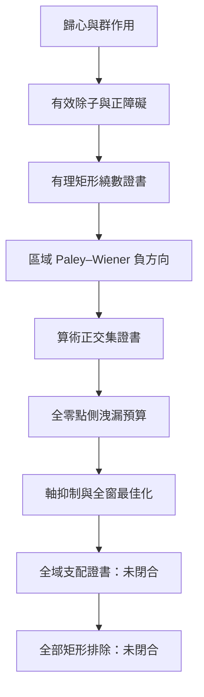

# 從等變零點障礙到可驗證算術交集
## 黎曼猜想的局部證書、顯式公式與全域洩漏整合研究綱領

**英文題名：** *From Equivariant Zero Obstructions to Validated Arithmetic Intersections: An Integrated Program for Local Certificates, Explicit Formulae, and Global Leakage in the Riemann Hypothesis*  
**作者：** Neo.K（許筌崴）  
**機構：** EveMissLab／一言諾科技有限公司  
**整合協作與技術審計：** OpenAI Codex  
**版本：** v1.0（整合內部研究稿）  
**日期：** 2026-07-24  
**案例識別：** `CASE-0001-RH-EAO-INTEGRATION-20260724`  
**母案例：** `CASE-0001-RH-WEIL-BATCH01`  
**狀態：** 可重播研究整合包；不構成黎曼猜想的證明或反證

---

## 重要聲明

本整合稿不是黎曼猜想的證明。

本稿把六篇理論文件與六個計算／證書包編譯成一條具有明確型別、依賴、證據層級與失敗紀錄的研究鏈。整合後可以確認：

1. RH 已被合法重寫為等變有效除子的偏軸正障礙消失問題；
2. 偏軸障礙已被局部化為可數有理矩形上的正繞數證書；
3. 假設某個偏軸矩形含零點，可構造在該整個矩形上一致為負的 Paley–Wiener 軌道區塊；
4. 已找到同一個明確測試函數，使「連續目標區域負值」與「正的算術純量」同時成立，並已形成可重播的驗證數值證書；
5. 目前測試函數的全零點側支配失敗：僅第一個已知臨界線零點的正貢獻，就約為目標負裕量的 $2387.591$ 倍；
6. 加入有限臨界線消去後，目標負值與算術正值仍可共存，但算術正方向隨消去條件增加而快速塌縮，且全控制窗仍出現顯著正峰；
7. 因此目前真正未閉合的主缺口，不再是「區域負方向是否存在」，而是：

$$
\boxed{
\text{可驗證的目標負值}
\;\dashrightarrow\;
\text{無條件的全零點側負值}
}
$$

以及：

$$
\boxed{
\text{每個假設偏軸矩形}
\;\dashrightarrow\;
\text{同時具有算術正證書與全域支配的測試函數}
}
$$

---

# 摘要

令黎曼完成函數為：

$$
\xi(s)
=
\frac12s(s-1)\pi^{-s/2}
\Gamma\!\left(\frac{s}{2}\right)\zeta(s),
$$

並作歸心：

$$
z=s-\frac12,
\qquad
F(z)=\xi\!\left(\frac12+z\right).
$$

若：

$$
z=\beta+i\gamma,
$$

則 RH 等價於：

$$
F(z)=0
\Longrightarrow
\beta=0.
$$

功能方程與實結構在歸心後產生 Klein 四群作用：

$$
a(z)=-z,
\qquad
b(z)=\overline z,
\qquad
j(z)=-\overline z,
$$

其中：

$$
\operatorname{Fix}(j)=i\mathbb R.
$$

將 $F$ 的零點按重數寫成局部有限、$G$-不變有效除子 $D_F$，便可定義偏軸正障礙：

$$
\mathfrak O(D_F)
=
D_F|_{X\setminus i\mathbb R}.
$$

於是：

$$
\mathrm{RH}
\iff
\mathfrak O(D_F)=0.
$$

在右半歸心臨界帶 $X^+$ 中，對每個邊界無零點的相對緊有理矩形 $R$，定義：

$$
\omega_R(F)
=
\frac{1}{2\pi i}
\oint_{\partial R}
\frac{F'(z)}{F(z)}\,dz.
$$

由辯值原理：

$$
\omega_R(F)=D_F(R)\in\mathbb N_0,
$$

故：

$$
\mathrm{RH}
\iff
\omega_R(F)=0
\quad
\text{對全部正則有理矩形 }R\Subset X^+.
$$

再使用譜坐標：

$$
w=-iz=\gamma-i\beta,
$$

臨界軸被送至實軸，而右半歸心帶被送至 $\operatorname{Im}w<0$。在乘法群顯式公式的對數坐標中，令：

$$
\psi(t)=e^{t/2}g(e^t),
$$

以及：

$$
G(w)
=
\int_{\mathbb R}
\psi(t)e^{iwt}\,dt
=
\widetilde g\!\left(\frac12+iw\right).
$$

若 $\psi$ 為實偶函數，則：

$$
G(-w)=G(w),
\qquad
G(\overline w)=\overline{G(w)}.
$$

顯式公式中的軌道區塊為：

$$
B_w(G)
=
2\operatorname{Re}\!\left(G(w)^2\right).
$$

當 $w\in\mathbb R$ 時，零點貢獻為 $|G(w)|^2\ge0$；當 $w\notin\mathbb R$ 時，$B_w(G)$ 可為負。這提供了偏軸零點的局部負方向。

整合後的工程結果顯示：存在一個支撐於 $[-3,3]$ 的明確分段線性函數，使：

$$
\sup_{w\in K}
2\operatorname{Re}\!\left(G(w)^2\right)
\le
-2.2416560599\times10^{-6},
$$

其中：

$$
K=[8,8.5]+i[-0.2,-0.1],
$$

且同一函數滿足：

$$
Q_{\mathrm{arith}}(\psi)
\in
[0.033762674558557,\ 0.061347696341296].
$$

這證明在採用的有限模型與驗證數值信任邊界下，區域負類與算術正純量類的交集非空。然而它不證明算術矩陣在任何函數空間上半正定，也不控制目標外全部零點。洩漏預算進一步得到：

$$
\frac{
\text{第一個已知軸上零點貢獻}
}{
\text{目標負裕量}
}
\approx
2387.591,
$$

因此單目標策略在沒有強軸抑制與全域窗控制時不可行。

本文據此將下一研究節點重新定義為「全域支配證書」：不再只最大化目標矩形的負值，而直接最大化目標負值扣除軸上、中間窗、未知偏軸與無窮遠尾部上界後的嚴格剩餘量。

**關鍵詞：** 黎曼猜想、等變拓樸、有效除子、偏軸正障礙、繞數證書、Riemann–Weil 顯式公式、Paley–Wiener、驗證數值、算術正錐、零點側洩漏、全域支配

---

# 1. 整合對象與研究定位

## 1.1 六篇理論文件

本整合稿所編譯的理論序列為：

1. 《從歸心到等變拓樸：RH 合法判定研究的思考方法與方法群》；
2. 《歸心後的等變拓樸判定域：RH 除子固定點與繞數障礙重構》；
3. 《等變零點組態拓樸學：RH 軌道型分層、有效除子半環與正障礙》；
4. 《層化零點障礙與局部—全域提升：從有理矩形證書到全臨界帶判定》；
5. 《等變算術分離：從軌道空間局部化到 ζ 顯式公式可容許測試函數》；
6. 《顯式公式中的偏軸正障礙：零點側區域負方向、質數側可計算錐與 ZFC 矛盾架構》。

## 1.2 六個工程包

計算與證書序列為：

1. `RH_Regional_Phase_Shaping_v0.1`；
2. `RH_Arithmetic_Matrix_PSD_v0.1`；
3. `RH_Separation_Positivity_Intersection_v0.1`；
4. `RH_Validated_Intersection_Certificate_v0.2`；
5. `RH_Zero_Side_Leakage_Budget_v0.1`；
6. `RH_Axis_Suppressed_Global_Window_Optimizer_v0.1`。

它們不是六條互相競爭的路線，而是同一研究鏈的六個工程節點。

---

# 2. 統一符號與正規化

## 2.1 三種坐標

本系列同時使用 $s$、$z$、$w$ 三種坐標：

| 坐標 | 定義 | 臨界線／軸 | 偏軸方向 |
|---|---|---|---|
| $s$ | 原始 ζ 坐標 | $\operatorname{Re}s=\frac12$ | $\operatorname{Re}s\ne\frac12$ |
| $z$ | $z=s-\frac12=\beta+i\gamma$ | $\operatorname{Re}z=0$ | $\beta\ne0$ |
| $w$ | $w=-iz=\gamma-i\beta$ | $\operatorname{Im}w=0$ | $\operatorname{Im}w\ne0$ |

轉換關係為：

$$
s=\frac12+z=\frac12+iw.
$$

若：

$$
w=x+iy,
$$

則：

$$
s=\left(\frac12-y\right)+ix.
$$

因此工程包使用的目標矩形：

$$
K=[8,8.5]+i[-0.2,-0.1]
$$

對應：

$$
0.6\le\operatorname{Re}s\le0.7,
\qquad
8\le\operatorname{Im}s\le8.5.
$$

這是一個用於驗證函數幾何與算術交集的合成目標區域。現有包沒有提供該矩形內含 ζ 零點的繞數證書，也沒有以它作為實際偏軸零點存在的證據。

## 2.2 兩種「正性」不得混同

本系列同時出現兩種完全不同的正性。

第一種是除子正性：

$$
\mathfrak O(D_F)\ge0.
$$

它表示偏軸零點以非負重數存在，不能被形式負係數抵消。

第二種是算術二次型或純量正性：

$$
Q_{\mathrm{arith}}(\psi)>0.
$$

它表示某個測試函數在採用的顯式公式正規化下具有正的算術值。

目前的嚴格交集證書只證明：

$$
\exists\psi:
\quad
\sup_{w\in K}B_w(G_\psi)<0
\quad\land\quad
Q_{\mathrm{arith}}(\psi)>0.
$$

它沒有證明：

$$
M_{\mathrm{arith}}\succeq0,
$$

也沒有證明：

$$
Q_{\mathrm{arith}}(\psi)\ge0
\quad
\text{對某個稠密函數類全部成立}.
$$

---

# 3. 整合研究架構

這條鏈可分成四種不同工作。

| 層 | 主要功能 | 已完成程度 |
|---|---|---|
| 判定層 | 精確表示 RH 等價條件 | 結構性完成 |
| 局部證書層 | 將偏軸存在轉成正整數證書 | 結構性完成 |
| 算術交集層 | 尋找同時區域負、算術正的函數 | 單一模型已驗證 |
| 全域支配層 | 控制全部非目標零點與尾部 | 尚未完成 |

---

# 4. 判定層：從歸心到正障礙

## 4.1 帶標記對合的母空間

令：

$$
X=
\left\{
z\in\mathbb C:
\left|\operatorname{Re}z\right|<\frac12
\right\},
$$

以及：

$$
A=i\mathbb R.
$$

對合：

$$
j(z)=-\overline z
$$

滿足：

$$
\operatorname{Fix}(j)=A.
$$

這保留了「哪一條線是臨界線」的資訊，避免裸拓樸把不同嵌入直線視為可任意搬移。

## 4.2 零點除子與軸向冪等算子

將零點寫成：

$$
D_F=\sum_\rho m_\rho[\rho].
$$

在閉臨界帶上定義：

$$
r(z)=i\,\operatorname{Im}z,
$$

以及除子推前：

$$
\mathcal R(D)=r_*D.
$$

則：

$$
\mathcal R^2=\mathcal R,
$$

且：

$$
\mathcal R(D)=D
\iff
\operatorname{supp}D\subseteq A.
$$

因此：

$$
\mathrm{RH}
\iff
\mathcal R(D_F)=D_F.
$$

這是診斷性固定點等價，不是使零點移動至臨界線的解析動力學。

## 4.3 正 Burnside 半環與不可抵消性

有限視窗中的 $G$-軌道型可以記錄於正 Burnside 半環 $A^+(G)$。偏軸投影保留一般四點軌道與實軸型偏軸軌道：

$$
\pi_{\mathrm{off}}^+\tau_W(D)
=
\left(n_e(W),n_b(W)\right).
$$

因係數位於 $\mathbb N_0$：

$$
\pi_{\mathrm{off}}^+\tau_W(D)=0
\iff
W\text{ 中沒有偏軸軌道}.
$$

這一步的價值是防止形式群化造成不存在於真實零點除子中的正負抵消。

---

# 5. 局部證書層：從層到可數矩形

## 5.1 偏軸障礙層

對開集 $U\subseteq X$，定義：

$$
\mathscr O^+(U)
=
\operatorname{Div}_{\mathrm{lf}}^+(U\setminus A).
$$

固定函數 $F$ 產生全域截面：

$$
\mathfrak o_F\in\Gamma(X,\mathscr O^+).
$$

因此：

$$
\mathrm{RH}
\iff
\mathfrak o_F=0.
$$

層論負責局部限制與黏合，但不提供每個莖為零的獨立理由。

## 5.2 有理矩形判定族

在右半帶：

$$
X^+
=
\left\{
z:
0<\operatorname{Re}z<\frac12
\right\}
$$

中取相對緊有理矩形 $R$。若 $F$ 在 $\partial R$ 上無零點，則：

$$
\omega_R(F)
=
\frac{1}{2\pi i}
\oint_{\partial R}
\frac{F'(z)}{F(z)}\,dz
=
D_F(R).
$$

由零點離散性與有理矩形基底性：

$$
\boxed{
\mathrm{RH}
\iff
\omega_R(F)=0
\quad
\text{對全部正則有理矩形 }R\Subset X^+.
}
$$

這將全域命題編譯為可數證書族，但「可數」仍不是「有限」。

## 5.3 正則耗盡與有限驗證邊界

若：

$$
U_1\Subset U_2\Subset\cdots\Subset X^+,
\qquad
\bigcup_{n\ge1}U_n=X^+,
$$

且每條邊界避開零點，則：

$$
\mathrm{RH}
\iff
\omega_{U_n}(F)=0
\quad
\forall n.
$$

但任意有限前綴只證明有限區域無偏軸零點。它不能消去：

$$
X^+\setminus U_N.
$$

---

# 6. 解析提升層：從矩形存在到區域負方向

## 6.1 顯式公式測試函數

在乘法群 $\mathbb R_+^\times$ 上令：

$$
g^\sharp(x)=x^{-1}g(x^{-1}),
$$

並定義：

$$
f_g=g*\overline g^{\,\sharp}.
$$

其 Mellin 轉換為：

$$
\widetilde f_g(s)
=
\widetilde g(s)
\overline{
\widetilde g(1-\overline s)
}.
$$

若：

$$
\widetilde g(0)=\widetilde g(1)=0,
$$

則在採用的顯式公式正規化下：

$$
Q_\zeta(g)
=
\sum_\rho
\widetilde g(\rho)
\overline{
\widetilde g(1-\overline\rho)
}.
$$

端點條件在 $w$ 坐標中成為：

$$
G\!\left(\frac i2\right)
=
G\!\left(-\frac i2\right)
=0.
$$

## 6.2 區域相位塑形

若緊矩形 $K$ 與實軸及 $\pm i/2$ 分離，並滿足平方像的多項式逼近條件，則理論稿構造實偶緊支撐 $\psi$，使：

$$
|G(w)-i|<\varepsilon
\qquad
\forall w\in K.
$$

於是：

$$
B_w(G)
=
2\operatorname{Re}\!\left(G(w)^2\right)
\le
-2\left(1-2\varepsilon-\varepsilon^2\right)
<0.
$$

因此：

$$
\omega_R(F)>0
\Longrightarrow
\text{存在只依賴 }R\text{ 的合法區域負方向}.
$$

這是本系列第一條從純判定重述進入實質函數構造的箭頭。

## 6.3 此箭頭仍不是總零點側負值

區域塑形只控制 $K$。它不自動控制：

$$
\sum_{\rho:\,w_\rho\notin K}
B_{w_\rho}(G).
$$

由此必須區分：

$$
\text{局部軌道區塊為負}
$$

與：

$$
\text{完整零點側總和為負}.
$$

兩者之間正是目前的主要 GAP。

---

# 7. 算術側：有限質數啟動與矩陣化

## 7.1 支撐—質數啟動過濾

若：

$$
\operatorname{supp}\psi
\subseteq
[-L/2,L/2],
$$

則卷積平方的乘法支撐位於：

$$
[e^{-L},e^L].
$$

有限位置只啟動：

$$
m\log p\le L
$$

的有限個質數冪。故可定義：

$$
\mathcal P_L
=
\left\{
(p,m):
m\log p\le L
\right\}.
$$

這使固定支撐尺度上的算術側成為有限可計算問題。

## 7.2 有限維算術矩陣

對基底 $\psi_1,\ldots,\psi_N$ 與：

$$
\psi_c=\sum_{j=1}^Nc_j\psi_j,
$$

可寫：

$$
Q_{\mathrm{arith}}(\psi_c)
=
c^\top
M_{\mathrm{arith}}(L)c,
$$

其中：

$$
M_{\mathrm{arith}}(L)
=
M_\infty
+
M_{\mathrm{fin}}(L).
$$

若能證明：

$$
M_{\mathrm{arith}}(L)\succeq0,
$$

便得到整個基底張成空間的算術非負證書。

但目前最強的 v0.2 結果是單一向量／單一函數的嚴格純量正性：

$$
c^\top M_{\mathrm{arith}}c>0.
$$

這遠弱於矩陣半正定。

---

# 8. 六個工程節點的整合結果

## 8.1 節點 C1：區域相位塑形

`RH_Regional_Phase_Shaping_v0.1` 使用實偶成對 bump 基底，完成：

- 端點條件的浮點約束；
- 目標矩形上的相位逼近；
- 密集網格上的負區塊搜尋；
- 解析 Lipschitz 估計的候選連續界。

證據層級為浮點數值原型。它建立可行性，不是嚴格連續區域證書。

## 8.2 節點 C2：算術矩陣／PSD 原型

`RH_Arithmetic_Matrix_PSD_v0.1` 實作：

$$
M_{\mathrm{arith}}(R)
=
M_\infty(R)
+
M_{\mathrm{fin}}(R).
$$

它掃描支撐半徑、啟動質數冪與最小特徵值，並完成時域／頻域交叉核對。但 `numerical_psd=true` 只表示目前離散化下未發現負特徵值。

## 8.3 節點 C3：分離—正性交集

`RH_Separation_Positivity_Intersection_v0.1` 在同一係數向量上聯立：

$$
\max_{w\in K}B_w(G_c)<0,
$$

以及：

$$
c^\top M_{\mathrm{arith}}c\ge\delta.
$$

供應的掃描在 $R=1.5,\ldots,4.0$ 都找到浮點交集候選。於 $R=3.0$：

$$
Q_{\mathrm{total}}
\approx
0.0491749029435855,
$$

且密集網格最大區塊約為：

$$
-2.3078\times10^{-5}.
$$

這仍是有限網格與浮點結果。

## 8.4 節點 C4：嚴格交集證書 v0.2

`RH_Validated_Intersection_Certificate_v0.2` 將候選改寫為明確 hat-spline：

$$
\psi(t)
=
\sum_{i=0}^{600}
y_i
\max\!\left(
1-\frac{|t-t_i|}{h},
0
\right),
$$

其中：

$$
h=0.01,
\qquad
t_i=-3+ih.
$$

其 Fourier 轉換具有閉式：

$$
G(w)
=
h
\left(
\frac{\sin(wh/2)}{wh/2}
\right)^2
\sum_{i=0}^{600}y_i e^{iwt_i}.
$$

重播得到：

$$
\sup_{w\in K}B_w(G)
\le
-2.2416560599\times10^{-6},
$$

以及：

$$
Q_{\mathrm{fin}}
\in
[-0.099762166120387,\,-0.099762166120386],
$$

$$
Q_\infty
\in
[0.133524840678940,\ 0.161109862461679],
$$

因此：

$$
Q_{\mathrm{arith}}
\in
[0.033762674558557,\ 0.061347696341296].
$$

驗證覆蓋包含 $480$ 個子矩形，未解子矩形數為 $0$，啟動質數冪數為 $98$。

這個結果的精確地位為：

$$
\boxed{
\text{單一明確測試函數的連續區域負證書}
\;\cap\;
\text{單一算術純量正區間}
\ne\varnothing.
}
$$

## 8.5 節點 C5：零點側洩漏預算

`RH_Zero_Side_Leakage_Budget_v0.1` 量化 v0.2 函數為何尚不能產生總零點側負值。

目標負裕量為：

$$
c_K
=
2.2416560599\times10^{-6}.
$$

第一個已知臨界線零點的數值貢獻為：

$$
0.005352157501758449,
$$

所以：

$$
\frac{0.005352157501758449}{c_K}
\approx
2387.5908519.
$$

前 $50$ 個已知軸上零點的累積質量為：

$$
0.023723782340489427,
$$

約為目標裕量的：

$$
10583.1500
$$

倍。

原型尾部上界為：

$$
8.667600624770651.
$$

因此目前函數不可能讓單一目標矩形支配完整零點側。

## 8.6 節點 C6：軸抑制與全窗最佳化

`RH_Axis_Suppressed_Global_Window_Optimizer_v0.1` 加入前 $q$ 個儲存臨界線縱座標的消去條件。

算術正方向數隨 $q$ 增加而下降：

| $q$ | 約束後維度 | 算術正方向 |
|---:|---:|---:|
| $0$ | $22$ | $12$ |
| $4$ | $18$ | $8$ |
| $8$ | $14$ | $4$ |
| $10$ | $12$ | $2$ |
| $12$ | $10$ | $1$ |
| $15$ | $7$ | $0$ |

選定 $q=12$ 候選具有：

$$
Q_{\mathrm{arith}}
\approx
5.00000000001\times10^{-5},
$$

$$
\max_{w\in K_{\mathrm{target}}}B_w
\approx
-2.64607989612\times10^{-8},
$$

但剩餘前 $50$ 個軸上質量為：

$$
1.54365729672\times10^{-4},
$$

而控制窗最大正峰為：

$$
0.267543612562.
$$

因此：

$$
B_w<0
\text{ 於目標窗}
$$

與：

$$
Q_{\mathrm{arith}}>0
$$

仍可共存，但：

$$
B_w\le0
\text{ 於完整控制窗}
$$

沒有達成。

這一失敗不是無效結果。它揭示了本路線的第一個可量化結構張力：

$$
\boxed{
\text{軸抑制自由度增加}
\Longrightarrow
\text{算術正子空間快速塌縮}.
}
$$

---

# 9. 整合條件主定理

## 9.1 全域支配證書

對每個正則有理矩形 $R\Subset X^+$，令其譜像為：

$$
K_R=-iR.
$$

若能構造測試函數 $\psi_R$ 與常數 $c_R>0$、$E_R\ge0$，使：

$$
\omega_R(F)>0
\Longrightarrow
Q_{\mathrm{target}}(\psi_R)
\le
-c_R\omega_R(F),
$$

並且：

$$
Q_{\mathrm{rest}}(\psi_R)
\le
E_R,
$$

以及：

$$
E_R<c_R\omega_R(F),
$$

則：

$$
Q_{\mathrm{zero}}(\psi_R)<0.
$$

若同一函數另有不依賴 RH 的算術證書：

$$
Q_{\mathrm{arith}}(\psi_R)\ge0,
$$

且顯式公式嚴格給出：

$$
Q_{\mathrm{zero}}(\psi_R)
=
Q_{\mathrm{arith}}(\psi_R),
$$

便得到矛盾。

## 9.2 條件式結論

若上述程序對全部正則有理矩形成立，則：

$$
\omega_R(F)=0
\qquad
\forall R\Subset X^+,
$$

故：

$$
\mathrm{RH}.
$$

## 9.3 目前已滿足與未滿足的條件

| 條件 | 目前狀態 |
|---|---|
| 目標矩形內一致負區塊 | 單一合成矩形已驗證；一般存在性有理論構造 |
| 同一函數的算術純量正值 | 單一函數已驗證 |
| 目標矩形確有偏軸零點 | 沒有；現有目標是合成矩形 |
| 非目標有限窗統一上界 | 未完成 |
| 臨界線總貢獻支配 | 未完成；現有函數明確失敗 |
| 未知偏軸零點貢獻上界 | 未完成 |
| 無窮遠尾部嚴格證書 | 僅有原型預算 |
| 對全部有理矩形的統一算法 | 未完成 |
| 顯式公式與區間證書的證明助理形式化 | 未完成 |

---

# 10. 證據分級

本整合包採用下列證據等級：

| 等級 | 名稱 | 定義 |
|---|---|---|
| `E0` | 定義／等價重述 | 不新增 RH 真值內容 |
| `E1` | 手稿證明的結構定理 | 有數學證明，但尚未外部審查或形式化 |
| `E2` | 浮點數值證據 | 有重播程式，無嚴格外包絡 |
| `E3` | 驗證數值證書 | 有連續區域與區間外包絡，仍依賴軟體信任基 |
| `E4` | 核驗形式證明 | 由證明助理核心驗證 |
| `E5` | 全域 RH 結論 | 完成全部無限量詞與非循環依賴 |

目前最高層級為 `E3`，適用於單一交集函數的兩個嚴格不等式。`E4` 與 `E5` 均未達成。

---

# 11. 已閉合、部分閉合與未閉合 GAP

## 11.1 已閉合

1. 歸心與原 RH 命題的等價；
2. 臨界線作為標記對合固定集；
3. 有效除子固定點與偏軸正障礙的等價；
4. 正則有理矩形繞數與區域零點重數相等；
5. 全部正則有理矩形零繞數與 RH 等價；
6. 對固定偏軸緊矩形構造一致負 Paley–Wiener 區塊的手稿方案；
7. 固定支撐只啟動有限質數冪；
8. 單一明確函數的「連續區域負值 ∩ 算術純量正值」驗證數值證書。

## 11.2 部分閉合

1. 算術矩陣：已能數值建立與核對，尚無一般 PSD 證書；
2. 無窮遠尾部：有基於衰減與零點計數的方向，現有數值預算尚非形式證書；
3. 軸抑制：有限前綴可消去，但會快速消耗算術正方向；
4. 全窗控制：已有交換法原型，但供應候選仍有大正峰；
5. 嚴格交集：單一合成矩形完成，尚未形成任意矩形的統一算法。

## 11.3 未閉合

1. 目標以外所有零點貢獻的無條件上界；
2. 對未知有限窗偏軸零點的符號控制；
3. 對任意靠近臨界線的矩形保持有限支撐成本；
4. 算術正類與區域分離類對全部矩形均有交集；
5. 從單一算術正純量提升為可用的結構性正錐；
6. 對全部有理矩形的可審計生成器；
7. 完整顯式公式正規化與區間算術的核驗形式化；
8. RH。

---

# 12. 下一個主研究節點

## 12.1 節點名稱

建議下一節點定名為：

> **RH Global Dominance Certificate Optimizer v0.2**  
> **RH 全域支配證書最佳化器 v0.2**

## 12.2 目標函數

不再只求：

$$
\min_\psi
\sup_{w\in K}B_w(G_\psi).
$$

改為直接最大化：

$$
\Delta_K(\psi)
=
c_K(\psi)
-
E_{\mathrm{axis}}(\psi)
-
E_{\mathrm{mid}}(\psi)
-
E_{\mathrm{tail}}(\psi)
-
E_{\mathrm{unknown}}(\psi).
$$

成功標準為：

$$
\Delta_K(\psi)>0
$$

且：

$$
Q_{\mathrm{arith}}(\psi)\ge\delta>0.
$$

其中所有 $E$ 必須是無條件上界，而不是只對目前已知零點樣本成立的觀測值。

## 12.3 約束

至少包含：

$$
G\!\left(\pm\frac i2\right)=0,
$$

$$
\mathcal N(\psi)=1,
$$

$$
Q_{\mathrm{arith}}(\psi)\ge\delta,
$$

$$
\sup_{w\in K}B_w(G_\psi)\le-c_K,
$$

以及以無條件零點計數 majorant 表示的：

$$
\sum_{\rho\notin K}
\max\!\left(B_{w_\rho}(G_\psi),0\right)
\le
E_{\mathrm{rest}}(\psi).
$$

## 12.4 不應再使用的成功指標

下列任一條單獨成立，都不應標記為全域進展：

1. 目標網格全部為負；
2. 單一算術值為正；
3. 前有限個軸上零點被消去；
4. 某個控制窗大部分為負；
5. 浮點最小特徵值為正；
6. 已知零點樣本上的洩漏很小。

新的唯一主指標應是：

$$
\boxed{
\text{嚴格全域支配餘量 }\Delta_K>0.
}
$$

---

# 13. 形式化與信任邊界

## 13.1 已重播項目

本次整合已完成：

- 五個含測試套件之程式包，共 $15$ 項測試通過；
- v0.2 嚴格交集證書重新計算並通過；
- v0.2 原始 `MANIFEST.sha256` 全部吻合；
- 軸抑制最佳化器原始 `MANIFEST.sha256` 全部吻合；
- 軸抑制選定候選重算值與包內報告一致；
- 零點側洩漏預算重算值與包內報告一致。

## 13.2 v0.2 證書的信任基

目前仍信任：

1. CPython 與作業系統；
2. `mpmath` 區間運算；
3. 幾何 bookkeeping 所使用的機器浮點；
4. hat-spline Fourier 閉式；
5. cubic autocorrelation 閉式；
6. 採用的 Riemann–Weil 正規化；
7. 輸入十進位節點資料。

因此它是驗證數值證書，不是證明助理核心核驗的形式證明。

## 13.3 形式化優先順序

建議依序形式化：

1. 坐標、群作用與正障礙等價；
2. 有理矩形與辯值原理證書接口；
3. hat-transform 與 cubic autocorrelation 恆等式；
4. 區間 Taylor 外包絡；
5. archimedean 複合中點誤差；
6. 有限質數冪枚舉與質數證書；
7. 採用的顯式公式定理；
8. 全域洩漏 majorant。

---

# 14. 對 AI 自主數學平台的輸出

本整合包將研究單位定義為「可審計的 GAP 邊」，而不是只把每篇論文視為孤立節點。

包內提供：

- `case-manifest.json`：案例入口、安全與壓縮檔資訊；
- `research_nodes.json`：理論與工程節點；
- `dependency_graph.json`：型別化依賴邊；
- `timeline.json`：概念與工程演進；
- `certificate_index.json`：證書、重播與信任邊界；
- `gap_map.json`：跨論文、可持續更新的 GAP 地圖；
- `claim_ledger.json`：主張與證據層級；
- `failure_and_revision_log.json`：失敗、修正與研究轉向；
- `trust_boundary.json`：信任基與未形式化部分；
- `artifact_catalog.json`：來源檔與入口；
- `platform_import_manifest.json`：平台匯入索引；
- `handoff/unresolved_questions.md`：未解問題；
- `handoff/next_experiment_spec.md`：下一實驗規格；
- `validation/checksums.sha256`：整包檔案雜湊；
- `validation/test_report.json`：本次驗證報告。

---

# 15. 結論

這批材料整合後，研究狀態比「多了六篇論文與六個程式包」更清楚。

真正已完成的是：

$$
\text{偏軸存在}
\longrightarrow
\text{正除子障礙}
\longrightarrow
\text{有理矩形繞數}
\longrightarrow
\text{區域一致負方向},
$$

以及單一明確函數上的：

$$
\text{連續區域負值}
\quad\land\quad
\text{算術純量正值}.
$$

真正被計算否決的是：

$$
\text{只要局部負值夠漂亮，就能自動壓過完整零點側}.
$$

它不成立。現有局部負裕量遠小於軸上與尾部洩漏。

因此下一步不應再重複生成更漂亮的局部負圖，也不應把單一正算術值升格為正錐。研究主軸必須改為：

$$
\boxed{
\text{在算術正約束下，直接求一個嚴格為正的全域支配餘量。}
}
$$

若此餘量在結構上永遠無法為正，本路線就得到明確的負研究結果；若能對任意假設偏軸矩形建立可審計正餘量，才真正跨越從局部證書到 RH 的核心 GAP。

---

# 附錄 A：最短等價鏈

$$
\mathrm{RH}
\iff
\operatorname{supp}D_F\subseteq i\mathbb R
$$

$$
\iff
\mathfrak O(D_F)=0
$$

$$
\iff
\mathfrak o_F=0
$$

$$
\iff
\omega_R(F)=0
\quad
\forall R\in\mathcal B_{\mathbb Q,F}^{\mathrm{reg},+}.
$$

最後一行之后尚需獨立證明全部局部證書為零；等價鏈本身不完成 RH。

---

# 附錄 B：目前最強的可審計非結論

目前可以嚴格說：

> 在指定顯式公式正規化、指定 hat-spline 模型與指定驗證數值信任邊界下，存在一個明確緊支撐測試函數，其 Fourier 轉換在合成偏軸矩形上產生一致負軌道區塊，且同一函數的算術純量嚴格為正。

目前不能說：

> 已證明某個實際偏軸零點導致完整零點側為負。

也不能說：

> 已證明算術矩陣半正定、Weil 正性或 RH。

---

# 附錄 C：版本邊界

v1.0 僅整合附件中的六篇理論文件與六個工程包，並加入重播、證據分級、GAP 地圖與平台入口。它不替換原始附件，不修改原始程式包內部結果，也不把整合性敘述回寫成原論文已主張的內容。
