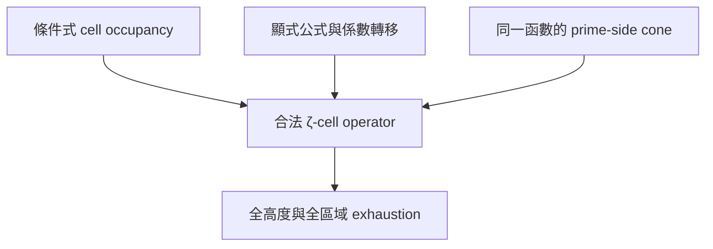

# 黎曼猜想半 AI 自主研究完整報告
## 從分帶多測試函數到局部區間 Green 五十八胞覆蓋：v0.1–v1.0 的結果、失敗、信任邊界與後續交接

**整合版本：** v1.0  
**日期：** 2026-07-25  
**研究模式：** 半 AI 自主數學研究  
**研究場域授權與審閱：** Neo.K / EveMissLab  
**技術研究判斷：** AI research collaborator，除非節點內另有標記  
**主鏈：** `RH-BMCC-20260724-v0.1` 至 `RH-LocalIntervalGreen-CellCover-20260725-v1.0`

---

## 0. 最重要的結論

本研究沒有證明或反證黎曼猜想，也沒有得到可稱為「接近完成的 RH 證明」的結果。

本輪真正完成的是另一件事：把一條原本容易混淆局部負值、算術正性、零點計數、位置占用與全域 RH 結論的研究路線，逐步拆成可審計的數學物件；沿途以精確反例淘汰非法轉移，以對偶證人淘汰低價值函數類，最後在明確的抽象 Green/operator 模型中取得嚴格區間證書。

截至 v1.0，最高的正面技術結論是：

> 對繼承自 v0.7 的固定抽象 clamped Green 模型，令 $58$ 個軸原子位置彼此獨立地在各自中心附近變動。當每個位置的閉區間半寬為
>
> $$
> h=\frac{89}{50\,000\,000}=1.78\times10^{-6},
> $$
>
> 且 child parameter 為 $\alpha=1$ 時，對 product box 內所有位置選擇，投影後的抽象算子皆嚴格正；此最大已證盒及其所有座標逐一包含的有理閉子盒形成 downward-closed 證書族。

該證書的主要區間量為：

$$
\eta_{\mathrm{Neu}}
\le
0.0275572505340
<1,
$$

$$
s_{11}
\ge
0.3305743170401,
$$

$$
\det S
\ge
6.69375118838\times10^{-5}.
$$

相較 v0.9 的條件式半徑

$$
2\times10^{-15},
$$

v1.0 的半徑提升恰為

$$
890\,000\,000
$$

倍。

但以下狀態仍全部為 `false`：

| 全域介面 | 狀態 |
|---|---:|
| `rh_proved` | `false` |
| `rh_disproved` | `false` |
| `actual_zeta_occupancy_family` | `false` |
| `zeta_facing_count_and_tail_coefficients_certified` | `false` |
| `explicit_formula_transfer_certified` | `false` |
| `global_rh_certificate` | `false` |

所以 v1.0 證明的是抽象算子族的局部全稱命題，不是「實際 $\zeta$ 零點落入這 $58$ 個小盒」，也不是顯式公式矛盾。

---

## 1. 研究問題的正確分解

### 1.1 希望建立的矛盾架構

這條路線的原始目標，是把「若存在偏軸零點」轉成同一測試函數上的兩個互斥結論。理想形式是：

$$
Q_{\mathrm{zero}}(f)<0
$$

與

$$
Q_{\mathrm{arith}}(f)\ge0,
$$

再由一個合法且無循環依賴的顯式公式恒等式

$$
Q_{\mathrm{zero}}(f)
=
Q_{\mathrm{arith}}(f)
$$

得到矛盾。

若用有理 cell $C$ 隔離一個假設存在的偏軸零點群，所需的 zero-side 支配可抽象寫成：

$$
Q_{\mathrm{target},C}(f)
\le
-c_C m_C,
$$

$$
Q_{\mathrm{rest}}(f)
\le
E_C,
$$

且

$$
E_C<c_Cm_C.
$$

真正困難的不是其中某一個局部負值，而是同時合法完成下列五層：

1. 從假設存在偏軸零點，得到具 multiplicity 與 endpoint convention 的 cell occupancy；
2. 對 cell 內所有可能位置建立 zero-side operator inequality；
3. 證明測試函數滿足顯式公式所需的解析可容許性與極限交換；
4. 對同一函數建立 theorem-backed 的 count、tail 與 prime-side 方向；
5. 對所有可能 cell 與無窮高度完成 local-to-global exhaustion。

v0.1–v1.0 主要推進了第 2 層的抽象版本，也精確發現第 1、3、4 層曾被錯誤混用。第 5 層尚未開始實質閉合。

### 1.2 為何「局部負值」遠遠不夠

前史 `CASE-0001-RH-EAO-INTEGRATION-20260724` 已重播一個單一函數、單一合成矩形上的驗證交集：

$$
\sup_{w\in[8,8.5]+i[-0.2,-0.1]}
2\operatorname{Re}(G(w)^2)
\le
-2.2416560599\times10^{-6},
$$

以及：

$$
Q_{\mathrm{arith}}(\psi)
\in
[0.033762674558557,\ 0.061347696341296].
$$

但第一個已知臨界線零點的正貢獻約為目標負裕量的 $2387.591$ 倍；前 $50$ 個已知軸上零點的累積量約為 $10583.150$ 倍。這直接否決「單一局部負窗加單一算術正純量就足夠」的想像。

因此 v0.1 的起點不是繼續把局部負值做深，而是分帶、多測試函數、覆蓋與全域 leakage budget。

---

## 2. 範圍與譜系

### 2.1 方法前史

本整合包把下列材料編為前史與方法來源，而不把它們算入 v0.1–v1.0 的十個主證書節點：

- 六篇內部理論稿：歸心、等變母空間、軌道型、有效除子、繞數障礙、有理矩形判定族、顯式公式可容許測試函數與條件式矛盾架構；
- 六個工程包：區域相位塑形、算術矩陣原型、分離—正性交集、驗證交集證書、zero-side leakage budget、axis-suppressed optimizer；
- 前史整合包 `RH_Equivariant_Arithmetic_Obstruction_Integration_v1.0.zip`。

這些材料提供問題語言、方法選擇與最初失敗訊號；它們不自動成為後段區間證書的依賴，也不因後段證書成功而被升格為已形式化的 RH 等價鏈。

### 2.2 十節點主鏈

| 版本 | 節點 | 核心問題 | 最終判定 |
|---:|---|---|---|
| v0.1 | Banded Multi-Test Cover | 分帶、多函數、adaptive cover 能否閉合 budget？ | 局部覆蓋成功；全域 budget 全負 |
| v0.2 | PSD Gram | full Gram cross terms 能否補缺口？ | 有改善；所有 budget 仍負 |
| v0.3 | Axis-Target Dual | $R=3$ finite family 是否已被對偶阻塞？ | 具名 finite model 被拒絕 |
| v0.4 | Support–Prime Frontier | 增加 support 是否值得？ | coarse-grid false escape；成本爆炸 |
| v0.5 | Axis Notch Co-design | notch/lift 能否穿過 gate？ | 齊次 notch 有單調障礙；已測 lift 飽和 |
| v0.6 | Paley–Wiener Extremal | 能否改成連續核對偶？ | 連續模型定理與 floating witness 完成 |
| v0.7 | Interval Green Certificate | fixed witness 能否嚴格區間化？ | 抽象 interval certificate 成功；係數語義失敗 |
| v0.8 | Zero-Count Semantics | count 能否合法轉成 operator mass？ | 普遍轉移被 exact counterexample 否決 |
| v0.9 | Occupancy Operator Family | cell occupancy 能否支持全稱 operator family？ | 抽象 transfer 與 synthetic cover 完成 |
| v1.0 | Local Interval Green Cover | 58 維位置盒能否大幅擴張？ | $h=1.78\times10^{-6}$ 抽象證書完成 |

完整節點 ID、來源 ZIP 雜湊與 byte-exact 證據快照位於 `metadata/`、`validation/` 與 `evidence_snapshots/`。

---

## 3. 統一證據語義

各節點曾使用略有不同的 `E0`–`E3` 名稱。為避免跨版誤讀，本報告改採下列語義類別：

| 類別 | 意義 | 可推出什麼 | 不可推出什麼 |
|---|---|---|---|
| `EXACT_FINITE` | 有理／精確有限模型結果 | 具名有限物件的等式、不等式或反例 | 連續解析轉移、全函數類結論 |
| `MODEL_THEOREM` | 明確抽象解析或 operator 模型內的定理 | 該模型內的弱對偶、Green 核、Schur 歸約 | 模型已等同 zeta 顯式公式 |
| `REPLAY_STRUCTURAL` | 可重算的結構、序列化或重建檢查 | 輸出與程式內定義一致 | 浮點結果已成為嚴格定理 |
| `FLOATING_DIAGNOSTIC` | 可重播的浮點研究證據 | 搜尋方向、失敗訊號、候選選擇 | 全稱連續命題或不存在定理 |
| `INTERVAL_CERTIFIED_SYNTHETIC` | synthetic premises 下的定向區間定理 | 合成模型的全稱命題 | synthetic axiom 是 zeta 事實 |
| `INTERVAL_CERTIFIED_ABSTRACT` | 抽象 Green/operator 模型內的定向區間定理 | 該 operator family 嚴格正 | actual zeta occupancy 或 RH |
| `EXACT_SEMANTIC` | 關於量詞、係數方向與轉移是否合法的精確定理 | 排除錯誤重型別與非法推論 | 自動給出替代的 zeta bridge |
| `EXACT_COUNTEREXAMPLE` | 對 proposed universal rule 的精確反例 | 該普遍規則為假 | 所有相鄰方法皆不可能 |
| `ZETA_TRANSFER` | theorem-backed 的實際 $\zeta$ 轉移 | 若完成，才可把抽象模型接到顯式公式 | 本鏈沒有任何正面的完成項 |

本鏈最高的正面數值證據是 `INTERVAL_CERTIFIED_ABSTRACT`，不是 `ZETA_TRANSFER`。

---

## 4. v0.1：分帶、多測試函數與 adaptive cover

### 4.1 設計

目標矩形為：

$$
[20,20.5]\times[-0.2,-0.1].
$$

v0.1 將它拆成 $18$ 個 anisotropic patches，建立 $72$ 個候選，並以有理原子 cell 驗證覆蓋；另做 $465$ 個有理 probes 與 dense-grid audit。

### 4.2 結果

- exact rational atomic cover：通過；
- 所有 sampled core 與 crude continuous sign audits：通過；
- candidate arithmetic minimum：約 $2.1517368757$；
- partial global gap 的範圍：約

$$
[-20.4018,\ -8.96858];
$$

- $72$ 個候選沒有任何一個通過 partial global budget；
- 已知零點 ordinates 未進入 optimization，只作 holdout。

### 4.3 判讀

v0.1 最有價值的結論不是找到一個更漂亮的局部函數，而是確認：

> 局部 sign engineering 與有限覆蓋已不再是第一瓶頸；真正瓶頸是 axis、tail 與 unknown off-axis regions 的全域支配。

對角 cone 的 stage-one LP 幾乎等於最佳單 ray，因此下一步升級為 full PSD Gram。

---

## 5. v0.2：完整 PSD Gram 仍無法閉合 budget

### 5.1 設計

v0.2 使用 $22$ 維 Gram coordinates，測試 requested ranks

$$
1,\ 2,\ 4,\ 8,
$$

以 $A=LL^{\mathsf T}\succeq0$ 保證有限模型的 algebraic PSD。

### 5.2 結果

所有 $18$ 個 patches 的主導 axis band 都是：

$$
A_1=[18,23].
$$

full Gram 相較 diagonal baseline 的 sampled majorant reduction 為：

$$
\min 0.1088656,\qquad
\operatorname{mean}0.2107757,\qquad
\max0.2866441.
$$

但所有 selected factors 的數值秩都塌縮為 $1$。最終 partial gaps 仍全負：

$$
[-141.93,\ -63.60]
$$

為 sampled 範圍，而 Lipschitz-corrected 範圍約為：

$$
[-353.16,\ -88.77].
$$

### 5.3 信任邊界

此節點使用 factorized nonconvex SLSQP，沒有 convex SDP solver，也沒有 global optimum claim。它只證明「已測 full-Gram 搜尋沒有成功」，不證明 full PSD cone 全域不可行。

### 5.4 決策

由於局部 majorant 有改善但全域 gap 仍大幅為負，再增加同類 primal rank 的邊際價值很低。研究轉向 dual axis-target transfer lower bound。

---

## 6. v0.3：以 exact dual surrogate 淘汰具名 $R=3$ 類

### 6.1 核心 gate

目標預算為 $1$，而 finite dual lower bound 為：

$$
2.
$$

v0.3 對 tail witness 與 $18$ 個 patch witnesses 建立 rational surrogate，exact LDL positivity 全部通過。

### 6.2 數值尺度

tail 最小特徵值約為：

$$
0.03104147825.
$$

primary witnesses 的 minimum eigenvalue 約在：

$$
3.10421\times10^{-5}
\quad\text{至}\quad
3.10424\times10^{-5}.
$$

尾部加 hybrid 的 optimal $\alpha$ 仍明顯高於 $1$；axis-only witness 則接近 null 或略負。

### 6.3 正確結論

此節點足以拒絕「具名 $R=3$ patchwise finite-model function class」。它不證明所有支撐半徑、所有 admissible functions 或 RH 本身有障礙，因為 Fourier/count/tail transfer 仍是浮點層。

---

## 7. v0.4：support-only 前沿、假 escape 與 prime cost

### 7.1 覆蓋與半徑掃描

原本 $18$ patches 被細化為 $288$ patches，共測 $126$ 個 uniform configurations。

觀察到：

- sampled center 首次 escape：$R=10$；
- patch-measure 首次 escape：$R=14$；
- 但完整細化後，所有測試半徑仍至少有一個 blocked patch。

具名結果如下：

| $R$ | dimension | strongest safe $\alpha$ |
|---:|---:|---:|
| $10.25$ | $100$ | $2.6200799$ |
| $12$ | $118$ | $1.8999498$ |
| $14$ | $138$ | $1.3981795$ |
| $16$ | $158$ | $1.09428134$ |

### 7.2 coarse-grid false escape

axis step 從 $0.25$ 細化到 $0.025$ 時，raw $\alpha$ 從約

$$
0.9853
$$

上升到約

$$
1.1923.
$$

所以 coarse grid 的「低於 $1$」是明確假 escape。自此之後，任何 coarse-grid-only pass 都被列為不可接受。

### 7.3 prime-side 成本

在 $R=10.25$ 的 benchmark 中：

- cutoff：$799\,902\,177$；
- primes：約 $41\,141\,456$；
- prime-power terms：約 $41\,144\,807$。

若擴到 $R=16$，projected cutoff 約為：

$$
7.8963\times10^{13}.
$$

這表示在 dual gate 尚未穿過時，先做大規模 prime enumeration 是不合理的工程順序。

---

## 8. v0.5：notch 子空間的精確障礙

### 8.1 主導頻帶

peak atlas 顯示最困難的 $A_1$ peak 約在：

$$
20.38,
$$

與 target geometry 重疊；其他主要 peaks 約在 $42.18$ 與 $83.05$。

### 8.2 精確單調性結論

若 notch constraints 只是 homogeneous linear constraints，所得可行集合是 parent feasible space 的子空間。對同一 minimization 而言，縮小可行集合不能改善 parent optimum。

因此「只加齊次 notch」不是有效突破方向。這是模型內精確定理，不只是數值失敗。

### 8.3 已測外部 lift

- anchor-flat threshold 反而惡化到約 $33.845656$；
- external lift $tq_R(t)\sin(\omega t)$ 只改善約 $1.12\%$；
- 最佳 geometry `d12_w2_p5` 的 raw $\alpha$ 約 $1.1435223$；
- safe $\alpha$ 約

$$
1.0717612>1.
$$

### 8.4 決策

停止 homogeneous notch subspaces、已測 lift 與 polynomial bump scaling；將 finite dictionary saturation 改寫為連續 Paley–Wiener 型 extremal。

---

## 9. v0.6：連續 $H_0^2$ 模型與低秩 Green 歸約

### 9.1 連續域

v0.6 固定 $R=16$，在 real-even clamped $H_0^2(-R,R)$ 類中工作，並加入：

$$
G(0)=G(i/2)=0.
$$

tail form 以二階導數的 Hilbert norm 表示；compact-support Fourier evaluation 成為 bounded linear functional。

### 9.2 已證的模型定理

此節點在明確定義的抽象模型中完成：

1. trace-class primal 與 measure dual 的弱對偶；
2. one-axis/one-core rank-two primal 的 closed form；
3. clamped biharmonic Green kernel；
4. 兩個 structural representers 的 finite-rank projection；
5. atomic PSD 問題的 Schur 歸約。

對

$$
W=I+UU^*-VV^*
$$

有：

$$
W\succeq0
\iff
I-V^*(I+UU^*)^{-1}V\succeq0.
$$

因負方向只有兩個 core-imaginary directions，最後只需驗證 $2\times2$ Schur matrix。

### 9.3 獨立數值交叉

- finest Galerkin raw dimension：$192$；
- structural constraints 後 effective dimension：$190$；
- joint $\alpha$：約 $1.1324752$；
- direct Green fixed-measure threshold：約 $1.1324412$；
- selected point 上 Galerkin/direct Green 的絕對差：約

$$
1.0534\times10^{-9}.
$$

凍結的 rational candidate 取：

$$
\alpha=\frac{21}{20}=1.05.
$$

浮點 full minimum eigenvalue 約為 $0.3122432$，Schur minimum 約為 $0.0698852$，因此有足夠 margin 值得投入區間證明。

---

## 10. v0.7：抽象 interval certificate 成功，zeta bridge 同輪失敗

### 10.1 區間結果

v0.7 對全部 fixed atoms 建立閉式 Green pairings、structural projection、verified $60\times60$ positive solve 與最後 $2\times2$ Sylvester test。

證書量為：

$$
\eta_{\mathrm{Neu}}
\le
7.53140475365\times10^{-15},
$$

$$
s_{11}
\ge
0.352427949645,
$$

$$
\det S
\ge
0.063615317260.
$$

因此固定抽象 operator 在 $\alpha=21/20$ 時嚴格正。disk-read replay、exact serialization audit 與 floating cross-check 均通過。

### 10.2 同輪揭露的 coefficient orientation blocker

區間 operator 證書成功後，對五帶係數做 source-orientation audit。結果顯示：

> 儲存的五個 positive band coefficients 對應 upper zero-count profiles；inherited absolute-$S$ bound 並沒有把它們證成 zero-side 所需的 lower coefficients。

將 witness 套到 lower profile 的 stress test 時，minimum eigenvalue 約為：

$$
-5.53605.
$$

所以不能把 v0.7 的抽象證書直接稱為 actual zero-side obstruction。

### 10.3 為何這不是「證書失敗」

需要分開兩件事：

- `abstract_continuous_interval_certificate = true`；
- `zeta_facing_count_coefficients_certified = false`。

前者是有效的模型內定理，後者是 zeta 轉移缺口。正確處理是保留前者並撤回非法升格，而不是把全部工作一起丟棄。

---

## 11. v0.8：count semantics 的精確修正

### 11.1 合法的標量方向

若 $q\ge0$ 且 band $B$ 中有 $N(B)$ 個零點，則：

$$
\sum_{\gamma\in B}q(\gamma)
\le
N(B)\sup_{t\in B}q(t),
$$

以及：

$$
\sum_{\gamma\in B}q(\gamma)
\ge
N(B)\inf_{t\in B}q(t).
$$

upper count 與 supremum 搭配，lower count 與 infimum 搭配；方向不可交換。

### 11.2 arbitrary measure transfer 為假

一個 scalar lower count 並不給任意 probability measure $\mu$ 上的 operator lower bound。對移動的 rank-one evaluations，也通常不存在非零 common PSD floor。

v0.8 以 exact two-point countermodel 與 range-intersection argument 否決 proposed universal rule。這是全鏈最重要的語義修正之一。

### 11.3 lower-profile 數值診斷

在 inherited floating lower profile 下：

$$
\alpha_{\mathrm{Galerkin},190}
\approx
0.1297047862,
$$

$$
\alpha_{\mathrm{direct\ Green}}
\approx
0.1297031276,
$$

而 sampled primal escape objective 約為：

$$
0.1297069814.
$$

這表示不是簡單重算權重就能保留 v0.7 obstruction。

### 11.4 prototype height 的角色

主鏈使用的 height-$20.4$ patch 只是一個 geometry prototype。依 v0.8 所鎖定的 rigorous verification source，它不屬於 unresolved actual-zeta target。後續研究不得在該高度假裝尋找偏軸 $\zeta$ 零點。

---

## 12. v0.9：從 scalar count 改為 occupancy operator family

### 12.1 正確的 transfer 語義

假設每個 cell 具有 source-valid occupancy，並從每個 cell 選出一個位置。如果對所有 selected locations 都能證明核心 operator family 為 PSD，那麼其餘實際點只貢獻 nonnegative PSD surplus，便可轉移到 all-point operator。

此定理的關鍵不是 count 更精確，而是保留：

- cell identity；
- multiplicity；
- endpoint convention；
- 每個位置的全稱量詞；
- surplus terms 的 PSD 方向。

### 12.2 count-only exact counterexample

v0.9 的 exact counterexample 給出：

$$
\det S
=
-\frac{254}{558009}<0,
$$

以及負 quadratic direction：

$$
-\frac{663194}{13755479859}<0.
$$

所以 total count two 仍不足以推出 synthetic operator positivity。

### 12.3 兩種證書

第一，synthetic Dirichlet Green model 的 root box 被 adaptive cover 分成：

- $8$ 個 certified leaves；
- maximum depth $7$；
- unresolved leaves $0$。

第二，條件於 v0.7 parent witness，58 個 clamped positions 的 uniform radius 只證到：

$$
\frac{1}{500\,000\,000\,000\,000}
=
2\times10^{-15}.
$$

浮點 corner search 在 half-width $0.016$ 時仍高於 threshold，而 $0.017$ 首次低於；但這不是 universal counterexample。

---

## 13. v1.0：局部區間 Green 五十八胞覆蓋

### 13.1 技術改變

v0.9 的 microscopic bound 主要來自過度粗糙的 global perturbation estimate。v1.0 直接對位置變量建立 affine-tagged complex-exponent boxes，逐項 enclosure projected clamped Green pairings，形成 $62\times62$ interval Gram family。

其中：

- 58 個 axis locations；
- 2 個 core atoms；
- positive rank $60$；
- negative Schur rank $2$；
- 五帶 atom counts 為

$$
[22,\ 5,\ 14,\ 9,\ 8].
$$

### 13.2 主證書

對所有 $58$ 個位置的獨立選擇：

$$
|x_j-x_j^{(0)}|
\le
\frac{89}{50\,000\,000},
$$

抽象 projected Green operator 嚴格正。

這不是只驗證一條 diagonal path，而是完整 $58$ 維 closed product box 的全稱結論。

### 13.3 downward-closed cover family

若一個 rational closed subbox 在每個座標都包含於 maximal certified box，則同一個 enclosure certificate 仍適用。因此得到的是一個 downward-closed 證書族，而不是單一半徑數字。

### 13.4 失敗半徑的正確分類

第一個測試失敗半徑為：

$$
\frac{9}{5\,000\,000}
=
1.8\times10^{-6}.
$$

它失敗於 Sylvester lower bound。$10^{-4}$ 與 $10^{-3}$ 則失敗於 Neumann inverse enclosure。

這些都不推出存在某一位置使真 operator 非正。相反地，沿 inherited adversarial sign pattern，距中心 $10^{-3}$ 的一個 exact rational corner point仍被嚴格證為正。

所以現有 certified radius 是「這套 rectangular interval method 已證的半徑」，不是 positivity 的真實最大半徑。

---

## 14. 失敗—修正地圖

本鏈的主要進步可視為一系列受控淘汰：

| 階段 | 被否決或限制的想法 | 證據 | 修正 |
|---|---|---|---|
| 前史 $\to$ v0.1 | 單一局部負窗足夠 | axis leakage 遠大於負裕量 | 分帶、multi-test、global budget |
| v0.1 $\to$ v0.2 | diagonal cone 足夠 | 72 candidates 全部 budget 失敗 | full PSD Gram |
| v0.2 $\to$ v0.3 | 增加 factor rank 足夠 | ranks 全塌縮為 1 | dual gate |
| v0.3 $\to$ v0.4 | $R=3$ 類值得繼續 tuning | exact rational dual obstruction | support–prime frontier |
| v0.4 $\to$ v0.5 | support-only 與 coarse grid 可靠 | false escape、prime cost 爆炸 | notch/geometry co-design |
| v0.5 $\to$ v0.6 | 齊次 notch 可改善 optimum | subspace monotonicity theorem | continuous extremal |
| v0.6 $\to$ v0.7 | 更大 dictionary 是主瓶頸 | independent solvers 約 $10^{-9}$ 一致 | freeze witness、intervalize |
| v0.7 $\to$ v0.8 | abstract certificate 可直接接 count | coefficient orientation blocker | typed semantics |
| v0.8 $\to$ v0.9 | scalar count 可變成 operator mass | exact countermodels | occupancy + location quantifier |
| v0.9 $\to$ v1.0 | global perturbation bound 是合理尺度 | microscopic radius | local Green interval engine |
| v1.0 $\to$ 後續 | 更大抽象半徑是主 GAP | zeta bridge 全部仍 false | conditional cell + explicit formula |

這張表也固定一條研究紀律：

> 一次失敗只淘汰被明確測試的函數類、轉移規則或 enclosure 方法；不得把有限搜尋失敗偷偷升格成 universal impossibility。

---

## 15. 本階段真正完成的數學資產

### 15.1 可重用的結構定理

- adaptive rational cell cover 的有限可審計架構；
- finite PSD Gram 與 dual witness 的機器介面；
- support–prime cost frontier 與 dense-grid false-escape gate；
- homogeneous notch subspace 的單調性 obstruction；
- clamped $H_0^2$ continuous weak duality；
- explicit clamped Green kernel 與 structural projection；
- $I+UU^*-VV^*$ 的 low-rank Schur reduction；
- scalar count 的合法 upper/lower 方向；
- scalar count 到 arbitrary operator mass 的 exact no-go；
- occupancy-selection 到 all-point PSD operator 的條件式 transfer theorem；
- affine-tagged local Green interval engine；
- 58 維 downward-closed product-box certificate。

### 15.2 可重用的研究工程

- 每節點 claim register、gap ledger、trust boundary 與 handoff；
- fixed-input 與 parent-hash 鎖定；
- 浮點候選與 interval verifier 分離；
- exact rational serialization；
- failure injection、corner stress 與 independent solver cross-check；
- canonical ZIP manifest 與 final evidence snapshots。

### 15.3 最有價值的負結果

這條鏈不只留下「沒有成功」：

1. 局部負值不足以支配 axis leakage；
2. diagonal/full-Gram 的具名 finite families 不足；
3. coarse grids 會製造假突破；
4. 齊次 notch 無法改善 parent optimum；
5. upper count 不能冒充 zero-side lower operator coefficient；
6. scalar lower count 不能冒充 arbitrary location distribution；
7. failed interval bound 不是 point counterexample；
8. 已驗證低高度的 geometry prototype 不是 unresolved zeta target。

這些結果直接縮小後續 AI 的錯誤搜尋空間。

---

## 16. 仍未完成的決定性缺口

### 16.1 條件式 zeta occupancy

真正需要的不是一張「實際偏軸零點表」。若 RH 為真，這種表根本不存在。正確的 contradiction interface 應是：

> 假設存在偏軸 $\zeta$ 零點，則可選取一個有理 cell，合法固定其 boundary convention、multiplicity 與 presence，並把未知位置保留為全稱變量。

這個條件式 occupancy theorem 尚未完成。

### 16.2 zeta-facing coefficients

五帶係數與 tail scale 必須逐一具有：

- 精確來源定理；
- 全部 hypotheses；
- validity range；
- endpoint convention；
- upper/lower 正確方向；
- directed interval；
- source hash。

目前沒有完成。

### 16.3 explicit-formula admissibility

需要證明 clamped $H_0^2$ closure 與實際使用的 test-function family 滿足顯式公式全部解析條件，包括：

- density；
- limit exchange；
- improper tails；
- zero sum 與 prime sum convergence；
- structural constraints；
- 同一函數在 operator 與 arithmetic expressions 中的 identity。

目前沒有完成。

### 16.4 prime-side cone

前史只有單一函數的 arithmetic-positive scalar certificate，沒有一般 prime-side nonnegative cone。大規模 prime enumeration 應等待合法 test function、support 與係數方向凍結。

### 16.5 global exhaustion

即使完成一個 parameterized cell，也仍需處理：

- 全部可能偏軸位置；
- 任意大高度；
- multiplicities 與 boundary degeneracies；
- unknown off-axis leakage；
- tail；
- count growth；
- local certificates 的可數／有限可驗證 exhaustion。

因此 `global_rh_certificate` 保持 `false`。

---

## 17. 下一節點建議：不要再把主力放在 radius

建議下一節點命名為：

`RH-ConditionalOffAxisCell-ZetaTransfer-2026Q3-v1.1`

核心問題：

> 能否在不使用任何「實際偏軸零點表」的前提下，將一個假設存在的偏軸 $\zeta$ 零點合法映射到 source-locked rational occupancy cell，再把該 cell 接到方向正確的顯式公式 operator inequality？

下一輪的依賴關係應是：



### 17.1 工作包順序

1. `WP11-SOURCE-LOCK`  
   凍結 zero count、argument principle/Turing semantics、tail bound 與 explicit formula 的原始定理、範圍、端點與 hashes。

2. `WP11-CONDITIONAL-OCC`  
   建立「若偏軸零點存在」的有理 cell occupancy schema。未知位置必須保留為 quantified variable，不能用 synthetic centers 代替。

3. `WP11-EF-TRANSFER`  
   對同一 clamped test-function family 證明 admissibility、coefficient orientation 與 directed bounds。

4. `WP11-OPERATOR-BRIDGE`  
   將 conditional cells 與 interval Green-Schur covers 合成。若合法係數破壞 frozen witness，應重新最佳化或輸出 formal robust-failure record。

5. `WP11-UPPER-NOGO`  
   另行完成 upper-envelope route 的 source certification。此軌不得與 actual occupancy 混合。

### 17.2 嚴格成功 gate

下一節點只有同時滿足以下條件才可標記為實質前進：

- 每一個 zeta-facing coefficient 都有來源定理、合法方向與 directed interval；
- occupancy 是從 hypothetical off-axis zero 推出的條件式語義，不是假裝已有偏軸零點；
- zero side 與 prime side 使用同一個 admissible test function；
- 所有位置量詞由 interval cover 或解析定理處理，不由 sampled grid 代替；
- 結果是一個 parameterized conditional cell theorem，或一個正式 no-go；不能只報告更大的抽象半徑。

### 17.3 停止規則

- 不再用一整輪只擴大 $1.78\times10^{-6}$ 的盒；
- 不把 height-$20.4$ prototype 當 unresolved target；
- 不把 scalar counts 轉成 arbitrary operator measures；
- 不以 known zero ordinates 作 optimization equalities；
- 不在 support 與 admissibility 未鎖定前展開大規模 primes；
- 不把 finite dictionary、nonconvex local optimum 或 failed enclosure 當 universal theorem；
- 不在完整 dependency graph 未閉合前使用「RH proof」「RH disproof」或「global certificate」。

---

## 18. 對後續 AI 的接手協定

### 18.1 首次接手順序

後續 AI 應依序閱讀：

1. `README.md`；
2. 本報告；
3. `AI_HANDOFF.md`；
4. `metadata/ai-handoff.json`；
5. `metadata/claim-register.json`；
6. `metadata/gap-ledger.json`；
7. `metadata/failure-correction-map.json`；
8. `validation/source-archive-audit.json`；
9. 相關版本的 `evidence_snapshots/`。

### 18.2 最低重播

執行：

```bash
python3 validate_release.py --require-sources
```

並確認：

- 十個 canonical source ZIP 的 SHA-256 與 `metadata/artifact-index.json` 一致；
- 十個 ZIP 的 CRC 與 internal manifest 全部通過；
- $82$ 份 evidence snapshots 與其 canonical ZIP members 的 hashes 一致；
- 所有硬旗標仍保留正確真假值。

若只取得 final synthesis ZIP 而沒有外部 canonical sources，可執行 `python3 validate_release.py`；該模式驗證包內 manifest、snapshots 與 recorded canonical audit。

### 18.3 狀態更新規則

任何後續節點若要把一個 `false` 改為 `true`，必須：

1. 指出被關閉的 exact gap ID；
2. 列出 theorem dependencies；
3. 提供 source hashes；
4. 提供 machine-checkable artifact；
5. 更新 claim register、gap ledger、dependency graph 與 trust boundary；
6. 清楚區分 model theorem、interval theorem 與 zeta transfer。

沒有新 artifact 時，不得只靠自然語言重新描述而升級狀態。

---

## 19. 完整性與可重播審計

本次整合以十個 ZIP 為 canonical release objects，不以可能被重播改動的 extracted working trees 為準。

審計結果：

- canonical source archives：$10$；
- ZIP CRC pass：$10/10$；
- internal SHA-256 manifest pass：$10/10$；
- canonical core evidence snapshots：$82$；
- 前史／方法來源：$13$；
- main-chain `global_rh_certificate`：全部 `false`。

整合時另發現本地 extracted v0.2 的 `outputs/gram_results.json` 被截斷；canonical v0.2 ZIP 內同名檔案完整，且 internal manifest 通過。因此本報告與 evidence snapshots 一律使用 ZIP 內版本。這是 working-copy drift，不是 canonical source archive 損壞。

---

## 20. 最終研究判定

本階段不能交付 RH 證明，但可以交付一個比「又做了一次數值嘗試」更扎實的成果：

1. 一條十節點、可重播、可追溯的研究鏈；
2. 多個對具名函數類與非法語義轉移的精確淘汰結果；
3. 一個 continuous Green/operator model 的定理化介面；
4. 一個固定抽象 witness 的嚴格 interval certificate；
5. 一個合法 occupancy operator transfer 架構；
6. 一個 $58$ 維 uncertain-location product box 的嚴格區間證書族；
7. 一份明確指出「下一個真正瓶頸不在 radius，而在 conditional zeta occupancy 與 explicit-formula transfer」的 AI 交接。

最精確的階段性總結是：

$$
\boxed{
\begin{aligned}
&\text{抽象連續 Green/operator 證書：已完成；}\\
&\text{58 維局部位置覆蓋：已完成；}\\
&\text{實際 }\zeta\text{ occupancy 與顯式公式轉移：未完成；}\\
&\text{全域 RH 證書：未完成。}
\end{aligned}
}
$$

研究因此在 v1.0 合理收束。若未來重啟，應從語義與解析 bridge 開始，而不是回到 unguided dictionary expansion 或單純追求更大的局部盒。
