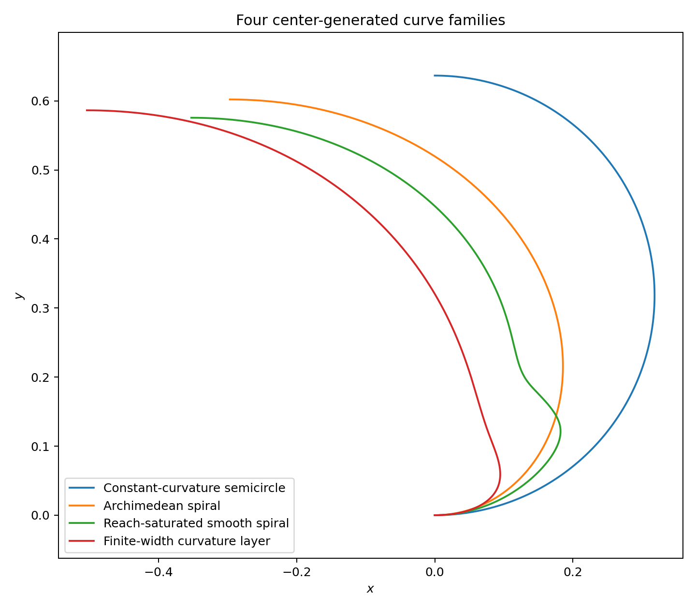
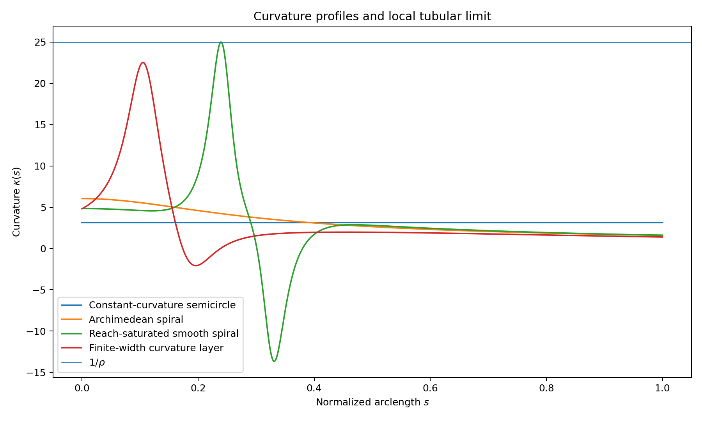
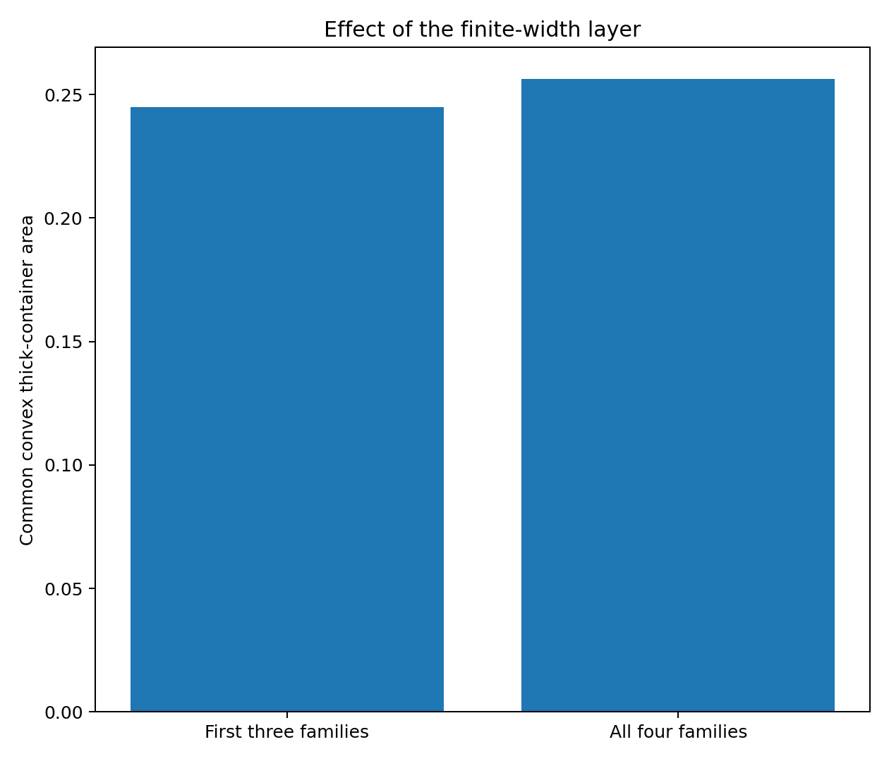
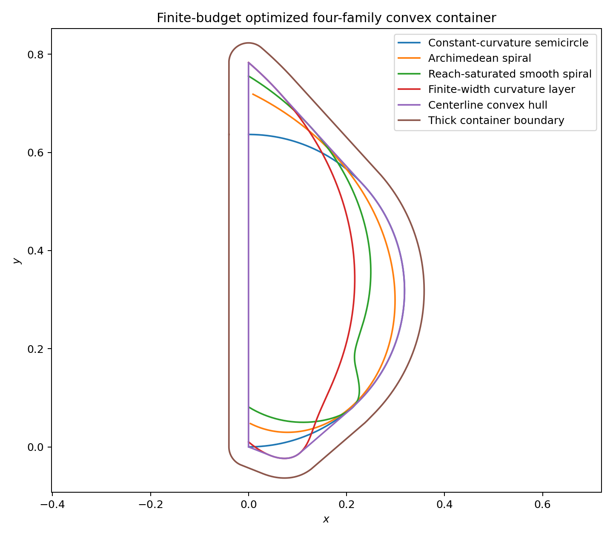
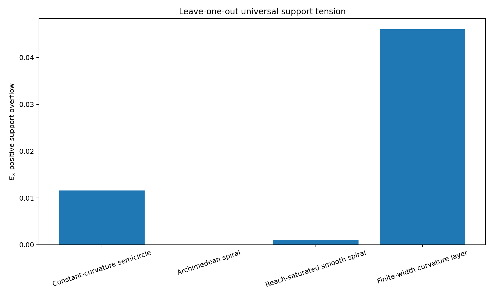
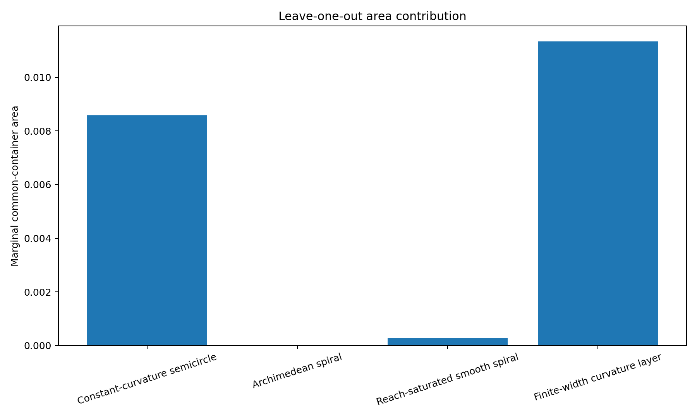
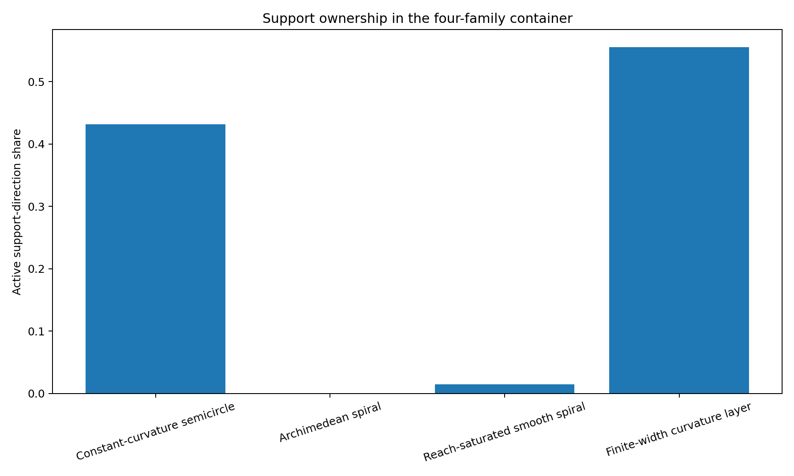
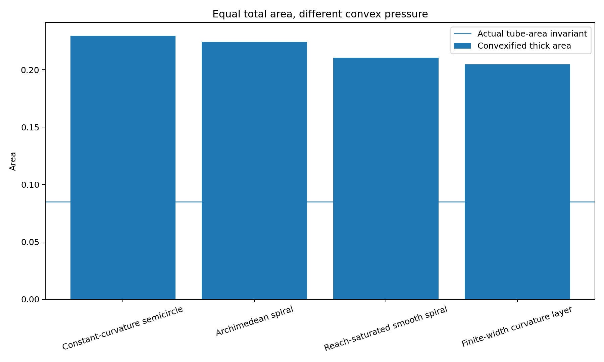

# 中心生成掛谷—Moser橋接族：第一個計算實驗

## ——常曲率、阿基米德、接觸飽和與有限寬度曲率層的普適支撐張力比較

**版本：** v0.1  
**日期：** 2026 年 7 月 27 日  
**性質：** 第一輪有限族計算實驗  
**狀態：** 數值候選；無全域或區間證書

---

# 1. 實驗問題

本文固定：

\[
\boxed{
(L,\rho,\tau)
=
(1,0.04,\pi)
}.
\]

其中：

- \(L=1\)：中心線長度；
- \(\rho=0.04\)：厚度半徑；
- \(\tau=\pi\)：法向針完成所有無向方向。

所有合法無端帽法向帶都具有相同面積：

\[
2\rho L=0.08.
\]

加入兩端半圓帽後：

\[
2\rho L+\pi\rho^2
=
0.085026548246.
\]

所以本輪不比較單體總面積，而比較：

\[
\boxed{
\text{等量異形曲線對共同凸容器造成的額外支撐張力。}
\]

---

# 2. 四個曲線族

1. 常曲率半圓；
2. 阿基米德螺旋；
3. 局部曲率半徑達 \(\rho\) 的接觸飽和平滑螺旋；
4. 以有限預算 max-min 搜尋取得的有限寬度曲率層。

| 曲線族 | 最大曲率 | 最小局部曲率半徑 | 終點半徑 | 單體凸化厚化面積 |
|---|---:|---:|---:|---:|
| 常曲率半圓 | 3.141593 | 0.318310 | 0.636620 | 0.229646 |
| 阿基米德螺旋 | 6.045121 | 0.165423 | 0.671205 | 0.224205 |
| 接觸飽和平滑螺旋 | 24.977599 | 0.040036 | 0.675004 | 0.210486 |
| 有限寬度曲率層 | 22.518355 | 0.044408 | 0.773010 | 0.204626 |

接觸飽和族滿足數值上：

\[
\max\kappa
\approx
\rho^{-1}
=
25.
\]

有限寬度曲率層則滿足：

\[
\max\kappa
\approx
22.518355
<
25.
\]

所以它並不是靠超越局部曲率上限取得壓力。

---

# 3. 共同凸厚化容器

對配置 \(g_i\in SE(2)\)，令：

\[
H
=
\operatorname{conv}
\left(
\bigcup_i g_i\gamma_i
\right).
\]

共同厚化容器為：

\[
C_\rho=H\oplus\rho B.
\]

其面積：

\[
\mu_2(C_\rho)
=
\mu_2(H)
+
\rho\operatorname{Per}(H)
+
\pi\rho^2.
\]

前三族的有限預算最佳值為：

\[
\boxed{
A_3
\approx
0.244915072937
}.
\]

加入有限寬度曲率層後：

\[
\boxed{
A_4
\approx
0.256259897110
}.
\]

增加：

\[
A_4-A_3
\approx
0.011344824173.
\]

相對增幅：

\[
\boxed{
4.6321%
}.
\]

---

# 4. Leave-one-out 支撐張力

對每一族，先用其餘三族建立共同容器，再把該族放回，計算最小 \(L^\infty\) 支撐缺口。

| 被移除曲線族 | 正支撐張力 | 面積增量 | 活動支撐方向比例 |
|---|---:|---:|---:|
| 常曲率半圓 | 0.011591404 | 0.008575538 | 43.1250% |
| 阿基米德螺旋 | 0.000000000 | 0.000000000 | 0.0000% |
| 接觸飽和平滑螺旋 | 0.000973210 | 0.000274087 | 1.4583% |
| 有限寬度曲率層 | 0.046058168 | 0.011344824 | 55.5556% |

---

# 5. 活動支撐方向

在四族共同容器的 \(1440\) 個方向審計中：

\[
\begin{aligned}
\text{有限寬度曲率層}
&\approx
55.5556%,\\
\text{常曲率半圓}
&\approx
43.1250%,\\
\text{接觸飽和螺旋}
&\approx
1.4583%,\\
\text{阿基米德螺旋}
&=
0.0000%.
\end{aligned}
\]

這表示共同容器主要由兩種互補幾何支撐：

\[
\boxed{
\text{常曲率全域骨架}
+
\text{有限寬度曲率集中骨架}.
}
\]

---

# 6. 第一個主要發現

最大曲率排序不是共同容器壓力排序。

接觸飽和螺旋達到：

\[
\max\kappa\approx25,
\]

但只提供約：

\[
1.46%
\]

的活動方向。

有限寬度曲率層的最大曲率較低，卻主導超過一半方向，且 leave-one-out 張力達：

\[
\boxed{
E_\infty
\approx
0.046058168408.
}
\]

所以本輪不支持：

\[
\text{局部 reach 飽和}
\Rightarrow
\text{最大普適容器壓力}.
\]

反而支持：

\[
\boxed{
\text{曲率的有限寬度分布與全域支撐配置，
比單一最大曲率更重要。}
\]

---

# 7. 第二個主要發現

阿基米德螺旋在單體凸化面積上並不最大，也沒有成為四族共同容器的活動支撐者。

其 leave-one-out 支撐值為負：

\[
z
\approx
-0.004327897460,
\]

表示它可以嚴格放進由其他三族生成的共同中心凸包代理中。

所以，在此參數與容器類別下：

\[
\boxed{
\text{阿基米德均勻節距不是 hard case。}
}
\]

---

# 8. 第三個主要發現

每一條完整厚化曲線的實際面積都相同：

\[
0.085026548246.
\]

但四族共同凸厚化容器面積約為：

\[
0.256259897110.
\]

其與單體完整管狀面積之比為：

\[
\boxed{
3.013881.
}
\]

這提供第一個具體數值例子：

\[
\boxed{
\text{單體總量守恆，
不代表普適容納成本守恆。}
\]

---

# 9. 對原理論的回饋

本輪結果對「量度守恆歪線纖維—萬有覆蓋張力理論」提供三項支持。

## 9.1 面積層失去區分力

所有單體法向帶面積固定為：

\[
2\rho L.
\]

所以單體面積無法排序 hard cases。

## 9.2 歪度層保留區分力

不同曲率函數：

\[
\kappa(s)
\]

產生不同支撐函數與不同活動方向。

## 9.3 張力層完成全域排序

Leave-one-out 支撐張力辨認出：

\[
\text{有限寬度曲率層}
>
\text{常曲率半圓}
>
\text{接觸飽和螺旋}
>
\text{阿基米德螺旋}
\]

的本輪邊際壓力排序。

---

# 10. 誠實邊界

本輪尚未證明：

1. 四族曲線各自是其函數族的全域最優者；
2. 共同凸容器搜尋已達全域最小；
3. 非凸容器不會更小；
4. 反射不會改變排序；
5. 取樣方向間不存在遺漏的支撐事件；
6. 接觸飽和族具有完整區間 reach 證書；
7. 有限寬度曲率層是完整橋接族 hard case；
8. 本結果構成掛谷或 Moser 問題的新界。

本輪是：

\[
\boxed{
\text{有限曲線族}
+
\text{凸容器代理}
+
\text{有限預算搜尋}
}
\]

下的第一個可重播實驗。

---

# 11. 下一個自然節點

第二輪應進行：

1. 對有限寬度曲率層做參數 KKT／分支等高化；
2. 加入反射，建立 \(E(2)\) 手性審計；
3. 對四族 reach 做高精度與區間驗證；
4. 將方向網格提升並建立支撐事件圖；
5. 以非凸星形容器測試凸化造成的面積損失；
6. 掃描 \(\rho\) 與 \(\tau\)，研究薄厚度漸近；
7. 搜尋是否存在第五族同時壓迫半圓與有限寬度層的剩餘方向。

---

# 12. 結論

在：

\[
(L,\rho,\tau)=(1,0.04,\pi)
\]

的第一個橋接族實驗中，所有曲線具有相同法向帶總量，但共同容器壓力高度不同。

最重要的結果是：

\[
\boxed{
\text{有限寬度曲率集中}
\text{ 比 }
\text{局部接觸飽和}
\text{ 更能產生普適支撐壓力。}
\]

共同容器的主要骨架不是單一極端形狀，而是：

\[
\boxed{
\text{常曲率半圓}
+
\text{有限寬度曲率層}
}
\]

的互補活動支撐。

這是「總量守恆後，幾何差異轉化為覆蓋張力差異」的第一個具體計算實例。
