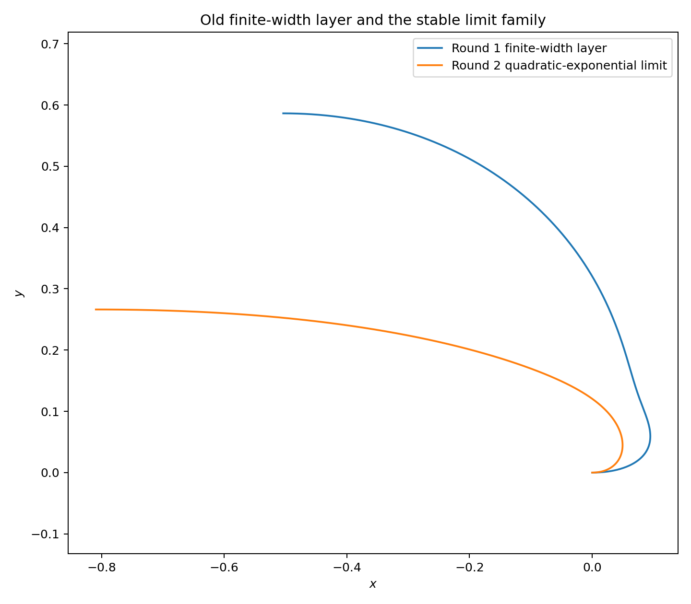
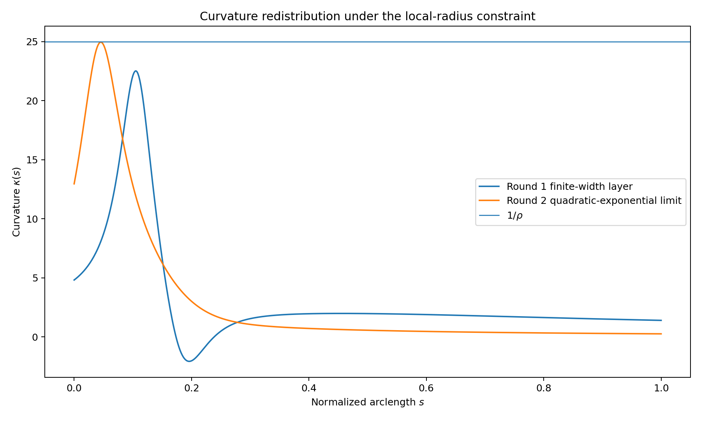
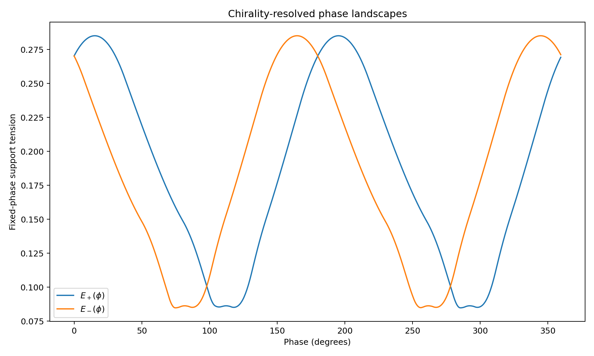
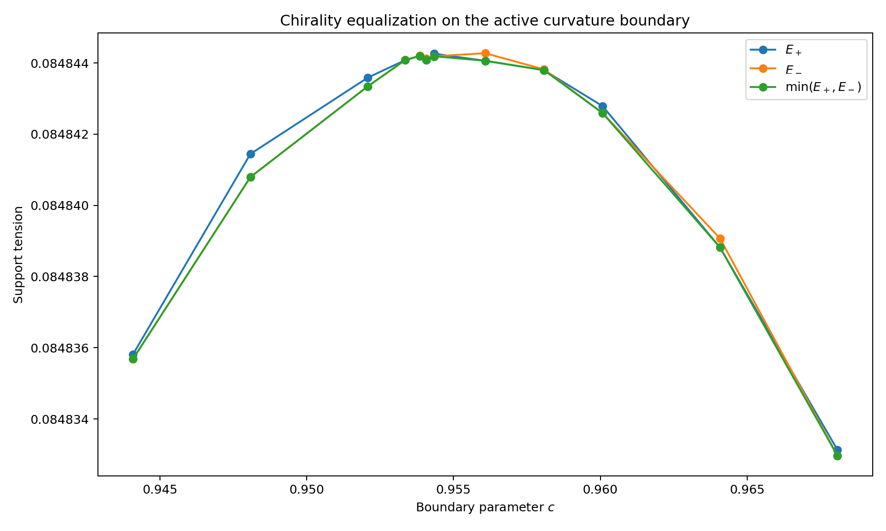
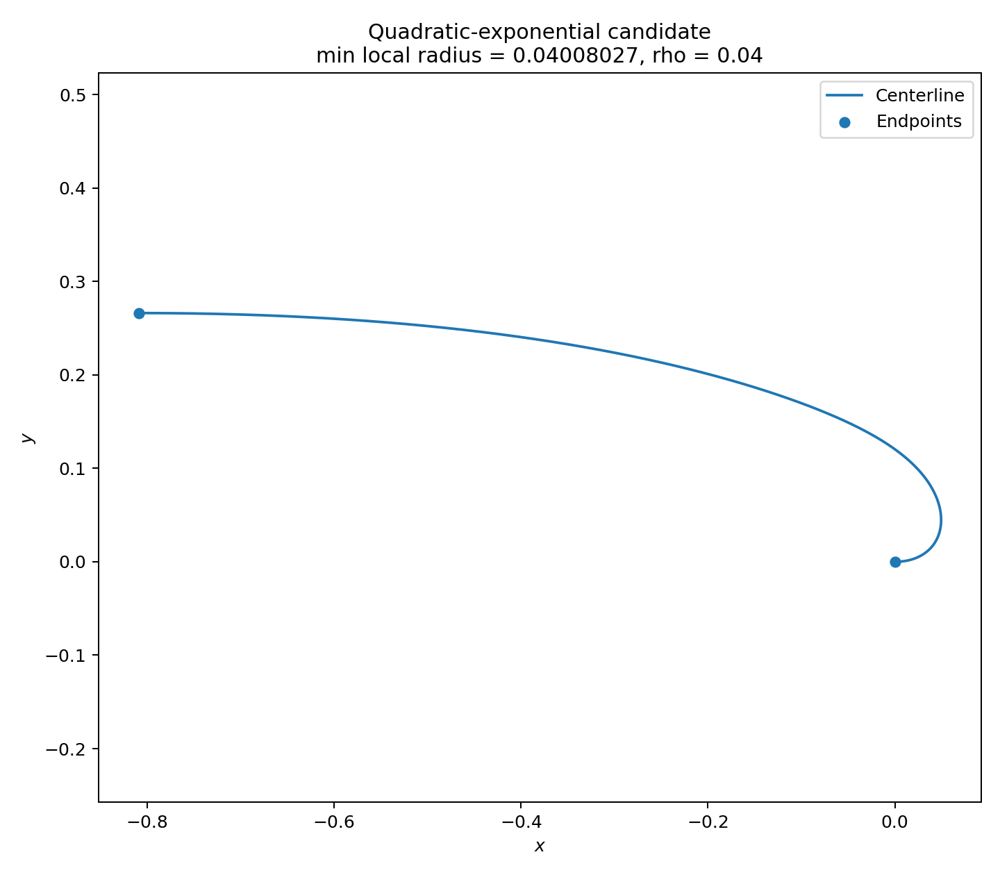
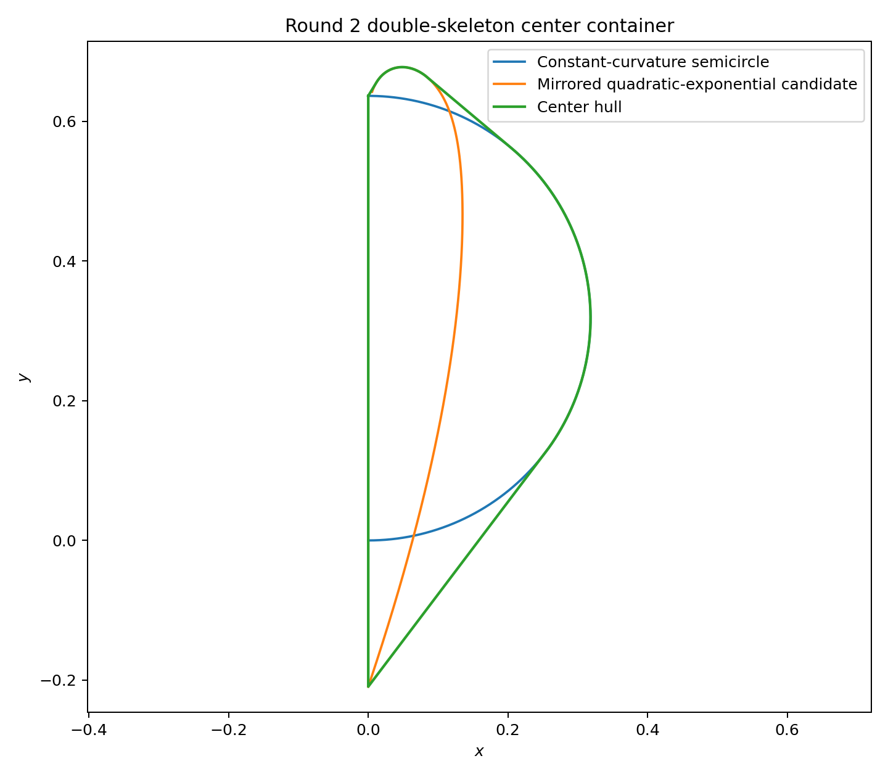
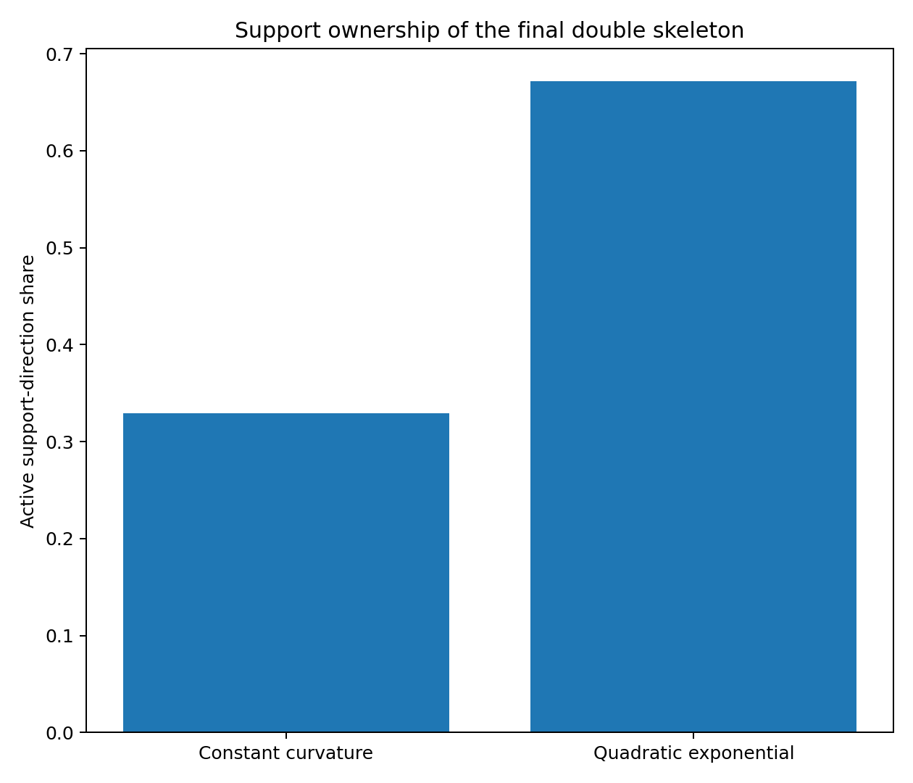
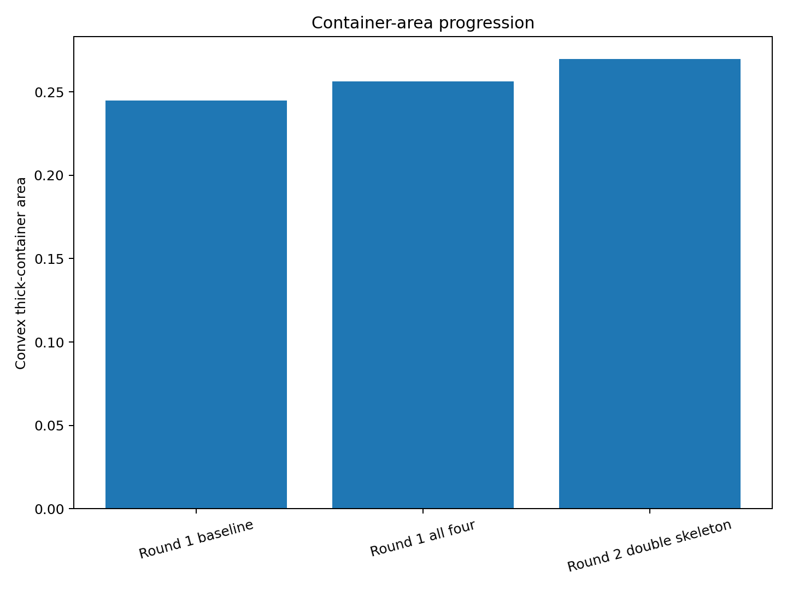

# 中心生成掛谷—Moser橋接族：第 2 輪

## ——曲率飽和術語修正、二次指數極限族、手性等高與雙骨架容器

**版本：** v0.2  
**日期：** 2026 年 7 月 27 日  
**狀態：** 高解析度數值候選；無區間或全域最優證書

---

# 1. 本輪目標

固定：

\[
(L,\rho,\tau)=(1,0.04,\pi).
\]

第 1 輪的主要未解問題是：

1. 有限寬度曲率層是否依賴單一手性；
2. 參數是否只是撞到搜尋盒邊界；
3. 加入共同容器後是否形成穩定支撐骨架。

本輪改用完整合同張力：

\[
E_{\mathrm{cong}}=\min(E_+,E_-).
\]

---

# 2. 術語修正

第 1 輪所稱「接觸飽和」實際只校準：

\[
\max\kappa\approx\rho^{-1}.
\]

這是局部曲率半徑飽和，不是：

\[
\operatorname{reach}(\gamma)=\rho.
\]

因此正式改名為：

\[
\boxed{\text{曲率飽和平滑螺旋}}.
\]

---

# 3. 二次指數極限族

原有限寬度族在 \(a,\varepsilon\) 同時增大時，逼近：

\[
\boxed{
r'(\theta)\propto e^{q(\theta-c)^2}
}.
\]

本輪候選：

\[
q=1.090073547848,
\qquad
c=0.953844856909.
\]

終點極角：

\[
\Theta=2.823761070596,
\]

長度正規化尺度：

\[
b=0.057263454680.
\]

曲率範圍：

\[
0.253909992
\leq
\kappa(s)
\leq
24.949981707.
\]

最小局部曲率半徑：

\[
\frac1{\max\kappa}=0.040080189707,
\]

相對 \(\rho=0.04\) 的局部餘量：

\[
8.018970729117e-05.
\]

---

# 4. 雙手性張力

高解析度結果：

\[
E_+=0.084844199671,
\]

\[
E_-=0.084844204388.
\]

因此：

\[
\boxed{
E_{\mathrm{cong}}
=
0.084844199671
}.
\]

手性差：

\[
|E_+-E_-|
=
4.716945736782e-09.
\]

第 1 輪有限寬度候選的完整合同重播值：

\[
E_{\mathrm{cong}}^{(1)}
=
0.046073023163.
\]

本輪增加：

\[
0.038771176508,
\]

倍率：

\[
1.841516.
\]

---

# 5. 非光滑等高結構

沿活動曲率邊界：

\[
\max\kappa=24.95
\]

調整 \(c\)，兩個手性分支在峰值附近等高。

這不是單一光滑分支的普通極值，而是 epigraph／Clarke 型平衡：

\[
E_+\approx E_-.
\]

原向下一個相位局部極小高出：

\[
0.000351148462.
\]

鏡像下一個相位局部極小高出：

\[
0.000126740211.
\]

---

# 6. 固定相位對偶帳本

兩個控制手性中的 LP 對偶壓力，都集中在一對近似反向方向：

\[
\lambda_1\approx\lambda_2\approx\frac12,
\]

並滿足：

\[
\sum_j\lambda_j=1,
\qquad
\sum_j\lambda_j u_{\theta_j}\approx0.
\]

因此控制機制主要是：

\[
\boxed{
\text{候選方向寬度}
-
\text{前三族容器方向寬度}
}.
\]

這一輪的 hard case 由寬度分支主導，而不是一般三向接觸。

---

# 7. 管狀合法性數值審計

折線近似滿足：

- LineString simple：`True`;
- buffer valid：`True`;
- 理論管狀面積：
  \[
  0.085026542840;
  \]
- buffer 面積：
  \[
  0.085026565415;
  \]
- 差異：
  \[
  -2.257445089193e-08.
  \]

對弧長分離至少 \(0.1\) 的採樣點對，在 \(2\rho+5\times10^{-4}\) 範圍內未找到非局部近接點。

這支持 reach 由局部曲率半徑控制，但仍不是區間 reach 證書。

---

# 8. 共同容器退化為雙骨架

重新優化後，四族共同凸厚化容器只需要：

\[
\boxed{
\text{常曲率半圓}
+
\text{鏡像二次指數極限曲線}
}.
\]

中心凸包面積：

\[
0.184006658575.
\]

中心凸包周長：

\[
2.014782029201.
\]

厚化容器面積：

\[
\boxed{
A_2=0.269624487989
}.
\]

支撐方向比例：

\[
\begin{aligned}
\text{常曲率半圓}
&\approx32.8819%,\\
\text{二次指數曲線}
&\approx67.1528%.
\end{aligned}
\]

---

# 9. 另外兩族成為冗餘族

阿基米德螺旋對雙骨架容器的最佳完整合同張力：

\[
-0.006272925748<0.
\]

曲率飽和平滑螺旋的最佳張力：

\[
-0.004494710587<0.
\]

因此兩者都能嚴格放入雙骨架中心容器，不再提供活動支撐。

---

# 10. 面積比較

第 1 輪前三族容器：

\[
A_3=0.244915072937.
\]

第 1 輪四族容器：

\[
A_4^{(1)}=0.256259897110.
\]

第 2 輪雙骨架容器：

\[
A_2^{(2)}=0.269624487989.
\]

相對前三族增加：

\[
0.024709415052
\quad
(10.0890%).
\]

相對第 1 輪四族增加：

\[
0.013364590879
\quad
(5.2152%).
\]

與單體完整管狀面積之比：

\[
3.171062.
\]

---

# 11. 本輪主要結論

第一，原有限寬度參數不是自然終點；其穩定極限是：

\[
r'(\theta)\propto e^{q(\theta-c)^2}.
\]

第二，完整合同審計沒有削弱候選，反而導致：

\[
E_+\approx E_-.
\]

第三，最大曲率本身不是 hard-case 排序量；更重要的是曲率沿整條中心線的全域重分配與方向寬度。

第四，共同容器不再需要四個活動族，而退化成：

\[
\boxed{
\text{全域常曲率骨架}
+
\text{廣域曲率重分配骨架}
}.
\]

---

# 12. 誠實邊界

本輪沒有證明：

1. 二次指數族是完整橋接族的最優族；
2. 候選參數是連續問題的唯一局部極值；
3. \(\max\kappa=24.95\) 可替代完整 reach 約束；
4. 雙骨架凸容器是全域最小凸容器；
5. 非凸容器不能更小；
6. 離散方向間沒有遺漏支撐事件；
7. 本結果構成新的掛谷或 Moser 面積界。

---

# 13. 下一個自然節點

第 3 輪應：

1. 直接使用 reach，而非只用 \(\max\kappa\) 作活動約束；
2. 建立 interval curvature 與 interval reach 證書；
3. 對手性等高點建立 KKT／Clarke 盒；
4. 把寬度主導公式提升成解析分支公式；
5. 在雙骨架容器上搜索專門攻擊切換方向的第五族；
6. 開始非凸容器削減，測量凸化成本。

---

# 14. 結論

第 2 輪將有限寬度數值候選提升為較穩定的極限幾何：

\[
\boxed{
r'(\theta)\propto e^{q(\theta-c)^2}
}.
\]

它在完整合同下取得：

\[
\boxed{
E_{\mathrm{cong}}
\approx
0.084844199671
}.
\]

共同凸厚化容器推進至：

\[
\boxed{
A\approx0.269624487989
}.
\]

本輪最重要的理論訊號是：

\[
\boxed{
\text{橋接族 hard case 不是由單一最大曲率決定，}
\text{而由全域曲率重分配與方向寬度共同決定。}
}
