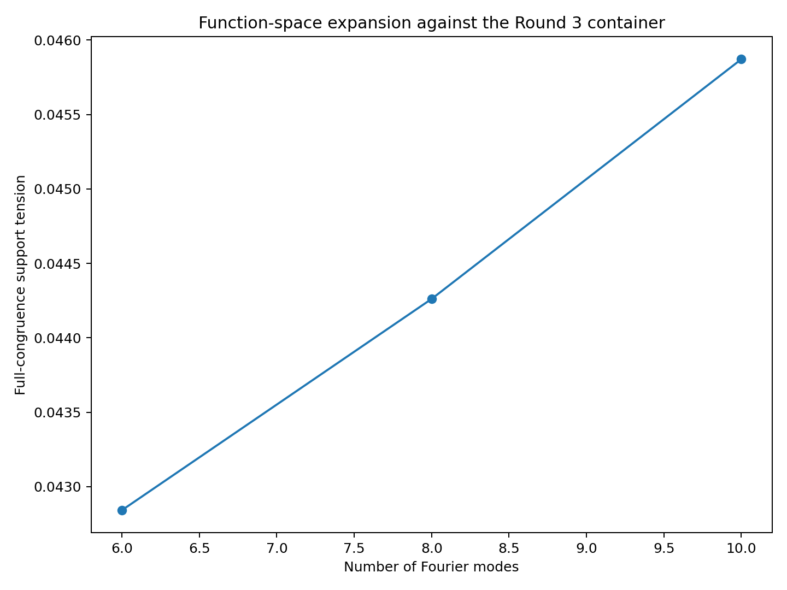
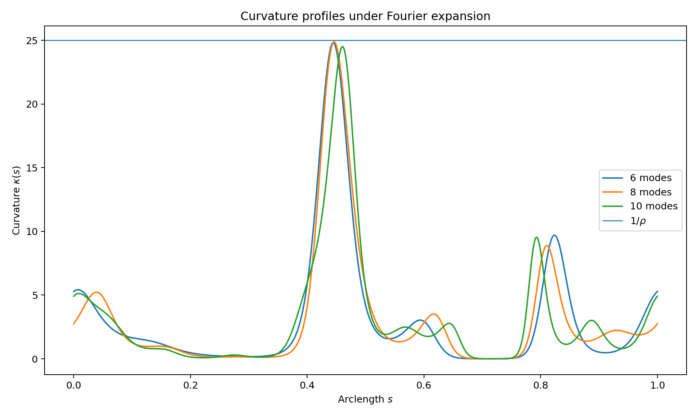
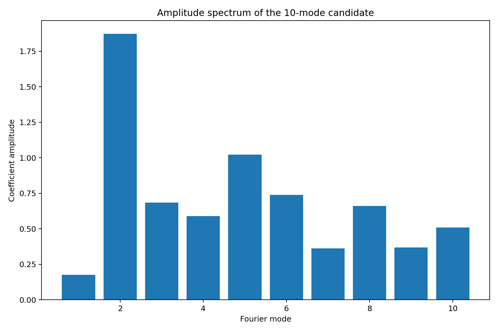
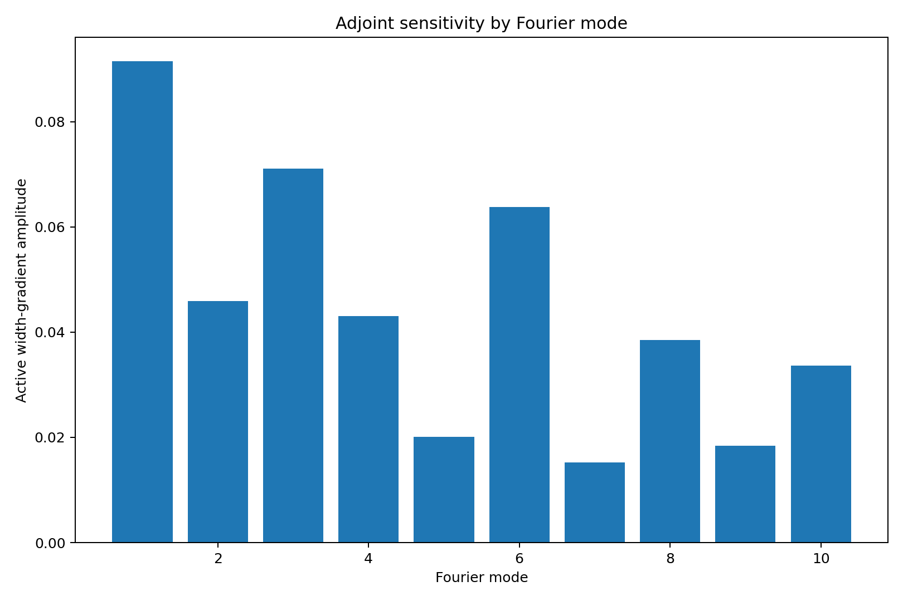
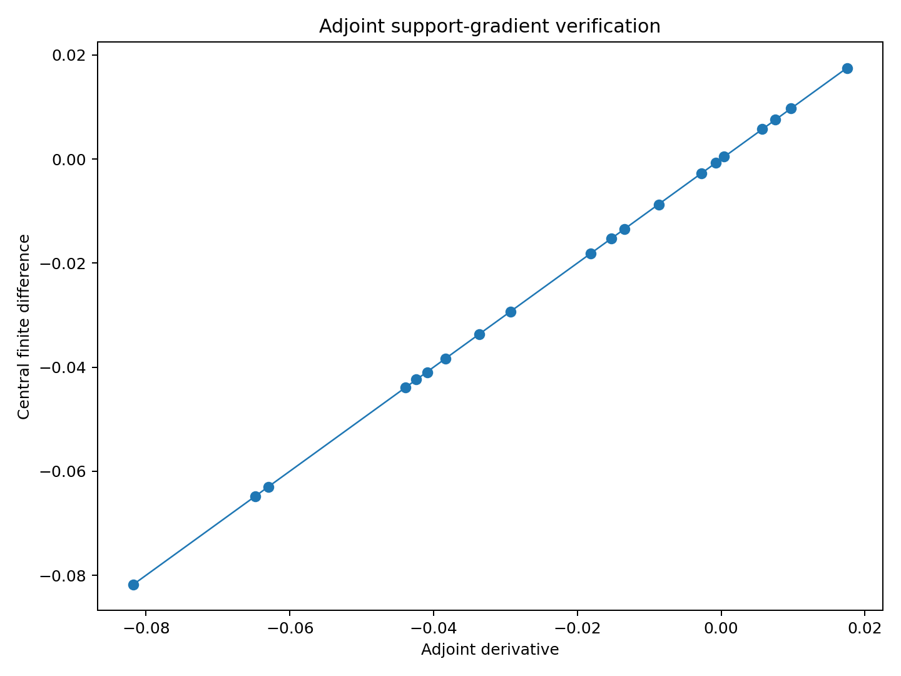
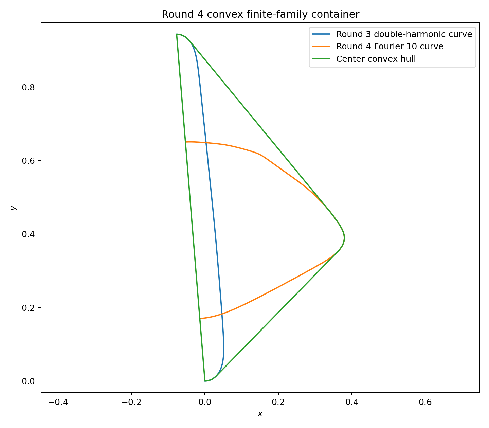
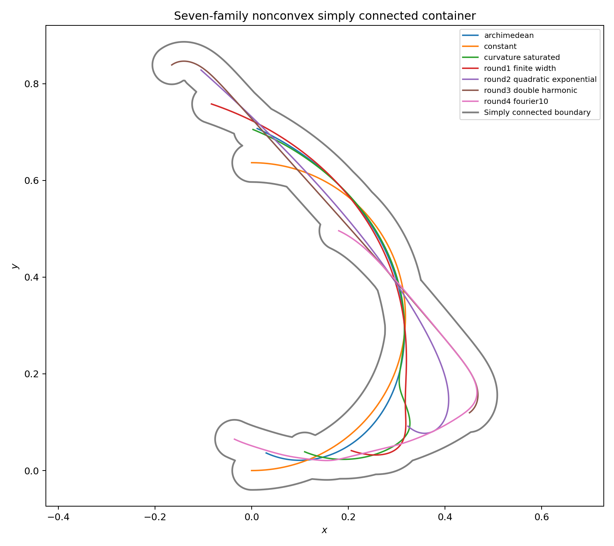
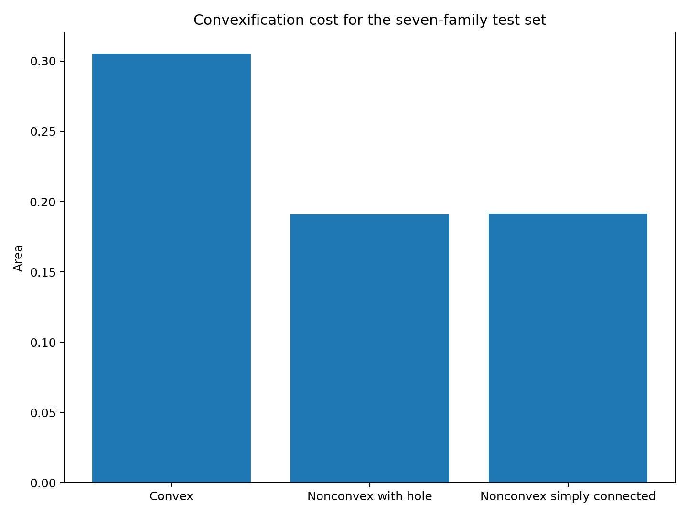

# 中心生成掛谷—Moser橋接族：第 4 輪

## ——Fourier 曲率函數空間、伴隨靈敏度與非凸容器削減

**版本：** v0.4  
**日期：** 2026 年 7 月 27 日  
**狀態：** 有限維函數空間候選＋半驗證曲率盒＋有限族非凸容器候選

---

# 1. 研究問題

固定：

\[
(L,\rho,\tau)
=
(1,0.04,\pi).
\]

本輪同時研究：

1. 增加曲率函數自由度後，能否突破第 3 輪凸容器；
2. 過去測得的容器壓力，有多少是凸化本身造成。

---

# 2. Fourier 曲率函數空間

\[
g_M(s)
=
\sum_{m=1}^M
\left[
a_m\cos(2\pi ms)
+
b_m\sin(2\pi ms)
\right],
\]

\[
\kappa_M(s)
=
\frac{
\pi e^{g_M(s)}
}{
\int_0^1e^{g_M(u)}du
}.
\]

此參數化自動滿足：

\[
\kappa_M(s)>0,
\qquad
\int_0^1\kappa_M(s)ds=\pi.
\]

---

# 3. 維度推進

對第 3 輪凸容器：

\[
E_6=0.042842089939,
\]

\[
E_8=0.044261255904,
\]

\[
E_{10}=0.045871358626.
\]

由 8 模式到 10 模式仍增加：

\[
3.6377%.
\]

所以 Fourier 維度尚未顯示明確收斂。

---

# 4. Fourier-10 候選

完整合同分支：

\[
E_+=0.045871364037,
\]

\[
E_-=0.045871358626.
\]

手性差：

\[
5.410603673428e-09.
\]

採樣最大曲率：

\[
24.500033481718.
\]

向外風格曲率盒：

\[
\max\kappa
\in
[
24.478974504951,
24.521117582109
].
\]

因此：

\[
\frac1{\max\kappa}
\ge
0.040781175517
>
0.04.
\]

管狀面積重播誤差：

\[
-9.320805660629e-08.
\]

---

# 5. 頻譜與敏感度

10 個模式均有非零係數振幅；活動寬度分支的伴隨敏感度也分散於多個模式。

第 1 模式係數振幅不大，但梯度敏感度很高；第 2 模式振幅最大，卻不是邊際梯度最大者。

因此：

\[
\text{係數振幅}
\not\Rightarrow
\text{容器張力敏感度}.
\]

---

# 6. 伴隨梯度

\[
\delta\kappa(s)
=
\kappa(s)
\left[
\delta g(s)
-
\frac1\pi
\int_0^1\kappa(u)\delta g(u)du
\right].
\]

\[
\delta\gamma(s)
=
\int_0^s
N(u)
\left[
\int_0^u\delta\kappa(v)dv
\right]du.
\]

若方向 \(n\) 的支撐點 \(s_\ast\) 唯一：

\[
\delta h_\gamma(n)
=
n\cdot\delta\gamma(s_\ast).
\]

數值核對：

\[
\max|D^{\mathrm{FD}}-D^{\mathrm{adj}}|
=
7.537290719695e-05,
\]

相對 \(L^2\) 誤差：

\[
1.194240584988e-03.
\]

---

# 7. 凸有限族容器

加入 Fourier-10 後，活動骨架為：

\[
\text{第 3 輪雙頻對數曲率曲線}
+
\text{第 4 輪 Fourier-10 曲線}.
\]

常曲率半圓及其餘舊族均具有負支撐張力。

共同凸厚化容器：

\[
A_{\mathrm{convex}}
=
0.305379358034.
\]

---

# 8. 非凸有限族容器

納入全部七個測試族後：

\[
A_{\mathrm{raw}}
=
0.191049126345
\]

為帶一個小孔洞的連通聯集。

填孔後：

\[
A_{\mathrm{sc}}
=
0.191444211669.
\]

相對凸容器削減：

\[
37.3094%.
\]

---

# 9. 結構判斷

凸與非凸問題中的活動族不同。

支撐函數只記錄凸包；非凸容器還必須記錄：

- 凹槽；
- 狹窄通道；
- 局部空缺；
- 管狀邊界間的互補嵌合。

因此：

\[
\text{凸支撐冗餘}
\not\Rightarrow
\text{非凸容器冗餘}.
\]

第 1 輪有限寬度族在凸問題中已冗餘，但在非凸容器 leave-one-out 中仍有非零貢獻；阿基米德族則可被其他六族完全吸收。

---

# 10. 誠實邊界

本輪沒有證明：

1. 10 模式是 Fourier 空間全局最優；
2. Fourier 維度已收斂；
3. 凸雙骨架容器是全局最小；
4. 非凸七族容器是全局最小；
5. 七族代表完整橋接曲線族；
6. 浮點盒是 Arb／MPFI 區間證書；
7. 本輪形成掛谷或 Moser 問題的新界。

---

# 11. 下一個自然節點

第 5 輪應建立交替對抗系統：

\[
\kappa^{(n+1)}
=
\arg\max_\kappa
\inf_g
\mathcal E
(T_\rho(\gamma_\kappa),C^{(n)}),
\]

\[
C^{(n+1)}
=
\operatorname{Prune}
\left[
C^{(n)}
\cup
gT_\rho(\gamma_{\kappa^{(n+1)}})
\right].
\]

具體包括：

1. Fourier／B-spline 伴隨梯度更新；
2. 非凸容器 signed-distance 或 level-set 更新；
3. 使用腐蝕集合 \(C\ominus\rho B\) 判定厚化曲線放置；
4. 對凹槽活動邊界建立局部距離張力；
5. Fourier 維度與容器網格同步加密；
6. 把最終有限證書遷移到區間算術。

---

# 12. 結論

第 4 輪得到兩個互補事實：

\[
\text{提高曲率函數維度仍能增加凸支撐張力},
\]

但同時：

\[
\text{凸化成本約佔目前有限族容器面積的 }37.31\%.
\]

因此後續真正的 hard case，不應只是最大化凸支撐缺口，而應尋找：

\[
\boxed{
\text{無法利用現有非凸凹槽、通道與局部互補結構放置的新曲率函數}.
}
\]
