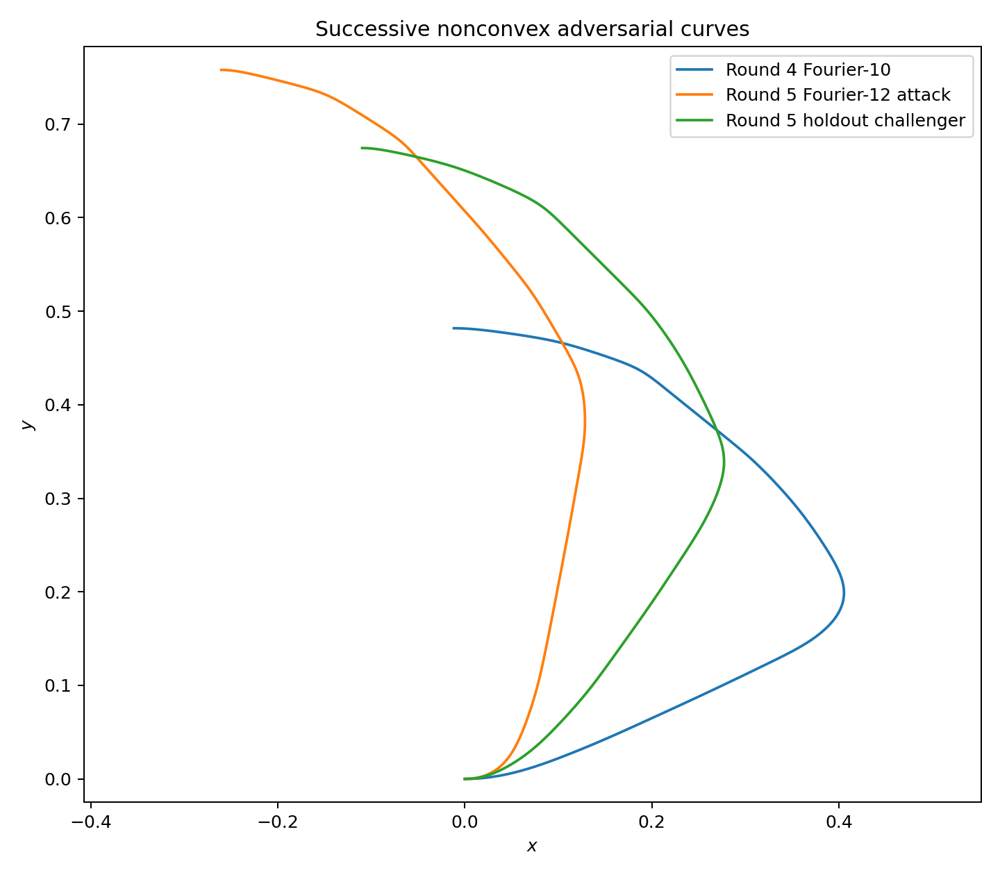
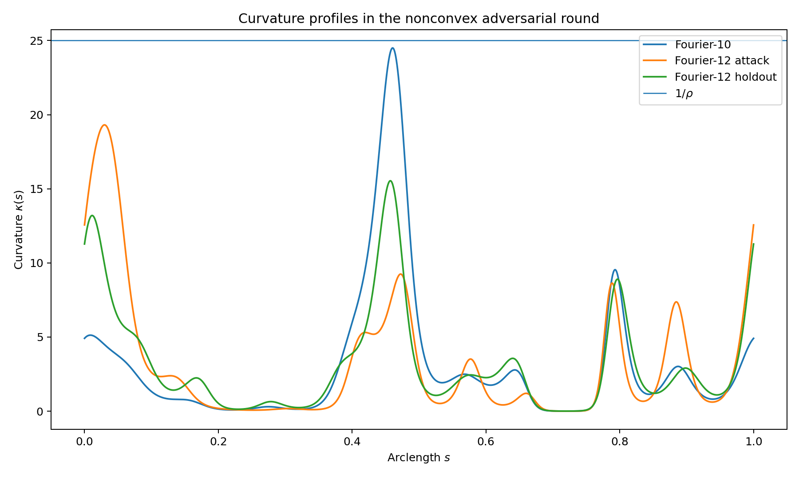
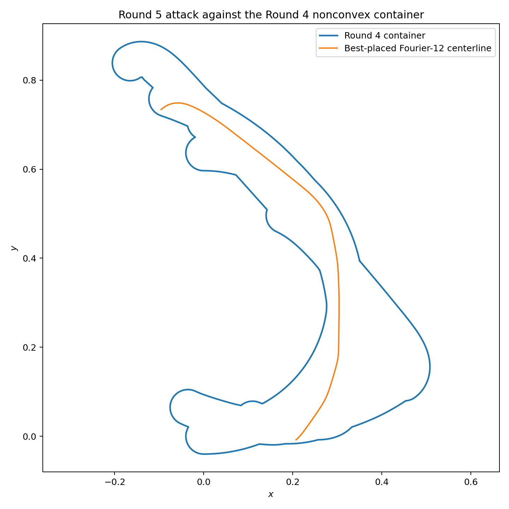
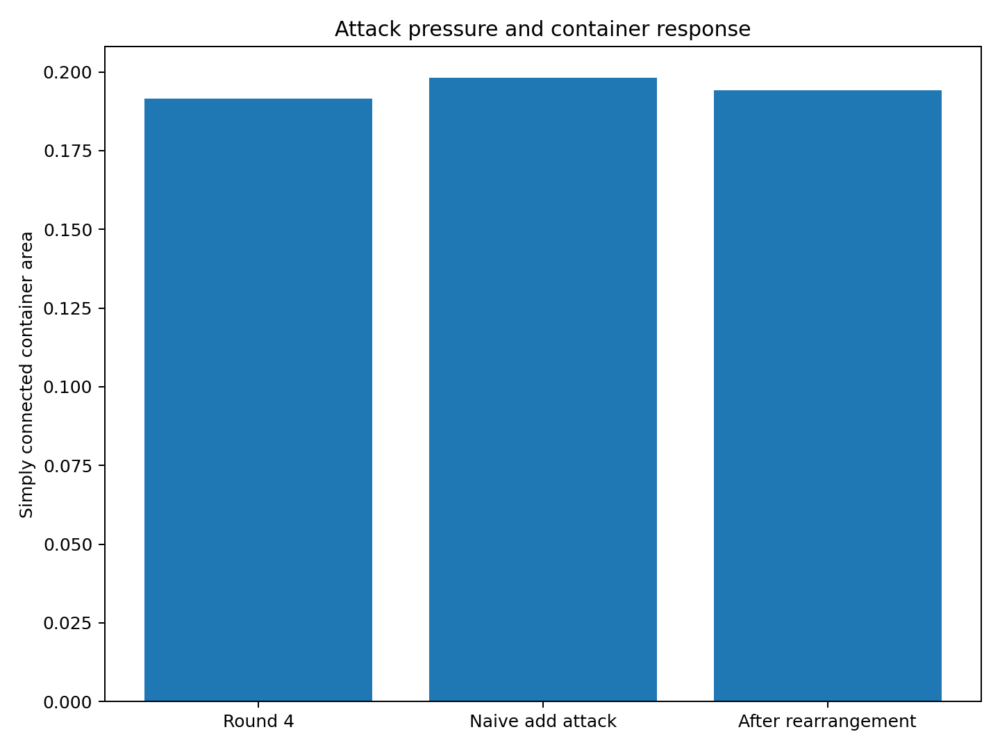
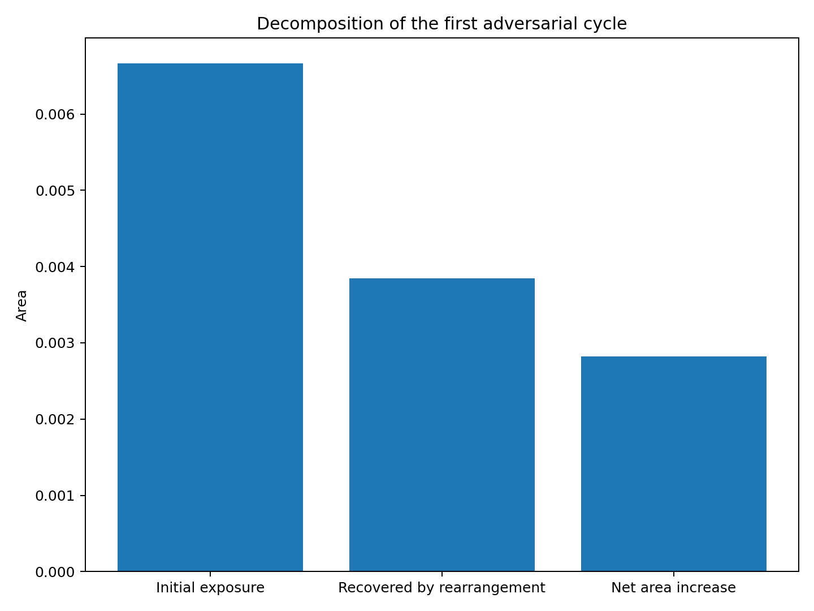
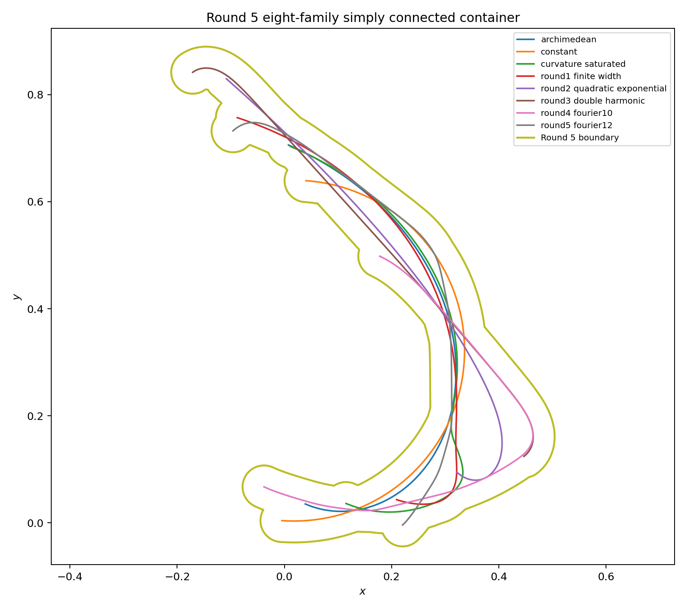
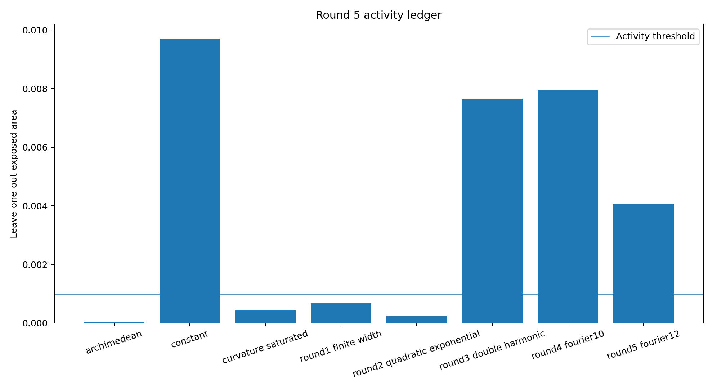
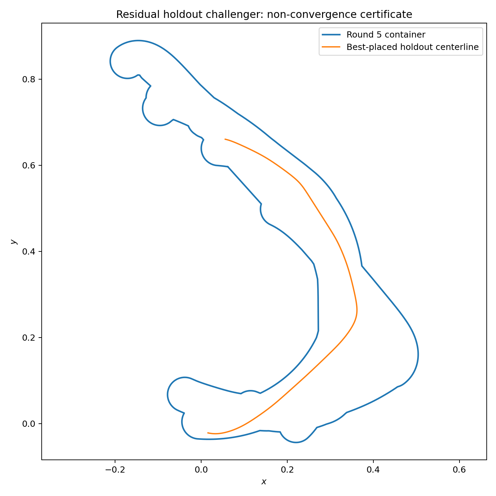

# 中心生成掛谷—Moser橋接族：第 5 輪

## ——非凸面積外露張力與第一個曲線—容器交替對抗循環

**版本：** v0.5  
**日期：** 2026 年 7 月 27 日  
**狀態：** 有限 Fourier 族、有限放置搜尋與非凸容器座標下降候選

---

# 1. 研究轉向

前 4 輪的曲線搜尋主要以凸支撐缺口為目標。

第 4 輪顯示，七族單連通非凸容器面積只有：

\[
0.191444211669,
\]

遠低於同族凸容器。

所以第 5 輪不再問：

> 哪條曲線最難放入某個凸包？

而改問：

> 哪條厚化曲線即使利用現有非凸凹槽、通道與局部互補結構，仍留下最大外露面積？

---

# 2. 面積外露張力

定義：

\[
\mathcal A_C(\gamma)
=
\inf_{g\in E(2)}
\mu_2
\left[
(gT_\rho(\gamma))\setminus C
\right].
\]

若：

\[
\mathcal A_C(\gamma)=0,
\]

則曲線的完整管狀鄰域可在某個合同配置下放入 \(C\)。

這是第 5 輪真正使用的非凸容器張力。

---

# 3. Fourier-12 攻擊曲線

曲率仍採正規化對數 Fourier 形式：

\[
\kappa(s)
=
\frac{
\pi e^{g_{12}(s)}
}{
\int_0^1e^{g_{12}(u)}du
}.
\]

半驗證曲率盒：

\[
\max\kappa
\in
[
19.278187626136,
19.342578149755
].
\]

因此：

\[
\frac1{\max\kappa}
\ge
0.051699416296
>
0.04.
\]

採樣最小徑向導數帳本為正，中心線 simple，buffer 有效。

攻擊曲線在第 4 輪容器中的最佳外露面積：

\[
\boxed{
\mathcal A_{C_4}(\gamma_5)
=
0.006664458451
}.
\]

相對單體管狀面積：

\[
7.8381%.
\]

---

# 4. 多分支放置審計

多個全域搜尋種子在最佳鏡像分支上收斂到同一配置。

最佳鏡像分支的低解析外露值約：

\[
0.00665814.
\]

最高解析局部重算為：

\[
0.006664458451.
\]

下一個原向控制分支約為：

\[
0.00685613.
\]

其他局部分支顯著更高。

這支持目前配置是強數值候選，但仍不是全局放置證書。

---

# 5. 直接加入與防守回應

第 4 輪容器：

\[
A_4
=
0.191444211669.
\]

保持既有配置不動，直接加入攻擊曲線：

\[
A_{\mathrm{naive}}
=
0.198108843289.
\]

逐族重新配置後：

\[
\boxed{
A_5
=
0.194262391530.
}
\]

容器回收：

\[
0.003846451759,
\]

即攻擊外露量的：

\[
57.7159%.
\]

最終淨增加：

\[
0.002818179861,
\]

相對第 4 輪：

\[
1.4721%.
\]

---

# 6. 最終容器

高解析重播得到：

\[
A_{\mathrm{raw}}
=
0.194082126470.
\]

聯集含一個面積：

\[
0.000180265060
\]

的小孔洞。

填孔後單連通面積：

\[
A_{\mathrm{sc}}
=
0.194262391530.
\]

容器有效且連通。

---

# 7. 活動骨架

以 leave-one-out 外露面積 \(10^{-3}\) 作活動門檻，目前主要活動族為：

1. `constant`：0.009712611659
2. `round3_double_harmonic`：0.007655203324
3. `round4_fourier10`：0.007965433132
4. `round5_fourier12`：0.004067990482

各族詳細外露量見機讀帳本與圖表。

這表示第 5 輪新增曲線不是單純取代舊骨架，而是成為第四個主要非凸活動來源。

---

# 8. 保留樣本與未收斂性

容器更新完成後，另以未參與訓練的隨機 12 模式曲線作保留樣本。

最佳保留候選仍有：

\[
\boxed{
\mathcal A_{C_5}(\gamma_{\mathrm{holdout}})
=
0.004934177792
>0.
}
\]

其最大曲率約：

\[
15.540501909157.
\]

因此：

\[
\boxed{
\text{第 5 輪交替系統尚未收斂。}
}
\]

該曲線已保存為第 6 輪攻擊種子。

---

# 9. 本輪理論訊號

本輪第一次直接量化：

\[
\text{曲線攻擊壓力}
\longrightarrow
\text{容器重排吸收}
\longrightarrow
\text{容器淨增量}.
\]

得到：

\[
\boxed{
\text{約 }57.7\%\text{ 的初始外露壓力可由重新配置吸收。}
}
\]

剩餘約：

\[
42.3\%
\]

轉化為真正的容器面積增長。

所以只計算「新曲線對固定容器的外露量」會高估長期普適容器的面積增量；必須讓容器回應後再記帳。

---

# 10. 誠實邊界

本輪沒有證明：

1. Fourier-12 攻擊曲線是函數空間最優；
2. 最佳合同放置已獲全局證書；
3. 八族非凸容器已達全局最小；
4. 保留樣本代表全部曲率函數空間；
5. 浮點曲率盒是 Arb／MPFI 證書；
6. 本輪形成掛谷或 Moser 問題的新界。

---

# 11. 下一個自然節點

第 6 輪可直接以已保存的保留候選開始第二個交替循環。

但方法上應升級為：

1. 使用 signed-distance 伴隨梯度更新曲率係數；
2. 使用連續腐蝕清距而非純網格代理；
3. 同步更新曲線係數與剛體配置；
4. 在容器側使用局部邊界位移或 level-set 削減；
5. 對每輪記錄：
   \[
   \text{攻擊外露量、回收量、淨增量}.
   \]
6. 觀察淨增量序列是否趨向零。

---

# 12. 結論

第 5 輪完成了第一個完整循環：

\[
C_4
\longrightarrow
\gamma_5
\longrightarrow
C_5.
\]

攻擊曲線對固定容器的外露量：

\[
0.006664458451.
\]

容器回應後淨面積增量：

\[
0.002818179861.
\]

最終單連通面積：

\[
\boxed{
A_5
=
0.194262391530.
}
\]

最重要的研究轉向是：

\[
\boxed{
\text{真正的普適容器研究必須是曲率函數與非凸容器的交替對抗，}
\text{而不是只對固定凸容器排序曲線。}
}
