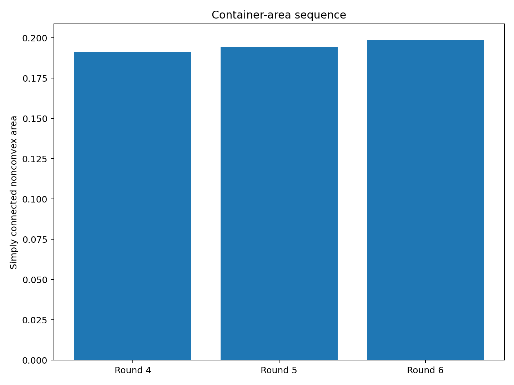
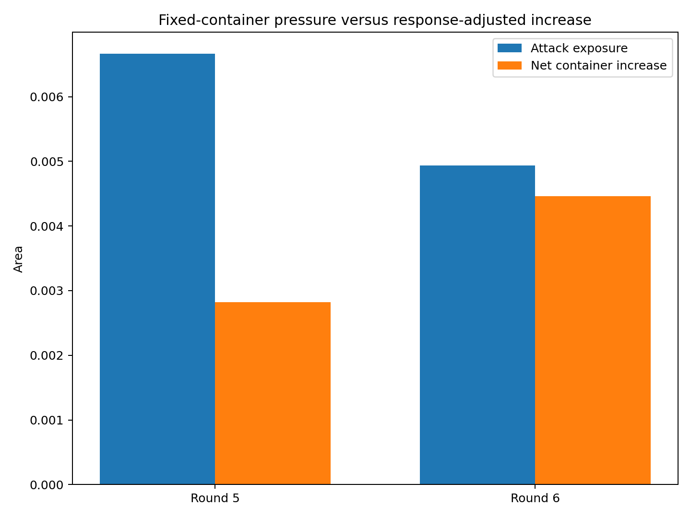
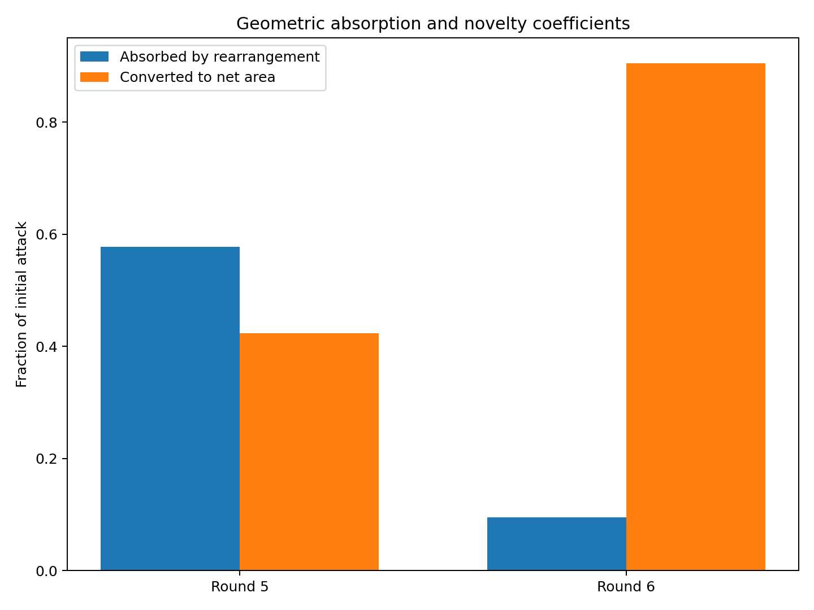
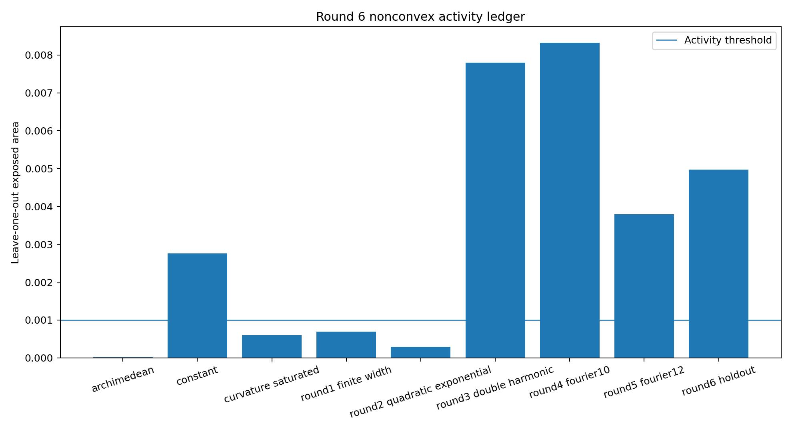
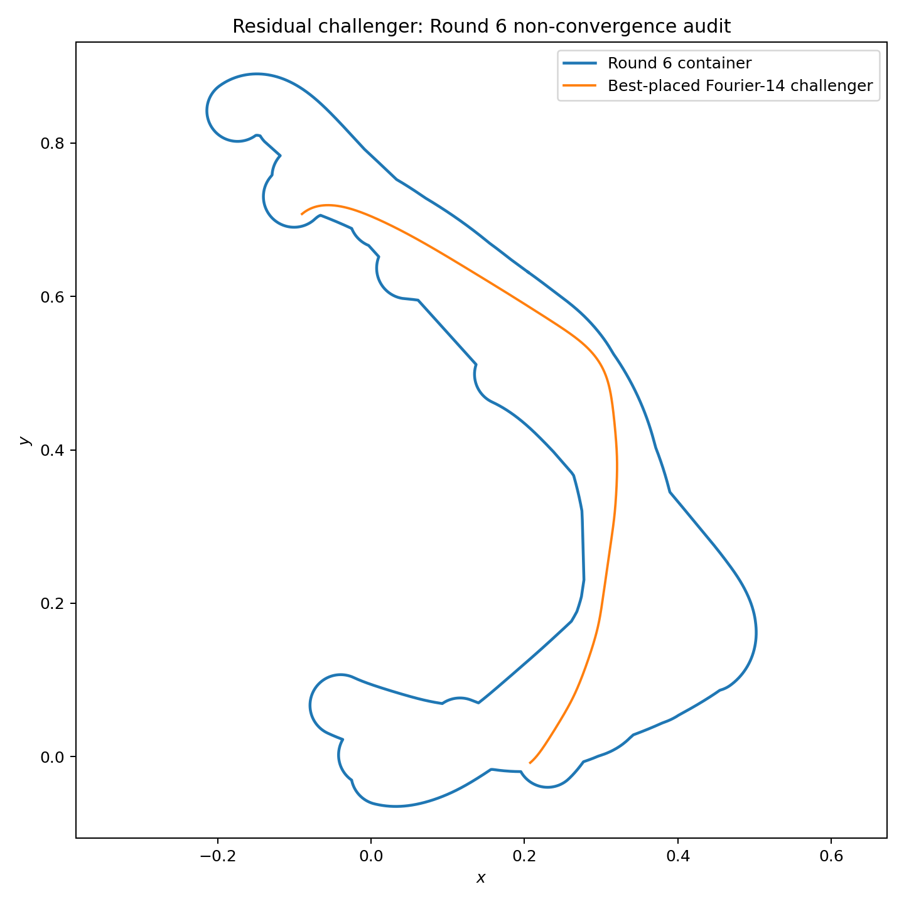

# 中心生成掛谷—Moser橋接族：第 6 輪

## ——第二次非凸交替循環、吸收係數與 Fourier-14 殘餘攻擊

**版本：** v0.6  
**日期：** 2026 年 7 月 28 日  
**狀態：** 有限 Fourier 族、有限合同搜尋與非凸容器座標下降候選

---

# 1. 本輪目標

第 5 輪完成第一個：

\[
C_4\longrightarrow\gamma_5\longrightarrow C_5
\]

循環，並保存一條仍對 \(C_5\) 有正外露量的 Fourier-12 候選。

第 6 輪直接以該曲線完成：

\[
C_5\longrightarrow\gamma_6\longrightarrow C_6.
\]

本輪不重新挑選攻擊曲線，以避免訓練集與保留集混用。

---

# 2. 正式攻擊

第 6 輪攻擊外露量：

\[
\boxed{
e_6
=
0.004934177792.
}
\]

占單體完整管狀面積：

\[
5.8031%.
\]

曲率外包盒：

\[
\max\kappa
\in
[
15.519775636551,
15.562199256863
].
\]

保守曲率半徑：

\[
\frac1{\max\kappa}
\ge
0.064258269895
>
0.04.
\]

因此該攻擊不是曲率飽和型候選。

---

# 3. 第二次容器回應

第 5 輪保存面積：

\[
A_5
=
0.194262391530.
\]

直接加入後：

\[
A_{\mathrm{naive}}
=
0.199197456848.
\]

重新配置九族後，高解析單連通面積：

\[
\boxed{
A_6
=
0.198726522197.
}
\]

原始聯集面積：

\[
0.198647118725.
\]

剩餘孔洞面積：

\[
0.000079403472.
\]

回收面積：

\[
0.000470934651.
\]

吸收率：

\[
\boxed{
\eta_6
\approx
9.5443%.
}
\]

淨增量：

\[
\boxed{
\Delta A_6
=
0.004464130667.
}
\]

相對第 5 輪增加：

\[
2.2980%.
\]

---

# 4. 活動骨架

以 \(10^{-3}\) 的 leave-one-out 外露量作門檻，主要活動族為：

1. `constant`：0.002760805466
2. `round3_double_harmonic`：0.007800765133
3. `round4_fourier10`：0.008326284463
4. `round5_fourier12`：0.003787840301
5. `round6_holdout`：0.004968182833

第 6 輪攻擊曲線本身仍保有：

\[
0.004968182833
\]

的 leave-one-out 外露量，因此不是加入後立即冗餘的曲線。

---

# 5. 與第 5 輪比較

第 5 輪：

\[
e_5
=
0.006664458451,
\qquad
\Delta A_5
=
0.002818179861,
\qquad
\eta_5
=
57.7133%.
\]

第 6 輪：

\[
e_6
=
0.004934177792,
\qquad
\Delta A_6
=
0.004464130667,
\qquad
\eta_6
=
9.5443%.
\]

雖然：

\[
e_6<e_5,
\]

但：

\[
\Delta A_6>\Delta A_5.
\]

原因是第二條攻擊與現有容器凹槽的幾何互補性較低，只有約 \(9.5\%\) 可由重排吸收。

因此：

\[
\boxed{
\text{攻擊外露量的下降，不足以保證容器淨增量下降。}
}
\]

---

# 6. Fourier-14 殘餘攻擊

在更新後的 \(C_6\) 上：

- 生成 20 條 Fourier-14 擾動曲線；
- 15 條通過幾何篩選；
- 前 5 名作完整放置重算。

最強殘餘候選得到：

\[
\boxed{
e_6^{\mathrm{res}}
=
0.006847625978.
}
\]

占其管狀面積：

\[
8.0535%.
\]

其曲率盒：

\[
\max\kappa
\in
[
21.737588058490,
21.798886996249
],
\]

並有：

\[
\frac1{\max\kappa}
\ge
0.045873901735
>
0.04.
\]

它的外露量高於本輪正式攻擊，故目前不存在近似封閉證據。

---

# 7. 收斂判定

面積序列：

\[
\begin{aligned}
A_4&=0.191444211669,\\
A_5&=0.194262391530,\\
A_6&=0.198726522197.
\end{aligned}
\]

增量：

\[
\Delta A_5
=
0.002818179861,
\]

\[
\Delta A_6
=
0.004464130667.
\]

\(\Delta A_6\) 未低於 \(\Delta A_5\)，且殘餘攻擊仍為正。

因此：

\[
\boxed{
\text{目前沒有單調收斂、維度收斂或攻擊封閉的證據。}
}
\]

---

# 8. 誠實邊界

本輪沒有證明：

1. 第 6 輪攻擊是 Fourier-12 全局最優；
2. 九族非凸容器是全局最小；
3. Fourier-14 殘餘候選是完整曲率函數空間最優；
4. 最佳合同放置具有全局證書；
5. 曲率盒是形式區間證書；
6. 本輪形成掛谷或 Moser 問題的新面積界。

---

# 9. 下一個自然節點

第 7 輪可直接使用已保存的 Fourier-14 殘餘候選。

方法上應加入：

1. 曲率係數與剛體配置的聯合伴隨更新；
2. 以容器 signed-distance 邊界法向導數近似外露面積梯度；
3. Fourier-14 至 Fourier-18 的嵌套維度審計；
4. B-spline 曲率族作非 Fourier 保留集；
5. 多次交替後對：
   \[
   e_n,\ \Delta A_n,\ \eta_n
   \]
   做趨勢與上界估計；
6. 對最終活動族建立區間曲率與合同放置盒。

---

# 10. 結論

第 6 輪完成第二個交替循環：

\[
C_5\longrightarrow\gamma_6\longrightarrow C_6.
\]

最終單連通容器：

\[
\boxed{
A_6
=
0.198726522197.
}
\]

但本輪最大的理論收穫不是面積數字，而是：

\[
\boxed{
\text{容器能否吸收一條攻擊，取決於攻擊與現有非凸結構的幾何互補性，}
\text{而不只取決於攻擊外露量本身。}
}
\]

Fourier-14 殘餘候選已表明，交替對抗仍需繼續。
