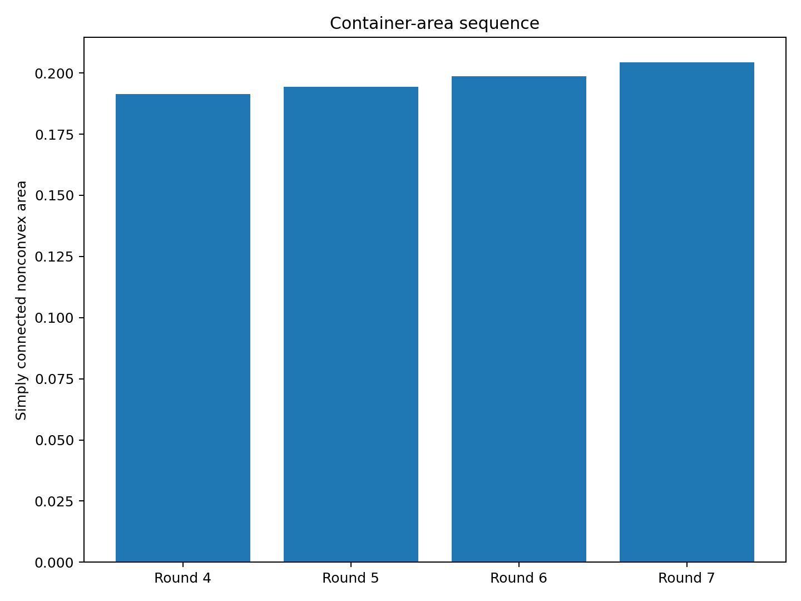
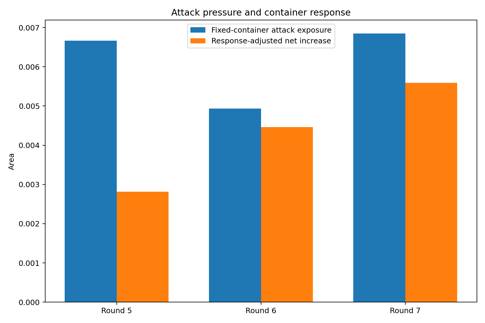
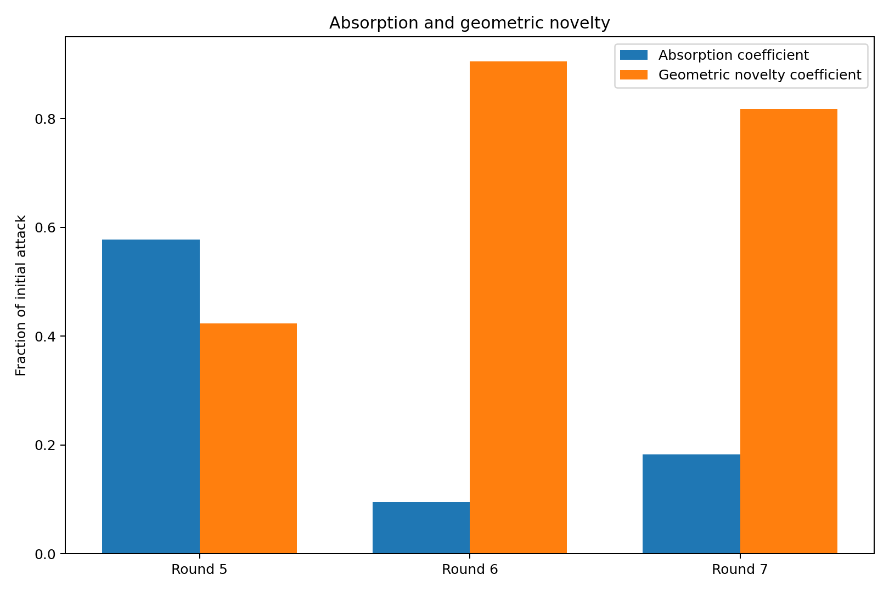
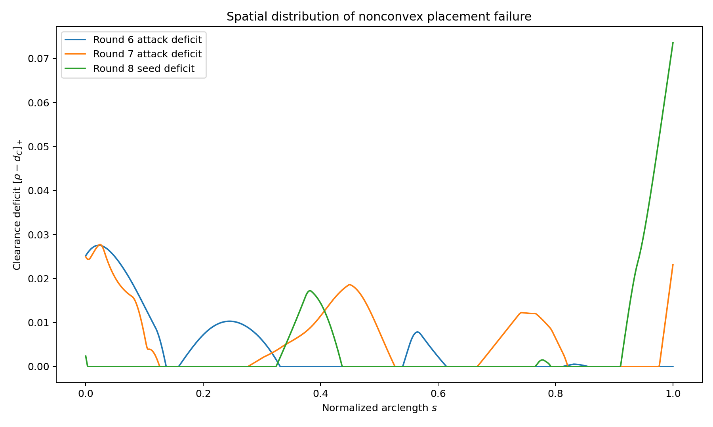
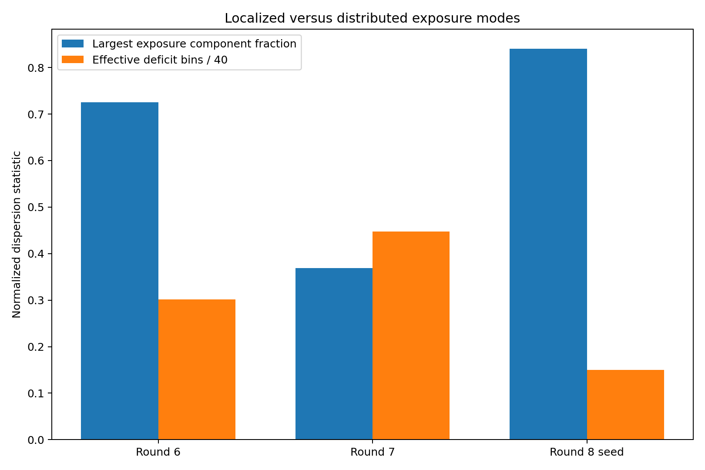
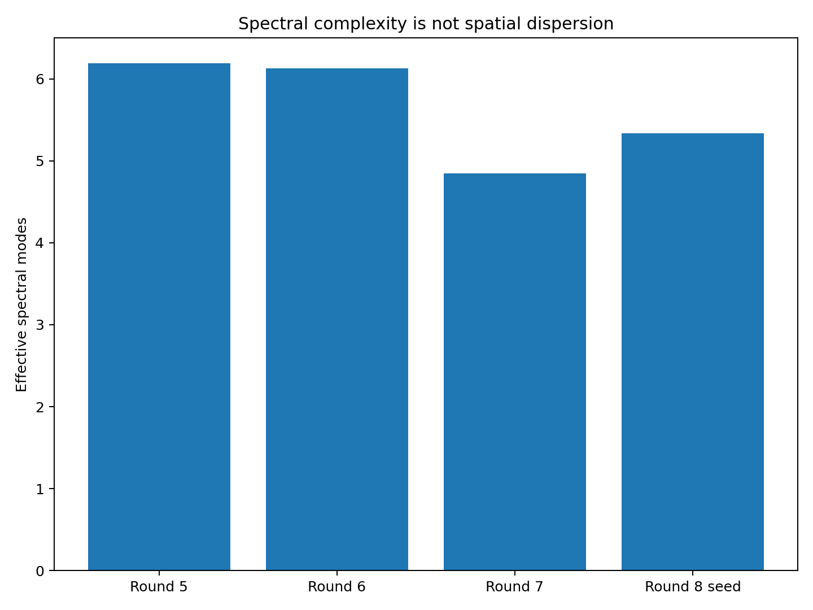
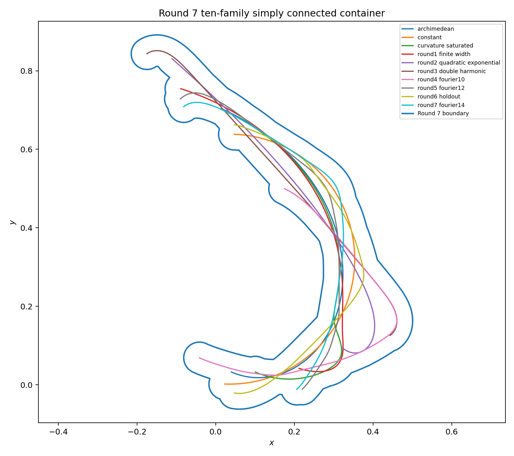
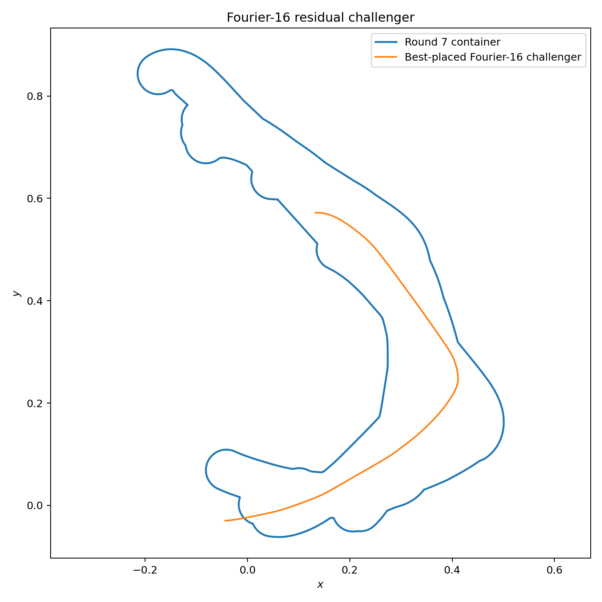

# 中心生成掛谷—Moser橋接族：第 7 輪

## ——第三次非凸交替循環、空間外露熵與 Fourier-16 殘餘攻擊

**版本：** v0.7  
**日期：** 2026 年 7 月 28 日  
**狀態：** 有限 Fourier 曲率族、有限合同搜尋與非凸容器座標下降候選

---

# 1. 第三次交替循環

本輪完成：

\[
C_6
\longrightarrow
\gamma_7
\longrightarrow
C_7.
\]

正式攻擊是第 6 輪保存的 Fourier-14 殘餘候選。

---

# 2. 攻擊合法性

曲率盒：

\[
\max\kappa
\in
[
21.737588058490,
21.798886996249
].
\]

所以：

\[
\frac1{\max\kappa}
\ge
0.045873901735
>
0.04.
\]

中心線 simple、管狀 buffer 有效，且管狀面積重播誤差為：

\[
-1.068639737117e-07.
\]

---

# 3. 正式攻擊量

最佳合同放置後：

\[
\boxed{
e_7
=
0.006847625978.
}
\]

約占單體完整管狀面積：

\[
8.0535%.
\]

外露集合分成四個連通分量，最大分量只占：

\[
36.9234%.
\]

這是本輪多葉片分散型攻擊的第一個訊號。

---

# 4. 容器回應

第 6 輪面積：

\[
A_6
=
0.198726522197.
\]

直接加入攻擊曲線：

\[
A_{\mathrm{naive}}
=
0.205574148175.
\]

重新排列十族後：

\[
\boxed{
A_7
=
0.204320360988.
}
\]

原始聯集面積：

\[
0.204267918556.
\]

孔洞面積：

\[
0.000052442432.
\]

填孔後淨增量：

\[
\boxed{
\Delta A_7
=
0.005593838791.
}
\]

相對增加：

\[
2.8148%.
\]

吸收率：

\[
\eta_7
=
18.3098%.
\]

---

# 5. 空間新穎度

第 7 輪攻擊的：

- 正缺口弧長比例：
  \[
  55.3149%;
  \]
- 有效缺口盒數：
  \[
  17.906819;
  \]
- 最大分量占比：
  \[
  36.9234%.
  \]

相比第 6 輪，它的外露更廣泛地分布在中心線與容器邊界上。

但其有效頻譜模式由第 6 輪約：

\[
6.130555
\]

下降到：

\[
4.849191.
\]

所以：

\[
\boxed{
\text{更多 Fourier 模式或更高頻能量，不等於更分散的非凸外露。}
}
\]

---

# 6. 十族活動帳本

以 leave-one-out 外露面積 \(10^{-3}\) 作數值門檻，活動族為：

1. `constant`：0.002277589439
2. `round3_double_harmonic`：0.007756962510
3. `round4_fourier10`：0.008983552993
4. `round6_holdout`：0.004926380500
5. `round7_fourier14`：0.003274473472

阿基米德螺旋已被其他九族完全吸收。

第 7 輪攻擊仍保有：

\[
0.003274473472
\]

的 leave-one-out 外露量，因此加入後沒有立即冗餘。

---

# 7. Fourier-16 殘餘攻擊

獨立 Fourier-16 搜尋得到：

\[
\boxed{
e_7^{\mathrm{res}}
=
0.007080929041.
}
\]

占單體管狀面積：

\[
8.3279%.
\]

其曲率盒：

\[
\max\kappa
\in
[
21.426569439939,
21.502612021114
],
\]

故：

\[
\frac1{\max\kappa}
\ge
0.046505977926
>
0.04.
\]

該候選的最大外露分量占：

\[
84.0244%,
\]

有效缺口盒數只有：

\[
5.996579.
\]

它由一個深而集中的缺口主導，與第 7 輪的分散葉片型攻擊不同。

---

# 8. 收斂診斷

面積增量：

\[
\Delta A_5
<
\Delta A_6
<
\Delta A_7.
\]

而 Fourier-16 殘餘攻擊略高於本輪正式攻擊。

因此：

\[
\boxed{
\text{目前沒有面積增量收斂、曲率維度封閉或對抗均衡的證據。}
}
\]

---

# 9. 理論回饋

本輪顯示非凸普適容器的困難度至少有三個彼此不同的軸：

1. **總外露量**
   \[
   e_n;
   \]

2. **外露空間分布**
   ——分散葉片或局部深缺口；

3. **容器吸收率**
   \[
   \eta_n.
   \]

相同量級的攻擊，可以因空間分布不同而得到完全不同的容器回應。

因此後續對抗搜尋不能只最大化外露面積，也應把外露分布模式納入多目標或保留集設計。

---

# 10. 誠實邊界

本輪沒有證明：

1. Fourier-14 是第 7 輪全局最強攻擊；
2. 十族非凸容器是全局最小；
3. Fourier-16 殘餘候選是完整函數空間最優；
4. 最佳合同放置具有形式證書；
5. 浮點曲率盒是形式區間證書；
6. 本輪形成掛谷或 Moser 問題的新界。

---

# 11. 下一個自然節點

第 8 輪可直接使用已保存的 Fourier-16 局部穿透型候選。

同時方法應升級成雙目標攻擊：

\[
\max_\gamma
\left[
\mathcal A_C(\gamma)
+
\lambda\,\mathcal D_C(\gamma)
\right],
\]

其中 \(\mathcal D_C\) 可區分：

- 分散覆蓋型；
- 局部穿透型。

並建立兩個保留池，避免容器只針對單一外露模式過度適配。

---

# 12. 結論

第 7 輪最終單連通面積為：

\[
\boxed{
A_7
=
0.204320360988.
}
\]

但更重要的結論是：

\[
\boxed{
\text{頻譜新穎度、空間外露新穎度與容器面積新穎度是三個不同量。}
}
\]

這使橋接族研究從單一 max-min 面積問題，進一步轉向具有多種攻擊模式的幾何對抗系統。
