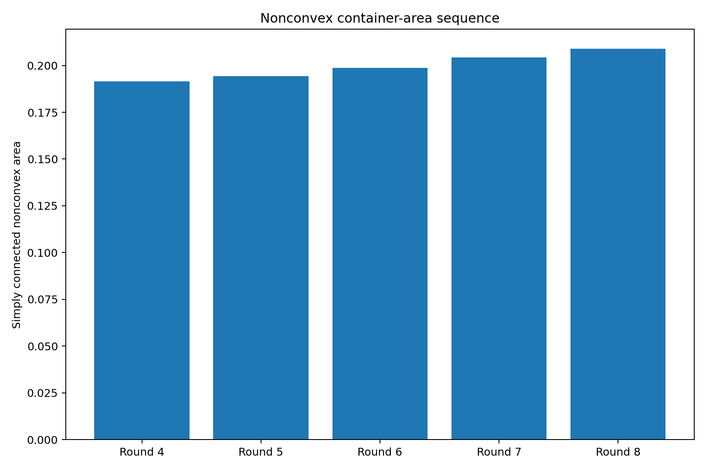
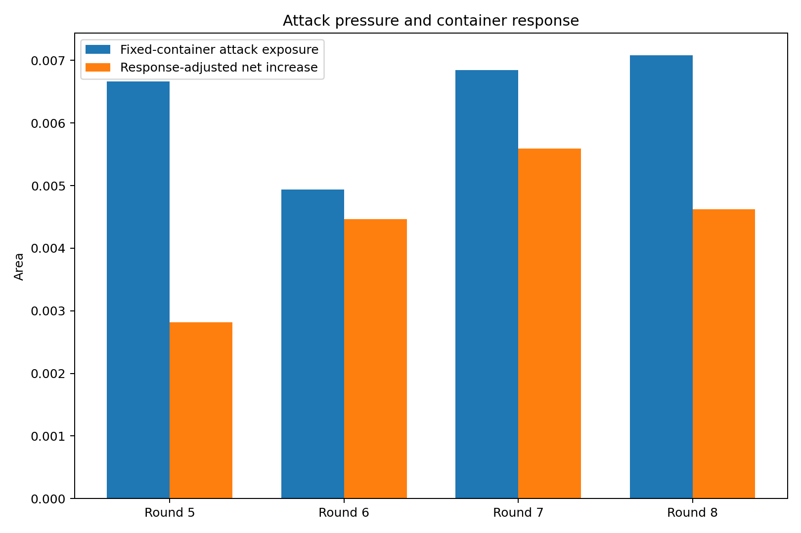
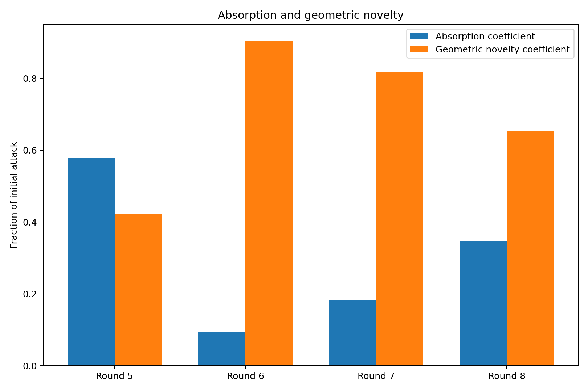
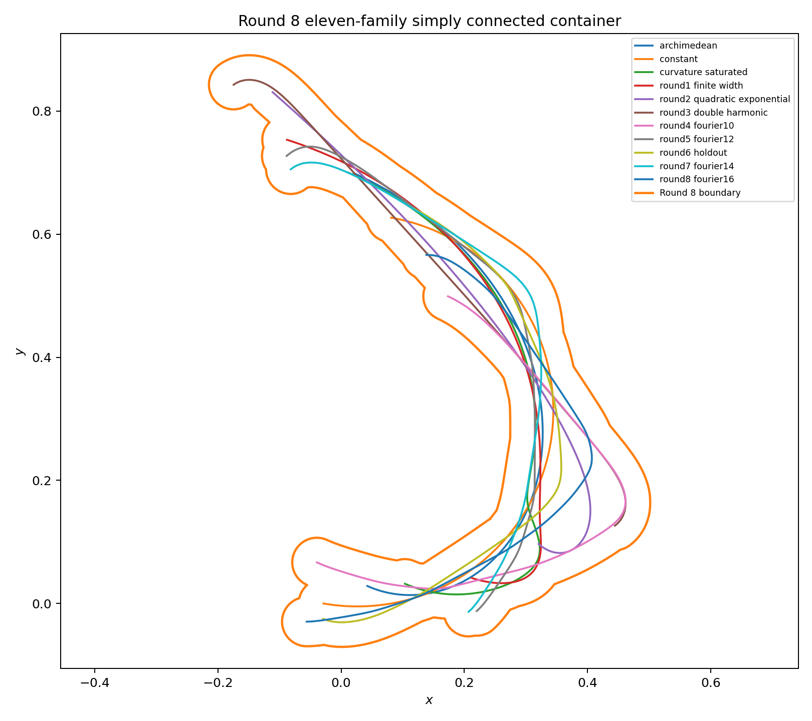
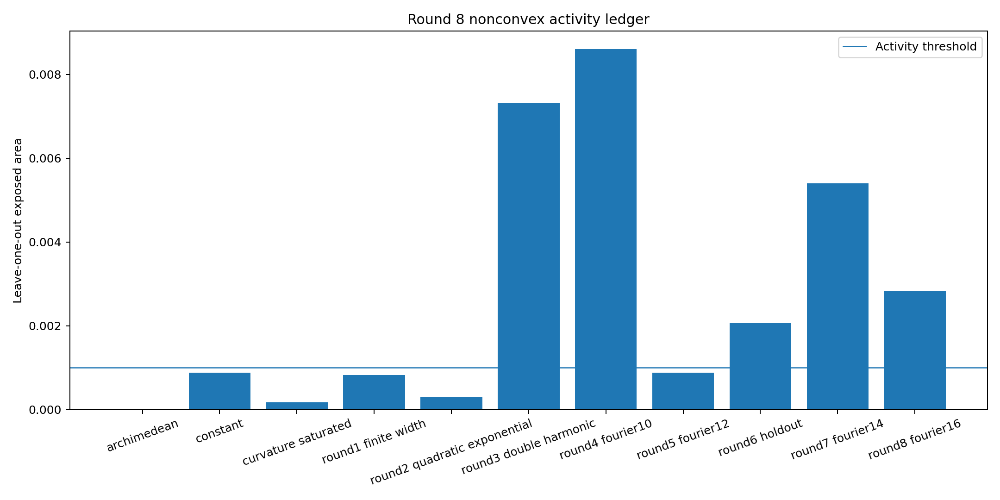
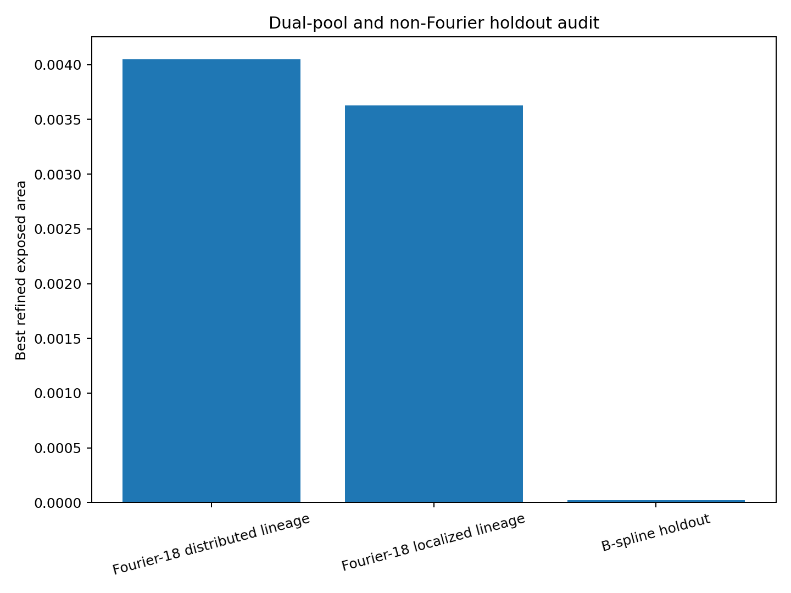
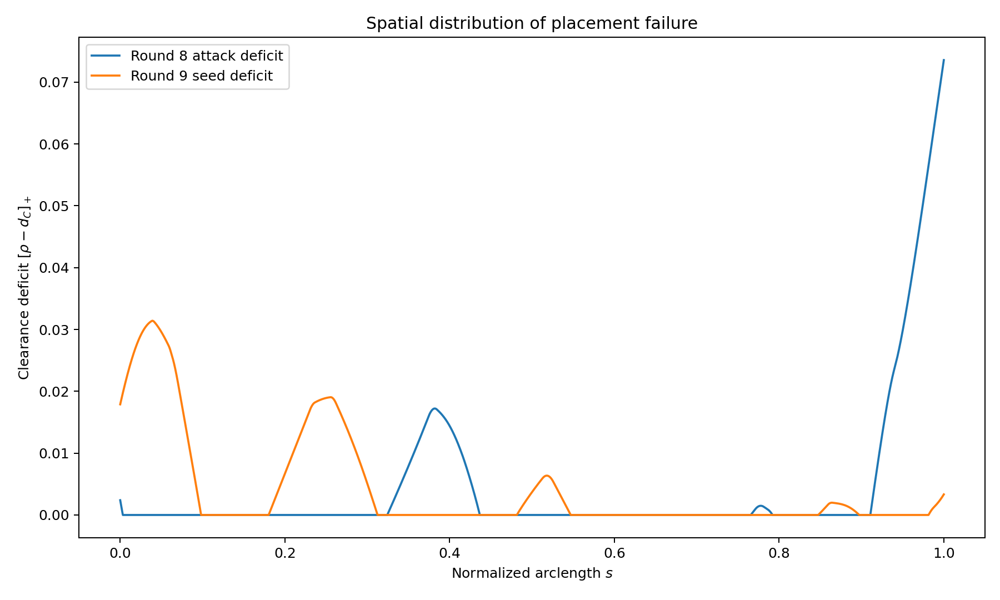
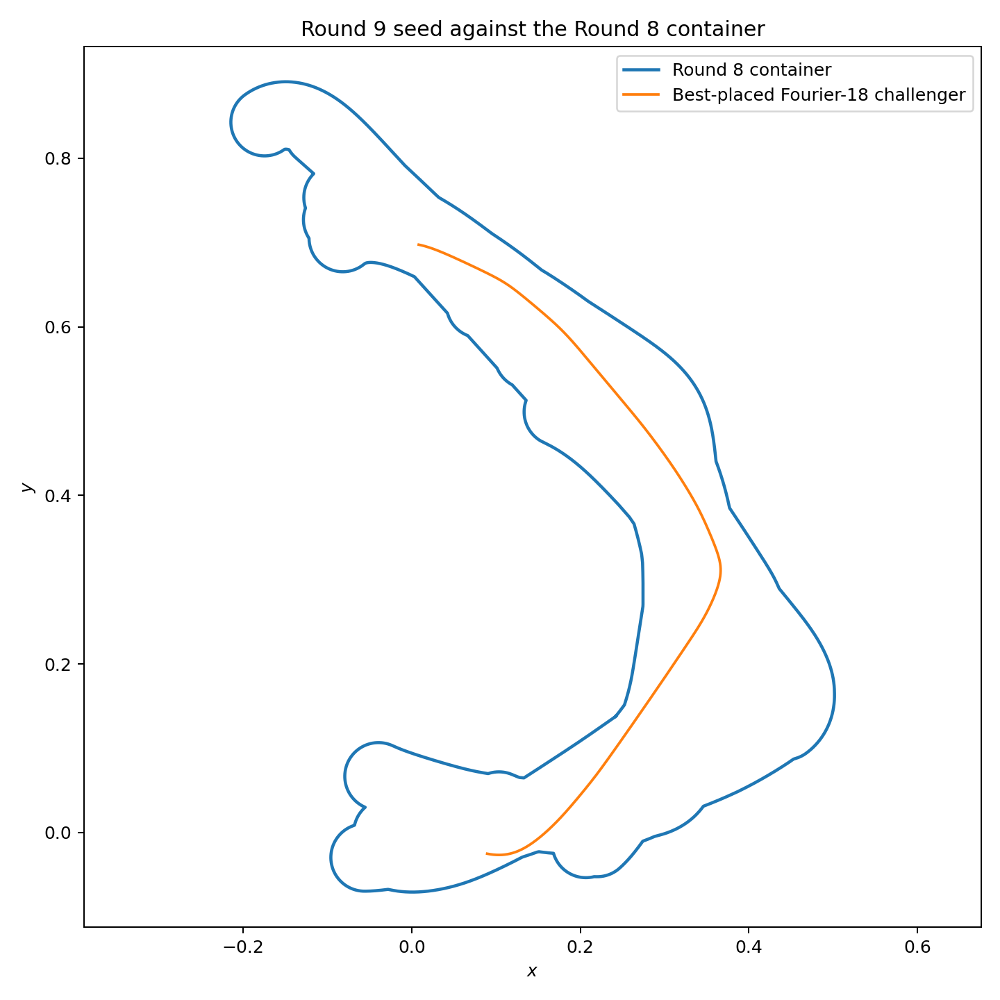

# 中心生成掛谷—Moser橋接族：第 8 輪

## ——第四次非凸交替循環、Fourier-18 雙池與頻譜母系—空間表型解耦

**版本：** v0.8  
**日期：** 2026 年 7 月 28 日  
**狀態：** 有限 Fourier／B-spline 曲率族、有限合同搜尋與非凸容器座標下降候選

---

# 1. 第四次交替循環

本輪完成：

\[
C_7
\longrightarrow
\gamma_8
\longrightarrow
C_8.
\]

正式攻擊為第 7 輪保存的 Fourier-16 局部穿透型候選。

---

# 2. 正式攻擊

最佳外露面積：

\[
\boxed{
e_8
=
0.007080929041.
}
\]

占單體完整管狀面積：

\[
8.3279%.
\]

曲率盒：

\[
\max\kappa
\in
[
21.426569439939,
21.502612021114
],
\]

故：

\[
\frac1{\max\kappa}
\ge
0.046505977926
>
0.04.
\]

---

# 3. 容器回應

第 7 輪：

\[
A_7
=
0.204320360988.
\]

直接加入：

\[
A_{\mathrm{naive}}
=
0.211400720567.
\]

重新配置十一族後：

\[
\boxed{
A_8
=
0.208938653536.
}
\]

容器沒有剩餘孔洞。

回收：

\[
0.002462067031.
\]

吸收率：

\[
\eta_8
=
34.7704%.
\]

淨增量：

\[
\Delta A_8
=
0.004618292548,
\]

相對增加：

\[
2.2603%.
\]

---

# 4. 增量序列

\[
\begin{aligned}
\Delta A_5&=0.002818179861,\\
\Delta A_6&=0.004464130667,\\
\Delta A_7&=0.005593838791,\\
\Delta A_8&=0.004618292548.
\end{aligned}
\]

第 8 輪增量低於第 7 輪，但仍高於第 5、6 輪。

所以這只是第一次回落，不構成收斂趨勢。

---

# 5. 活動族

以 leave-one-out 外露量 \(10^{-3}\) 作門檻：

1. `round3_double_harmonic`：0.007320161834
2. `round4_fourier10`：0.008606249632
3. `round6_holdout`：0.002061809501
4. `round7_fourier14`：0.005407020379
5. `round8_fourier16`：0.002823706215

第 8 輪 Fourier-16 攻擊仍留下：

\[
0.002823706215
\]

的 leave-one-out 外露，因此不是加入後立即冗餘。

阿基米德族僅剩數值噪聲量級外露。

---

# 6. 雙池與非 Fourier 保留集

Fourier-18 分散母系最佳值：

\[
0.004050690308.
\]

Fourier-18 局部母系最佳值：

\[
0.003625184186.
\]

B-spline 保留池最佳精煉值：

\[
0.000021419854.
\]

所以兩個 Fourier 母系都仍能產生正外露候選，而本批平滑 B-spline 擾動接近被完全吸收。

---

# 7. 第 9 輪種子

最強 Fourier-18 候選外露：

\[
\boxed{
e_8^{\mathrm{res}}
=
0.004050717099.
}
\]

占單體管狀面積：

\[
4.7641%.
\]

曲率盒：

\[
\max\kappa
\in
[
20.321848458779,
20.387027508692
],
\]

因此：

\[
\frac1{\max\kappa}
\ge
0.049050799562
>
0.04.
\]

其空間表型：

- 五個外露分量；
- 最大分量：
  \[
  60.2183%;
  \]
- 有效缺口盒數：
  \[
  10.170047;
  \]
- 正缺口弧長比例：
  \[
  36.4527%.
  \]

它是一條混合型攻擊，已保存為第 9 輪初始種子。

---

# 8. 新的理論判斷

本輪同時否定三個過度簡單的判斷：

\[
\text{局部母系必然產生局部表型};
\]

\[
\text{分散母系必然產生分散表型};
\]

\[
\text{局部穿透型必然比分散型更難吸收}.
\]

更合理的關係是：

\[
\boxed{
\text{空間外露表型}
=
\mathcal P
(
\text{曲率頻譜},
\text{頻譜相位},
\text{合同配置},
\text{容器幾何}
).
}
\]

吸收率則是：

\[
\boxed{
\eta
=
\mathcal R
(
\text{攻擊表型},
\text{當前容器狀態}
).
}
\]

它們都不是曲線單獨的標量屬性。

---

# 9. 收斂診斷

第 8 輪面積增量雖然下降，但第 9 輪種子仍留下：

\[
0.004050717099
>0.
\]

而且分散與局部兩個 Fourier 母系都未封閉。

因此：

\[
\boxed{
\text{目前沒有函數空間封閉、攻擊封閉或非凸容器均衡的證據。}
}
\]

---

# 10. 誠實邊界

本輪沒有證明：

1. Fourier-16 是第 8 輪全局最強攻擊；
2. 十一族非凸容器是全局最小；
3. Fourier-18 種子是完整曲率空間最優；
4. B-spline 池代表全部非 Fourier 曲率族；
5. 合同放置具有形式證書；
6. 浮點曲率盒是形式區間證書；
7. 本輪形成掛谷或 Moser 問題的新面積界。

---

# 11. 下一個自然節點

第 9 輪可直接使用已保存的 Fourier-18 混合型候選。

方法上應：

1. 保留分散、局部與混合三個表型池；
2. 對外露分量面積分布建立 Wasserstein 或分布距離；
3. 以不同表型的最壞值作多池 min-max：
   \[
   \max_{\gamma\in\mathcal P_j}
   \mathcal A_C(\gamma);
   \]
4. 容器回應時避免只針對單一表型過度適配；
5. 加入非 Fourier 的局部 B-spline 結點移動，而不只擾動固定控制點值；
6. 追蹤三個池的殘餘外露是否同時下降。

---

# 12. 結論

第 8 輪最終面積：

\[
\boxed{
A_8
=
0.208938653536.
}
\]

其核心推進不是單一數字，而是：

\[
\boxed{
\text{頻譜母系、空間外露表型與容器吸收率必須分開記帳。}
}
\]

非凸普適容器已經不能只用「哪條曲線更難」描述，而必須研究：

\[
\boxed{
\text{多個攻擊表型池與容器回應之間的動態均衡。}
}
