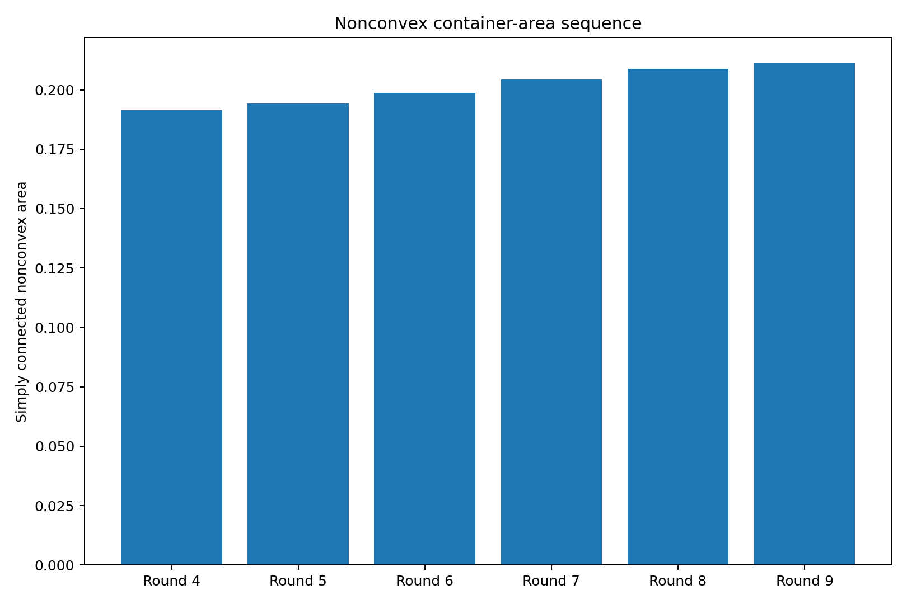
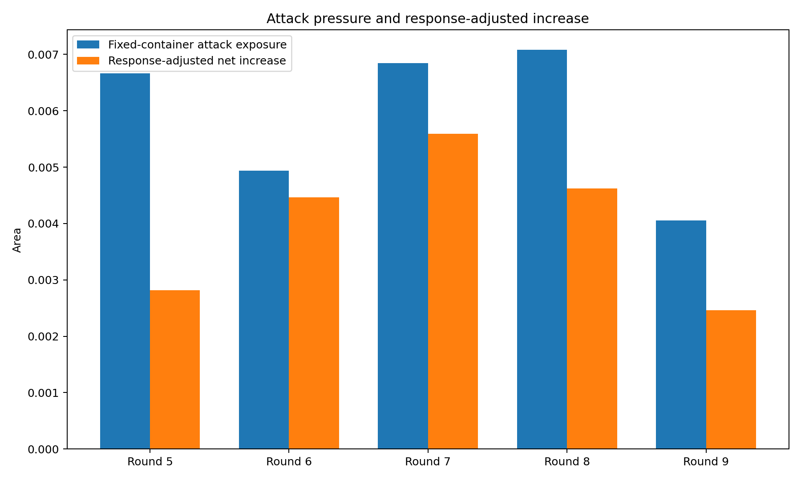
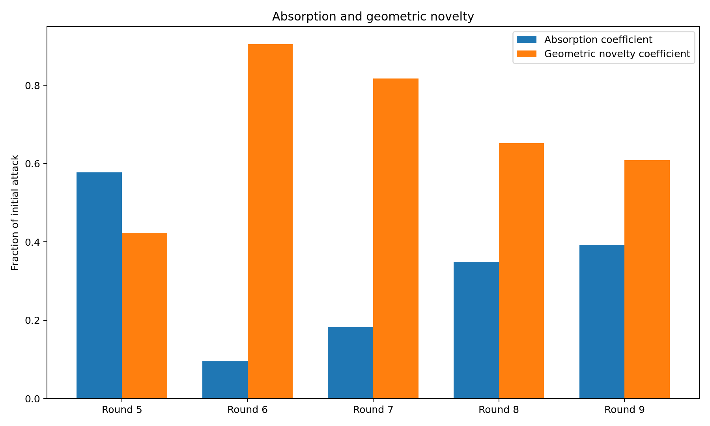
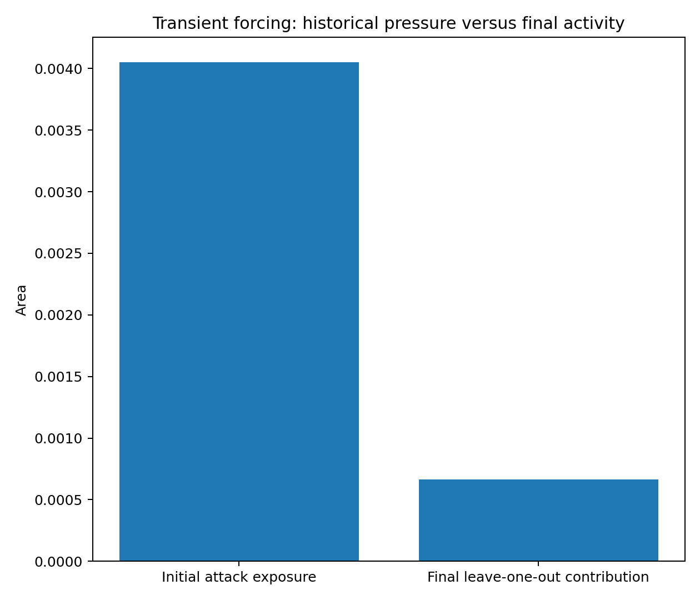
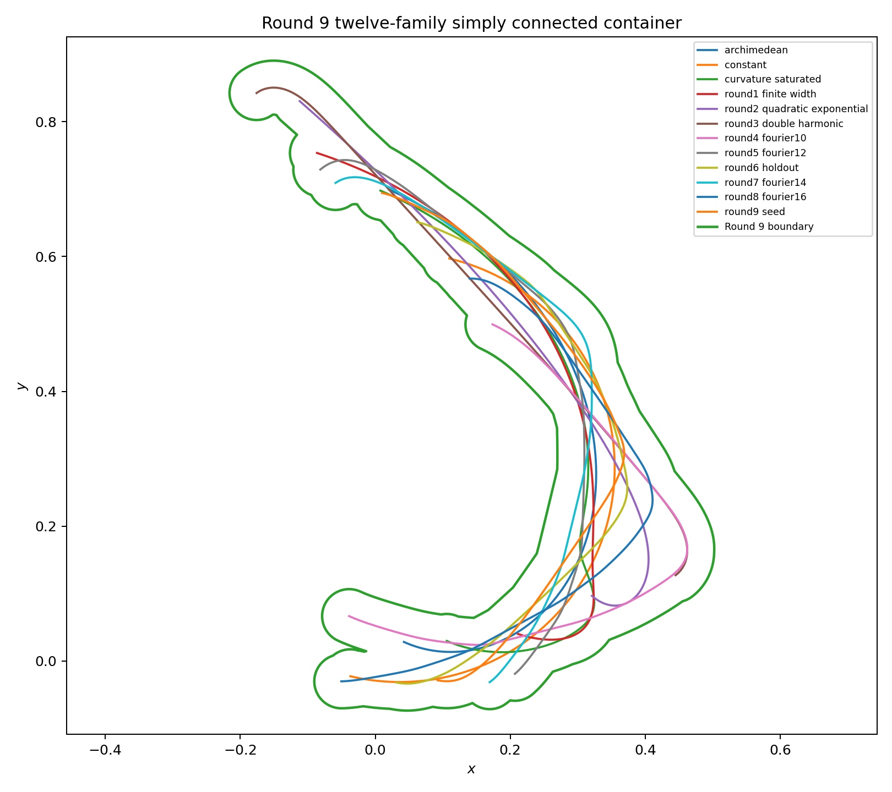
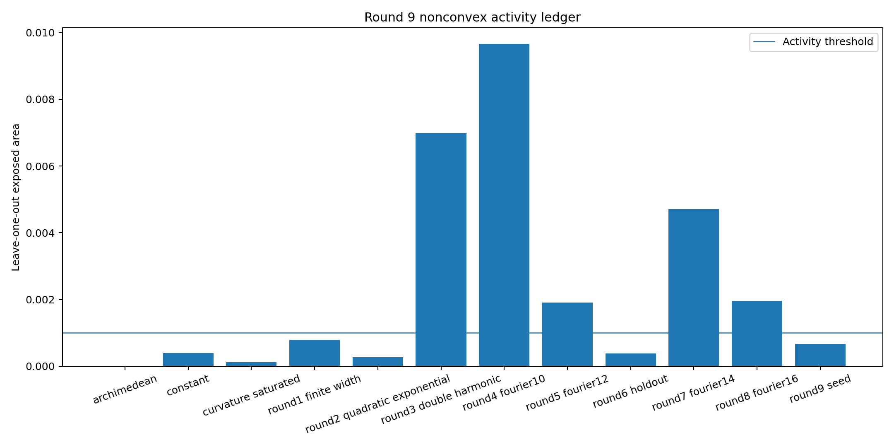
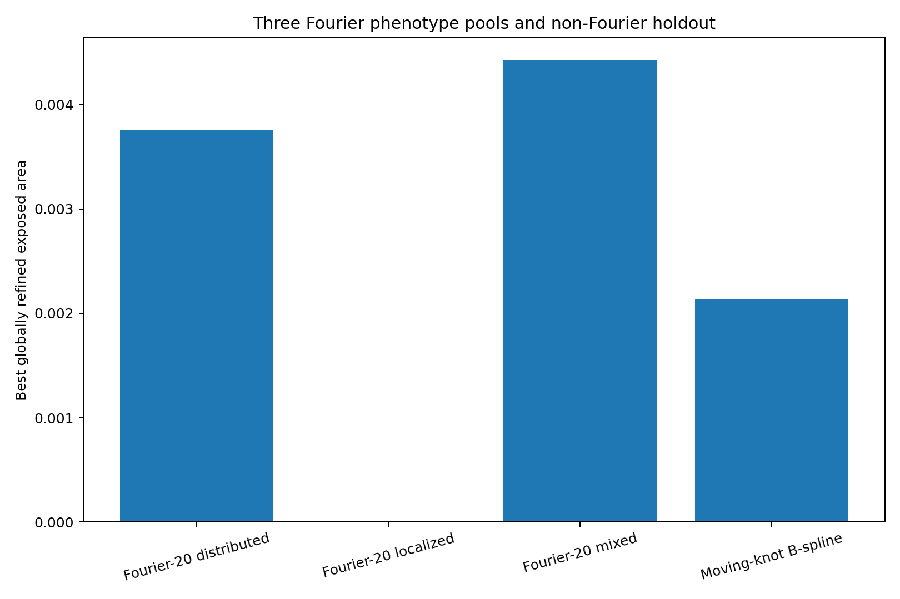
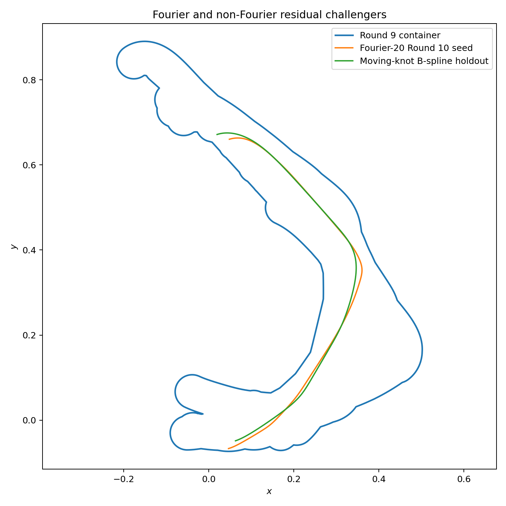

# 中心生成掛谷—Moser橋接族：第 9 輪

## ——第五次非凸交替循環、暫態施壓曲線與 Fourier／B-spline 多族殘餘

**版本：** v0.9  
**日期：** 2026 年 7 月 28 日  
**狀態：** 有限 Fourier／B-spline 曲率族、有限合同搜尋與非凸容器座標下降候選

---

# 1. 第五次交替循環

本輪完成：

\[
C_8
\longrightarrow
\gamma_9
\longrightarrow
C_9.
\]

正式攻擊為第 8 輪保存的 Fourier-18 混合型候選。

---

# 2. 正式攻擊

最佳外露面積：

\[
\boxed{
e_9
=
0.004050717099.
}
\]

約占單體管狀面積：

\[
4.7641%.
\]

曲率盒：

\[
\max\kappa
\in
[
20.321848458779,
20.387027508692
],
\]

所以：

\[
\frac1{\max\kappa}
\ge
0.049050799562
>
0.04.
\]

---

# 3. 容器回應

第 8 輪：

\[
A_8
=
0.208938653597.
\]

直接加入：

\[
A_{\mathrm{naive}}
=
0.212989343905.
\]

十二族重新排列後：

\[
\boxed{
A_9
=
0.211402629026.
}
\]

最終聯集連通、有效且無孔洞。

回收面積：

\[
0.001586714880.
\]

吸收率：

\[
\eta_9
=
39.1712%.
\]

淨增量：

\[
\boxed{
\Delta A_9
=
0.002463975428.
}
\]

相對第 8 輪增加：

\[
1.1793%.
\]

---

# 4. 增量序列

\[
\begin{aligned}
\Delta A_5&=0.002818179861,\\
\Delta A_6&=0.004464130667,\\
\Delta A_7&=0.005593838791,\\
\Delta A_8&=0.004618292548,\\
\Delta A_9&=0.002463975428.
\end{aligned}
\]

第 9 輪是第 5 至 9 輪中最低的淨增量。

但下一輪 Fourier-20 與 B-spline 保留候選仍有正外露，所以這只是單輪低點。

---

# 5. 暫態施壓曲線

第 9 輪攻擊在固定舊容器中的外露量為：

\[
0.004050717099.
\]

但更新後 leave-one-out 外露只剩：

\[
0.000664164818
<
10^{-3}.
\]

因此它在終態活動門檻下已接近冗餘，卻確實造成：

\[
0.002463975428
\]

的容器淨增長。

這構成：

\[
\boxed{
\text{歷史施壓}
\not\Rightarrow
\text{終態活動}.
}
\]

---

# 6. 終態活動族

以 leave-one-out 外露量 \(10^{-3}\) 作門檻：

1. `round3_double_harmonic`：0.006981984814
2. `round4_fourier10`：0.009658593581
3. `round5_fourier12`：0.001911602351
4. `round7_fourier14`：0.004708312773
5. `round8_fourier16`：0.001952499210

第 9 輪正式攻擊沒有進入此列表。

因此最終靜態骨架與攻擊歷史必須分開保存。

---

# 7. Fourier-20 三池

分散母系最佳外露：

\[
0.003755030295.
\]

局部母系：

\[
0.000000000000.
\]

混合母系：

\[
\boxed{
0.004423629900.
}
\]

本批局部母系精煉候選全部被吸收，但分散與混合母系仍為正。

---

# 8. 非 Fourier B-spline 保留池

移動結點自然三次 B-spline 候選留下：

\[
\boxed{
e_{\mathrm{spline}}
=
0.002135639003.
}
\]

其曲率盒：

\[
\max\kappa
\in
[
15.157618959651,
15.190835559256
],
\]

所以：

\[
\frac1{\max\kappa}
\ge
0.065829163649
>
0.04.
\]

這表示殘餘外露並非只存在於 Fourier 同源曲率族。

---

# 9. 第 10 輪種子

最強 Fourier-20 混合母系候選：

\[
\boxed{
e_9^{\mathrm{res}}
=
0.004423629900.
}
\]

曲率盒：

\[
\max\kappa
\in
[
20.787610395035,
20.938252289988
],
\]

保守曲率半徑：

\[
0.047759478019.
\]

其外露分成五個連通分量，最大分量占：

\[
63.2415%,
\]

有效缺口盒數：

\[
10.332930.
\]

它已保存為第 10 輪初始攻擊。

---

# 10. 理論回饋

本輪新增三個分離量：

1. 固定舊容器攻擊量：
   \[
   e_n;
   \]

2. 容器回應後淨成本：
   \[
   \Delta A_n;
   \]

3. 終態 leave-one-out 活動度：
   \[
   \ell_n.
   \]

對第 9 輪：

\[
e_9
>
\Delta A_9
>
\ell_9.
\]

因此曲線的攻擊強度、歷史因果成本與終態結構必要性是不同概念。

---

# 11. 收斂診斷

第 9 輪淨增量雖下降到目前最低，但：

- Fourier-20 分散池為正；
- Fourier-20 混合池為正；
- 移動結點 B-spline 池為正。

所以：

\[
\boxed{
\text{目前沒有多表型、多表示族同步封閉的證據。}
}
\]

---

# 12. 誠實邊界

本輪沒有證明：

1. Fourier-18 是第 9 輪全局最強攻擊；
2. 十二族非凸容器是全局最小；
3. Fourier-20 種子是完整曲率空間最優；
4. B-spline 保留池代表全部非 Fourier 曲率族；
5. 最佳合同放置具有形式證書；
6. 浮點曲率盒是形式區間證書；
7. 本輪形成掛谷或 Moser 問題的新面積界。

---

# 13. 下一個自然節點

第 10 輪可直接使用已保存的 Fourier-20 混合候選。

同時應保留：

- Fourier 分散池；
- Fourier 局部池；
- Fourier 混合池；
- 移動結點 B-spline 池。

容器停止條件應要求各池殘餘同時下降，而不能只觀察單一最強候選。

---

# 14. 結論

第 9 輪最終單連通面積：

\[
\boxed{
A_9
=
0.211402629026.
}
\]

本輪最重要的新結論是：

\[
\boxed{
\text{一條曲線可以在歷史上迫使容器擴張，}
\text{卻在更新後成為次活動甚至近冗餘曲線。}
}
\]

因此非凸普適容器的研究帳本必須同時保存攻擊歷史與終態結構。
