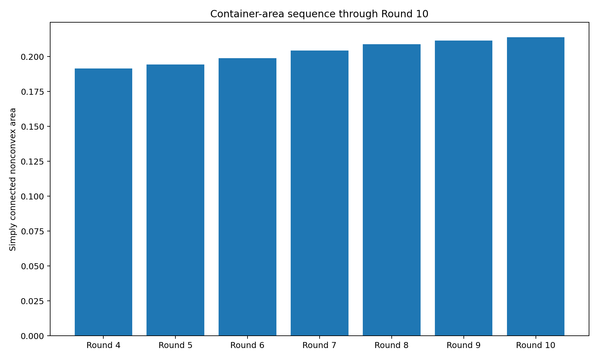
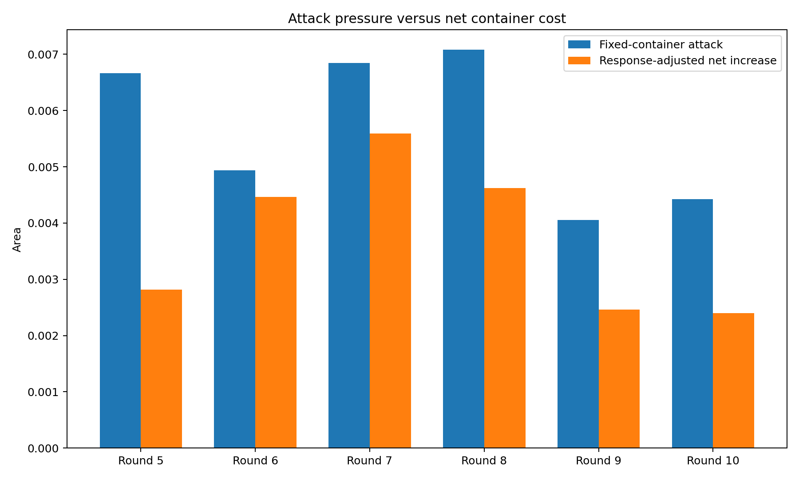
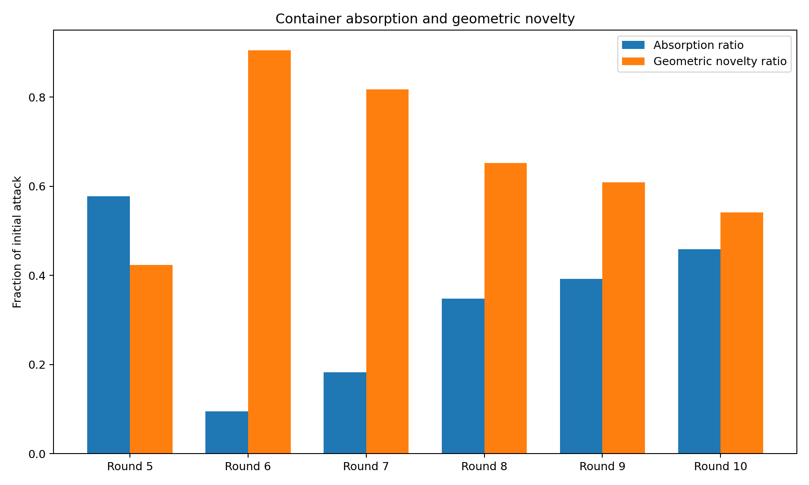
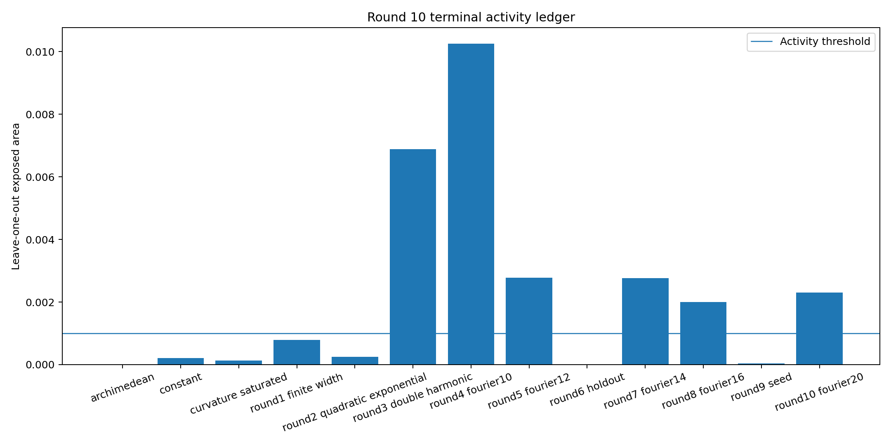
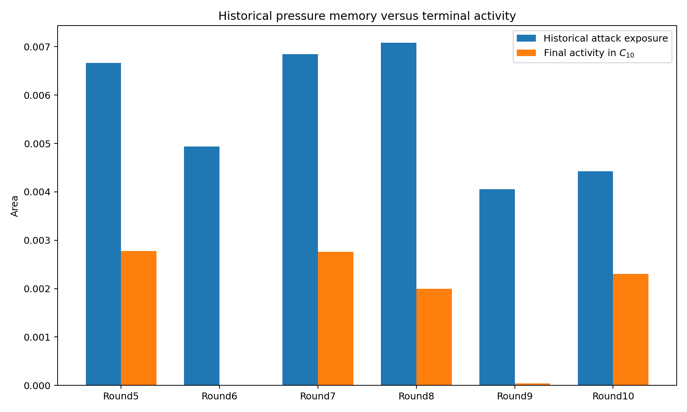
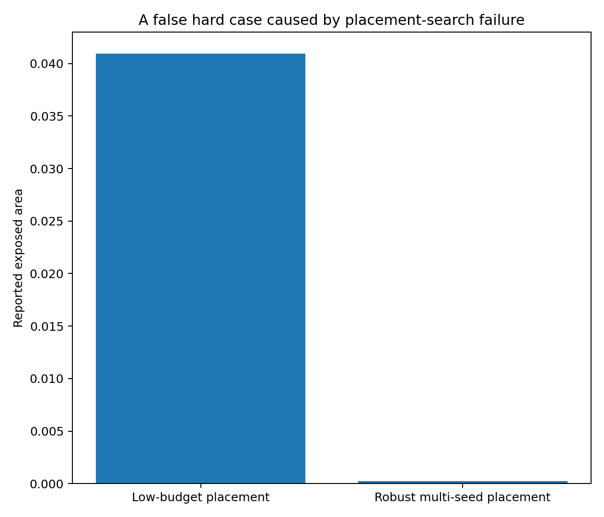
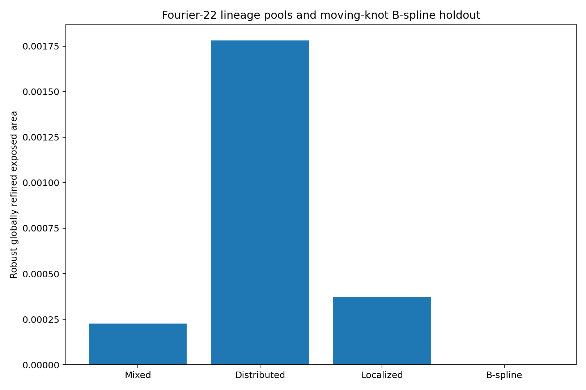
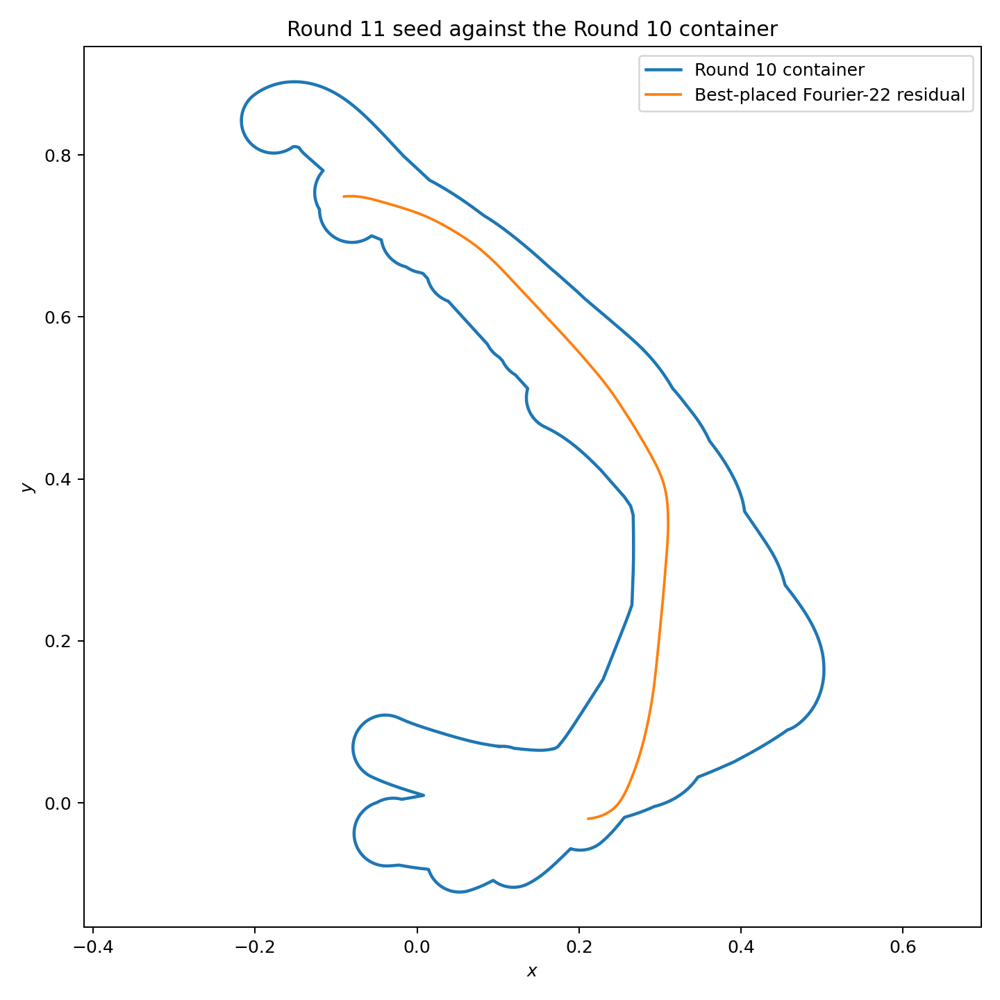

# 中心生成掛谷—Moser橋接族：第 10 輪

## ——第六次非凸交替循環、歷史施壓記憶與合同放置反證

**版本：** v1.0  
**日期：** 2026 年 7 月 28 日  
**狀態：** 有限曲率族、有限合同搜尋與非凸容器候選

---

# 1. 第六次交替循環

\[
C_9
\longrightarrow
\gamma_{10}
\longrightarrow
C_{10}.
\]

正式攻擊為第 9 輪保存的 Fourier-20 混合候選。

---

# 2. 攻擊與容器回應

\[
e_{10}
=
0.004423629900.
\]

\[
A_9
=
0.211402629026.
\]

直接加入：

\[
A_{\mathrm{naive}}
=
0.215826180426.
\]

跨盆地重新排列後：

\[
\boxed{
A_{10}
=
0.213797932626.
}
\]

回收：

\[
0.002028247800,
\]

吸收率：

\[
\eta_{10}
=
45.8503%.
\]

淨增量：

\[
\boxed{
\Delta A_{10}
=
0.002395303600.
}
\]

相對第 9 輪：

\[
1.1331%.
\]

---

# 3. 持續骨架

Fourier-20 在終態容器中的 leave-one-out 外露：

\[
\ell_{10}
=
0.002307467379.
\]

持續比例：

\[
\frac{\ell_{10}}{e_{10}}
=
52.1623%.
\]

所以它不是暫態施壓曲線，而是持續骨架。

第 9 輪曲線在 \(C_{10}\) 中只剩：

\[
0.000044750202,
\]

仍屬暫態施壓型。

---

# 4. 終態活動族

以 \(10^{-3}\) 為門檻：

1. `round3_double_harmonic`：0.006879408521
2. `round4_fourier10`：0.010254868982
3. `round5_fourier12`：0.002773514019
4. `round7_fourier14`：0.002762925182
5. `round8_fourier16`：0.001996811390
6. `round10_fourier20`：0.002307467379

---

# 5. 歷史施壓記憶

容器狀態不能只由終態活動族描述。

應保存：

\[
e_n,\quad
\Delta A_n,\quad
\ell_n.
\]

第 9 輪代表暫態施壓，第 10 輪代表持續骨架。

---

# 6. 放置器反證

低預算搜尋曾把一條 Fourier-22 混合曲線誤判為：

\[
0.040938380334.
\]

高預算多種子重算後：

\[
0.000225741207.
\]

高估約：

\[
181.4\text{ 倍}.
\]

因此非凸 hard case 必須先通過合同放置器的反證。

---

# 7. 第 11 輪種子

穩健保留池中，最強候選來自分散母系 Fourier-22：

\[
\boxed{
e_{10}^{\mathrm{res}}
=
0.001780655490.
}
\]

約占單體管狀面積：

\[
2.0942%.
\]

曲率盒：

\[
\max\kappa
\in
[
21.677592220466,
21.762073866669
].
\]

保守曲率半徑：

\[
0.045951502882
>
0.04.
\]

它已保存為第 11 輪攻擊種子。

---

# 8. 收斂判斷

第 10 輪淨增量仍為正，Fourier-22 分散母系亦留下穩定正外露。

因此：

\[
\boxed{
\text{目前沒有攻擊封閉、表示族封閉或非凸均衡的證據。}
}
\]

但本輪確認了一個更基礎的誤差來源：

\[
\boxed{
\text{曲線生成誤差}
\quad\text{與}\quad
\text{合同放置誤差}
\text{必須分開驗證。}
}
\]

---

# 9. 誠實邊界

本輪沒有證明：

1. Fourier-20 是全局最強攻擊；
2. 十三族容器是全局最小；
3. Fourier-22 種子是完整曲率空間最優；
4. B-spline 池已全局封閉；
5. 合同放置具有形式全局證書；
6. 浮點曲率盒是形式區間證書；
7. 本輪形成掛谷或 Moser 問題的新面積界。

---

# 10. 下一個自然節點

第 11 輪直接使用已保存的 Fourier-22 分散母系候選。

方法上應把合同放置器升級為雙層證書：

1. 多種子全域上界；
2. 以配置空間分割或 interval branch-and-bound 建立下界；
3. 對異常 hard case 自動追加搜索預算；
4. 曲線生成器與放置器交替對抗，而不是單邊擴維；
5. 歷史施壓記憶持續保留。

---

# 11. 結論

第 10 輪最終面積：

\[
\boxed{
A_{10}
=
0.213797932626.
}
\]

本輪最重要的新結論是：

\[
\boxed{
\text{非凸普適容器研究不只是一個曲線生成問題，}
\text{也是一個合同放置全局最佳化問題。}
}
\]

若放置器未收斂，再強的曲線生成器也會製造大量假 hard cases。
