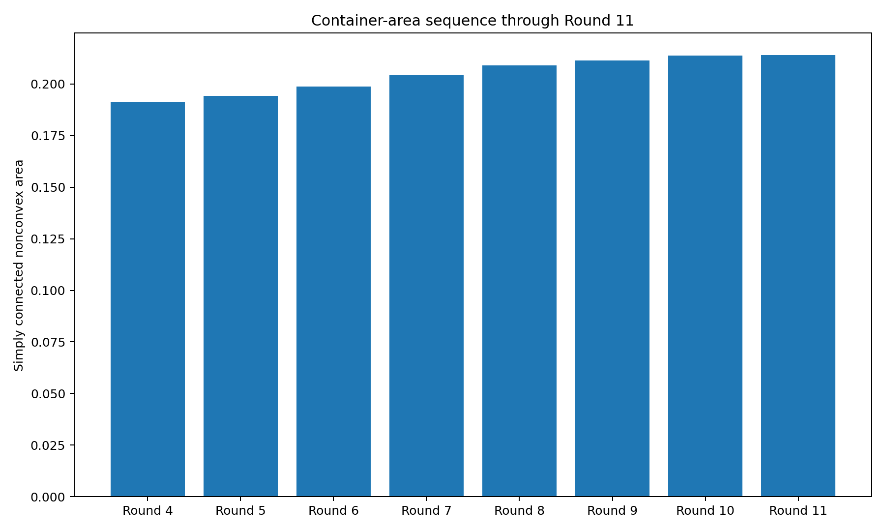
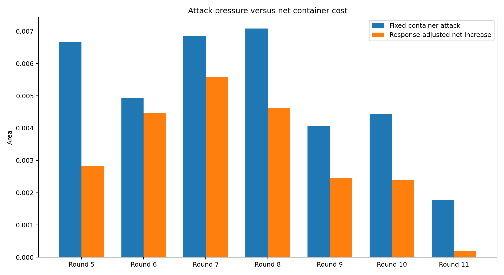
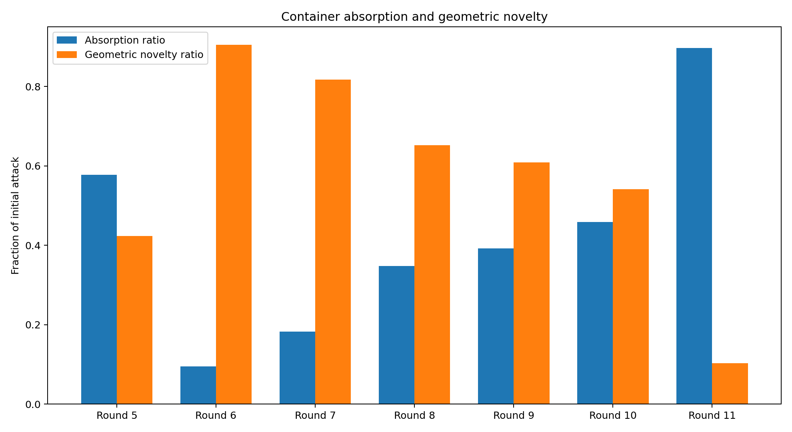
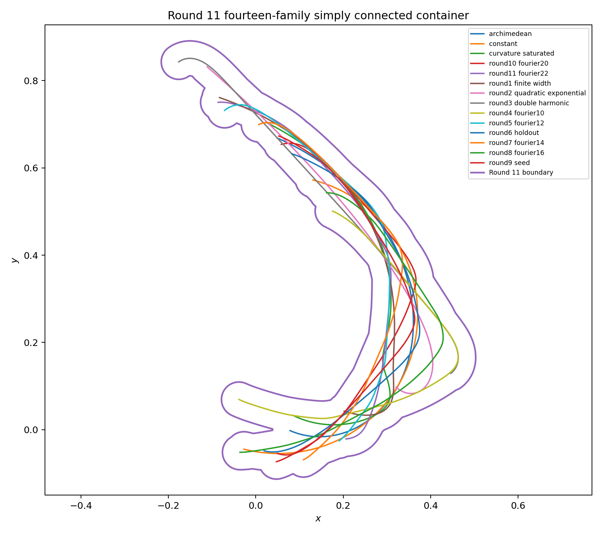
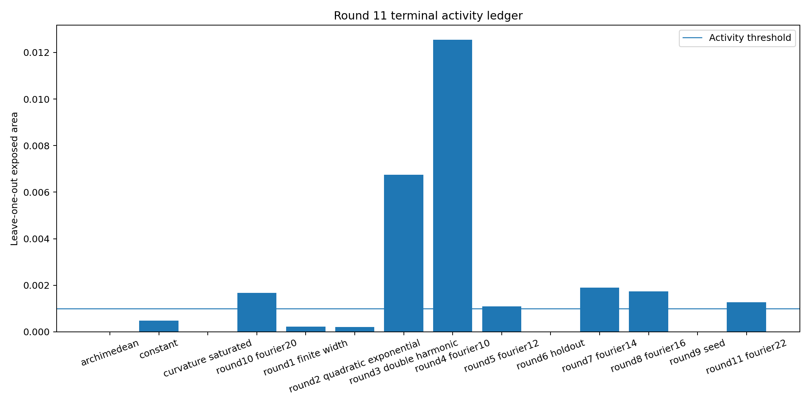
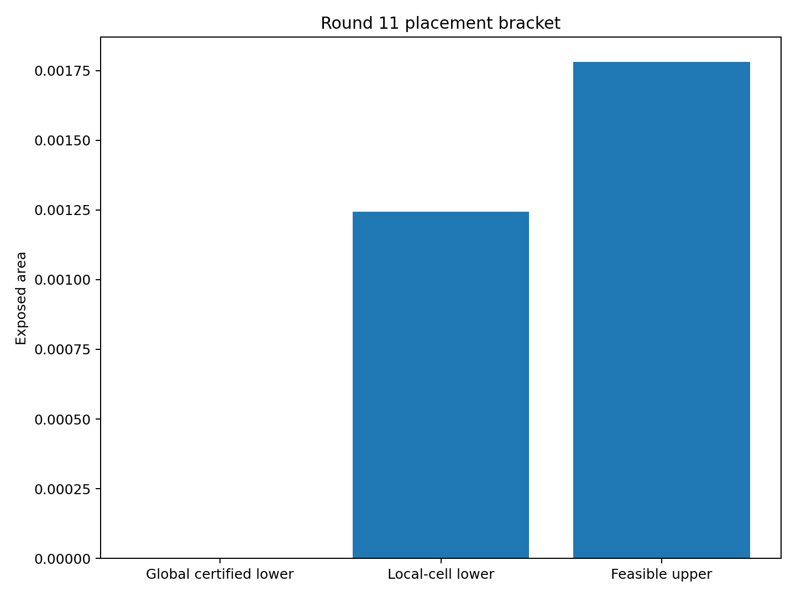
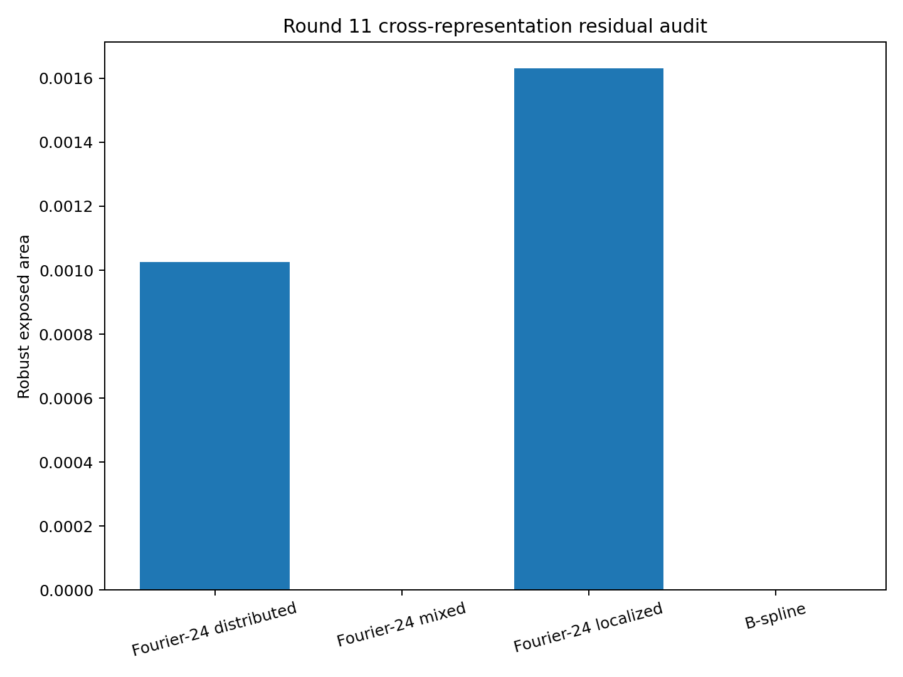
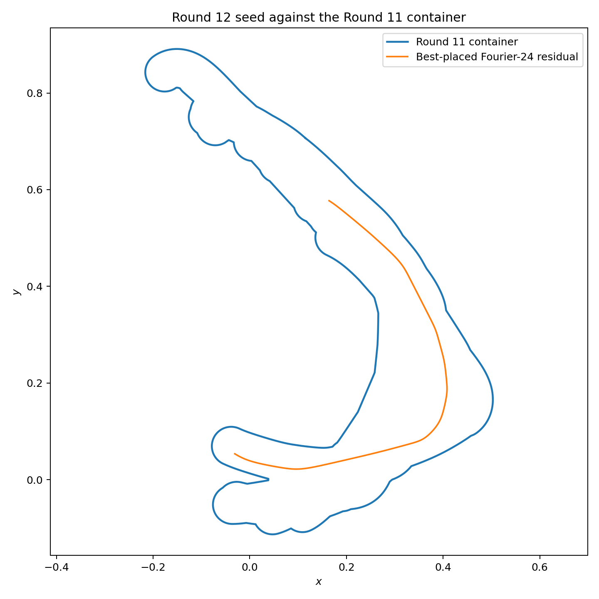
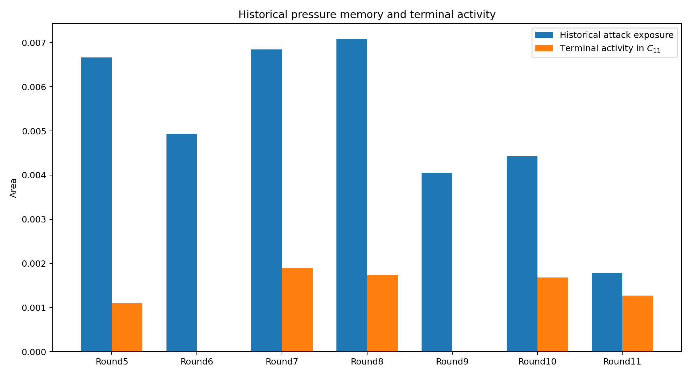
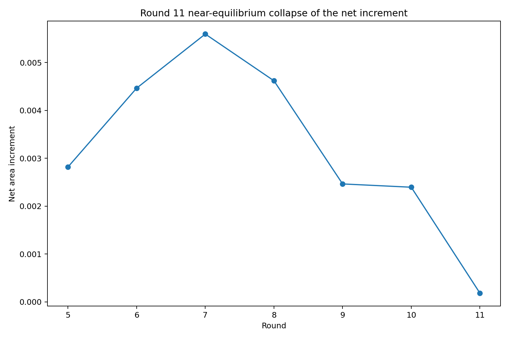

# 中心生成掛谷—Moser橋接族：第 11 輪

## ——第七次非凸交替循環、局部放置證書與母系接力

**版本：** v1.1  
**日期：** 2026 年 7 月 28 日  
**狀態：** 有限曲率族、有限合同搜尋、局部放置下界與非凸容器候選

---

# 1. 第七次交替循環

\[
C_{10}
\longrightarrow
\gamma_{11}
\longrightarrow
C_{11}.
\]

正式攻擊為 Fourier-22 分散母系候選。

---

# 2. 容器近均衡回應

\[
e_{11}
=
0.001780655490.
\]

\[
A_{10}
=
0.213797932626.
\]

直接加入：

\[
A_{\mathrm{naive}}
=
0.215578170497.
\]

重新排列十四族後：

\[
\boxed{
A_{11}
=
0.213981813786.
}
\]

吸收率：

\[
\boxed{
\eta_{11}
=
89.6499%.
}
\]

淨增量：

\[
\boxed{
\Delta A_{11}
=
0.000183881160.
}
\]

相對容器面積只增加：

\[
0.0860%.
\]

這是第 5 至 11 輪最小的淨面積增量。

---

# 3. 攻擊並非冗餘

Fourier-22 在終態中的 leave-one-out 外露為：

\[
\ell_{11}
=
0.001274459617.
\]

持續比例：

\[
71.5725%.
\]

所以它是真正持續骨架；淨增量小不是因攻擊為假，而是既有骨架能透過協同重排吸收約九成固定容器壓力。

---

# 4. 終態活動族

1. `round10_fourier20`：0.001680034923
2. `round3_double_harmonic`：0.006743987202
3. `round4_fourier10`：0.012543448956
4. `round5_fourier12`：0.001097950279
5. `round7_fourier14`：0.001897486370
6. `round8_fourier16`：0.001739006041
7. `round11_fourier22`：0.001274459617

第 6 與第 9 輪曲線目前屬暫態施壓；它們的終態活動可為零，但仍保留於歷史測試集。

---

# 5. 放置證書缺口

全域可行上界：

\[
U
=
0.001780655490.
\]

最佳配置附近的局部單元可證明：

\[
f(g)
\ge
0.001243765913.
\]

但完整配置域的全域認證下界仍為：

\[
L=0.
\]

均勻分割估計需要約：

\[
1.11\times10^{12}
\]

個單元，顯示單純周長 Lipschitz 分支界不可行。

---

# 6. Fourier-24 與 B-spline 保留池

\[
\begin{aligned}
e_{\mathrm{distributed}}
&=
0.001025603286,\
e_{\mathrm{mixed}}
&=
0.000000000000,\
e_{\mathrm{localized}}
&=
0.001631401070,\
e_{\mathrm{spline}}
&=
0.000002445060.
\end{aligned}
\]

最強殘餘改由局部母系產生：

\[
\boxed{
e_{11}^{\mathrm{res}}
=
0.001631401070.
}
\]

所以第 11 輪是容器對正式攻擊的局部近均衡，而不是函數空間封閉。

---

# 7. 第 12 輪種子

Fourier-24 局部母系種子的曲率盒：

\[
\max\kappa
\in
[
16.565094818618,
16.640926015370
].
\]

保守曲率半徑：

\[
0.060092809684
>
0.04.
\]

它具有四個外露分量，最大分量占：

\[
82.6585%.
\]

已保存為第 12 輪正式攻擊種子。

---

# 8. 歷史施壓記憶

終態活動集：

\[
\mathcal A_{11}
\]

與歷史施壓集：

\[
\mathcal H_{11}
\]

並不相同。

容器更新使用完整歷史施壓集，終態解釋才使用活動集。

---

# 9. 收斂判斷

第 11 輪淨增量大幅下降：

\[
\Delta A_{11}
=
0.000183881160.
\]

但 Fourier-24 局部母系仍留下：

\[
0.001631401070.
\]

因此：

\[
\boxed{
\text{容器回應接近局部均衡，但多母系曲率空間尚未封閉。}
}
\]

---

# 10. 誠實邊界

本輪沒有證明：

1. Fourier-22 是全局最強攻擊；
2. 十四族容器是全局最小；
3. Fourier-24 種子是完整曲率空間最優；
4. 全域合同放置下界為正；
5. B-spline 池已全局封閉；
6. 浮點曲率盒是形式區間證書；
7. 本輪形成掛谷或 Moser 問題的新面積界。

---

# 11. 下一個自然節點

第 12 輪直接使用 Fourier-24 局部母系種子。

方法上應優先改進放置下界，而不是只增加曲率維度：

1. 以容器腐蝕距離盒排除整批平移單元；
2. 以支撐方向先排除旋轉區間；
3. 只對未排除配置盒使用外露面積 Lipschitz 細分；
4. 建立真正非零的全域放置下界；
5. 同時保留分散、局部、混合與 B-spline 四池。

---

# 12. 結論

第 11 輪最終面積：

\[
\boxed{
A_{11}
=
0.213981813786.
}
\]

本輪最重要的雙重結論是：

\[
\boxed{
\text{正式攻擊已被容器吸收近九成，}
\text{但另一曲率母系立即接手成為新 hard case。}
}
\]

這表明普適容器可能接近某個局部幾何均衡，但尚未接近完整函數空間均衡。
