# Phase Canon Migration Graph v1.0
## Historical Phase Genealogy → Current Canonical Research Stacks

```mermaid
flowchart TD
    T[Phase Taxonomy<br/>A / B / A∩B / C<br/>PH-0…PH-6]

    G1[G1 Strong Ontology]
    G2[G2 Math / Topology]
    G3[G3 Cognitive / Time / Semantic]
    G4[G4 AI / Search / Cross-Carrier]
    B5[Bio / Body / Engineering Side Branches]

    G1 -->|retain physical phase<br/>retire universal ontology| P[PCPRT]
    G1 -->|carrier relation survives| G[GPC-CS]

    G2 --> PCH[Phase-Coherence TDA]
    G2 --> WIO[Weighted Infinite Oscillators]
    G2 --> PCC[Persistent Cohomology → S¹]
    G2 --> TAC[Topology-Aware Computing]

    G3 --> TRD[Typed Relational Difference]
    G3 --> IRT[Internal / Relational Time]
    G3 --> RPD[Reflexive Prediction Dynamics]
    G3 --> CTD[Cross-Temporal Semantic Delivery]
    G3 --> VSA[Versioned Semantic Addressing]
    TRD --> G
    CTD --> G
    VSA --> G

    G4 --> GIPSS[GIPSS Open-World Discovery]
    G4 --> GIPE[GIPE Active Epistemic Control]
    G4 --> HDS[Cross-Carrier Semantic Transduction]
    G4 --> WM[World-Model Rollout / Judgment]
    G4 --> IE[Intent–Execution Alignment]
    GIPSS --> G
    GIPE --> G
    HDS --> G
    WM --> P
    IE --> G

    B5 --> BIO[Biological Oscillator Science]
    B5 --> WEAK[Weak-Field Hypotheses]
    B5 --> MON[Multiscale Physiological Monitoring]
    B5 --> POW[Classical Power-Phase Engineering]
    BIO --> P
    WEAK --> P
    MON --> P
    POW --> P

    T --> G1
    T --> G2
    T --> G3
    T --> G4
    T --> B5

    G --> C[Phase Canon v1.1]
    P --> C
    PCH --> C
    WIO --> C
    PCC --> C
    GIPSS --> C
    GIPE --> C
    BIO --> C
    POW --> C
```

## Canonical center

$$
\boxed{
\text{Phase Canon v1.1}
\leftarrow
\{
\text{GPC-CS},
\text{PCPRT},
\text{audited research stacks}
\}.
}
$$
