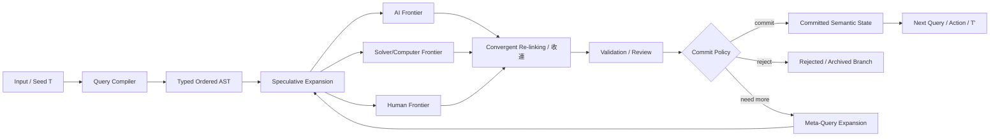

# T Query Runtime v0.1 — Architecture

## Core chain

\[
NaturalInput
\rightarrow
TypedAST
\rightarrow
SpecExpand
\rightarrow
AsyncFrontiers
\rightarrow
Compute
\rightarrow
Validate
\rightarrow
CRL
\rightarrow
Commit
\]

## Meta-chain

\[
Q
\rightarrow
Inspect(Q)
\rightarrow
SpecMetaExpand(Q)
\rightarrow
Validate
\rightarrow
CRL
\rightarrow
Commit(nextQ)
\]
