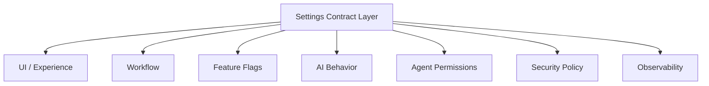
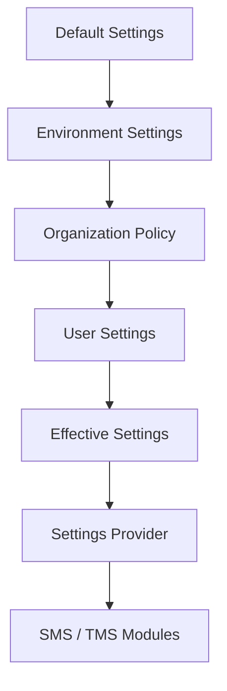
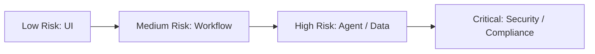

    # 設定契約層（Settings Contract Layer, SCL）：軟體系統可控制性邊界的先行架構方法論

**作者**：Neo-K  
**機構**：一言諾科技有限公司（EveMissLab）  
**日期**：2026年6月  
**版本**：v1.0  
**文件性質**：技術白皮書 / 方法論論文  
**關聯方法論**：三層認知架構、MSSP 母集與子集範式、規模感知架構組織範式  

---

## 摘要

本文提出「設定契約層」（Settings Contract Layer, SCL）作為一種軟體系統開發的先行架構方法論。其核心主張是：**設定層不是功能完成後附加的輔助檔案，而是系統可控制性、可調適性、使用者主權與功能邊界的隱性合約**。在任何具有持續演化可能的軟體專案中，若先實作功能再補設定，則功能模組往往會內嵌大量未被聲明的假設：預設值被硬編碼，行為邏輯散落於各處，功能開關缺乏統一治理，權限邊界與使用者控制範圍變得模糊。當後期需要讓使用者調整、讓管理者治理、讓系統支援多環境部署、讓 AI Agent 受到安全約束時，開發者必須回頭翻修既有功能，造成高昂的重構成本與架構債務。

SCL 方法論將設定層重新定位為「功能層之前的控制契約」。功能定義系統能做什麼；設定定義系統允許被如何改變。FMS（First Mother Set）定義系統是什麼；SCL 定義系統可被哪些主體、在何種範圍內、透過何種規則進行改變；SMS（Second Mother Set）與 TMS（Third Mother Set）則依照 SCL 所聲明的控制邊界執行核心功能與可插拔功能。由此，SCL 成為系統本體聲明與功能實作之間的可變性介面。

本文從軟體工程、認知科學、架構治理、產品設計與 AI Agent 安全五個角度論證 SCL 的必要性。本文提出「設定先行原則」（Configuration-First Principle）、「可控制性邊界」（Controllability Boundary）、「可變性表面」（Variability Surface）、「受控全域狀態」（Controlled Global State）、「設定註冊表」（Settings Registry）、「設定模式」（Settings Schema）與「設定生命週期」（Settings Lifecycle）等核心概念，並提供從小型專案到超大型系統的規模感知演化路徑。最後，本文提出一套可操作的 SCL 實踐模板，涵蓋 config.js、settings.json、settings.schema.json、SettingsProvider、Feature Flags、Permission Policy、Audit Log、Config Migration 與 CI/CD 驗證流程。

本文的理論意義在於：將設定層從「工程細節」提升為「架構契約」，使軟體系統在開發之初即明確回答「誰能控制什麼、哪些東西可變、哪些東西不可變、哪些變動是安全的、哪些變動需要治理」。本文的實務價值在於：降低後期重構成本、減少硬編碼假設、提升產品可調適性、強化安全邊界、支援 AI Agent 時代的行為治理，並為可視化架構、文件化決策與規模感知專案組織提供新的中介層。

**關鍵詞**：設定契約層、Configuration-First、軟體架構、可控制性、設定治理、使用者主權、Feature Flags、AI Agent、安全邊界、MSSP

---

## 目錄

1. 引言：從 config 檔案到系統合約  
2. 問題陳述：功能先行造成的隱性架構債  
3. SCL 的核心定義與理論定位  
4. 設定先行原則：為何設定必須早於功能  
5. 設定層作為可控制性邊界  
6. SCL 與三層認知架構、MSSP、規模感知範式的關係  
7. SCL 的內部架構：Schema、Registry、Provider、Policy  
8. 設定類型分類：從介面偏好到 AI Agent 權限  
9. 規模感知的 SCL 演化路徑  
10. 反模式：硬編碼、散落設定、隱性預設值與全域污染  
11. 實踐模板：檔案結構、JSON Schema、TypeScript 介面與治理流程  
12. AI Agent 時代的設定層：安全、主權與可治理自動化  
13. 驗證方法：如何判斷設定層是否健康  
14. 結論：可演化軟體需要先定義自己的可變性  

---

# 第一章：引言：從 config 檔案到系統合約

在多數軟體專案中，設定檔往往被視為次要角色。開發者通常先建立功能，再在功能逐漸複雜後補上一個 `config.js`、`.env`、`settings.json` 或後台管理頁。這種做法在短期內看似合理，因為功能才是使用者能看見的部分，設定只是讓功能更彈性的輔助工具。然而，當專案持續演化，設定層的缺席會逐漸暴露出深層問題：每個功能都帶著自己的假設誕生，每個模組都在內部決定哪些行為可變、哪些行為不可變，每個開發者都可能以不同方式處理預設值、權限、環境變數與使用者偏好。

這些問題的共同根源在於：系統沒有在一開始明確回答「這個工具允許使用者控制什麼」。當這個問題沒有被集中回答，答案就會散落在功能實作之中。某個按鈕的顏色被寫死在前端元件裡，某個模型選項被寫死在 API 呼叫裡，某個自動儲存間隔被寫死在 hook 裡，某個 Agent 的檔案權限被寫死在任務流程裡。這些硬編碼行為在初期看似只是節省時間，後期卻會成為系統可調適性的障礙。

本文主張：設定層不應被視為後補的配置檔，而應被視為系統的隱性合約。更精確地說，設定層是一個系統對自身可變性所做出的公開聲明。它回答以下問題：

- 使用者可以改什麼？
- 管理者可以治理什麼？
- 系統允許哪些行為被外部參數調整？
- 哪些行為必須保持不可變，以維持安全性與一致性？
- 哪些功能只是可開關的實驗功能？
- 哪些設定涉及權限、安全、資料存取與隱私？
- 哪些設定只影響外觀與體驗？
- 哪些設定會改變核心業務邏輯？
- 哪些設定可以熱更新，哪些設定必須重新啟動？
- 哪些設定的改變需要記錄、審核或版本遷移？

當這些問題被提前回答，功能開發就不再是盲目增生，而是在一個已被定義的可控制性空間內展開。反之，如果功能先於設定，系統將形成大量隱性假設；後期想要開放使用者控制權時，就必須回到功能內部「翻腸子」，逐一找出哪些地方可以抽出為參數，哪些地方已經與其他邏輯綁死，哪些地方的改動會引發不可預期的連鎖反應。

因此，本文提出「設定契約層」（Settings Contract Layer, SCL）。SCL 不是單一檔案，也不只是全域變數。它是一套架構層級的治理機制，包含設定項目的命名、分類、預設值、型別約束、權限範圍、讀寫介面、動態更新機制、版本遷移、審計追蹤與可視化描述。它可以在小型專案中表現為一個簡單的 `settings.json`，也可以在大型系統中演化為設定註冊表、Schema 服務、Feature Flag 平台、權限政策中心與配置分發系統。

SCL 的核心命題可以濃縮為一句話：

> **功能定義系統能做什麼；設定定義系統允許被如何改變。**

這句話看似簡單，但其實改變了軟體設計的順序。它要求開發者在功能實作之前，先設計可變性邊界。它要求系統在擁有行為之前，先擁有對行為可調適範圍的聲明。它要求架構師不只思考「我要做哪些功能」，還要思考「哪些功能應該被使用者控制、哪些控制權應該被保留、哪些設定需要安全治理」。

從這個角度看，設定層不是工程附屬物，而是產品哲學與架構治理的交界。它不只影響程式碼，也影響使用者經驗、商業模式、團隊協作、部署策略、法規合規與 AI Agent 安全。尤其在 AI 與 Agent 應用逐漸成為主流的時代，設定層將不再只是「主題顏色」「語言」「自動儲存」這類偏好設定，而會直接決定 Agent 能否讀檔、能否寫檔、能否連網、能否呼叫 API、能否自動執行任務、能否記憶使用者資訊、能否在背景持續運作。這些設定若沒有先行契約化，Agent 系統就會陷入難以治理的風險狀態。

本文的目標不是提出某一種特定技術棧的設定檔格式，而是提出一套普適方法論：任何可演化的軟體系統，都需要先定義自己的可變性邊界。SCL 正是這個邊界的形式化表達。

---

# 第二章：問題陳述：功能先行造成的隱性架構債

## 2.1 功能先行的直覺誘惑

大多數專案一開始都會受到「功能先行」的誘惑。這是合理的：客戶想看到功能，投資者想看到 Demo，創業團隊想快速驗證市場，開發者也想盡快讓程式跑起來。於是專案初期常見的流程是：

```text
先做畫面
再接 API
再補資料
再補權限
再補設定
再補管理後台
再補測試
再補文件
```

這種流程的問題不在於快速迭代本身，而在於它讓系統的可變性邊界被延後定義。當設定層被延後，每個功能在誕生時都會自帶預設假設。例如：

```text
這個功能一定開啟
這個按鈕一定顯示
這個流程一定自動執行
這個模型一定用 default
這個資料來源一定是 production
這個權限一定允許
這個提示一定不可修改
這個通知一定發送
這個任務一定同步執行
```

這些假設一開始可能沒有錯，甚至是合理的。但它們若沒有被集中登記，就會變成隱性契約。所謂隱性契約，是指系統實際依賴某個規則，卻沒有在任何架構文件、設定檔、Schema 或控制介面中明確聲明。隱性契約的危險在於：它只有在被破壞時才會被看見。

## 2.2 硬編碼不是小問題，而是未聲明的決策

工程實務中常說「不要硬編碼」。但硬編碼真正的問題不是「程式碼不好看」，而是「決策被藏起來」。例如：

```javascript
const MAX_UPLOAD_SIZE = 20 * 1024 * 1024;
const ENABLE_AGENT_MODE = true;
const DEFAULT_MODEL = "gpt-default";
const AUTOSAVE_INTERVAL = 3000;
```

這些值若只存在於某個模組裡，它們其實代表一組產品與架構決策：

- 為何上傳限制是 20MB？
- Agent Mode 是否應該在所有環境啟用？
- 預設模型是否可以由使用者改變？
- 自動儲存間隔是否需要依裝置效能調整？
- 這些值是否有安全含義？
- 這些值是否需要在不同部署環境中不同？
- 這些值是否應該出現在使用者設定頁？
- 這些值變更時是否需要記錄？

若這些問題沒有被回答，硬編碼就不是單純的技術債，而是決策債。它讓未來的開發者不知道原本的設計理由，也不知道改動會不會破壞系統預期。

SCL 的觀點是：任何可能影響系統行為、使用者體驗、安全邊界、部署差異、模組啟用狀態或 AI Agent 權限的值，都應該被視為候選設定項。它不一定要立即開放給使用者修改，但至少應該被登記、命名、分類並給出預設值。也就是說，設定層的第一任務不是「讓所有東西都可調」，而是「讓所有可能可調的東西被看見」。

## 2.3 後補設定的重構成本

當專案晚期才補設定層，通常會遇到以下問題：

第一，功能已經與固定值耦合。某個流程原本假設「一定自動執行」，現在要加入「使用者可關閉」的選項，就必須檢查整個流程是否依賴自動執行的副作用。

第二，模組之間對同一設定有不同理解。例如前端認為 `agentMode` 是 UI 開關，後端認為它是權限開關，排程系統認為它是任務執行開關。若缺乏統一 Schema，同一個設定名稱可能在不同層具有不同語義。

第三，預設值散落，導致行為不一致。A 模組預設語言是 `zh-TW`，B 模組預設語言是 `en-US`，C 模組沒有預設值而依賴瀏覽器語言。使用者會感覺系統不穩定，開發者也難以追蹤問題來源。

第四，安全設定難以治理。後期才加入「允許檔案存取」「允許網路存取」「允許背景任務」等設定時，往往發現功能已經直接呼叫底層能力，缺乏統一授權閘門。此時補設定不只是加 UI，而是要重構權限架構。

第五，設定頁變成雜物間。當每個功能都各自加設定，最後設定頁會變成無結構的選項堆疊：使用者不知道哪些設定重要，管理者不知道哪些設定危險，開發者不知道哪些設定被使用。

因此，SCL 強調：設定層應該在功能之前建立，至少應該與 FMS 或專案初始化同步建立。早期的設定層可以很簡單，甚至大部分設定項都只是 hardcode 預設值，但它必須先有位置、名稱、分類與治理邏輯。這比後來在功能堆裡挖設定要便宜得多。

## 2.4 設定缺席造成的四種債務

本文將設定缺席造成的債務分為四類：

### 一、可變性債務

系統本來應該允許調整的行為被寫死，導致後期每次需求變更都需要修改程式碼。可變性債務會降低產品調適市場的速度。

### 二、認知債務

開發者不知道某個行為的控制點在哪裡，也不知道某個預設值來自哪裡。認知債務會提高新成員上手成本與除錯成本。

### 三、安全債務

涉及權限、資料、網路、檔案、Agent 自動化的行為沒有集中治理。安全債務在普通功能中可能不明顯，但在 AI Agent 與自動化系統中會迅速放大。

### 四、產品債務

使用者無法控制應該控制的行為，或暴露了太多不應暴露的選項。產品債務會造成使用者困惑，也會削弱產品定位。

SCL 的目標，就是在專案開場時建立一個足夠輕量但可演化的控制契約，使這四種債務不至於在系統尚未成熟前就累積。

---

# 第三章：SCL 的核心定義與理論定位

## 3.1 定義：什麼是設定契約層？

本文將設定契約層定義如下：

> **設定契約層（Settings Contract Layer, SCL）是位於系統元描述層與功能實作層之間的可變性治理層。它以機器可讀與人類可理解的形式，聲明系統中哪些行為、參數、權限、偏好、模組與環境差異可以被控制，並定義其預設值、型別、約束、作用範圍、讀寫權限、生命週期與審計規則。**

這個定義包含幾個重點。

第一，SCL 是「層」，不是單一檔案。它可以由一個 JSON 檔案實現，也可以由多個服務實現，但本質上它是一個架構層。

第二，SCL 是「契約」，不是自由散落的變數。契約意味著它具有約束力，所有功能模組都應依照它讀取設定，而不是自行定義隱性預設值。

第三，SCL 管理的是「可變性」，不是所有狀態。使用者目前正在輸入的文字、購物車目前的商品、任務目前的進度，這些是運行時業務狀態，不一定屬於設定層。SCL 管理的是可預先聲明、可被控制、可跨會話或跨環境生效的行為參數。

第四，SCL 需要同時人類可理解與機器可讀。純文件不夠，因為無法自動驗證；純程式碼也不夠，因為會掩蓋設計意圖。因此 SCL 最理想的形式是：敘事文件 + Schema + 設定檔 + 讀取介面 + 驗證工具。

## 3.2 SCL 與普通 config 的差異

普通 config 常被理解為：

```text
把一些常數放到一個檔案裡
```

SCL 則是：

```text
用一套可治理的結構定義系統的可控制性邊界
```

兩者差異如下：

| 面向 | 普通 config | SCL |
|---|---|---|
| 定位 | 工程輔助檔 | 架構契約層 |
| 目的 | 避免硬編碼 | 聲明可變性邊界 |
| 內容 | 常數、環境變數 | 預設值、Schema、權限、範圍、生命週期 |
| 使用者 | 開發者 | 開發者、管理者、使用者、系統本身 |
| 驗證 | 常缺乏 | 必須可驗證 |
| 文件 | 常缺乏 | 必須可閱讀 |
| 安全 | 常與 secrets 混雜 | 必須區分設定、秘密與權限 |
| 演化 | 零散成長 | 規模感知演化 |

因此，SCL 不是把所有東西塞進 `config.js`。相反，SCL 要避免設定層變成混亂的全域垃圾場。它要求設定項目被命名、分類、約束與治理。

## 3.3 核心概念一：可控制性邊界

「可控制性邊界」（Controllability Boundary）指的是系統明確允許外部主體調整的範圍。這裡的外部主體可以是：

- 一般使用者
- 管理員
- 開發者
- 部署環境
- 第三方整合服務
- AI Agent
- 自動化流程
- 組織政策

可控制性邊界不是越大越好。過小的邊界會讓系統僵硬，過大的邊界會讓系統失控。好的設定設計不是「什麼都可調」，而是「該調的可調，不該調的不可調，危險的調整需要治理」。

例如：

```json
{
  "ui.theme": "user-writable",
  "ui.language": "user-writable",
  "agent.fileAccess": "admin-controlled",
  "agent.networkAccess": "admin-controlled",
  "security.encryptionEnabled": "system-locked",
  "billing.taxRate": "admin-controlled-with-audit",
  "database.connectionString": "secret-managed"
}
```

這不是單純設定，而是在定義控制權分配。

## 3.4 核心概念二：可變性表面

「可變性表面」（Variability Surface）指系統暴露出的全部可調節點。可變性表面越大，系統越靈活，但也越難測試與治理。SCL 的重要任務之一，是控制可變性表面的大小與結構。

過大的可變性表面會造成以下問題：

- 使用者不知道如何選擇
- 測試組合爆炸
- 文件難以維護
- 安全審查成本增加
- 功能行為難以預測

過小的可變性表面則會造成：

- 使用者無法適配自己的工作流
- 不同環境需要改程式碼
- 商業客戶無法客製化
- AI Agent 權限無法細分
- 功能迭代速度下降

因此，SCL 的設計目標不是最大化設定數量，而是最佳化可變性表面。

## 3.5 核心概念三：受控全域狀態

很多開發者對「全域變數」有天然警戒，這是正確的。隨意可寫的全域變數會造成副作用、耦合與除錯困難。但設定層確實具有全域性，因為它被多個模組共同依賴。問題不在於「全域」，而在於「是否受控」。

本文將 SCL 所管理的狀態稱為「受控全域設定狀態」（Controlled Global Configuration State）。它具有以下特徵：

- 集中定義
- Schema 約束
- 唯一讀取介面
- 讀寫權限分離
- 預設值明確
- 來源可追蹤
- 變更可審計
- 可視化描述
- 可測試
- 可遷移

錯誤方式是：

```javascript
window.enableAgent = true;
global.maxItems = 20;
featureA.theme = "dark";
featureB.theme = "light";
```

正確方式是：

```typescript
const settings = SettingsProvider.get();

if (settings.agent.fileAccess.enabled) {
  PermissionGate.require("agent:file:read");
}

const theme = settings.ui.theme;
```

SCL 不鼓勵混亂的全域變數，而是承認系統需要全域控制面，並將它治理化。

---

# 第四章：設定先行原則：為何設定必須早於功能

## 4.1 原則定義

本文提出「設定先行原則」（Configuration-First Principle）：

> 在任何非一次性軟體專案中，設定契約層應先於功能層建立。因為設定層不是功能的附屬，而是系統可控制性、可調適性與功能邊界的先驗聲明。若功能先於設定產生，則每個功能都會內嵌自己的隱性假設；當系統後期需要開放控制權時，這些假設將轉化為高成本的重構債。

這裡的「先行」不是要求在第一天就完成所有設定，而是要求專案在開場時就建立設定入口、設定分類、預設值聲明與擴展路徑。早期可以很粗，但不能沒有。

最低限度的 SCL 可以是：

```text
settings/
├── default.settings.json
├── settings.schema.json
└── SETTINGS.md
```

或更小：

```text
config.js
SETTINGS.md
```

關鍵不是形式，而是設計順序：功能在誕生時，應該知道自己的可變參數要從哪裡拿。

## 4.2 設定先行如何降低認知負荷

當設定先行時，開發者在實作功能前會自然被迫回答：

- 這個功能是否可關閉？
- 這個功能是否有預設值？
- 這個功能是否受權限限制？
- 這個功能是否需要環境差異？
- 這個功能是否會影響安全？
- 這個功能是否會暴露給使用者調整？
- 這個功能的行為是否需要版本遷移？

這些問題會迫使設計者在中觀層面先釐清功能邊界，而不是直接進入微觀實作。這正是 SCL 的認知價值：它把隱性設計問題提前顯性化。

例如，要做一個自動摘要功能。功能先行的做法可能是：

```javascript
async function summarize(text) {
  return await model.generateSummary(text, { length: "medium" });
}
```

設定先行的做法會先問：

```json
{
  "ai.summary.enabled": true,
  "ai.summary.defaultLength": "medium",
  "ai.summary.allowedLengths": ["short", "medium", "long"],
  "ai.summary.model": "default",
  "ai.summary.maxInputTokens": 8000,
  "ai.summary.requireConfirmationForLongText": true
}
```

這些設定讓功能尚未實作前，其控制面已經被看見。功能因此不會長歪。

## 4.3 設定層作為功能範圍聲明

當開發者設計設定時，其實是在設計產品的權力結構。使用者可以控制什麼，代表產品承認使用者在哪些地方有主權。使用者不能控制什麼，代表產品保留哪些判斷。管理員可以控制什麼，代表組織治理的邊界。系統鎖定什麼，代表安全或一致性不可讓渡。

因此，設定層是功能範圍聲明。

例如一個 Markdown AI 編輯器，如果設定層包含：

```json
{
  "editor.autosave": true,
  "editor.previewMode": "split",
  "ai.rewrite.tone": "balanced",
  "ai.agent.fileWrite": false,
  "export.defaultFormat": "markdown"
}
```

這就聲明了產品的可控制範圍：使用者可以改預覽模式、AI 改寫語氣與匯出格式，但 Agent 預設不能寫檔。這比單純在功能中做按鈕更深，因為它定義了產品哲學。

## 4.4 設定先行不是過度工程

有人可能反對：專案初期快速驗證，何必先設計設定層？這個反對意見有一部分是合理的。如果專案只是一次性腳本，確實不需要完整 SCL。但只要專案有以下任一特徵，就應該建立最小 SCL：

- 預期會持續開發超過兩週
- 會有多個功能模組
- 會有使用者偏好
- 會部署到多個環境
- 會有權限差異
- 會有 AI / Agent 行為
- 會有管理後台
- 會需要測試不同策略
- 會交給他人維護
- 會成為產品而非一次性工具

最小 SCL 不需要複雜。它可以只是：

```javascript
export const settings = {
  ui: {
    theme: "dark",
    language: "zh-TW"
  },
  features: {
    agentMode: false,
    visualMap: true
  },
  workflow: {
    autosave: true,
    confirmBeforeDelete: true
  }
};
```

這樣做的目的不是提前預測全部未來，而是給未來一個可擴展的位置。

---

# 第五章：設定層作為可控制性邊界

## 5.1 控制不是單一維度

設定層常被誤解為「讓使用者選」。但控制權不是單一維度，而是多主體、多層級、多風險的結構。不同設定項可能由不同主體控制：

| 設定類型 | 控制主體 | 風險等級 |
|---|---|---|
| 主題顏色 | 使用者 | 低 |
| 語言 | 使用者 | 低 |
| 自動儲存 | 使用者或管理員 | 中 |
| 實驗功能 | 管理員或開發團隊 | 中 |
| Agent 檔案讀取 | 管理員 / 使用者雙重確認 | 高 |
| Agent 網路存取 | 管理員 / 安全政策 | 高 |
| 資料保留天數 | 組織政策 | 高 |
| 加密開關 | 系統鎖定 | 極高 |
| API Key | Secret Manager | 極高 |

SCL 必須區分這些控制主體，否則設定頁會把低風險偏好與高風險權限混在一起。

## 5.2 可控制性矩陣

本文提出「可控制性矩陣」（Controllability Matrix）作為 SCL 的分析工具。每個設定項至少應標註以下欄位：

```text
設定名稱
設定類型
預設值
允許值
控制主體
作用範圍
是否可熱更新
是否需要審計
安全等級
失敗策略
依賴項
版本
```

範例：

| 設定名稱 | 預設值 | 控制主體 | 作用範圍 | 風險 | 審計 |
|---|---:|---|---|---|---|
| ui.theme | dark | user | client | low | no |
| workflow.autosave | true | user | client+server | medium | no |
| agent.fileAccess | false | admin+user | runtime | high | yes |
| agent.networkAccess | false | admin | runtime | high | yes |
| data.retentionDays | 30 | org-admin | backend | high | yes |
| security.encryption | true | system | backend | critical | yes |

這個矩陣讓設定不再是無序選項，而是可治理的契約。

## 5.3 設定層與使用者主權

設定層的深層意義是使用者主權。當產品不提供設定，使用者只能接受設計者的全部預設；當產品提供過多設定，使用者又會被複雜性壓垮。真正好的產品不是完全替使用者決定，也不是把所有責任丟給使用者，而是設計恰當的控制權分配。

使用者主權可分為三層：

第一層是體驗主權：使用者可以改變介面、語言、顯示密度、通知偏好。

第二層是工作流主權：使用者可以決定自動儲存、預設匯出格式、快捷鍵、任務流程、預設模型。

第三層是代理主權：使用者可以控制 AI Agent 能做什麼、不能做什麼、何時需要確認、何時可以自動執行。

在傳統軟體中，第一層與第二層已經足夠重要；在 AI Agent 軟體中，第三層將成為核心。因為 Agent 不只是被動工具，而是可以代替使用者行動的執行體。沒有設定契約層的 Agent，就像沒有法律邊界的代理人。

## 5.4 不可變性同樣需要聲明

SCL 不只聲明可變的東西，也應聲明不可變的東西。這點很容易被忽略。系統中有些行為不應該暴露為設定，例如：

- 安全加密不可關閉
- 審計日誌不可關閉
- 核心資料一致性不可降低
- 法規要求不可被使用者覆蓋
- 某些 Agent 權限不可自動授予
- 系統完整性檢查不可略過

如果不可變性沒有被聲明，未來開發者可能會在壓力下把它做成設定：「客戶想關掉審計日誌」「為了效能先關加密」「為了方便讓 Agent 永久擁有所有權限」。這些決策短期方便，長期危險。

因此，SCL 應包含 `locked` 或 `systemPolicy` 概念：

```json
{
  "security.auditLog.enabled": {
    "value": true,
    "writableBy": "system",
    "locked": true,
    "reason": "All security-sensitive actions must be auditable."
  }
}
```

不可變性本身也是契約。

---

# 第六章：SCL 與三層認知架構、MSSP、規模感知範式的關係

## 6.1 與三層認知架構的關係

三層認知架構將軟體開發問題分為宏觀層、中觀層與微觀層。SCL 不是獨立於三層之外，而是橫跨宏觀與中觀，並約束微觀。

宏觀層問：

```text
這個產品允許使用者控制什麼？
哪些控制權符合產品定位？
哪些控制權會造成風險？
哪些控制權是商業模式的一部分？
```

中觀層問：

```text
這些設定如何組織？
哪些模組讀取哪些設定？
設定如何跨前端、後端、Agent、平台層傳遞？
設定與權限如何分離？
```

微觀層問：

```text
程式碼如何讀取設定？
如何驗證型別？
如何處理缺省值？
如何避免每個模組自行寫死設定？
如何測試不同設定組合？
```

因此，SCL 可以被理解為三層認知架構中的「可變性介面」。它把宏觀產品決策轉化為中觀架構約束，再落地為微觀程式碼讀取方式。

## 6.2 與 MSSP 的關係

MSSP 將系統組織為 FMS、SMS、TMS。SCL 可作為 FMS 與 SMS/TMS 之間的補充層：

```text
FMS：系統是什麼
SCL：系統允許如何被改變
SMS：核心功能如何穩定運作
TMS：可插拔功能如何擴展
DMS：系統如何被觀測與診斷
```

FMS 是本體聲明，SCL 是可變性聲明。FMS 告訴開發者「這個系統的目的、邊界、核心模組是什麼」；SCL 告訴開發者「哪些行為可以被設定、由誰設定、如何生效」。

在 MSSP 中，FMS 強調純元資料與架構索引。SCL 則可被視為一種特殊的元資料：它不是一般敘事，而是可被功能模組讀取的控制契約。因此，SCL 應具有比普通文件更強的機器可讀性。

建議的整合結構如下：

```text
project/
├── FMS/
│   ├── 00_SYSTEM_NARRATIVE.md
│   ├── 01_MODULE_INDEX.md
│   └── 02_ARCHITECTURE_NOTES.md
├── SCL/
│   ├── 00_SETTINGS_NARRATIVE.md
│   ├── 01_SETTINGS_MATRIX.md
│   ├── settings.schema.json
│   ├── default.settings.json
│   └── permissions.policy.json
├── core/
├── features/
└── tests/
```

這樣 FMS 與 SCL 分工清楚：FMS 不承擔可變性細節，SCL 不承擔系統總敘事。

## 6.3 與規模感知範式的關係

規模感知範式指出，資料夾結構應隨專案規模演化。同理，SCL 也應規模感知。小型專案不需要配置中心，大型系統不能只靠一個 `config.js`。SCL 的形式應依專案規模、團隊規模、風險等級與部署複雜度演化。

小型專案的 SCL 目標是「避免硬編碼與混亂預設值」。中型專案的 SCL 目標是「建立分類、Schema 與 SettingsProvider」。大型專案的 SCL 目標是「建立設定註冊、權限治理、Feature Flag 與審計」。超大型系統的 SCL 目標是「建立配置平台、聯邦治理與跨子系統一致性」。

因此，SCL 不是固定模板，而是一個隨規模演化的架構器官。

---

# 第七章：SCL 的內部架構：Schema、Registry、Provider、Policy

## 7.1 SCL 的基本組成

完整的 SCL 通常包含以下部分：

```text
Settings Narrative：設定層敘事，說明控制哲學與範圍
Settings Schema：設定型別、允許值與約束
Default Settings：預設設定
User Settings：使用者覆蓋設定
Environment Settings：環境覆蓋設定
Settings Registry：設定註冊表
Settings Provider：統一讀取介面
Permission Policy：權限政策
Feature Flags：功能開關
Migration Rules：設定版本遷移
Audit Log：設定變更記錄
Validation Tools：驗證與 lint 工具
```

不是每個專案一開始都要具備全部部分，但這些部分構成 SCL 的完整圖譜。

## 7.2 Settings Narrative：設定層敘事

設定層敘事是給人讀的文件，回答：

- 這個系統的設定哲學是什麼？
- 哪些設定開放給使用者？
- 哪些設定只給管理員？
- 哪些設定由系統鎖定？
- 設定變更的風險等級如何分類？
- 新增設定項時應遵守哪些規則？

範例：

```markdown
# Settings Narrative

本系統採用使用者主權優先但安全保守的設定哲學。
低風險體驗設定開放給使用者自由修改。
涉及資料、檔案、網路、Agent 自動化的設定必須經過權限政策檢查。
所有高風險設定變更必須寫入 Audit Log。
任何新功能若包含可變參數，必須先登記於 settings.schema.json。
```

這份文件避免設定層變成純工程資料。

## 7.3 Settings Schema：設定型別與約束

Schema 是 SCL 的核心。沒有 Schema，設定就只是任意 JSON；有 Schema，設定才具有契約性。

簡化範例：

```json
{
  "$schema": "https://json-schema.org/draft/2020-12/schema",
  "type": "object",
  "properties": {
    "ui": {
      "type": "object",
      "properties": {
        "theme": {
          "type": "string",
          "enum": ["light", "dark", "system"],
          "default": "system",
          "description": "User interface theme."
        },
        "language": {
          "type": "string",
          "default": "zh-TW"
        }
      }
    },
    "agent": {
      "type": "object",
      "properties": {
        "fileAccess": {
          "type": "boolean",
          "default": false,
          "x-risk": "high",
          "x-writableBy": ["admin", "user-confirmed"]
        },
        "networkAccess": {
          "type": "boolean",
          "default": false,
          "x-risk": "high",
          "x-writableBy": ["admin"]
        }
      }
    }
  }
}
```

注意 `x-risk` 與 `x-writableBy` 這類擴展欄位。SCL 的 Schema 不只描述型別，也描述治理語義。

## 7.4 Settings Registry：設定註冊表

當專案變大，Schema 本身可能不足以表達設定的來源、擁有者與依賴。此時需要 Settings Registry。

```json
[
  {
    "key": "ai.summary.defaultLength",
    "owner": "ai-team",
    "type": "enum",
    "allowedValues": ["short", "medium", "long"],
    "default": "medium",
    "risk": "low",
    "scope": "user",
    "hotReload": true,
    "description": "Default summary length for AI summarization."
  },
  {
    "key": "agent.fileAccess.enabled",
    "owner": "security-team",
    "type": "boolean",
    "default": false,
    "risk": "high",
    "scope": "workspace",
    "hotReload": false,
    "audit": true,
    "description": "Whether agents may read local files."
  }
]
```

Registry 使設定項成為可搜尋、可審查、可治理的資產。

## 7.5 Settings Provider：統一讀取介面

功能模組不應直接讀取 JSON 檔。它們應透過 SettingsProvider 讀取設定：

```typescript
interface SettingsProvider {
  get<T>(key: string): T;
  getWithDefault<T>(key: string, fallback: T): T;
  isEnabled(featureKey: string): boolean;
  requirePermission(permissionKey: string): void;
  subscribe(key: string, listener: (value: unknown) => void): void;
}
```

好處是：

- 可統一處理預設值
- 可統一驗證
- 可統一記錄來源
- 可統一處理熱更新
- 可在測試中注入假設定
- 可避免模組直接依賴設定檔路徑

## 7.6 Permission Policy：設定與權限分離

設定不是權限。這句話非常重要。

例如：

```json
{
  "agent.fileAccess.enabled": true
}
```

不代表 Agent 真的可以任意讀檔。它只代表設定層允許此能力被啟用；真正執行時仍需通過權限政策：

```typescript
if (settings.get("agent.fileAccess.enabled")) {
  permissionPolicy.require("agent:file:read", context);
}
```

設定回答「能力是否被配置為可用」。權限回答「當前主體是否被允許使用此能力」。兩者必須分離，否則設定層會變成安全漏洞。

---

# 第八章：設定類型分類：從介面偏好到 AI Agent 權限

## 8.1 體驗設定

體驗設定影響使用者感知，但通常不改變核心邏輯。

```json
{
  "ui.theme": "dark",
  "ui.language": "zh-TW",
  "ui.layoutDensity": "compact",
  "ui.showAdvancedOptions": false
}
```

風險較低，通常可由使用者自由修改。

## 8.2 工作流設定

工作流設定會影響使用者操作方式。

```json
{
  "workflow.autosave": true,
  "workflow.autosaveIntervalMs": 3000,
  "workflow.confirmBeforeDelete": true,
  "workflow.defaultExportFormat": "markdown"
}
```

這類設定可能影響資料安全與使用者預期。例如關閉刪除確認可能提高效率，但也提高誤刪風險。

## 8.3 功能開關

功能開關用於控制模組是否啟用。

```json
{
  "features.visualArchitectureMap": true,
  "features.experimentalAgentMode": false,
  "features.betaExportPipeline": false
}
```

功能開關不只是工程測試工具，也是產品部署策略。它可以支援灰度發布、A/B 測試、客戶分層與風險控制。

## 8.4 模型與 AI 行為設定

AI 應用需要大量行為設定：

```json
{
  "ai.defaultModel": "balanced",
  "ai.reasoningLevel": "medium",
  "ai.temperature": 0.7,
  "ai.memory.enabled": true,
  "ai.memory.scope": "workspace",
  "ai.responseStyle": "structured"
}
```

這些設定會直接影響輸出品質、成本、速度與使用者信任。

## 8.5 Agent 權限設定

Agent 權限設定是高風險設定：

```json
{
  "agent.enabled": false,
  "agent.fileRead": false,
  "agent.fileWrite": false,
  "agent.networkAccess": false,
  "agent.backgroundExecution": false,
  "agent.maxAutonomousSteps": 3,
  "agent.requireConfirmationBeforeExternalAction": true
}
```

這類設定應具備：

- 預設保守
- 高風險標籤
- 權限政策檢查
- 審計記錄
- 使用者確認
- 管理員限制
- 可視化提示

## 8.6 環境設定

環境設定與部署有關：

```json
{
  "environment.name": "development",
  "api.baseUrl": "http://localhost:3000",
  "logging.level": "debug",
  "cache.enabled": false
}
```

環境設定應與 secrets 分離。API Key、密碼、憑證不應直接放在一般 settings.json 中，而應由 Secret Manager 管理。

## 8.7 觀測與診斷設定

觀測設定控制 logging、metrics、tracing：

```json
{
  "observability.logging.level": "info",
  "observability.metrics.enabled": true,
  "observability.tracing.sampleRate": 0.1
}
```

這類設定在生產環境中非常重要，但若設計不當，可能造成效能問題或洩漏敏感資訊。

## 8.8 組織與合規設定

企業級系統會有組織政策設定：

```json
{
  "data.retentionDays": 90,
  "compliance.auditRequired": true,
  "security.mfaRequired": true,
  "sharing.allowPublicLinks": false
}
```

這些設定通常不應由一般使用者修改，而應由組織管理員或系統政策控制。

---

# 第九章：規模感知的 SCL 演化路徑

## 9.1 小型專案：單一設定檔

適用範圍：

```text
程式碼 < 10K
模組 < 15
團隊 1-3 人
開發週期 < 3 個月
```

建議結構：

```text
project/
├── README.md
├── FMS.md
├── config.js
├── src/
└── tests/
```

或：

```text
project/
├── README.md
├── settings.json
├── settings.schema.json
├── src/
└── tests/
```

小型專案的目標是避免散落硬編碼。此階段不需要複雜設定平台，但需要集中入口。

## 9.2 中型專案：設定目錄與 Provider

適用範圍：

```text
程式碼 10K-100K
模組 15-50
團隊 3-10 人
```

建議結構：

```text
project/
├── FMS/
├── SCL/
│   ├── 00_SETTINGS_NARRATIVE.md
│   ├── default.settings.json
│   ├── user.settings.json
│   ├── environment.settings.json
│   ├── settings.schema.json
│   └── SETTINGS_MAP.md
├── src/
│   ├── settings/
│   │   ├── SettingsProvider.ts
│   │   ├── SettingsLoader.ts
│   │   └── SettingsValidator.ts
│   ├── core/
│   └── features/
└── tests/
```

中型專案應開始建立 SettingsProvider，避免各模組直接讀設定檔。

## 9.3 大型專案：設定註冊表與治理

適用範圍：

```text
程式碼 100K-500K
模組 50-200
團隊 10-50 人
```

建議結構：

```text
project/
├── FMS/
├── SCL/
│   ├── narrative/
│   ├── schemas/
│   ├── registries/
│   ├── policies/
│   ├── feature-flags/
│   ├── migrations/
│   └── audit/
├── platform/
│   ├── settings-service/
│   ├── permission-service/
│   └── feature-flag-service/
├── core/
├── features/
└── governance/
```

大型專案中，設定已經不是單純檔案，而是治理資產。每個設定項都應有 owner、風險等級、作用範圍與變更流程。

## 9.4 超大型系統：配置平台與聯邦治理

適用範圍：

```text
程式碼 > 500K
模組 > 200
團隊 > 50 人
多子系統長期演化
```

建議結構：

```text
monorepo/
├── global-FMS/
├── global-SCL/
│   ├── global-settings-registry/
│   ├── global-policy/
│   ├── compatibility-rules/
│   └── federation-governance/
├── subsystems/
│   ├── user-service/
│   │   ├── FMS/
│   │   ├── SCL/
│   │   └── src/
│   ├── agent-service/
│   │   ├── FMS/
│   │   ├── SCL/
│   │   └── src/
│   └── document-service/
├── platform/
│   ├── config-distribution/
│   ├── schema-service/
│   ├── policy-engine/
│   └── audit-log/
└── governance/
```

超大型系統需要聯邦治理：每個子系統可以有自己的 SCL，但必須遵守全域 SCL 的政策與命名規範。否則不同子系統會對同一設定產生不同語義。

---

# 第十章：反模式：硬編碼、散落設定、隱性預設值與全域污染

## 10.1 反模式一：功能內硬編碼

```javascript
function exportFile(content) {
  return toMarkdown(content);
}
```

如果匯出格式可能改變，這就應該讀設定：

```javascript
function exportFile(content, settings) {
  const format = settings.get("export.defaultFormat");
  return Exporter.export(content, format);
}
```

## 10.2 反模式二：散落預設值

```javascript
const lang = user.lang || "en";
const locale = profile.locale || "zh-TW";
const displayLang = settings.language || "auto";
```

三個地方有三個預設語言。正確做法是：

```javascript
const language = settings.get("ui.language");
```

預設值應由 SCL 統一決定。

## 10.3 反模式三：設定與秘密混在一起

錯誤：

```json
{
  "theme": "dark",
  "openaiApiKey": "sk-xxxx",
  "databasePassword": "password"
}
```

正確：

```text
settings.json：非秘密設定
.env / secret manager：秘密
permission policy：權限
```

設定可以描述「使用哪個 provider」，但不應直接保存敏感憑證。

## 10.4 反模式四：設定項命名無規範

```json
{
  "agent": true,
  "enable_agent_mode": false,
  "agentModeEnabled": true,
  "useAgent": true
}
```

這會造成語義混亂。應採用穩定命名規則：

```json
{
  "agent.enabled": false,
  "agent.fileAccess.enabled": false,
  "agent.networkAccess.enabled": false
}
```

## 10.5 反模式五：把所有東西都做成設定

不是所有東西都該設定化。過度設定化會造成複雜性爆炸。例如：

```json
{
  "button.border.radius.top.left": 3,
  "button.border.radius.top.right": 3,
  "button.shadow.blur": 2
}
```

除非產品是設計系統工具，否則這類設定會破壞簡潔性。SCL 需要控制可變性表面，而不是盲目增加可變性。

## 10.6 反模式六：設定可寫但無審計

高風險設定若可改卻無記錄，會造成治理風險。例如 Agent 權限、資料保留、公開分享、支付策略等設定，必須記錄誰在何時改了什麼、為何改、影響範圍是什麼。

## 10.7 反模式七：模組直接讀取設定檔

錯誤：

```javascript
import settings from "../../settings.json";
```

正確：

```javascript
const settings = SettingsProvider.get();
```

直接讀檔會讓模組與設定儲存形式耦合，後期要支援遠端設定、使用者設定、環境覆蓋或測試注入時會很痛苦。

---

# 第十一章：實踐模板：檔案結構、JSON Schema、TypeScript 介面與治理流程

## 11.1 最小可用 SCL 模板

```text
project/
├── FMS.md
├── SETTINGS.md
├── settings.schema.json
├── default.settings.json
├── src/
│   ├── settings/
│   │   ├── SettingsProvider.ts
│   │   ├── SettingsLoader.ts
│   │   └── SettingsValidator.ts
│   ├── core/
│   └── features/
└── tests/
```

## 11.2 default.settings.json

```json
{
  "ui": {
    "theme": "system",
    "language": "zh-TW",
    "layoutDensity": "comfortable"
  },
  "workflow": {
    "autosave": true,
    "autosaveIntervalMs": 3000,
    "confirmBeforeDelete": true
  },
  "features": {
    "visualArchitectureMap": true,
    "experimentalAgentMode": false
  },
  "ai": {
    "defaultModel": "balanced",
    "reasoningLevel": "medium",
    "memoryEnabled": true
  },
  "agent": {
    "enabled": false,
    "fileRead": false,
    "fileWrite": false,
    "networkAccess": false,
    "backgroundExecution": false,
    "maxAutonomousSteps": 3,
    "requireConfirmationBeforeExternalAction": true
  }
}
```

## 11.3 TypeScript 介面

```typescript
export interface AppSettings {
  ui: {
    theme: "light" | "dark" | "system";
    language: string;
    layoutDensity: "compact" | "comfortable" | "spacious";
  };
  workflow: {
    autosave: boolean;
    autosaveIntervalMs: number;
    confirmBeforeDelete: boolean;
  };
  features: {
    visualArchitectureMap: boolean;
    experimentalAgentMode: boolean;
  };
  ai: {
    defaultModel: string;
    reasoningLevel: "low" | "medium" | "high";
    memoryEnabled: boolean;
  };
  agent: {
    enabled: boolean;
    fileRead: boolean;
    fileWrite: boolean;
    networkAccess: boolean;
    backgroundExecution: boolean;
    maxAutonomousSteps: number;
    requireConfirmationBeforeExternalAction: boolean;
  };
}
```

## 11.4 SettingsProvider 範例

```typescript
export class SettingsProvider {
  private settings: AppSettings;

  constructor(settings: AppSettings) {
    this.settings = settings;
  }

  get<K extends keyof AppSettings>(key: K): AppSettings[K] {
    return this.settings[key];
  }

  isFeatureEnabled(key: keyof AppSettings["features"]): boolean {
    return this.settings.features[key] === true;
  }

  getAgentPolicy() {
    return this.settings.agent;
  }
}
```

大型系統應使用更完整的 dot-path 查詢、Schema 驗證、熱更新訂閱與設定來源追蹤。但小型專案先有這個入口，就已經避免大量混亂。

## 11.5 新增設定項流程

建議流程：

1. 在 SETTINGS.md 說明新增設定的目的。
2. 在 settings.schema.json 加入型別、允許值、預設值。
3. 在 default.settings.json 加入預設值。
4. 在 SettingsProvider 加入讀取方法或確保通用讀取可用。
5. 在相關功能模組中只透過 SettingsProvider 讀取。
6. 加入測試：預設值、非法值、不同設定組合。
7. 若設定高風險，加入權限政策與審計。
8. 若設定會改變既有語義，加入 migration。

## 11.6 CI 驗證

可以加入設定檢查流程：

```yaml
name: Settings Contract Check

on: [pull_request]

jobs:
  check-settings:
    runs-on: ubuntu-latest
    steps:
      - uses: actions/checkout@v4
      - name: Validate settings schema
        run: npm run settings:validate
      - name: Check undocumented settings
        run: npm run settings:lint
      - name: Check high-risk settings policy
        run: npm run settings:policy-check
```

這讓 SCL 不只是文件，而是可執行的契約。

---

# 第十二章：AI Agent 時代的設定層：安全、主權與可治理自動化

## 12.1 Agent 讓設定層從偏好變成安全邊界

傳統設定大多影響體驗，例如主題、語言、通知。但 AI Agent 設定會直接影響行動能力。Agent 可以讀檔、寫檔、連網、查資料、執行指令、建立任務、修改文件、呼叫 API。這意味著設定層不再只是 preference layer，而是 capability governance layer。

Agent 系統至少需要以下設定：

```json
{
  "agent.enabled": false,
  "agent.autonomyLevel": "suggest-only",
  "agent.fileRead.enabled": false,
  "agent.fileWrite.enabled": false,
  "agent.networkAccess.enabled": false,
  "agent.shellExecution.enabled": false,
  "agent.backgroundTasks.enabled": false,
  "agent.maxStepsWithoutConfirmation": 0,
  "agent.requireConfirmationFor": [
    "file_write",
    "external_api",
    "payment",
    "email_send",
    "delete"
  ]
}
```

這些設定不是功能選項，而是安全法律。它們定義 Agent 的行為邊界。

## 12.2 Agent 權限應預設保守

SCL 在 Agent 系統中的基本原則是 fail-closed：

```text
不確定是否允許 → 不允許
設定缺失 → 使用保守預設
權限衝突 → 採用較嚴格規則
高風險行為 → 要求確認
外部副作用 → 必須審計
```

這與普通 UI 設定不同。UI 設定缺失時可以用漂亮預設值；Agent 權限缺失時必須保守拒絕。

## 12.3 使用者主權與組織治理的張力

在個人工具中，使用者應該擁有較高控制權。但在企業系統中，組織政策可能限制使用者。例如：

```json
{
  "agent.fileWrite.enabled": {
    "userPreference": true,
    "organizationPolicy": false,
    "effectiveValue": false
  }
}
```

SCL 應區分 desired value 與 effective value。使用者想開，不代表最終生效；組織政策、安全政策、法規政策都可能覆蓋。

## 12.4 Agent 設定需要可視化

Agent 權限若只藏在 JSON 裡，使用者難以理解。因此 SCL 應支援可視化：

```text
Agent 可做：
✓ 讀取目前工作區文件
✓ 產生草稿
✓ 建議修改

Agent 不可做：
✗ 寫入文件
✗ 連接外部網路
✗ 發送郵件
✗ 執行終端指令
```

這種可視化是信任介面。使用者需要一眼看懂 Agent 的邊界。

---

# 第十三章：驗證方法：如何判斷設定層是否健康

## 13.1 SCL 健康度檢查表

一個健康的 SCL 應滿足：

- 是否有集中設定入口？
- 是否有預設值？
- 是否有 Schema？
- 是否有設定敘事文件？
- 是否區分設定與 secrets？
- 是否區分設定與權限？
- 是否所有功能模組都透過 Provider 讀取？
- 是否高風險設定有審計？
- 是否有設定遷移機制？
- 是否有設定測試？
- 是否有未使用設定項？
- 是否有散落硬編碼？
- 是否有同義不同名設定？
- 是否有同名不同義設定？
- 是否可視化設定分類？
- 是否能說明每個設定項的控制主體？

## 13.2 三個視覺測試

SCL 也應該可視化。本文提出三個圖：

### 一、設定分類圖



### 二、設定覆蓋圖



### 三、設定風險圖



如果設定層無法畫出這三張圖，表示設定治理已經開始失控。

## 13.3 設定層的量化指標

可用指標包括：

```text
設定項總數
高風險設定比例
未文件化設定數
未使用設定數
硬編碼候選值數
同義設定重複數
設定讀取入口數
缺少 Schema 的設定數
缺少測試的設定數
設定變更事故數
```

這些指標可以整合到架構健康報告中。

---

# 第十四章：結論：可演化軟體需要先定義自己的可變性

軟體系統不只是功能集合。它也是一個可被控制、可被調整、可被治理、可被使用者共同塑造的動態結構。傳統開發流程往往先關注功能，後關注設定；但本文指出，這個順序會讓系統在早期就累積隱性假設。當系統後期需要使用者控制、管理員治理、多環境部署、AI Agent 安全與組織級合規時，這些隱性假設會轉化為高昂的重構成本。

設定契約層 SCL 的提出，正是為了改變這個順序。它要求軟體系統在功能展開之前，先聲明自己的可變性邊界。這不是過度工程，而是降低未來混亂的最低成本方式。最小 SCL 可以非常輕量：一個設定檔、一份 Schema、一份設定說明、一個 Provider。關鍵不在於形式多完整，而在於系統是否從一開始就知道「控制點在哪裡」。

本文提出的核心命題如下：

第一，設定層不是功能附屬，而是系統可控制性的契約。

第二，功能定義系統能做什麼；設定定義系統允許被如何改變。

第三，FMS 定義系統是什麼；SCL 定義系統可被如何調適；SMS 與 TMS 依照這些設定執行核心與擴展功能。

第四，設定先行能避免硬編碼假設、降低認知負荷、提高產品調適性、強化安全治理。

第五，設定層必須規模感知：小型專案用簡單 config，中型專案用 Schema 與 Provider，大型專案用 Registry 與 Policy，超大型系統用配置平台與聯邦治理。

第六，在 AI Agent 時代，設定層將從偏好管理變成能力治理與安全邊界。Agent 能否讀檔、寫檔、連網、執行任務、背景運作，必須由 SCL 明確聲明與治理。

如果說架構圖讓系統「可被看見」，那麼設定契約層讓系統「可被控制」。一個看得見但不能被合理控制的系統，仍然會在演化中僵化；一個可控制但邊界不明的系統，則會在自由中失控。好的軟體需要兩者：可視化的結構與可治理的可變性。

因此，任何嚴肅的可演化軟體專案，在寫第一個主要功能之前，都應該先問：

```text
這個系統有哪些可變性？
誰可以控制它們？
哪些控制權應開放？
哪些控制權應保留？
哪些設定只是偏好？
哪些設定是權限？
哪些設定涉及安全？
哪些設定需要審計？
哪些設定永遠不該被打開？
```

這些問題的答案，就是 SCL 的起點。

設定層不是最後補上的選單，而是系統開場時的自我約束。它是功能尚未生長前，先畫出的可變性邊界；是程式尚未開始執行前，先寫下的控制契約；也是未來 AI Agent 與人類共同使用軟體時，維持主權、安全與可理解性的基礎。

最終，SCL 的目的不是讓系統變得複雜，而是讓複雜系統仍然可被理解、可被控制、可被信任、可被演化。

---

# 附錄 A：SCL 啟動清單

```text
[ ] 是否建立 settings 或 config 入口？
[ ] 是否有預設設定檔？
[ ] 是否有設定說明文件？
[ ] 是否有基本 Schema？
[ ] 是否所有新功能都先檢查可設定項？
[ ] 是否區分設定、權限、秘密？
[ ] 是否有 SettingsProvider？
[ ] 是否高風險設定預設關閉？
[ ] 是否 Agent 權限 fail-closed？
[ ] 是否有設定測試？
[ ] 是否有設定遷移策略？
[ ] 是否能畫出設定分類圖？
```

---

# 附錄 B：建議命名規則

```text
ui.theme
ui.language
ui.layoutDensity

workflow.autosave.enabled
workflow.autosave.intervalMs
workflow.delete.confirmBeforeDelete

features.visualArchitectureMap.enabled
features.experimentalAgentMode.enabled

ai.defaultModel
ai.reasoningLevel
ai.memory.enabled
ai.memory.scope

agent.enabled
agent.fileRead.enabled
agent.fileWrite.enabled
agent.networkAccess.enabled
agent.backgroundExecution.enabled
agent.maxAutonomousSteps

security.auditLog.enabled
security.mfa.required

observability.logging.level
observability.tracing.sampleRate

data.retention.days
data.export.defaultFormat
```

命名原則：

```text
由大到小
語義穩定
避免縮寫
避免同義詞混用
布林值使用 enabled / required / allowed
時間單位寫入名稱，例如 intervalMs、retentionDays
高風險設定放入 security / agent / data 等明確命名空間
```

---

# 附錄 C：SCL 與專案初始化流程

建議新專案初始化順序：

```text
1. 撰寫 FMS：系統目的、邊界、核心模組
2. 撰寫 SCL Narrative：設定哲學、控制範圍、風險分類
3. 建立 default.settings.json
4. 建立 settings.schema.json
5. 建立 SettingsProvider
6. 建立最小功能骨架
7. 功能模組只透過 Provider 讀設定
8. 建立設定測試
9. 建立架構圖與設定分類圖
10. 隨規模成長引入 Registry、Policy、Audit、Migration
```

這個流程的精神是：先定義系統，再定義可變性，再實作功能。

---

# 參考與延伸

- Neo-K，《程式語言設計開發的普適方法論：三層認知架構的理論建構與實踐路徑》
- Neo-K，《MSSP：母集與子集範式——可視化驅動的軟體架構方法論》
- Neo-K，《軟體專案的規模感知架構組織範式：從認知負荷到動態演化的系統性方法論》
- George A. Miller, "The Magical Number Seven, Plus or Minus Two"
- John Sweller, Cognitive Load Theory
- Michael Polanyi, The Tacit Dimension
- Martin Fowler, Feature Toggles
- Twelve-Factor App, Config
- JSON Schema Specification
- Open Policy Agent / Policy-as-Code
