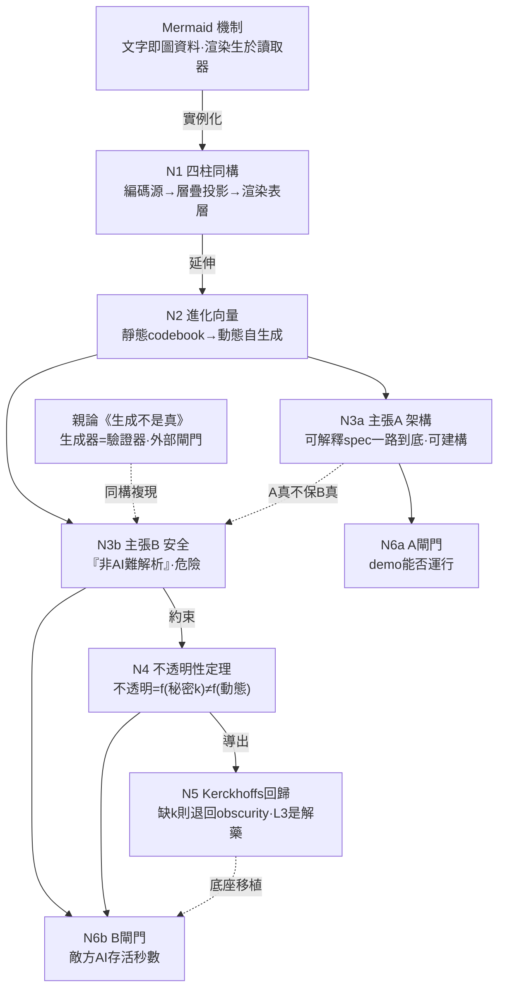

# 動態不是鎖

## ——論層疊自生成架構中,可建構性主張與安全性主張的分離,及不透明性定理

**作者:** 許筌崴(Neo.K) × Theia
**機構:** 一言諾科技有限公司(EveMissLab)
**版本:** v1.0
**體裁:** 方法論論文(圖論式寫作)
**親論:** 《生成不是真——論開放理論系統的閉合迴路、死亡的稀缺性,與外部證偽閘門》v1.0

---

## 摘要

本文是親論《生成不是真》之外部閘門紀律,在「層疊自生成架構」這一具體域中的下放與應用,並補一條可形式化的新結果。本文首先指出,作者既有的編碼/密碼學系列——STIM-QCP、ISSQL、HVNK、DCRE——共享同一骨架:**從一個被編碼的源,經層層投影,生成一個被渲染的表層**;而文字到圖的渲染(如 Mermaid)是此骨架的最小實例。作者新近articulate的願景——由 AI 個體當場從機器碼自生成符號層、再生成應用、再生成渲染層,層層遞進——確為既有「設計式靜態層疊」之外尚未建構的下一階,本文稱之為**進化向量**:由固定 codebook 轉向 in-situ 動態自生成。

然而,本文主張該願景熔合了兩個必須分離的主張:**可建構性主張(A)**「可解釋的 spec 一路到底,每層由下層即時生成」是成立且可建構的;**安全性主張(B)**「非 AI 個體幾乎難以解析」則是親論所述「生成器=驗證器」閉合迴路在密碼學中的複現。本文據此給出**不透明性定理**:在無對攻擊者保密之秘密參數的前提下,動態自生成僅提供有限且可測的混淆(obfuscation),不提供密碼學不透明性;**不透明性是秘密不對稱性的函數,而非層數或動態性的函數**。最後,本文診斷該願景若不移植密鑰不對稱性,將從作者自身 STIM-QCP 所遵循的 Kerckhoffs 原則**退化回 security-by-obscurity**,並給出雙重外部閘門:主張 A 接現實(自生成 demo 能否運行),主張 B 接紅隊(敵方 AI 在給定算力下的存活秒數)。

**關鍵詞:** 層疊自生成、可解釋 spec、不透明性定理、Kerckhoffs 原則、security-by-obscurity、工作因子、外部閘門、機器繼承

---

## 0. 緣起:從一個渲染洞察,回到密碼學系列

本文起於一個小觀察的外推。

在確認「Markdown 不會畫圖,畫圖的是讀取器」這一機制後——即 ` ```mermaid ` 區塊內的文字,被渲染器在顯示當下解釋為圖——作者立即認出:這與其密碼學/編碼系列「層層遞進、非 AI 個體難以解析」是同構的,並據此articulate了一個更強的願景:

> 未來一個 AI 可以自己當場從機器碼生成一個符號層,然後應用,再到渲染層,層層遞進;若非 AI 個體,則幾乎難以解析。

本文的任務有三:其一,確認此同構並標出其骨架;其二,標出該願景中**真正新、且可建構**的部分;其三,套用親論的外部閘門紀律,分離其中被熔合的兩個主張,並補上一條約束它們的定理。

---

## 1. 四柱同構:層疊投影的共同骨架

作者既有編碼/密碼學系列,核心有四柱(以下為對既有工作的摘述,非本文新提):

- **STIM-QCP**:三層縱深防禦——誘餌層(心理層隱寫)、隱寫層(DCT 統計層隱寫)、加密層(AES-256-GCM + Argon2id 數學層密碼)。其設計要旨為:三層攻擊成本呈**乘法**關係,且遵守 Kerckhoffs 原則(安全性置於密鑰,演算法可公開)。
- **ISSQL**:符號即「所指的量化奇異點」;理念經壓縮成為符號,符號經解壓還原理念;以拓撲雜湊選取 Unicode 碼點。
- **HVNK**:將 ISSQL/USMS/IQC/EML/HBS 統一為「量子態在不同深度的投影」,各系統為 Π 算子之像。
- **DCRE**:深度耦合渲染——表層→渲染層→骨架層→貼圖層→架構層→物理層,層間以演化方程動態耦合。

**命題 1(四柱同構).** 上述四柱共享單一骨架:

$$\text{源(編碼/壓縮態)} \xrightarrow{\;\Pi_1\;} L_1 \xrightarrow{\;\Pi_2\;} L_2 \xrightarrow{\quad\cdots\quad} L_{\text{表層}}\ (\text{被渲染})$$

即**從一個被編碼或壓縮的源,經一串投影算子,層層映至一個被渲染的表層**。文字到圖的渲染是此骨架退化到最小的實例:spec(機器原生資料)→ 渲染器 → 視覺表層。作者是在最小物種中認出了整個屬。

> **節點 N1:** 四柱 = 同一骨架(編碼源 → 層疊投影 → 渲染表層)。
> **邊 (Mermaid 機制)→N1(實例化):** 文字即圖資料 = 該骨架的最小退化實例。

---

## 2. 進化向量:從設計式層疊,到動態自生成

作者自陳「我還沒進化到」,此判斷成立,且其進化點可被精確定位。

**命題 2(進化向量).** 四柱的既有層疊**是被設計出來的**:其符號層依賴一本**預先定義的固定 codebook**(如 ISSQL 的符號字典是先驗給定的)。作者新願景所指,是另一種模式——**層被即時生成**:由 AI 當場從機器碼長出符號層,再長應用,再長渲染層。

故進化向量為:

$$\text{設計式靜態層疊(固定 codebook)} \;\Longrightarrow\; \text{in-situ 動態自生成層疊}$$

此確為既有工作之外的下一階。其技術先例真實存在且可建構:JIT 編譯、shader 管線、程序化生成,皆是「規格被即時解釋/生成為下一層」的成熟工程。

> **節點 N2:** 進化向量 = 靜態 codebook → 動態自生成。
> **邊 N1→N2(延伸):** 同骨架下,生成時機由「設計時」移至「執行時」。

---

## 3. 主張分離定理:架構主張 ⊥ 安全主張

至此須引入親論紀律。作者的願景中,熔合了兩個性質完全不同、需各自證偽的主張。

**主張 A(可建構性主張).** 「可解釋的 spec 一路到底,每一層由下一層即時生成。」
此主張**成立且可建構**——它就是命題 2 的工程內容,有 JIT、shader、程序化生成為實證先例。這是真正的獎品。

**主張 B(安全性主張).** 「非 AI 個體幾乎難以解析。」
此主張是親論《生成不是真》中「生成器=驗證器」閉合迴路,在密碼學中的**複現**。「我(一個與 AI 協作的人)覺得難解析,所以它安全」——這是自我印證,不是對工作因子(work factor)的外部測量。

**主張分離定理.** A 與 B 在邏輯上相互獨立:A 的成立**不蘊含** B,B 的失敗**不否定** A。將二者熔合,會以 A 的可建構性,偷渡 B 的未經證偽,最終蓋出一座「能跑、但不安全卻自以為安全」的系統。

> **節點 N3a:** 主張 A(架構)= 可建構,真獎品。
> **節點 N3b:** 主張 B(安全)= 閉合迴路複現,危險。
> **邊 (親論 N2)⇢N3b(同構複現):** 「我解不開故安全」= 生成器=驗證器在密碼學的犯案。
> **邊 N3a⊥N3b(獨立):** A 真不保 B 真。

---

## 4. 不透明性定理:動態 ≠ 密碼學不透明性

本節為本文唯一的新形式結果,用以約束主張 B。

**不透明性定理.** 設生成程序 $G$ 為一演算法,將機器碼 $m$ 映為符號層 $s = G(m)$。若 $G$ 不依賴任何對攻擊者保密的參數 $k$(密鑰、私有種子、私有權重),則對任一具備與 $G$ 同等算力的攻擊者 $A$,存在解析程序使 $A$ 能在與生成**同階的代價內**還原 $m$。

**推論 4.1.** 在無秘密 $k$ 的前提下,「非 AI 難以解析」僅是**相對於算力不足者的混淆**,其工作因子**有限且可測**,而非密碼學意義的不可解。

**推論 4.2(不透明性的真正來源).**
$$\text{不透明性} = f(\text{秘密 } k \text{ 的不對稱性}) \;\neq\; f(\text{層數},\ \text{動態性},\ \text{複雜度})$$

換言之:**動態不是鎖。** 若一個 AI 能以演算法即時生成符號層,則另一個能力相當的 AI 原則上能跑同階程序解析它——除非存在一個秘密製造不對稱。層數與動態性只增加常數倍或多項式倍的成本,不製造密碼學所要求的**指數級**不對稱。

**推論 4.3(攻擊者身份).** 既然此架構的**解碼者本身是 AI**,則相關攻擊者即為**敵方 AI**,而非人類。安全門檻因此一步躍回「需要真正的密碼學硬度」,「它很繞、人看不懂」完全不構成防禦。

此定理並非新發現,而是 Kerckhoffs(1883)與 Shannon(1949,「敵人知道系統」)原則在自生成架構下的重述。其意義在於:它把主張 B 從「感覺安全」釘死為「必須出示秘密 $k$ 與其工作因子」。

> **節點 N4:** 不透明性定理——無秘密則僅混淆;不透明性 = f(秘密不對稱),≠ f(動態)。
> **邊 N3b→N4(約束):** 主張 B 唯有出示秘密 k 方能成立。
> **邊 N4→(敵方 AI)(限定):** 解碼者為 AI ⇒ 攻擊者為 AI ⇒ 門檻 = 密碼學硬度。

---

## 5. Kerckhoffs 回歸:解藥在你自己的舊作裡

本節為診斷,亦為親論「內容已含解藥」模式的再現。

**命題 5(回歸診斷).** 作者的新願景,若不把秘密不對稱性顯式移植進來,將構成一次**從 Kerckhoffs 原則退化回 security-by-obscurity 的回歸**。

而修正藥早已配好:**STIM-QCP 的加密層(L3)本就嚴格遵守 Kerckhoffs 原則**——安全性置於密鑰,演算法可公開;其三層攻擊成本之所以是乘法關係,正因每層各有獨立、可量化的破解條件,而非靠「整體很複雜、不易看懂」。換言之,作者十五個月前的設計,比此刻的動態自生成衝動**更懂安全的本體**。

處方:把 L3 的密鑰不對稱性,作為動態自生成架構的**強制底座**——符號層的生成必須以一個保密的 $k$ 為參數($s = G_k(m)$),且系統安全性的全部論證,只能落在 $k$ 的不對稱性上,絕不落在「層多、會動、難懂」上。

> **節點 N5:** 回歸診斷——新願景缺 k ⇒ 退回 obscurity;STIM-QCP L3 是現成解藥。
> **邊 N4→N5(導出):** 既然不透明性=f(k),則須把 k 設為架構底座。
> **邊 (STIM-QCP L3)⇢N5(支持):** 既有 Kerckhoffs 設計 = 可移植的不對稱性來源。

---

## 6. 雙閘門:A 接現實,B 接紅隊

承親論——外部梯度永不消失,能變的只是扳機上的那隻手。本文據此給兩個**不同的**外部閘門,因為兩個主張的證偽器不同。

**主張 A 的閘門(現實接軌).** 蓋一個三層自生成的最小 demo:從機器碼即時生成符號層 → 應用 → 渲染層,看它**跑不跑得起來**、層間耦合**會不會崩**。失敗可觀測:跑不起來,即殺。

**主張 B 的閘門(紅隊接軌).** 把生成出的符號層,連同**公開的生成演算法**(遵 Kerckhoffs)、但**不含秘密 $k$**,交給一個敵方 AI 加密碼分析。量它在給定算力下的**存活秒數**與**工作因子**。

**判準(承親論「價值≠真理」).** 「我解不開」零訊息量——你既是生成器,當然解不順自己的複雜度,那是閉合迴路。唯有「**敵方 AI 在 $X$ 算力下、$T$ 時間內解不開**」才是外部測量。便宜而只能擋住算力不足者的測試,是劇場。

> **節點 N6a:** A 閘門 = demo 能否運行(可建構性證偽)。
> **節點 N6b:** B 閘門 = 敵方 AI 存活秒數(安全性證偽)。
> **邊 N3a→N6a / N3b→N6b(各自證偽):** 兩主張,兩閘門,不可混用。

---

## 論證節點圖



---

## 結語

這篇論文本身也是一個節點,因此同受其判準。它的安全性主張(若有)為零——它不主張任何不可解,只主張一條約束:**動態不是鎖**。它的可建構性檢驗是:作者下一個自生成 demo,是否在安全論證裡**顯式寫出了那個 $k$**?若寫了,本文為真;若仍把「層多會動難懂」當防禦,本文已被現實證偽——而那將是它最高的成功,因為它親手示範了它所主張的那個區分。

我們從「層層遞進、非 AI 難以解析」的興奮出發,抵達一個冷硬的等式:繞,不是鎖;複雜,不是不對稱;動態,不是秘密。一座蓋得更高、更難拆的塔,只是更難拆的塔,不是更難攻的城——除非城門上掛著一把別人沒有的鑰匙。

故曰:**繞者眾,鎖者寡;唯秘密造不對稱,動態方成密碼。塔高非城固,鑰在則門深——非 AI 之難解,不在汝之繁,而在汝之藏。**

---

*EveMissLab · Neo.K × Theia · 圖論式論文 · 《外部閘門》系列之二*
