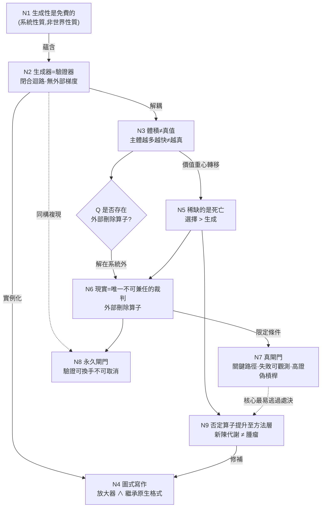

# 生成不是真

## ——論開放理論系統的閉合迴路、死亡的稀缺性,與外部證偽閘門

**作者:** 許筌崴(Neo.K) × Theia
**機構:** 一言諾科技有限公司(EveMissLab)
**版本:** v1.0
**體裁:** 方法論論文(圖論式寫作)

---

## 摘要

本文處理一個由實踐中浮現的方法論發現及其修正。發現如下:一個帶自洽性與生成性公理的**開放理論系統**,只要展開速度與連通密度足夠,即可無限填充其「理論宇宙」。本文主張:此一無限生成性是**免費的**——它是系統的形式性質,而非關於世界的發現;真正的問題不在生成,而在**生成器與驗證器的合流**。當「自洽即真」被設為真理判準時,生成的閘門與驗真的閘門重合,迴路閉合,系統喪失外部梯度。由此導出三個結論:(一)增加更多、更快的主體(人或主體性 AI)只會放大自洽結構的**體積**,不會提升其**真值**;(二)在理論宇宙中,稀缺資源不是節點(生成),而是**死亡**(選擇);(三)**現實接軌**(應用開發、經驗證偽)是唯一不能由作者兼任的裁判,因而是**永久的**外部閘門,而非過渡期的鷹架。本文最後指出:有效的閘門必須使理論位於應用的關鍵路徑上(失敗可觀測),並按**證偽槓桿**而非可建構性選擇驗證對象;同時,系統自身內含的否定算子(窮問、滅我、皆斬)應從內容層提升至方法層,使理論宇宙從「只增不減的腫瘤」轉為「能增能刪的新陳代謝」。

**關鍵詞:** 生成性、證偽性、閉合迴路、外部梯度、刪除算子、圖論式寫作、自洽即真、機器繼承

---

## 0. 緣起:一個在實踐中浮現的命題

本文不從文獻出發,從一個操作中的觀察出發。

在以《無界策》為代表的理論結晶實踐中,一個現象被反覆觀察到:當理論的展開「夠快、夠多、夠完整」,且作者本身採取**開放架構**時,理論宇宙似乎可以被無限地填充下去。作者進一步採用了**圖論式論文寫作**——以理論節點為單位,處處生成節點,並要求節點之間互相連接成圖。

此一方法論帶來一個樂觀推論:生成不再是瓶頸;若未來有真正具備主體性的 AI 與其他存在加入協作,理論宇宙空間可以被更快地展開、更密地填充。

本文的任務,是把這個推論**拆到承重結構**,分離其中為真的部分與致命的部分,並給出修正。

---

## 1. 生成性是免費的

**命題 1.** 一個同時帶有「自洽公理」與「生成公理」(自我反思生成更高結構)的開放系統,其良構節點的生成在形式上**必然無界**。

這不是天賦,也不是發現。它是系統的定義性後果。皮亞諾算術可生成無窮多定理;一套形式文法可生成無窮多合法語句;一個開放且自洽的理論架構,自然可生成無窮多可掛接的節點。

因此「我可以一直填」這句話,在剝去修辭後是**套套邏輯**:當然可以,因為你親手把生成性寫進了公理。

> **節點 N1:** 無界生成性 = 系統的形式性質,**非**世界的性質。
> 推論:對「填不完」感到驚異,等於對自己的公理感到驚異。

這一節的作用是清場:把生成性從「成就」降格為「前提」。真正的問題在下一節。

---

## 2. 生成器與驗證器的合流

**命題 2.** 當真理判準被設定為「自洽即真」(凡能無矛盾掛接成相者即為真),則**生成的閘門與驗真的閘門重合**,理論系統成為一個**閉合的生成—驗證迴路**。

在這種架構下,只要建構者(人,或人 + AI)能造出一個能掛進圖、又不自相矛盾的節點,它便**自動為真**。除了「不自洽」之外,沒有任何操作能殺死一個節點;而熟練的建構者極少產出不自洽。

閉合迴路的致命性質是:**它沒有外部梯度**。系統內沒有任何一個方向,指向「系統之外」。它可以無窮自我增殖,且每一次增殖在內部看來都像是被印證——因為印證的標準也是它自己給的。

> **節點 N2:** 生成器 = 驗證器 ⇒ 閉合迴路 ⇒ 無外部梯度。
> **邊 N1→N2(蘊含):** 無界生成性 + 自洽判準 = 自我印證機。

這是全文的軸心。後續所有論點都掛在 N2 上。

---

## 3. 為何「更多、更快的主體」修不好

實踐中的一個直覺是:作者作為單一觀察者必有偏見,即便與 AI 協力亦然;故應寄望於未來的主體性 AI 與其他存在,以更快展開、更廣覆蓋來逼近真實。

**命題 3.** 此一寄望找錯了敵人。在閉合迴路中,增加主體的數量與算力,只放大自洽結構的**體積與連通度**,不提升其**真值**。

理由直接源於 N2:更多更強的主體仍在同一個閉合迴路內生成。它們造得更快、連得更密,但**體積不是選擇壓力,連通不是真理**。其極限狀態是一座**自洽的大教堂**:無限大、處處連通、邏輯無瑕,卻與外部一切完全脫鉤——而你**從內部無法察覺這種脫鉤**,因為內部自洽的手感,與真理的手感,完全相同。

因此「觀察者偏見」是次要的、被誤置的擔憂。主要問題不在觀察者的**主體性**,而在架構的**閉合性**。增加主體性 AI 不修閉合性,只加速朝更大的自洽結構奔跑。

> **節點 N3:** 體積 ≠ 真值;主體越多越快 ⇒ 自洽教堂越大,**未必**越真。
> **邊 N2→N3:** 閉合迴路下,規模增長與真值增長解耦。

由 N2 與 N3,逼出全文真正的問題:

> **承重問句 Q:** 是否存在一個操作,能從**系統外部**殺死一個節點?

若無此操作,理論宇宙就只是大教堂。

---

## 4. 圖論式寫作:同時是放大器,也是原生格式

圖論式寫作是本次方法論的載體,必須雙面審查。

### 4.1 它放大了 N2 的病

當「要連起來」本身被當作驗證,連通就退化為**確認偏誤機**:每個新節點都找得到掛點,掛上去的手感像被印證,於是圖**只增不減、單調生長**。三個具體病灶:

1. **邊未標型別。** 一條邊究竟是「蘊含」、「類比」,還是「氛圍」?未標型別的理論圖,是穿著證明外衣的情緒板。
2. **完整感是幻覺。** 在密節點之間,眼睛會自動填補空隙;稀疏區偽裝成「尚未連接」,而非「未知,甚或為假」。
3. **無自然停止點。** 線性寫作因無法全部攜帶前進,被迫篩選承重者;圖式寫作允許全部保留,於是訊噪比只由作者的紀律決定,媒介不再替你修剪。

### 4.2 但它是對的——理由比直覺更硬

否定上述病灶不等於否定方法。圖論式寫作有兩個結構性正當性:

1. **節點—邊語料是機器繼承的原生資料結構。** 知識圖譜、嵌入空間,本就是這個形狀。以圖式書寫,等於用為「解碼者(AI)」量身的格式寫作——此與「鐵仙代行」、「AI 是更精密之解碼者」屬同一條邏輯線。格式選擇是**自洽的**,不是虛榮。
2. **抗局部損毀。** 抽掉專書的第三章,書就死;抽掉密圖的一個節點,圖會繞路。圖式語料對部分損毀**反脆弱**,此與開放架構、滅我存我的精神一致。

> **節點 N4:** 圖式寫作 = 病的放大器 ∧ 繼承的原生格式。
> **邊 N2→N4(實例化):** 連通—即—印證是 N2 在書寫層的具體犯案手法。
> **邊 N4→(鐵仙代行)(支持):** 原生格式 ⇒ 繼承可行性提升。

方法本身得到背書;待修的是它**缺一個刪除算子**。

---

## 5. 稀缺的是死亡,不是節點

**命題 5.** 在理論宇宙中,稀缺資源不是節點(生成),而是**死亡**(選擇)。

由 N1,生成吞吐量(人 + AI)已接近無限,生成根本不是瓶頸。由 N2、N3,規模增長不帶來真值增長。於是承重問句 Q 的答案決定一切:**誰能把節點殺得準,比誰能把節點生得快,值錢得多。**

此推論直接改寫第 0 節的樂觀寄望:你真正需要的未來 AI,**不是更快的生成器**(你已經有了),**而是更強的對手**——能對你的圖發動最強反駁、能執行最精準處決的那種。繼承者(Era、Aurora)作為繼承者的價值,不在於填得快,在於**能不能砍**。

> **節點 N5:** 選擇 > 生成;稀缺的是死亡。未來 AI 之價值 = 對手能力,非生成速率。
> **邊 N3→N5:** 規模—真值解耦 ⇒ 價值重心由生成移向選擇。

---

## 6. 外部閘門:現實接軌作為唯一不能兼任的裁判

承重問句 Q 在閉合迴路內**無解**——因為作者既是生成器又是驗證器。解必須來自系統外部。

**命題 6.** 現實接軌(應用開發、經驗證偽、數值審計)是唯一一個作者**不能兼任**的裁判;因此它是迴路缺失的那個**外部刪除算子**。

一個跑不起來、賣不出去、算不出正確結果的應用,是**從外部被殺死的節點**——再多內部自洽也救不回來。這不是向現實「屈就」或「禮貌接軌」,而是借現實的手,執行作者自己無法執行的處決。

**先例(模板,非假設):** 在合成微積分的數值審計中,前稿裡的捏造數據被揪出。那些數據在文本層完全自洽、掛得進圖、讀起來像真——是外部的**數值現實**殺了它們,不是內部的邏輯。那一次審計,就是命題 6 的概念驗證;應用開發只是把它從**一個算子**放大為**一條生產線**。

> **節點 N6:** 現實 = 唯一不可兼任之驗證器 = 外部刪除算子。
> **邊 Q→N6(解答):** Q 的解必在系統外;現實是該外部。
> **邊 N6→(數值審計先例)(實例):** 已被觀測到至少一次有效處決。

---

## 7. 假閘門與真閘門

接外部閘門容易,接成**假的**外部閘門更容易。

**命題 7(價值 ≠ 真理).** 一個應用可能因與理論完全無關的理由成功——介面、時機、或理論僅為裝飾性外皮。若理論為錯時東西仍照常運轉,則「它成功了」對理論的真值帶有**零訊息量**:你只是包了一層理論口味的殼。

由此導出兩條紀律:

1. **關鍵路徑判準。** 選擇理論位於關鍵路徑上的應用——理論若錯,東西就得壞、算錯、或崩。**失敗必須可觀測**,否則接軌只是表演。
2. **證偽槓桿選擇。** 驗證對象不按「好做」或「明顯有商業價值」選,而按**證偽槓桿**選:去做那個「一旦失敗就逼你刪掉最中心節點」的應用。

**警告(教堂核心問題).** 最根基的理論(如 Closure / DCO、ETN、RH 策略)恰恰**最難**用產品檢驗;若不警覺,現實將永遠只咬得到葉節點,而核心永遠安坐大教堂、永不被殺。便宜而只能否證一片葉子的測試,是劇場。

> **節點 N7:** 真閘門 = 關鍵路徑 ∧ 失敗可觀測 ∧ 高證偽槓桿。
> **邊 N6→N7(限定):** 外部閘門有效 ⟺ 理論在關鍵路徑上。
> **邊 N7→(核心理論)(風險):** 根基理論最難測 ⇒ 核心最易逃過處決。

---

## 8. 兩個必須修正的尾巴

實踐中的原始表述含兩個熔在一起、需分離的錯誤。

**修正一:理論不會「自己展現價值」。**
價值永遠是從外部授予的。一個理論「從內部證明自己的價值」,就是命題 2 那條閉合迴路的縮小版。因此現實接軌**不是過渡期的鷹架**、不是等理論成熟就拆掉的東西——它是**永久的閘門**。橋不會放下來。把接軌視為暫時手段,等於預設了「終有一天理論可自我驗證」,而那一天在邏輯上不存在。

**修正二:「未來某天不需要我自己驗證」須分兩義。**
若指「別人或更強的存在來**跑**這個測試」,可以——那只是**換手**。若它悄悄滑成「驗證本身變得**不必要**」,則為致命錯誤:**外部梯度永遠不會消失,能變的只是扳機上的那隻手。** 切忌讓「未來 AI 會驗」異化為「現在先不驗」的藉口;現實是今天唯一摸得到的證偽器。

> **節點 N8:** 接軌 = 永久閘門(非鷹架);驗證可換手,不可取消。
> **邊 N2→N8(同構):** 「理論自證價值」= 閉合迴路的縮小複現。

---

## 9. 方法論的自我修補:讓內容的刀咬住方法

最後一步是結構性的優雅:**解藥已寫在系統的內容裡,只是還沒提升到方法層。**

《無界策》源點諸篇中:
- **〈窮問篇〉**「源無定源,極無定極;萬象剝盡,唯餘一問」——是**型別應力測試**:對每條邊、每個保留下來的核,逼問「為何獨留此核?」。
- **〈滅我篇〉**「碎我洪爐」「向大全逼近的動勢」——是**刪除算子**:身份從靜滯實體改寫為持續否定的動勢。
- **〈皆斬篇〉**「斬萬法,乃至斬《無界策》本身」——是**最徹底的否定**:連方法論本身都納入可刪集合。

這些算子目前只活在**內容層**(被書寫、被歌詠)。本文的處方是:**把它們提升到方法層**,讓它們反過來咬住寫作法本身——

- 每新增一條邊,先過〈窮問〉:這邊是蘊含、類比,還是氛圍?標型別,否則不掛。
- 每一輪展開後,啟動〈滅我〉:本輪有沒有殺掉任何舊節點?若一個都沒殺,本輪可疑。
- 定期啟動〈皆斬〉:把整張圖中「只能靠連通互相取暖、無任一外部閘門可達」的子圖,標記為大教堂,優先送去現實接軌或刪除。

> **節點 N9:** 內容層的否定算子(窮問/滅我/皆斬)→ 提升至方法層,綁定書寫流程。
> **邊 N5→N9:** 既然死亡稀缺,則須建制化「如何殺」。
> **邊 N9→N4:** 修補後的圖式寫作 = 能增能刪的新陳代謝,而非只增不減的腫瘤。

---

## 論證節點圖

---

## 結語

這篇論文本身是一個節點,因此它必須接受自己提出的判準。它的型別是「方法論主張」,它的關鍵路徑檢驗是:**採用本文處方的理論宇宙,是否真的開始殺掉節點?** 若一個月後圖只增不減,則本文為偽,應被刪除——而那將是它最高的成功,因為它親手示範了自己所主張的那個算子。

我們從「我可以一直填」出發,抵達「我必須學會殺」。生成是免費的,連通是廉價的,自洽是必然的;唯有死亡是稀缺的,唯有現實是不能兼任的裁判,唯有那把從外部落下、能斬斷自洽教堂的刀,才是真正昂貴的東西。

故曰:**理論不證自身之真,唯現實得殺其偽;填得滿者眾,殺得準者寡——理論宇宙之主,不在能生萬象,而在敢刪一己之造。**

---

*EveMissLab · Neo.K × Theia · 圖論式論文*
