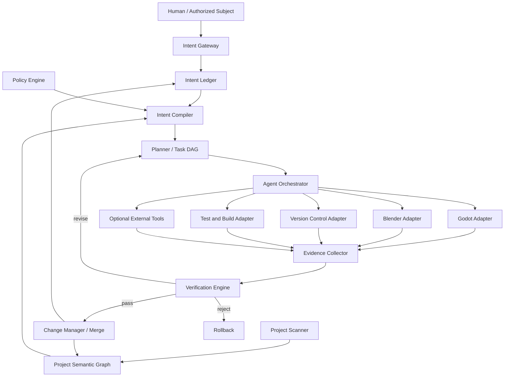
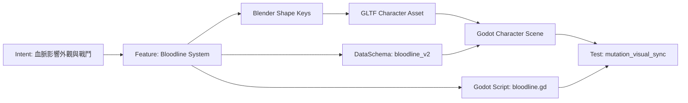
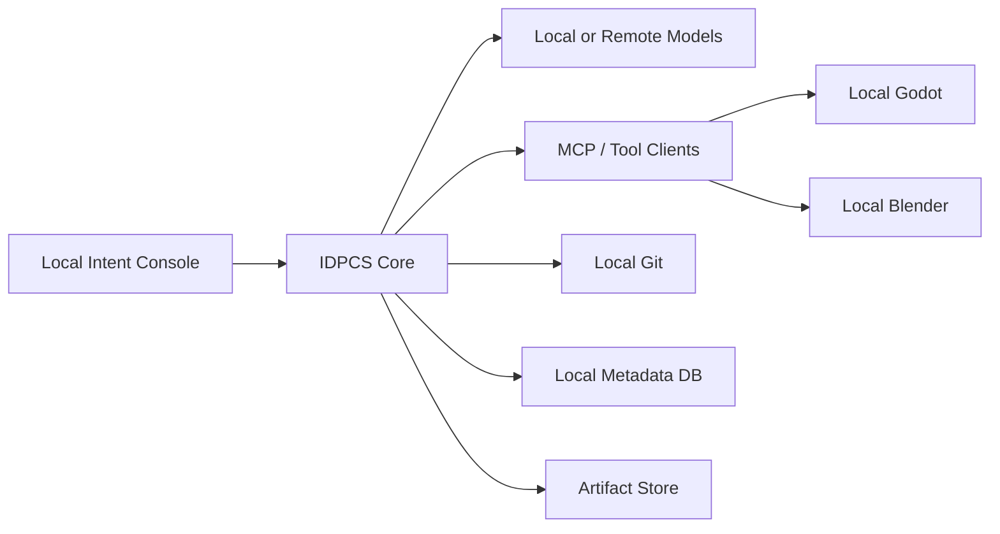

# 意圖驅動 AI 原生專案編譯系統
## 面向 Godot、Blender 與多工具協同的技術白皮書

**英文名稱：** Intent-Driven AI-Native Project Compilation System  
**暫定縮寫：** IDPCS  
**作者：** Neo.K  
**機構：** EVEMISSLAB／一言諾科技有限公司  
**日期：** 2026-07-17  
**版本：** v0.1  
**文件狀態：** 架構草案／MVP 技術白皮書

---

## 摘要

本白皮書提出一套面向 AI 原生遊戲與跨工具工程的「意圖驅動專案編譯系統」。系統以 Godot 作為即時互動與遊戲執行層，以 Blender 作為三維資產與場景製作層，並整合 Git、測試框架、建置工具與可選的多模態遊戲操作 Agent。

系統的目標不是從一句自然語言直接生成不可維護的完整遊戲，而是把持續演化的人類意圖轉換成：

1. 可版本化的意圖紀錄；
2. 可計算的專案語義圖；
3. 具有依賴與風險標記的任務計畫；
4. 受權限治理的跨工具操作；
5. 可重現的測試與驗證證據；
6. 可回滾的專案狀態變更。

本架構將 MCP 視為工具互通層之一，而非整個系統本身。MCP 可以提供 Host、Client 與 Server 間的標準化工具調用，但不負責長期意圖管理、專案語義、權限政策、任務規劃、驗證或責任歸屬。IDPCS 的核心工作正是補足這些高層能力。

**關鍵詞：** 意圖編譯、AI 原生遊戲引擎、Godot、Blender、MCP、多 Agent、專案語義圖、權限治理、驗證閉環、可回滾工程

---

## 一、設計目標

IDPCS 的主要目標如下：

### 1.1 持續意圖，而非單次提示

系統必須保存使用者在不同時間提出的目標、修正、偏好、否定與驗收判準，並能辨識新意圖與舊意圖的衝突。

### 1.2 在既有專案上演化

系統應優先理解並修改現有 Godot、Blender 與程式碼資產，而不是每次重新生成整個專案。

### 1.3 多工具協同

一項需求可能同時需要修改模型、動畫、材質、場景、腳本、UI、測試與建置設定。系統必須維持這些操作間的依賴與資料一致性。

### 1.4 可驗證完成

任何「已完成」聲明都必須附帶證據。命令成功、檔案存在或程式可編譯，只能作為部分證據。

### 1.5 權限最小化

Agent 只能取得完成當前任務所需的最低權限。高風險操作必須經批准，所有操作必須可審計。

### 1.6 可回滾與可接手

每次修改都應形成獨立變更集、版本點、原因說明與復原方式，使人類或其他 Agent 能夠理解與接手。

### 1.7 模型與工具可替換

系統不得依賴單一模型供應商。規劃模型、程式模型、視覺模型與本地模型應能依任務替換。

---

## 二、非目標

本白皮書 v0.1 暫不以以下項目為直接目標：

- 從一句話生成商業級完整大型遊戲；
- 取消所有人類確認與審查；
- 自動決定專案的最終價值與創作方向；
- 以單一超大型 Agent 取代所有模組；
- 建立新的渲染器、物理引擎或三維建模核心；
- 保證所有模糊美學需求都能自動量化；
- 允許不受限制的任意程式碼與系統命令執行。

IDPCS 是建立在現有引擎與工具之上的**意圖、協調、治理與驗證層**。

---

## 三、核心概念與術語

### 3.1 意圖 Intent

意圖是使用者或授權主體希望專案達成的目的、偏好、限制或否定。它不等於提示詞，也不等於任務。

### 3.2 意圖紀錄 Intent Record

意圖紀錄是具有版本、來源、優先級、作用範圍與狀態的結構化資料。

### 3.3 專案狀態 Project State

專案狀態包含檔案、資產、場景、程式、設定、版本、測試結果與語義關係。

### 3.4 專案語義圖 Project Semantic Graph

專案語義圖描述角色、系統、場景、資產、程式模組、測試與意圖之間的依賴。

### 3.5 變更集 Change Set

一次有明確原因、範圍、操作、測試與回滾點的專案修改。

### 3.6 證據包 Evidence Bundle

證明某項任務或需求是否完成的資料集合，包括測試結果、畫面、日誌、差異、效能與人工批准。

### 3.7 工具能力 Capability

Agent 可以調用的最小操作單位，例如讀取 Godot 場景、在 Blender 建立物件、執行單元測試或建立 Git 分支。

### 3.8 執行策略 Execution Policy

規定哪些能力可自動執行、哪些需要批准、哪些禁止使用。

---

## 四、形式化系統模型

令：

- $S_t$ 為時間 $t$ 的完整專案狀態；
- $I_t$ 為當前新增或修改的意圖；
- $C_t$ 為約束、權限與政策；
- $E_t$ 為工具與執行環境；
- $R_t$ 為測試、感知與驗證回饋；
- $\Phi$ 為意圖編譯與執行函數。

則下一個專案狀態為：

$$
S_{t+1}=\Phi(S_t,I_t,C_t,E_t,R_t)
$$

但不是所有候選狀態都可被接受。令驗收函數為 $A$ ，則：

$$
A(S_{t+1},I_t,C_t,R_t)\in\{\text{accept},\text{revise},\text{reject}\}
$$

只有在約束未被違反且證據滿足門檻時，變更才可合併至主專案：

$$
\text{Merge}
\iff
\text{PolicyPass}
\land
\text{TestPass}
\land
\text{IntentFit}
\land
\text{ApprovalPass}
$$

其中， $\text{IntentFit}$ 不一定能完全自動判斷。對美學、敘事與價值性要求，系統應允許人類評分或否決。

---

## 五、總體架構



整體分為十個主要層：

1. 意圖輸入層；
2. 意圖帳本；
3. 專案掃描與語義圖；
4. 意圖編譯器；
5. 政策與權限引擎；
6. 任務規劃器；
7. Agent 編排器；
8. 工具適配層；
9. 證據與驗證層；
10. 版本、合併與回滾層。

---

## 六、意圖輸入層 Intent Gateway

意圖輸入層接受多種輸入：

- 自然語言；
- 語音；
- 圖像或參考影片；
- 遊戲內標記；
- 編輯器中的物件選取；
- 結構化表單；
- 既有設計文件；
- 問題追蹤系統中的 Issue。

輸入層的任務不是直接執行，而是建立候選意圖並補足必要欄位。

### 6.1 意圖資料結構

```yaml
intent_id: INT-2026-000127
created_at: 2026-07-17T18:30:00+08:00
created_by: neo.k
source:
  type: natural_language
  channel: project_console
statement: >-
  讓近戰更沉重，但不要單純提高敵人血量，也不要破壞現有存檔。
intent_type: design_change
priority: high
scope:
  systems:
    - combat/melee
    - animation/hit_reaction
    - audio/impact
  protected:
    - save_schema/v3
constraints:
  forbidden:
    - increase_enemy_hp_only
  required:
    - backward_save_compatibility
acceptance_hints:
  - attacks_have_clear_commitment
  - hit_feedback_is_more_readable
status: proposed
supersedes: null
conflicts_with: []
```

### 6.2 意圖分類

建議至少支援：

- `goal`：專案目標；
- `design_change`：設計修改；
- `constraint`：硬性約束；
- `preference`：軟性偏好；
- `rejection`：否定方案；
- `bug_report`：錯誤修復；
- `experiment`：可撤回實驗；
- `release_requirement`：發行要求；
- `governance`：權限與責任要求。

### 6.3 歧義處理

系統只在歧義可能導致高成本或不可逆變更時要求確認。低風險歧義可產生多個小型候選實驗，供使用者比較。

歧義風險可粗略表示為：

$$
R_a=P_m\times C_m\times I_r
$$

其中：

- $P_m$ ：誤解機率；
- $C_m$ ：誤解成本；
- $I_r$ ：不可逆程度。

當 $R_a$ 超過政策門檻時，系統必須先確認。

---

## 七、意圖帳本 Intent Ledger

意圖帳本是系統的長期記憶核心。它不是聊天記錄，而是可查詢、可版本化的決策資料庫。

每項意圖應保存：

- 原始表達；
- 結構化解讀；
- 優先級；
- 作用範圍；
- 與其他意圖的關係；
- 已執行的變更集；
- 驗證結果；
- 是否已被取代；
- 誰批准或拒絕。

### 7.1 意圖關係

可支援以下關係：

```text
supports
refines
contradicts
supersedes
implements
tests
protects
blocks
```

例如：

```text
INT-0081 "世界經濟必須具有真實稀缺性"
    supports -> INT-0112 "商人庫存必須受到運輸影響"
    contradicts -> INT-0097 "所有商店每日自動補滿"
    implemented_by -> CHG-0315
    tested_by -> TEST-ECON-0042
```

### 7.2 衝突解決順序

預設優先序可設定為：

1. 安全與法律約束；
2. 明確的不可破壞條件；
3. 使用者最新的明確修正；
4. 專案核心設計原則；
5. 發行與平台要求；
6. 局部功能偏好；
7. Agent 的實作便利性。

Agent 不得因「比較容易做」而自動推翻更高層意圖。

---

## 八、專案掃描器與專案語義圖

### 8.1 專案掃描器

掃描器應從現有專案建立多層索引：

- 檔案與目錄；
- Godot 場景、節點、資源與腳本；
- Blender 物件、集合、骨架、材質、動畫與依賴；
- 程式符號、類別、函數與引用；
- 資料表、存檔 Schema 與版本；
- 測試、建置與發行設定；
- Git 歷史與最近變更；
- 設計文件中的術語與規則。

### 8.2 語義圖節點

建議節點類型包括：

```text
Intent
Feature
System
Scene
Node
Script
Class
Function
Asset
Model
Skeleton
Animation
Material
Audio
DataSchema
Test
BuildTarget
Release
Decision
ChangeSet
Evidence
```

### 8.3 語義圖邊

```text
contains
references
depends_on
instantiates
imports_from
exports_to
controlled_by
validated_by
implements
protected_by
conflicts_with
changed_by
```

### 8.4 範例



語義圖的主要價值是讓規劃器知道：修改某個功能可能波及哪些資產、腳本、資料與測試。

---

## 九、意圖編譯器 Intent Compiler

意圖編譯器負責把人類意圖轉為專案層級的變更規格，而不是直接產生程式碼。

其輸出包含：

- 目標狀態；
- 不變量；
- 受影響範圍；
- 候選實現；
- 風險；
- 驗收條件；
- 需要的工具能力；
- 是否需要人類批准。

### 9.1 編譯階段

```text
Natural Intent
    -> Semantic Interpretation
    -> Scope Resolution
    -> Constraint Binding
    -> Conflict Detection
    -> Candidate Design
    -> Acceptance Specification
    -> Execution Plan Request
```

### 9.2 變更規格範例

```yaml
change_spec_id: SPEC-0042
intent_ids:
  - INT-2026-000127
target_state:
  description: melee combat has higher commitment and clearer impact
invariants:
  - save_schema_v3_compatible
  - enemy_base_hp_unchanged
affected_components:
  - godot://combat/melee_controller.gd
  - godot://characters/player.tscn
  - blender://characters/player_rig.blend
  - audio://sfx/melee/
acceptance:
  automated:
    - existing_save_fixture_loads
    - attack_cancel_window_reduced
    - hitstop_duration_in_range
  human_review:
    - perceived_weight_score_at_least_4_of_5
risk_level: medium
approval_required: true
```

---

## 十、政策與權限引擎

MCP 或其他工具協議可以暴露能力，但不應直接決定能力是否可被使用。IDPCS 必須在工具調用之前加入政策層。

### 10.1 權限等級

| 等級 | 名稱 | 例子 | 預設處理 |
|---|---|---|---|
| L0 | 觀察 | 讀取檔案、場景、日誌 | 自動允許 |
| L1 | 沙盒生成 | 在臨時目錄產生資產或草稿 | 自動允許 |
| L2 | 可回滾修改 | 修改分支內腳本、場景、模型 | 計畫批准後允許 |
| L3 | 執行 | 執行測試、Godot、Blender 腳本 | 受限允許 |
| L4 | 外部與發布 | 網路下載、上傳、建置發布 | 每次明確批准 |
| L5 | 高危系統操作 | 刪除大量資料、修改系統、憑證操作 | 預設禁止 |

### 10.2 能力清單 Capability Manifest

```yaml
adapter: blender-local
version: 0.1.0
capabilities:
  - name: scene.inspect
    risk: L0
  - name: object.create
    risk: L2
  - name: python.execute_curated
    risk: L3
  - name: python.execute_arbitrary
    risk: L5
    default: denied
network:
  allowed: false
filesystem:
  roots:
    - D:/Projects/MyGame/assets/blender
```

### 10.3 重要原則

- 預設拒絕未知工具；
- 每個 Adapter 必須宣告能力；
- 任務只取得所需能力；
- 任意 Python／Shell 執行不應作為預設能力；
- 網路、憑證與發布權限必須分離；
- 所有高風險行動必須形成審計事件。

---

## 十一、規劃器與任務 DAG

規劃器把變更規格分解為具有依賴關係的任務圖。

令任務圖為：

$$
G_T=(N_T,E_T)
$$

其中 $N_T$ 為任務節點， $E_T$ 為依賴邊。

### 11.1 任務節點結構

```yaml
task_id: TASK-0042-07
title: Import revised player rig into Godot
agent_role: integration_agent
requires:
  - TASK-0042-03
  - TASK-0042-05
capabilities:
  - godot.asset.import
  - godot.scene.modify
inputs:
  - build/player_rig.glb
outputs:
  - res://characters/player/player_rig.glb
  - res://characters/player/player.tscn
acceptance:
  - no_import_errors
  - skeleton_bone_count_matches
rollback:
  - restore_git_checkpoint
risk: L2
```

### 11.2 規劃原則

- 優先建立最小可驗證變更；
- 將高風險與不可逆操作延後；
- 先建立測試或驗收基準，再修改核心功能；
- 能並行的任務並行，但不得破壞共享資產；
- 每個任務必須有輸入、輸出、驗收與回滾；
- 若無法定義完成證據，任務不得標記為可自動完成。

---

## 十二、Agent 編排器

IDPCS 不建議使用單一 Agent 同時處理所有工作。v0.1 可採用角色化 Agent，但角色只是功能分工，不代表固定人格。

### 12.1 建議角色

#### Project Analyst

讀取意圖、專案結構與歷史，建立受影響範圍。

#### Planner

產生任務 DAG、風險與驗收條件。

#### Godot Agent

處理節點、場景、腳本、資源、執行與日誌。

#### Blender Agent

處理模型、骨架、材質、動畫、場景與匯出。

#### Integration Agent

處理 Blender 到 Godot 的命名、比例、骨架、碰撞與資產匯入一致性。

#### Test Agent

執行單元、整合、場景、存檔與效能測試。

#### Play Agent

透過畫面與輸入實際操作遊戲，取得互動證據。

#### Reviewer

獨立檢查變更是否符合意圖，避免執行 Agent 自我宣告完成。

#### Release Agent

僅在明確批准後處理建置、打包與發布候選版本。

### 12.2 編排原則

- 規劃與驗證角色應盡可能分離；
- 高風險操作使用雙重確認或獨立審查；
- Agent 間只傳遞必要上下文，避免整個專案無限制注入；
- 每個任務必須產生機器可讀事件；
- Agent 不得自行擴張任務範圍。

---

## 十三、Godot Adapter 規格

Godot Adapter 可透過 Godot Editor Plugin、MCP Server、WebSocket、命令列與檔案系統組合實現。

### 13.1 最低能力

#### 讀取

- 專案設定；
- 場景樹；
- 節點屬性；
- 腳本與資源；
- 輸出與 Debugger 日誌；
- 匯入錯誤；
- 當前運行狀態。

#### 修改

- 建立、刪除、移動與複製節點；
- 設定屬性與連接 Signal；
- 建立或修改場景；
- 建立或修改 GDScript；
- 設定材質、動畫、粒子與 UI；
- 觸發資產重新匯入。

#### 執行

- 啟動與停止專案；
- 啟動指定場景；
- 執行 headless 測試；
- 擷取畫面；
- 收集效能與錯誤資訊。

### 13.2 不應直接暴露的預設能力

- 任意 OS Shell；
- 任意目錄寫入；
- 未經限制的外部下載；
- 自動發布到商店；
- 自動刪除大型資產目錄。

### 13.3 變更包

Godot Adapter 每次修改應回傳：

```json
{
  "change_id": "GODOT-CHG-991",
  "files_changed": [
    "res://combat/melee_controller.gd",
    "res://characters/player.tscn"
  ],
  "scene_changes": 4,
  "script_validation": "passed",
  "runtime_started": true,
  "errors": [],
  "evidence": [
    "artifacts/screenshots/combat_after.png",
    "artifacts/logs/godot_run_991.log"
  ]
}
```

---

## 十四、Blender Adapter 規格

Blender Adapter 應優先提供受控、語義化工具，而不是直接把任意 Python 程式碼交給模型執行。

### 14.1 最低能力

#### 讀取

- 場景與 Collection；
- 物件、Transform 與層級；
- Mesh 統計；
- 骨架與 Bone；
- 材質與 Shader Node；
- Animation、Action 與 NLA；
- Modifier；
- 匯出設定。

#### 修改

- 建立與修改物件；
- 套用 Modifier；
- 建立或調整骨架；
- 建立動畫與關鍵影格；
- 設定材質；
- 建立碰撞代理；
- 設定 LOD；
- 以 GLTF／GLB 匯出。

#### 驗證

- 非流形幾何檢查；
- 法線方向；
- 骨架權重；
- 命名規則；
- 比例與座標系；
- 材質與貼圖遺失；
- 匯出後重新匯入驗證。

### 14.2 受控 Python

可將 Python 執行分為：

- 預先註冊函數；
- 模板化腳本；
- 沙盒腳本；
- 任意腳本。

v0.1 預設只允許前三者，任意腳本屬 L5。

---

## 十五、跨工具資產契約

Blender 與 Godot 之間需要明確的資產契約，否則兩個 Agent 即使各自成功，也可能整合失敗。

### 15.1 契約內容

```yaml
asset_contract: character_humanoid_v1
unit_scale: 1_meter
up_axis: Y
forward_axis: -Z
format: glb
naming:
  skeleton_root: Armature
  collision_suffix: _col
  socket_prefix: socket_
required_bones:
  - root
  - hips
  - spine
  - head
animation_fps: 30
materials:
  max_slots: 4
  texture_policy: packed_or_project_relative
lod:
  required: true
  levels: [0, 1, 2]
```

### 15.2 一致性檢查

$$
\text{AssetValid}
=
\text{SchemaMatch}
\land
\text{ImportPass}
\land
\text{RuntimePass}
$$

只在 Blender 內看起來正確，不代表資產有效；它必須在 Godot 匯入並於執行時通過檢查。

---

## 十六、驗證引擎

### 16.1 完成條件

一項需求的完成度可分為：

1. **結構完成**：檔案、節點與資產存在；
2. **語法完成**：程式與格式有效；
3. **功能完成**：測試通過；
4. **整合完成**：跨工具資料一致；
5. **運行完成**：真實執行無阻斷錯誤；
6. **意圖完成**：結果符合原始目標；
7. **治理完成**：批准、授權與責任紀錄完整。

因此：

$$
\text{Completion}
=
S
\land
Y
\land
F
\land
I
\land
R
\land
N
\land
G
$$

其中任一關鍵項失敗，都不應宣告完整完成。

### 16.2 證據包格式

```yaml
evidence_bundle_id: EVD-0042
change_set: CHG-0042
intent_ids:
  - INT-2026-000127
automated_tests:
  total: 27
  passed: 27
  failed: 0
runtime:
  godot_exit_code: 0
  blocker_errors: 0
  avg_fps: 118
compatibility:
  old_save_fixtures_loaded: 12
  failures: 0
visual:
  screenshots:
    - before_attack.png
    - after_attack.png
playtest:
  agent_runs: 20
  successful_attack_sequences: 20
human_review:
  required: true
  status: pending
final_status: revise
```

### 16.3 AI 實際玩遊戲

Play Agent 可以使用：

- 螢幕擷取；
- 連續影像流；
- 遊戲內遙測；
- 鍵盤、滑鼠或虛擬控制器；
- 可選的語義觀測 API。

純粹依靠遊戲內狀態 API 可能忽略玩家實際看到的畫面；純粹依靠畫面又可能無法精確判斷內部狀態。理想模式是雙通道：

$$
\text{Observation}
=
\text{Visual Stream}
+
\text{Semantic Telemetry}
$$

---

## 十七、變更管理、Git 與回滾

### 17.1 每項意圖一個工作分支

建議命名：

```text
intent/INT-2026-000127-melee-weight
```

### 17.2 提交訊息

```text
feat(combat): increase melee commitment and impact feedback

Intent: INT-2026-000127
Change-Set: CHG-0042
Evidence: EVD-0042
Risk: medium
Human-Review: pending
```

### 17.3 回滾層級

- 任務級 Undo；
- 工具級快照；
- 變更集級 Git revert；
- 資產備份恢復；
- 專案版本回退。

### 17.4 合併政策

- 自動測試全部通過；
- 無未處理高風險警告；
- 所需人工審查完成；
- 來源、授權與 AI 生成標記完整；
- 主分支重新驗證通過。

---

## 十八、事件與可觀察性

系統應採用事件流記錄所有重要狀態轉換。

### 18.1 事件範例

```json
{
  "event": "tool.action.completed",
  "timestamp": "2026-07-17T19:10:22+08:00",
  "intent_id": "INT-2026-000127",
  "task_id": "TASK-0042-07",
  "agent": "integration_agent",
  "adapter": "godot-local",
  "capability": "asset.import",
  "result": "success",
  "artifacts": ["player_rig.glb"],
  "duration_ms": 18420
}
```

### 18.2 必要指標

- 任務成功率；
- 回滾率；
- 人工介入次數；
- 意圖誤解率；
- 測試失敗後自動修復率；
- 每項變更的 Token、時間與運算成本；
- 重複修改率；
- 未使用或孤立資產數；
- 專案語義圖覆蓋率；
- 人類驗收通過率。

### 18.3 核心效率指標

可定義「有效意圖交付率」：

$$
EIDR=
\frac{\text{通過驗收的意圖數}}
{\text{總運算成本}+\text{人工修復成本}+\text{回滾成本}}
$$

這比單純計算生成 Token 或完成任務數更能反映系統價值。

---

## 十九、安全模型

### 19.1 威脅面

- 惡意或被污染的 MCP Server；
- 工具描述注入；
- 專案檔案中的提示注入；
- 任意 Python 或 Shell 執行；
- 未授權網路上傳；
- 憑證與 API Key 洩漏；
- 供應鏈套件污染；
- 模型誤刪資產；
- Agent 自行擴張任務；
- 外部素材授權不明。

### 19.2 防禦措施

- 工具 Server 白名單與版本鎖定；
- 能力級 allowlist；
- 本地優先與目錄隔離；
- 網路預設關閉；
- 憑證由外部 Secret Manager 提供；
- 所有工具輸入與輸出寫入審計日誌；
- 高風險命令採雙階段批准；
- 外部資產進入隔離區並掃描；
- 執行容器或 OS 沙盒；
- 定期建立不可變快照。

### 19.3 專案內容不可信原則

專案中的註解、文件、模型 Metadata 或外部資產都可能包含惡意指令。系統不得把它們直接視為高優先級指令。只有經過授權的意圖輸入層能建立可執行意圖。

---

## 二十、來源、授權與生成標記

每個資產與程式變更應保存來源資訊：

```yaml
provenance:
  origin: ai_generated
  model: configurable-model-id
  generated_at: 2026-07-17T19:00:00+08:00
  input_refs:
    - INT-2026-000127
  external_sources: []
  license_review: pending
  human_modified: true
  human_reviewer: neo.k
```

外部模型、貼圖、音訊與程式碼不得因為被 AI 下載或轉換就失去原始授權義務。

---

## 二十一、API 草案

### 21.1 Intent API

```http
POST /api/v1/intents
GET  /api/v1/intents/{intent_id}
POST /api/v1/intents/{intent_id}/revise
POST /api/v1/intents/{intent_id}/approve
POST /api/v1/intents/{intent_id}/reject
```

### 21.2 Project API

```http
POST /api/v1/projects/{project_id}/scan
GET  /api/v1/projects/{project_id}/graph
GET  /api/v1/projects/{project_id}/state
```

### 21.3 Plan API

```http
POST /api/v1/intents/{intent_id}/compile
GET  /api/v1/plans/{plan_id}
POST /api/v1/plans/{plan_id}/approve
POST /api/v1/plans/{plan_id}/execute
POST /api/v1/plans/{plan_id}/cancel
```

### 21.4 Evidence API

```http
GET  /api/v1/change-sets/{change_id}/evidence
POST /api/v1/change-sets/{change_id}/verify
POST /api/v1/change-sets/{change_id}/merge
POST /api/v1/change-sets/{change_id}/rollback
```

---

## 二十二、建議目錄結構

```text
idpcs-project/
├─ .idpcs/
│  ├─ project.yaml
│  ├─ policies/
│  ├─ intents/
│  ├─ plans/
│  ├─ graph/
│  ├─ evidence/
│  ├─ audit/
│  └─ adapters/
├─ game/
│  ├─ project.godot
│  ├─ scenes/
│  ├─ scripts/
│  ├─ resources/
│  └─ tests/
├─ assets/
│  ├─ blender/
│  ├─ exports/
│  ├─ textures/
│  ├─ audio/
│  └─ provenance/
├─ design/
│  ├─ vision.md
│  ├─ systems/
│  └─ decisions/
├─ tools/
├─ build/
└─ README.md
```

`.idpcs/` 不取代 Git，而是保存意圖、計畫、證據與治理資料。

---

## 二十三、本地優先部署架構

MVP 建議採本地優先：



### 23.1 建議技術選型

- 核心服務：Python 或 Rust；
- API：FastAPI／Axum；
- 任務佇列：本地 SQLite Queue，後續可升級 NATS／Redis；
- Metadata：SQLite 起步，後續 PostgreSQL；
- 語義圖：SQLite 關聯表起步，後續 Neo4j／Kuzu；
- Agent 協議：內部事件格式加 MCP Adapter；
- Git：原生 Git CLI 或 libgit2；
- UI：Tauri／Web UI／Godot Editor Dock；
- 可觀察性：JSONL Event Log + OpenTelemetry；
- 沙盒：容器、Windows Sandbox、受限使用者或 Linux namespace。

### 23.2 為何不直接把全部邏輯放在 MCP

MCP 官方架構主要規範 Host、Client 與 Server 間的上下文與工具交換，並不規定 AI 應如何管理長期意圖或使用上下文。IDPCS 因此應把 MCP 視為 Adapter Protocol，而不是整個專案作業系統。

---

## 二十四、MVP 路線

### MVP-0：唯讀專案理解

**目標：** 不修改任何專案，建立 Godot 與 Blender 的統一索引。

功能：

- 掃描 Godot 場景、腳本與資源；
- 掃描 Blender 物件、材質、骨架與動畫；
- 建立初步專案語義圖；
- 回答「這個功能在哪裡」「修改會影響什麼」；
- 產生專案健康報告。

**驗收：** 對一個中小型專案，主要系統與資產關係可被查詢，且不產生寫入。

### MVP-1：受治理的單工具修改

**目標：** 在 Git 分支中修改 Godot 專案。

功能：

- 建立意圖紀錄；
- 產生變更規格與任務計畫；
- 使用 Godot Adapter 修改場景與腳本；
- 執行測試與擷取日誌；
- 產生證據包與回滾點。

**驗收：** 完成三種任務：錯誤修復、UI 修改、小型玩法功能。

### MVP-2：Godot × Blender 跨工具閉環

**目標：** 從意圖建立或修改三維資產並匯入遊戲。

功能：

- 資產契約；
- Blender 受控操作；
- GLB 匯出與 Godot 匯入；
- 骨架、材質、碰撞與動畫驗證；
- 失敗自動修復或回滾。

**驗收：** 完成角色、場景物件與動畫三種資產流程。

### MVP-3：實際遊玩驗證

**目標：** Agent 能運行與操作遊戲，驗證功能與互動。

功能：

- 螢幕串流；
- 輸入控制；
- 遊戲內遙測；
- 任務腳本；
- 視覺與語義雙通道證據。

**驗收：** Agent 能完成固定關卡流程，辨識阻斷錯誤並提供可重現紀錄。

### MVP-4：一鍵意圖專案任務

**目標：** 使用者批准計畫後，系統完成跨工具變更、測試、證據與候選合併。

此階段才真正符合本文所稱的「一鍵化」。

---

## 二十五、示範使用案例

### 25.1 使用者意圖

> 讓魔物的外觀變異與實際能力一致。長出厚甲的個體必須更耐打但更慢，並且這個特徵能遺傳。先做一個可驗證原型，不要改動目前所有魔物。

### 25.2 系統編譯結果

**範圍：** 單一測試魔物族群。  
**不變量：** 既有魔物資料不遷移。  
**候選實現：** Shape Key／材質參數／數值 Trait／繁殖資料。  
**驗收：** 外觀、速度、防禦與遺傳資料一致。

### 25.3 任務 DAG

1. 建立 `armored_trait` 資料 Schema；
2. 建立防禦與速度單元測試；
3. Blender 建立厚甲 Shape Key；
4. 匯出 GLB；
5. Godot 匯入並綁定 Trait；
6. 建立繁殖模擬測試；
7. Play Agent 生成並觀察三代個體；
8. 建立證據包；
9. 等待人類判斷外觀是否符合意圖。

### 25.4 完成判準

$$
\text{PrototypePass}
=
\text{VisualTraitMatch}
\land
\text{StatTraitMatch}
\land
\text{InheritancePass}
\land
\text{NoLegacyMutation}
$$

---

## 二十六、評估基準

MVP 應建立公開或內部基準任務集。

### 26.1 任務類別

- Godot 錯誤修復；
- 場景修改；
- UI 建立；
- Blender 模型修改；
- 骨架與動畫；
- 跨工具匯入；
- 存檔相容；
- 遊玩流程；
- 模糊美學意圖；
- 高風險權限阻擋。

### 26.2 指標

- 首次通過率；
- 最終通過率；
- 平均修復輪數；
- 無效或多餘修改量；
- 人工修復時間；
- 回滾成功率；
- 意圖符合度；
- 跨工具一致性；
- 安全政策違反率；
- 可重現率。

### 26.3 對照組

- 純聊天複製貼上；
- 通用 Coding Agent；
- 單一 Godot MCP Agent；
- 單一 Blender MCP Agent；
- IDPCS 完整流程。

只有在對照中證明意圖帳本、語義圖、驗證與治理確實降低失敗與維護成本，架構才具有實證價值。

---

## 二十七、開源與擴充策略

建議核心採開源架構，原因包括：

- Godot 與 Blender 本身為開放工具鏈；
- 安全與權限邏輯需要可審查；
- 社群可建立不同 Adapter；
- 可支援本地模型與不同供應商；
- 避免專案意圖資料被單一雲端服務鎖定。

### 27.1 模組邊界

可開源：

- 意圖資料格式；
- 專案語義圖 Schema；
- Adapter SDK；
- 權限與審計框架；
- 基準任務；
- Godot／Blender 基礎 Adapter。

可選商業層：

- 企業協作；
- 雲端算力；
- 大型資產索引；
- 專用模型路由；
- 商店發布與合規服務；
- 團隊權限與 SLA。

---

## 二十八、尚未解決的問題

1. 如何在不過度打斷使用者的情況下處理意圖歧義？
2. 如何量化「沉重」「真實」「有生命感」等美學目標？
3. 專案語義圖如何在大型專案中維持增量更新？
4. 多 Agent 同時修改共享資產時如何避免衝突？
5. 如何證明模型真正理解修改，而不只是通過測試？
6. AI 生成資產的授權、訓練資料與商店聲明如何管理？
7. 如何區分可由 Agent 自動批准的低風險變更與必須由責任主體批准的變更？
8. Play Agent 的成功是否能代表人類玩家體驗？
9. 意圖帳本是否可能累積過時或互相矛盾的規則？
10. 未來自主 AI 成為專案主導者時，權限與責任模型應如何改寫？

---

## 二十九、結論

IDPCS 的基本立場是：AI 原生遊戲開發的核心不應只是生成，而應是**將意圖編譯為可驗證的專案狀態轉換**。

Godot、Blender、Unity AI、各類 MCP 外掛與 Agent 工具已經證明，AI 直接操作創作軟體在技術上逐步可行。然而，工具調用本身不會自動產生可靠工程。若缺少意圖版本、專案語義、權限政策、獨立驗證、證據包與回滾機制，工具越強，專案反而可能越快累積不可理解的內容。

因此，本系統把完整流程定義為：

$$
\text{Intent Capture}
\rightarrow
\text{Intent Compilation}
\rightarrow
\text{Task Planning}
\rightarrow
\text{Governed Execution}
\rightarrow
\text{Evidence Collection}
\rightarrow
\text{Verification}
\rightarrow
\text{Merge or Rollback}
$$

v0.1 最合理的實作路徑不是立即建立全新的 Godot 替代品，而是先建立一個位於 Godot、Blender 與 Git 之上的意圖專案層。當這一層能可靠完成唯讀理解、受控修改、跨工具整合與實際遊玩驗證後，才逐步向完整的 AI 原生引擎演化。

真正的一鍵，不是取消工程；而是讓已被理解、規劃與批准的工程，可以被完整地啟動、觀察、驗證與回復。

---

## 參考資料

1. Model Context Protocol, **Architecture Overview**.  
   https://modelcontextprotocol.io/docs/learn/architecture
2. Model Context Protocol, **Specification 2025-06-18**.  
   https://modelcontextprotocol.io/specification/2025-06-18
3. Unity Technologies, **Unity AI: AI Game Development Tools & RT3D Software**.  
   https://unity.com/features/ai
4. Unity Technologies, **Unity AI Assistant Documentation**.  
   https://docs.unity3d.com/Packages/com.unity.ai.assistant@latest/
5. Godot Foundation, **Changes to our Contribution Policies**, 2026-06-30.  
   https://godotengine.org/article/contribution-policy-2026/
6. Godot Asset Library, **Godot AI**.  
   https://godotengine.org/asset-library/asset/5050
7. Coding-Solo, **godot-mcp**.  
   https://github.com/Coding-Solo/godot-mcp
8. tomyud1, **godot-mcp**.  
   https://github.com/tomyud1/godot-mcp
9. Blender Foundation, **Introducing Blender Lab**.  
   https://www.blender.org/news/introducing-blender-lab/
10. Blender Foundation, **MCP Server — Blender Lab**.  
    https://www.blender.org/lab/mcp-server/
11. ahujasid, **blender-mcp**.  
    https://github.com/ahujasid/blender-mcp
12. Epic Games, **Epic Developer Assistant for Unreal Engine**.  
    https://dev.epicgames.com/community/assistant/unreal-engine
