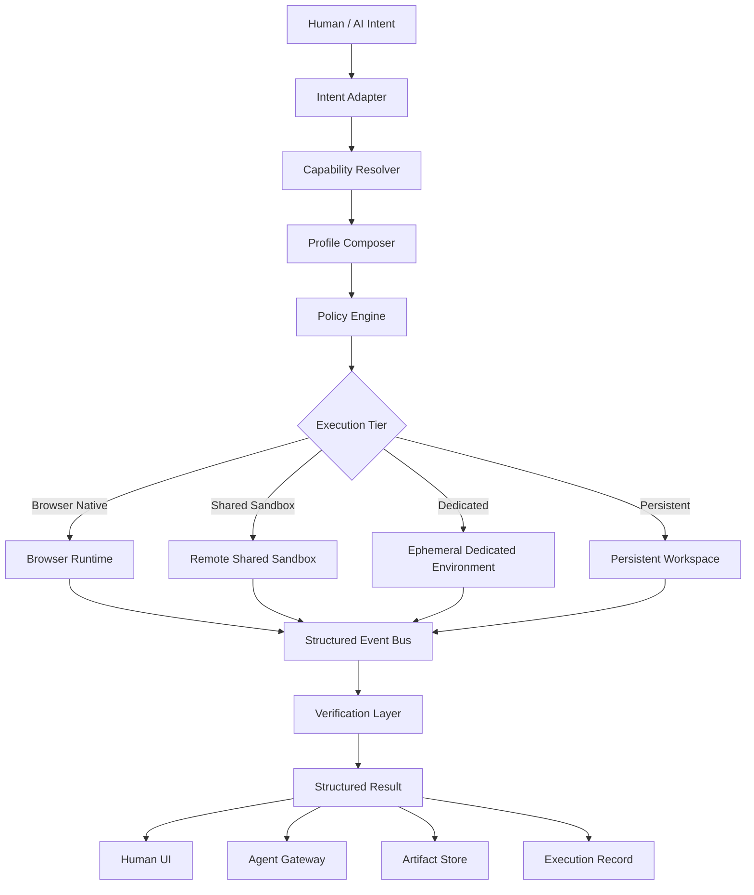
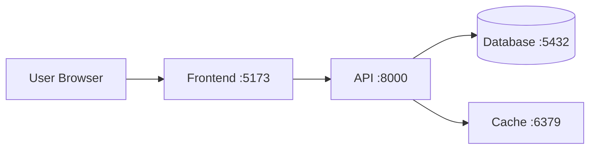

# 通用隨選工具鏈壓縮與執行基底技術白皮書

## 面向人類與 AI Agent 的低摩擦全端工作環境、標準能力層與可驗證執行協議

**英文名稱建議：** Universal On-Demand Toolchain Compression and Execution Substrate  
**縮寫建議：** UOTCES  
**文件版本：** v0.1  
**文件狀態：** 技術白皮書／架構母稿  
**作者：** Neo.K／EVEMISSLAB  
**日期：** 2026-07-19  
**授權建議：** 程式碼 Apache-2.0；規格與文件 CC BY 4.0

---

# 摘要

現代軟體與 AI Agent 的核心瓶頸，已逐漸不再只是「缺少工具」，而是工具數量過多、介面異質、依賴複雜、環境狀態不透明、執行結果難以驗證，導致人類與 AI 在真正開始任務前，必須花費大量時間與推理資源進行安裝、探索、配置、試錯與恢復。

傳統解法通常是讓人類先完成環境配置，再交由 AI 操作；或讓 AI 模擬人類，透過 CLI、GUI、滑鼠、鍵盤與終端輸出猜測工具狀態。然而，這類方法只是把摩擦自動化，並未消除摩擦本身。

本白皮書提出一個新的基礎設施方向：

> 建立一個面向人類與 AI Agent 的通用隨選工具鏈壓縮與執行基底，將分散、異質、需要配置的工具、Runtime、服務、資料庫、工作區與安全政策，封裝成可預測、可組合、可驗證、可重現的標準能力。

本系統不是單純的線上終端、雲端 IDE、容器平台或 AI Agent 框架，而是一個位於「意圖」與「實際工具鏈」之間的共同執行層。

其基本轉換為：

```text
人類／AI 意圖
    ↓
標準化能力請求
    ↓
環境與工具鏈組裝
    ↓
受控執行
    ↓
結構化結果
    ↓
可驗證產物與可重現狀態
```

終端機只是人類可視化介面之一；MCP、REST、Tool Calling 與事件流則是 AI 介面。人類與 AI 操作的是同一工作區、同一執行狀態與同一驗證真相。

本白皮書定義平台的核心抽象、架構分層、能力協議、工作區模型、Runtime Profile、服務管理、安全政策、瀏覽器原生執行、遠端沙箱、Agent Gateway、可觀測性、可重現性、開源策略與分階段實作路線。EML 將作為第一個垂直 Runtime Adapter 與參考驗證案例，但平台本體不依賴任何單一語言或專案。

---

# 1. 問題背景

## 1.1 工具增加，摩擦也增加

當前軟體工作流通常包含：

- 編輯器；
- 終端機；
- 套件管理器；
- 語言 Runtime；
- 編譯器；
- 測試框架；
- 前端開發伺服器；
- 後端 API；
- 資料庫；
- 容器；
- 瀏覽器；
- 日誌；
- 部署工具；
- Git；
- CI；
- AI Agent；
- 各種專用 CLI 與 GUI。

工具越多，理論上的能力越強，但實際工作負擔也同步增加。

一次任務的總成本可表示為：

$$
C_{\text{total}}
=
C_{\text{intent}}
+
C_{\text{environment}}
+
C_{\text{tool}}
+
C_{\text{orchestration}}
+
C_{\text{recovery}}
+
C_{\text{verification}}
$$

其中：

- $C_{\text{intent}}$ ：理解任務意圖；
- $C_{\text{environment}}$ ：辨識與建立環境；
- $C_{\text{tool}}$ ：理解工具介面；
- $C_{\text{orchestration}}$ ：安排工具順序與資料流；
- $C_{\text{recovery}}$ ：處理失敗與恢復；
- $C_{\text{verification}}$ ：確認輸出是否真實正確。

現有 AI 系統主要降低：

$$
C_{\text{intent}}
$$

但真正大量消耗 Token、時間與執行資源的，通常是：

$$
C_{\text{environment}}
+
C_{\text{tool}}
+
C_{\text{orchestration}}
+
C_{\text{recovery}}
+
C_{\text{verification}}
$$

本平台的核心目標，就是壓縮後面五項。

---

## 1.2 「直接讓 AI 操作工具」並未解決問題

表面上，AI Agent 已能：

- 操作終端；
- 點擊 GUI；
- 執行程式；
- 編輯檔案；
- 啟動服務；
- 呼叫 API。

但 AI 在每個新環境中仍需先探索：

```bash
pwd
ls
find .
which python
python --version
node --version
cat package.json
cat requirements.txt
docker ps
git status
```

這些操作不是使用者真正的任務，而是 AI 用來建立環境認知的成本。

即使 AI 能完成這些步驟，也仍存在：

- 作業系統差異；
- PATH 差異；
- 套件版本衝突；
- Port 衝突；
- 權限問題；
- 不同 CLI 的參數差異；
- 不透明的程序生命週期；
- 只回傳文字、不回傳狀態；
- 執行結果不可重現；
- 錯誤恢復依賴臨場猜測。

因此：

> AI 能操作工具，不代表 AI 應該每次都從零探索、配置與維護工具鏈。

---

## 1.3 目前工具主要為人類而設計

多數工具仍以以下介面為主：

```text
GUI
CLI
快捷鍵
視窗
文字日誌
人類語意錯誤訊息
```

AI 若要使用，只能：

- 模擬人類操作；
- 解析終端文字；
- 猜測程序狀態；
- 對錯誤輸出重新推理；
- 依賴臨時腳本包裝。

這是一種不穩定的「介面借用」。

理想工具應同時具有：

$$
\text{Tool}
=
\text{Human Projection}
+
\text{Machine Interface}
+
\text{Execution Truth}
$$

也就是：

- 人類有 GUI、終端與編輯器；
- AI 有結構化 API、能力描述與事件；
- 兩者共用同一執行核心與狀態真相。

---

# 2. 核心定位

## 2.1 產品定義

本平台定義為：

> 一個將異質工具、Runtime、服務、工作區與安全政策封裝為標準化能力的通用執行基底，使人類與 AI 不必反覆安裝、辨識、配置、調用與恢復工具鏈。

更精確地說，它是一個：

- 工具鏈壓縮層；
- 隨選環境組裝器；
- 結構化執行協議；
- 人類—AI 共用工作區；
- 可驗證與可重現的計算基底。

---

## 2.2 不只是終端機

終端機只是介面之一：

$$
\text{Terminal}
\subset
\text{Interfaces}
\subset
\text{Execution Substrate}
$$

平台本體不應被「終端」綁定。

人類介面可包括：

- 終端機；
- 程式碼編輯器；
- 檔案瀏覽器；
- GUI；
- 一鍵執行；
- 流程圖；
- 自然語言；
- 預覽視窗；
- Debug 面板。

AI 介面可包括：

- MCP；
- REST；
- Tool Calling；
- WebSocket；
- Structured Event Stream；
- Runtime Protocol；
- Capability Graph。

---

## 2.3 不只是雲端 IDE

雲端 IDE 的核心通常是：

```text
遠端機器
＋ 編輯器
＋ Shell
```

本平台的核心則是：

```text
標準能力
＋ 可組合 Runtime
＋ 結構化狀態
＋ 政策治理
＋ 可驗證輸出
＋ 人類／AI 共用介面
```

兩者差異在於：

| 項目 | 傳統雲端 IDE | 本平台 |
|---|---|---|
| 核心單位 | VM／Container | Capability／Profile／Workspace |
| 主要介面 | 編輯器＋Shell | Human UI＋Machine API |
| 狀態回傳 | 文字為主 | 結構化結果 |
| 工具鏈 | 使用者自行配置 | 平台組裝 |
| Agent 使用 | 模擬操作 | 原生能力調用 |
| 執行真相 | 程序輸出 | 狀態＋產物＋驗證 |
| 可重現性 | 依設定而定 | Snapshot＋Lock＋Execution Record |
| 成本模型 | 常駐環境 | Browser-first＋按需沙箱 |

---

# 3. 理論模型：工具調用熵與工具鏈壓縮

## 3.1 工具調用熵

假設系統存在 $n$ 個工具，每個工具有 $m_i$ 個主要操作，則直接暴露所有工具時，AI 或人類需要掌握的介面複雜度可近似表示為：

$$
K_{\text{raw}}
=
\sum_{i=1}^{n} m_i
$$

若工具之間還存在相依與轉換規則，則實際複雜度會進一步增長：

$$
K_{\text{chain}}
=
\sum_{i=1}^{n} m_i
+
\sum_{i \neq j} d_{ij}
$$

其中 $d_{ij}$ 表示工具 $i$ 與工具 $j$ 間的轉換、資料格式與順序成本。

本平台引入有限的標準能力層後：

$$
K_{\text{normalized}}
=
m_W + m_R + m_S + m_A + m_P + m_G
$$

其中：

- $m_W$ ：Workspace 操作；
- $m_R$ ：Runtime 操作；
- $m_S$ ：Service 操作；
- $m_A$ ：Artifact 操作；
- $m_P$ ：Policy 操作；
- $m_G$ ：Agent Gateway 操作。

只要底層新工具可映射到既有能力，平台複雜度就不需隨工具數量線性成長。

---

## 3.2 工具鏈壓縮

傳統流程：

$$
I
\rightarrow
T_1
\rightarrow
T_2
\rightarrow
\cdots
\rightarrow
T_n
\rightarrow
R
$$

總成本：

$$
C_{\text{chain}}
=
\sum_{i=1}^{n} C(T_i)
+
\sum_{i=1}^{n-1} C(T_i \rightarrow T_{i+1})
$$

平台化流程：

$$
I
\rightarrow
U
\rightarrow
\{T_1,T_2,\ldots,T_n\}
\rightarrow
U
\rightarrow
R
$$

其中 $U$ 是統一能力層。

理想情況下：

$$
C_{\text{platform}}
<
C_{\text{chain}}
$$

且工具越多、工作流越複雜，壓縮收益越明顯。

---

# 4. 核心抽象

整個平台可表示為：

$$
\mathcal{E}
=
\mathcal{W}
+
\mathcal{R}
+
\mathcal{S}
+
\mathcal{I}
+
\mathcal{P}
+
\mathcal{G}
+
\mathcal{V}
$$

其中：

- $\mathcal{W}$ ：Workspace，工作區；
- $\mathcal{R}$ ：Runtime，執行環境；
- $\mathcal{S}$ ：Services，服務；
- $\mathcal{I}$ ：Interfaces，介面；
- $\mathcal{P}$ ：Policy，政策；
- $\mathcal{G}$ ：Agent Gateway；
- $\mathcal{V}$ ：Verification，驗證層。

使用者或 Agent 所需環境為：

$$
E_{\text{request}}
=
\operatorname{Compose}
(W,R,S,I,P,G,V)
$$

---

## 4.1 Capability

Capability 描述「能完成什麼」，而不是「要輸入哪一條命令」。

例如：

```text
workspace.read
workspace.write
code.execute
project.build
test.run
service.start
service.stop
service.inspect
database.query
artifact.export
browser.inspect
eml.transpile
```

每個 Capability 必須定義：

- 唯一名稱；
- 輸入 Schema；
- 輸出 Schema；
- 所需權限；
- 資源限制；
- 是否可取消；
- 是否產生 Artifact；
- 是否可重試；
- 是否具副作用；
- 是否需要人類確認。

範例：

```json
{
  "name": "service.start",
  "version": "1.0",
  "input": {
    "profile": "fastapi",
    "entry": "main:app",
    "port": 8000
  },
  "policy": {
    "network": "egress-deny",
    "filesystem": "workspace-write",
    "maxRuntimeSeconds": 3600
  }
}
```

---

## 4.2 Runtime Profile

Profile 封裝完成一類任務所需的工具鏈。

範例：

```yaml
id: fastapi-postgres
name: FastAPI + PostgreSQL
version: 1

runtimes:
  python: "3.13"
  postgres: "17"

packages:
  python:
    - fastapi
    - uvicorn
    - psycopg

services:
  api:
    command: ["uvicorn", "main:app", "--host", "0.0.0.0", "--port", "8000"]
    port: 8000
    health:
      type: http
      path: /health

  database:
    type: postgres
    port: 5432

capabilities:
  - workspace.read
  - workspace.write
  - code.execute
  - test.run
  - service.start
  - database.query
```

Profile 不是完整 VM 映像的同義詞。它是：

- Runtime 描述；
- 依賴；
- 服務圖；
- 能力集合；
- 安全政策；
- 啟動與驗證規則。

---

## 4.3 Workspace

Workspace 是人類與 AI 共用的狀態空間。

應包含：

```text
檔案
目錄
Runtime Metadata
環境變數
服務狀態
資料庫狀態
執行記錄
測試結果
Artifacts
Snapshots
權限
Agent 操作歷史
```

建議目錄模型：

```text
/project
  /frontend
  /backend
  /database
  /tests
  /docs

/.substrate
  profile.yaml
  policy.yaml
  runtime.lock
  services.json
  execution/
  artifacts/
  snapshots/
```

---

## 4.4 Policy

Policy 用於限制與授權：

- 網路；
- 檔案；
- Shell；
- 套件安裝；
- CPU；
- 記憶體；
- 執行時間；
- Port；
- 外部憑證；
- 雲端資源；
- 破壞性操作；
- 人類確認；
- Agent 自主權限。

範例：

```yaml
network:
  inbound: preview-only
  outbound: deny
filesystem:
  read:
    - /project
  write:
    - /project
    - /.substrate/artifacts
shell:
  arbitrary: false
packages:
  install: allow-listed
limits:
  cpu: 1
  memory: 512MiB
  timeout: 30s
confirmation:
  required:
    - external.send
    - deployment.publish
    - database.drop
```

---

## 4.5 Structured Result

每次操作都必須回傳結構化結果，而不只是文字。

```ts
interface ExecutionResult {
  requestId: string;
  capability: string;
  status:
    | "queued"
    | "running"
    | "succeeded"
    | "failed"
    | "cancelled"
    | "timed_out";

  exitCode?: number;
  stdout?: string;
  stderr?: string;

  diagnostics?: Diagnostic[];
  artifacts?: ArtifactRef[];
  services?: ServiceState[];
  resourceUsage?: ResourceUsage;
  verification?: VerificationResult;
  suggestedActions?: SuggestedAction[];

  startedAt?: string;
  finishedAt?: string;
}
```

這讓同一結果可被：

- 終端顯示；
- GUI 顯示；
- AI 解析；
- 自動測試；
- 稽核系統；
- 重新執行；
- 產生報告。

---

# 5. 系統架構



---

# 6. 四層執行模型

## 6.1 第一層：Browser Native

用於：

- JavaScript／TypeScript；
- WebAssembly；
- Python-WASM；
- SQLite-WASM；
- EML；
- 小型編譯器；
- Parser；
- 靜態分析；
- 小型測試；
- 檔案處理；
- ZIP；
- 圖形化工具。

優點：

- 零伺服器執行成本；
- 快速啟動；
- 隱私較高；
- 可離線；
- 適合匿名使用。

限制：

- 無完整 OS；
- 無任意 native binary；
- 記憶體受限；
- 不適合重型多程序；
- 受瀏覽器安全模型限制。

---

## 6.2 第二層：Shared Remote Sandbox

用於：

- 原生 Python；
- Node.js 後端；
- C／C++；
- Rust；
- Go；
- 測試；
- 短期服務；
- 受限資料庫；
- 小型專案建置。

特性：

- 多租戶；
- 短生命週期；
- 嚴格資源限制；
- 預設無網路；
- 任務完成即銷毀；
- 無跨使用者狀態。

---

## 6.3 第三層：Dedicated Ephemeral Environment

用於：

- 多服務專案；
- Docker Compose；
- 原生依賴；
- 複雜資料庫；
- 大型建置；
- 整合測試；
- 臨時預覽部署。

特性：

- 每工作區獨立；
- 可持續數十分鐘至數小時；
- 有完整服務圖；
- 可生成預覽網址；
- 任務後銷毀。

---

## 6.4 第四層：Persistent Workspace

用於：

- 登入使用者；
- 團隊專案；
- 長期 Agent；
- GitHub 同步；
- 雲端硬碟掛載；
- 長期資料庫；
- 自訂網域；
- CI／CD；
- 持續研究工作。

必須具有：

- 磁碟配額；
- Snapshot；
- 成本治理；
- 權限；
- 備份；
- Workspace 休眠；
- Agent 身分；
- 稽核。

---

# 7. 執行層選擇

平台不應讓使用者手動理解所有執行層。

可由 Resolver 自動選擇：

$$
T^*
=
\arg\min_T
\left(
C_T + L_T + R_T
\right)
$$

其中：

- $C_T$ ：成本；
- $L_T$ ：延遲；
- $R_T$ ：風險。

同時滿足：

$$
\operatorname{Capability}(T)
\supseteq
\operatorname{Requirement}(J)
$$

其中 $J$ 是任務。

範例：

```text
格式化 JSON
→ Browser Native

執行 Python + numpy
→ Browser Python-WASM

編譯 C++
→ Shared Sandbox

啟動 React + FastAPI + PostgreSQL
→ Dedicated Ephemeral

維護長期專案
→ Persistent Workspace
```

---

# 8. 人類介面

## 8.1 終端機

終端機仍然重要，但應是結構化執行系統的投影。

人類可以輸入：

```bash
profile use fastapi-postgres
workspace open demo
service start api
test run
artifact export
```

平台內部轉成 Capability Request。

不應直接把所有輸入無條件送入 shell。

---

## 8.2 GUI

GUI 可提供：

- 工作區；
- 檔案；
- Runtime；
- 服務；
- 資料庫；
- 預覽；
- 測試；
- Artifact；
- Policy；
- Agent 操作記錄；
- 資源使用量；
- Snapshot。

---

## 8.3 自然語言

使用者可輸入：

> 建立一個 React 前端、FastAPI 後端與 SQLite 資料庫，加入登入、測試與預覽。

系統不直接生成任意命令，而應產生：

```yaml
profile:
  frontend: react-vite
  backend: fastapi
  database: sqlite

capabilities:
  - project.scaffold
  - service.start
  - test.run
  - preview.open

policy:
  network:
    outbound: package-registry-only
```

然後再執行。

---

# 9. Agent Gateway

## 9.1 Agent 不應只看到終端

Agent 應取得：

```json
{
  "workspace": "ws_01",
  "profile": "fastapi-postgres",
  "runtimes": {
    "python": "3.13",
    "postgres": "17"
  },
  "services": [
    {
      "id": "api",
      "status": "healthy",
      "port": 8000
    }
  ],
  "capabilities": [
    "workspace.read",
    "workspace.write",
    "test.run",
    "service.restart",
    "artifact.export"
  ]
}
```

而不是每次先執行十幾條探索命令。

---

## 9.2 建議 Agent 工具

```text
workspace.describe
workspace.list
workspace.read
workspace.write
workspace.patch
workspace.snapshot
workspace.restore

runtime.describe
runtime.execute
runtime.install_package

service.list
service.start
service.stop
service.restart
service.logs
service.health

test.discover
test.run

database.describe
database.query
database.migrate

artifact.list
artifact.read
artifact.export

policy.describe
policy.request_escalation

execution.cancel
execution.retry
execution.explain
```

---

## 9.3 Agent 權限

建議權限層級：

```text
A0 — Read only
A1 — Workspace edit
A2 — Browser execution
A3 — Sandboxed execution
A4 — Service management
A5 — External network
A6 — Publish / deploy
A7 — Destructive administration
```

高風險能力必須：

- 明確授權；
- 有時間限制；
- 有作用域；
- 有審計；
- 可撤銷；
- 可要求人類確認。

---

# 10. 通用執行協議

## 10.1 Capability Request

```json
{
  "schema": "substrate-request-v1",
  "requestId": "req_01",
  "workspaceId": "ws_01",
  "capability": "test.run",
  "input": {
    "scope": "all",
    "framework": "auto"
  },
  "constraints": {
    "timeoutMs": 120000,
    "maxMemoryMb": 1024
  },
  "caller": {
    "type": "agent",
    "id": "agent_01"
  }
}
```

---

## 10.2 Event Stream

```json
{
  "schema": "substrate-event-v1",
  "requestId": "req_01",
  "seq": 12,
  "type": "execution.stdout",
  "timestamp": "2026-07-19T12:00:00+08:00",
  "data": {
    "text": "42 tests passed\n"
  }
}
```

事件類型：

```text
execution.queued
execution.started
execution.stdout
execution.stderr
execution.progress
execution.diagnostic
execution.artifact
execution.service
execution.verification
execution.completed
execution.failed
execution.cancelled
```

---

## 10.3 結果

```json
{
  "schema": "substrate-result-v1",
  "requestId": "req_01",
  "status": "succeeded",
  "exitCode": 0,
  "summary": "42 tests passed",
  "artifacts": [
    {
      "id": "artifact_01",
      "name": "test-report.xml",
      "mediaType": "application/xml"
    }
  ],
  "verification": {
    "passed": true,
    "checks": [
      {
        "name": "exit-code",
        "ok": true
      },
      {
        "name": "test-suite",
        "ok": true
      }
    ]
  }
}
```

---

# 11. Service Graph

全端環境通常不是單一程序，而是服務圖：



Service 定義：

```yaml
services:
  frontend:
    runtime: node
    command: ["pnpm", "dev", "--host", "0.0.0.0"]
    port: 5173
    dependsOn:
      - api

  api:
    runtime: python
    command: ["uvicorn", "main:app", "--host", "0.0.0.0", "--port", "8000"]
    port: 8000
    dependsOn:
      - db

  db:
    runtime: postgres
    port: 5432
```

平台應負責：

- 啟動順序；
- Port 分配；
- DNS；
- 健康檢查；
- 日誌；
- Restart；
- Shutdown；
- Preview URL；
- Service dependency。

---

# 12. Workspace Snapshot 與可重現性

## 12.1 一次成功不應只是臨時狀態

執行成功後，應可固化為：

```text
原始碼
Runtime Profile
Dependency Lock
Service Graph
Policy
Environment Metadata
Execution Record
Artifacts
Database Seed
Snapshot
```

---

## 12.2 Snapshot Schema

```json
{
  "schema": "substrate-snapshot-v1",
  "id": "snap_01",
  "workspaceId": "ws_01",
  "createdAt": "2026-07-19T12:00:00+08:00",
  "profile": "fastapi-postgres@1",
  "filesDigest": "sha256:...",
  "runtimeLock": {
    "python": "3.13.4",
    "postgres": "17.5"
  },
  "services": {
    "api": {
      "status": "stopped"
    }
  },
  "artifacts": [
    "artifact_01"
  ]
}
```

---

## 12.3 重現性條件

令一次執行為：

$$
X = (W,R,S,P,I)
$$

若另一執行：

$$
X' = (W',R',S',P',I')
$$

且：

$$
W'=W,\quad R'=R,\quad S'=S,\quad P'=P,\quad I'=I
$$

則理想輸出應滿足：

$$
O(X') \equiv O(X)
$$

若不一致，平台必須記錄環境差異，而不是只顯示「執行失敗」。

---

# 13. Artifact 系統

Artifact 包含：

- 編譯產物；
- 測試報告；
- Trace；
- 日誌；
- ZIP；
- 圖片；
- 模型；
- 資料集；
- Coverage；
- 部署包；
- 預覽快照；
- 最小重現包。

```ts
interface ArtifactRef {
  id: string;
  name: string;
  mediaType: string;
  size: number;
  digest: string;
  createdBy: string;
  expiresAt?: string;
  downloadUrl?: string;
}
```

Artifact 應：

- 可追蹤來源；
- 可下載；
- 可設定 TTL；
- 可簽章；
- 可比對雜湊；
- 可由人類與 AI 使用。

---

# 14. 儲存與雲端硬碟策略

## 14.1 儲存分工

### GitHub

存放：

- 原始碼；
- 規格；
- Profile；
- Adapter；
- Issue；
- 發布版本。

### R2／S3／物件儲存

存放：

- Runtime Bundle；
- Package Cache；
- Base Image；
- Artifact；
- Snapshot；
- Dataset；
- 離線包；
- 大型模型；
- Build Cache。

### Google Drive 等雲端硬碟

適合：

- 人工分享；
- 備份；
- 大型離線下載；
- 歷史版本；
- 使用者匯入資料；
- 個人工作區外部鏡像。

不適合直接作為：

- Runtime CDN；
- 即時執行資料庫；
- 高頻 API；
- 容器映像 Registry；
- 需要穩定 CORS 的核心模組來源。

---

## 14.2 使用者雲端硬碟掛載

未來可讓使用者將雲端硬碟資料夾掛載為：

```text
/input
/archive
/datasets
/models
/exports
```

但不應直接暴露整個雲端硬碟。應採：

- 明確資料夾作用域；
- 唯讀／可寫分離；
- 暫時 Token；
- 操作記錄；
- 大檔串流；
- 雜湊；
- 防止 Agent 任意掃描全部私人資料。

---

# 15. 安全模型

## 15.1 威脅

- 無限迴圈；
- 記憶體耗盡；
- 巨量輸出；
- Fork bomb；
- 挖礦；
- 網路掃描；
- 惡意套件；
- 供應鏈攻擊；
- 路徑穿越；
- ZIP Slip；
- 容器逃逸；
- Workspace 越權；
- Agent 誤操作；
- 憑證洩漏；
- 資料外傳；
- Prompt injection 導致工具濫用；
- 高成本資源濫用。

---

## 15.2 Browser 層

- Worker 隔離；
- timeout；
- maxSteps；
- Output 限制；
- 記憶體監控；
- CSP；
- 不注入敏感憑證；
- 預設無外網；
- Runtime 固定版本；
- 資產雜湊；
- 可強制終止 Worker。

---

## 15.3 Remote Sandbox

- rootless；
- read-only root filesystem；
- seccomp；
- AppArmor；
- cgroup；
- no-new-privileges；
- egress deny；
- 非 root 使用者；
- 一次性工作區；
- 任務後銷毀；
- 容器或 microVM 隔離；
- Rate limit；
- Queue；
- Artifact 掃描；
- Image 簽章；
- 供應鏈清單。

---

## 15.4 人類確認

應要求確認的操作：

- 對外寄送；
- 發布部署；
- 刪除資料；
- 修改正式資料庫；
- 使用付費雲端資源；
- 開啟外部網路；
- 上傳私人檔案；
- 更改權限；
- 建立長期服務；
- Agent 安裝未知套件。

---

# 16. 驗證層

## 16.1 驗證不等於 Exit Code

執行成功不代表任務完成。

例如：

```text
exitCode = 0
```

只能表示程序正常結束，不能證明：

- 網站可用；
- API 正確；
- 測試完整；
- 輸出符合需求；
- 資料庫一致；
- Artifact 可重現。

因此需要 Verification Layer。

---

## 16.2 驗證類型

```text
syntax
typecheck
build
unit-test
integration-test
health-check
snapshot
output-equivalence
schema-validation
artifact-digest
security-policy
runtime-consistency
```

---

## 16.3 驗證結果

```json
{
  "passed": false,
  "checks": [
    {
      "name": "build",
      "ok": true
    },
    {
      "name": "health-check",
      "ok": false,
      "message": "GET /health returned 500"
    }
  ]
}
```

---

# 17. 可觀測性

平台應記錄：

- Capability；
- 執行層；
- 啟動時間；
- 結束時間；
- CPU；
- 記憶體；
- 輸出大小；
- Cache hit；
- Artifact；
- 失敗類型；
- 重試；
- Agent 操作；
- 人類確認；
- 服務狀態；
- Runtime 版本。

核心指標：

```text
Time to First Useful Action
Time to First Run
Environment Resolution Time
Capability Success Rate
Recovery Success Rate
Agent Exploration Reduction
Browser Execution Ratio
Remote Escalation Ratio
Snapshot Reproduction Rate
Verification Pass Rate
Cost per Successful Task
```

---

## 17.1 AI 探索成本下降

可定義：

$$
R_{\text{explore}}
=
\frac{N_{\text{environment-probing commands}}}
{N_{\text{all commands}}}
$$

平台目標是使：

$$
R_{\text{explore}} \to 0
$$

因為 Agent 應直接取得環境描述，不必反覆執行 `pwd`、`which`、`--version`。

---

# 18. Adapter 架構

平台本體不直接理解所有語言與工具，而透過 Adapter。

```ts
interface RuntimeAdapter {
  id: string;
  version: string;

  detect(workspace: Workspace): Promise<DetectionResult>;
  describe(): RuntimeDescriptor;
  prepare(context: RuntimeContext): Promise<PrepareResult>;
  execute(request: ExecuteRequest): Promise<ExecutionHandle>;
  verify(result: ExecutionResult): Promise<VerificationResult>;
  cleanup(context: RuntimeContext): Promise<void>;
}
```

Adapter 類型：

```text
Language Adapter
Framework Adapter
Database Adapter
Build Adapter
Browser Adapter
AI Tool Adapter
Deployment Adapter
```

---

# 19. EML 作為第一個參考 Adapter

EML 不再是平台本體，而是第一個完整參考案例。

```yaml
id: eml-python
name: EML + Python
version: 1

browser:
  packages:
    - eml-parser
    - eml-transpiler-python
    - eml-transpiler-eml
    - eml-interpreter
    - eml-trace

wasm:
  python: pyodide

remote:
  runtimes:
    node: "20+"
    python: "3.10+"

capabilities:
  - eml.parse
  - eml.transpile
  - eml.compress
  - eml.run
  - eml.trace
  - eml.roundtrip
  - test.run
```

EML 適合作為第一個 Adapter，因為它同時具備：

- Parser；
- AST；
- 雙向轉譯；
- Interpreter；
- Trace；
- Round-trip；
- Browser-safe Runtime；
- CLI；
- MCP；
- 案例庫；
- Python 對照執行。

因此它能驗證平台是否真正做到：

- 人類介面；
- AI 介面；
- Browser execution；
- Remote execution；
- Structured result；
- Verification；
- Artifact；
- Snapshot。

---

# 20. 開源與商業定位

## 20.1 開源核心

建議開源：

- Protocol；
- Capability Schema；
- Runtime Profile Spec；
- Adapter SDK；
- Browser Runtime；
- 本地單機 Runner；
- 基本 Web UI；
- EML Adapter；
- 範例 Profiles。

---

## 20.2 可商業化層

可商業化：

- Managed Sandbox；
- Persistent Workspace；
- 團隊協作；
- 大型 Artifact Storage；
- 高資源 Runner；
- GPU；
- 私有 Profile Registry；
- 企業 Policy；
- SSO；
- 稽核；
- 私有部署；
- 高可用；
- 成本治理；
- Agent 長期執行。

---

## 20.3 避免平台鎖定

所有 Workspace、Snapshot、Profile、Artifact Manifest 與 Execution Record 應可匯出。

平台不能只提供：

```text
在本平台可用
```

而應提供：

```text
可下載
可本地執行
可遷移
可驗證
可重現
```

---

# 21. 開發階段

## Phase 0：協議與 EML 驗證

- 定義 Capability Request；
- 定義 Event；
- 定義 Result；
- 定義 Workspace；
- 定義 Profile；
- 將 EML `/app` 與案例接入；
- 結構化輸出；
- 匯出 ZIP。

驗收：

```text
人類可執行
Agent 可調用
結果共用同一 Schema
```

---

## Phase 1：Browser Execution Substrate

- 虛擬檔案系統；
- Worker；
- IndexedDB／OPFS；
- 終端介面；
- GUI；
- Python-WASM；
- SQLite-WASM；
- Artifact；
- Snapshot。

---

## Phase 2：Shared Sandbox

- Remote Runner；
- Queue；
- Rootless container；
- Python；
- Node；
- C／C++；
- Rust；
- Go；
- Rate limit；
- Artifact Store；
- 結果簽章。

---

## Phase 3：Full-stack Service Graph

- Frontend preview；
- Backend port；
- Database；
- Service dependency；
- Health check；
- Log stream；
- Preview URL；
- 多服務 Profile。

---

## Phase 4：Agent Gateway

- MCP；
- Tool Calling；
- Workspace patch；
- Service management；
- Policy escalation；
- Human confirmation；
- Agent audit；
- 自動恢復；
- 失敗分類。

---

## Phase 5：Persistent Workspace

- 登入；
- GitHub；
- 雲端硬碟；
- 長期磁碟；
- Snapshot；
- Team；
- Role；
- Cost control；
- Workspace sleep。

---

## Phase 6：Intent-native Composition

- 自然語言生成 Profile；
- Capability Planner；
- Service Graph Composer；
- Policy inference；
- Runtime resolver；
- 模板市場；
- Adapter Registry；
- 自動驗證；
- 一鍵重現。

---

# 22. MVP 建議

最小可行版本不應一開始做完整 Codespaces。

MVP 應包含：

```text
Web UI
Virtual Workspace
Structured Terminal
Capability Protocol
EML Adapter
JavaScript Runtime
Python-WASM
Artifact Export
Snapshot
MCP Gateway
```

MVP 核心場景：

1. 開啟一個案例；
2. 自動載入 Profile；
3. 人類或 AI 修改檔案；
4. 執行；
5. 取得結構化結果；
6. 驗證；
7. 匯出工作區；
8. 不需本地安裝。

---

# 23. 建議目錄結構

```text
apps/
  web/
  api-gateway/
  runner/

packages/
  protocol/
  capability-registry/
  profile-schema/
  workspace/
  vfs/
  event-bus/
  policy-engine/
  verification/
  artifact-client/
  agent-gateway/
  terminal-ui/
  editor-ui/

adapters/
  eml/
  javascript/
  python/
  node/
  cpp/
  rust/
  postgres/
  sqlite/
  browser/

profiles/
  eml-python/
  react-node/
  fastapi-postgres/
  rust-cli/

infra/
  cloudflare/
  runner/
  sandbox/
  storage/
```

---

# 24. 核心決策摘要

| 問題 | 決策 |
|---|---|
| 平台本體是否是終端機 | 否，終端只是介面 |
| 是否只是雲端 IDE | 否 |
| 是否只服務人類 | 否，人類與 AI 共用 |
| 是否讓 AI 直接操作所有 CLI | 僅作 fallback |
| 核心抽象 | Capability、Profile、Workspace、Policy、Result |
| 是否 Browser-first | 是 |
| 是否需要遠端沙箱 | 是，按需 |
| 是否允許匿名任意 Shell | 預設否 |
| 是否支援全端服務 | 是 |
| 是否支援資料庫 | 是 |
| 是否支援 Agent | 原生支援 |
| 是否可重現 | 必須 |
| 是否可匯出 | 必須 |
| EML 的角色 | 第一個參考 Adapter |
| 大型資產存放 | R2／S3 |
| Google Drive 角色 | 分享、備份、資料匯入 |
| 核心差異 | 消除工具摩擦，而非只自動化摩擦 |

---

# 25. 結論

本平台真正要解決的，不是「如何讓 AI 使用終端」，而是：

> 為什麼人類與 AI 每次都必須重新面對相同的安裝、探索、配置、工具差異、狀態猜測與錯誤恢復？

讓 AI 模擬人類操作，可以提升自動化程度，但仍然保留了原有工具鏈的全部摩擦。真正的下一步，是將工具重新封裝為同時適合人類與 AI 使用的公共計算能力。

本白皮書提出的通用隨選工具鏈壓縮與執行基底，將：

- 終端從本體降為介面；
- 將 CLI 命令提升為 Capability；
- 將環境配置固化為 Profile；
- 將工作狀態統一為 Workspace；
- 將權限固化為 Policy；
- 將文字輸出提升為 Structured Result；
- 將一次成功執行固化為 Snapshot 與 Artifact；
- 將 AI 從模擬操作提升為原生調用；
- 將本地、瀏覽器與雲端整合為分層執行基底。

最終目標不是讓 AI 更擅長忍受工具複雜度，而是讓工具環境本身不再要求人類或 AI 承擔不必要的複雜度。

其核心原則可以濃縮為：

> 不只是讓工具可被調用，而是讓能力可被理解、組合、限制、驗證與重現。

---

# 附錄 A：最小 Capability Schema

```json
{
  "$schema": "https://example.org/substrate/capability-v1.schema.json",
  "name": "code.execute",
  "version": "1.0",
  "description": "Execute code in a selected runtime.",
  "inputSchema": {
    "type": "object",
    "required": ["runtime", "entry"],
    "properties": {
      "runtime": {
        "type": "string"
      },
      "entry": {
        "type": "string"
      },
      "args": {
        "type": "array",
        "items": {
          "type": "string"
        }
      }
    }
  },
  "sideEffects": "workspace",
  "cancelable": true,
  "requiresConfirmation": false
}
```

---

# 附錄 B：最小 Profile

```yaml
schema: substrate-profile-v1
id: python-basic
version: 1

runtimes:
  python: "3.13"

capabilities:
  - workspace.read
  - workspace.write
  - code.execute
  - test.run
  - artifact.export

execution:
  preferredTier: browser
  fallbackTier: shared-sandbox

policy:
  network:
    outbound: deny
  limits:
    timeout: 30s
    memory: 512MiB
```

---

# 附錄 C：最小人類會話

```text
Universal Execution Substrate v0.1

> profile use eml-python
Profile loaded.

> workspace open 001-summation
Workspace ready.

> eml run main.eml
338350

Verification:
- Browser interpreter: passed
- Python/WASM: passed
- Round-trip: passed

> artifact export workspace
Created workspace-001-summation.zip
```

---

# 附錄 D：最小 Agent 會話

```json
{
  "tool": "workspace.describe",
  "arguments": {}
}
```

```json
{
  "workspaceId": "ws_01",
  "profile": "eml-python",
  "entry": "main.eml",
  "capabilities": [
    "workspace.read",
    "workspace.write",
    "eml.run",
    "eml.trace",
    "eml.roundtrip"
  ]
}
```

Agent 不需先執行：

```bash
pwd
ls
node --version
python --version
```

因為環境狀態已由平台直接描述。

---

# 附錄 E：一句話定位

> 一個面向人類與 AI Agent 的隨選工具鏈壓縮與通用執行基底，將異質工具、Runtime、服務與工作區封裝為標準化能力，使任務可直接啟動、受控執行、結構化回傳、驗證與重現。
