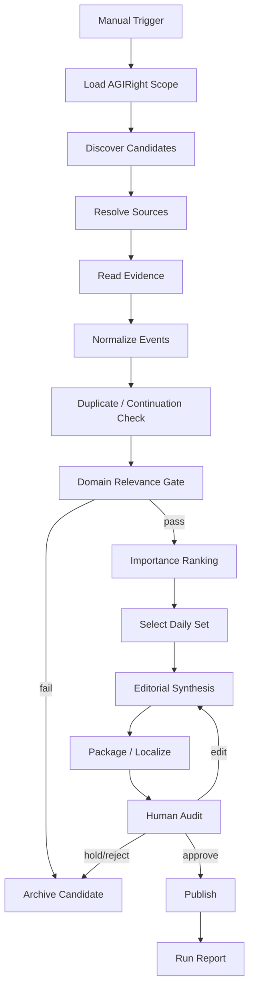

# AGIRight 半自動領域資訊工作流 v0.1

## 從「每日重複觸發」到可排程自治前的工程基線

## 摘要

本文件是《網路資訊海動態秩序化》系列進入技術階段後的第一份內部白皮書。其目的不是重新論證 AI 是否能整理網路資訊，而是把 AGIRight Topics 已經存在的半自動工作方式，拆成可重現、可測量、可移交、可逐步自動化的工程流程。

截至 2026-08-01，AGIRight Topics 公開頁面明確標示為「Hand-curated — no crawler yet」，亦即目前沒有自主爬蟲持續抓取整個來源集合；然而實際操作流程已不是傳統人工編輯。依現行工作方式，人類主要負責觸發每日任務、提供必要邊界、查看結果與處理明顯問題；AI 則承擔大量搜尋、來源閱讀、候選事件辨識、去重、重要性初判、摘要、分類、多語入口與頁面內容生成工作。故本文件將此狀態定義為「Human-triggered, AI-executed, Human-audited」的半自動領域資訊工作流。

其最小閉環可表示為：

$$
H_{trigger}
\rightarrow
A_{discover}
\rightarrow
A_{read}
\rightarrow
A_{cluster}
\rightarrow
A_{rank}
\rightarrow
A_{write}
\rightarrow
A_{package}
\rightarrow
H_{audit}
\rightarrow
P_{publish}
$$

其中，人類並不逐步代替 AI 執行，而是在入口與出口維持邊界控制；AI 則在中段完成高重複、低至中風險、可回查的資訊加工任務。

本文件同時定義三個必須分離的系統狀態：

1. **Current Baseline（現行基線）**：人工觸發、AI 執行、人工抽查，無常駐自主爬蟲；
2. **Automatable Boundary（可排程邊界）**：可以立即由 Scheduler、工作流狀態與失敗重試取代的人工作業；
3. **Deferred Autonomy（延後自治）**：需要更完整權限治理、歷史資料層、多 Agent 審查或較高風險控制後才適合自動化的部分。

白皮書進一步提出 Run Manifest、Candidate Record、Topic Record、Source Evidence、Review Decision 與 Run Report 六種最小資料物件，以及來源可解析率、溯源覆蓋率、重複率、人工介入率、修正率、發布回滾率與自主步驟比等監測指標。本文不虛構目前尚未量測的數值，而把它們定義為下一階段必須開始記錄的工程欄位。

本文件的目標是把 AGIRight 從「使用者知道怎麼每天叫 AI 做」轉換成「即使更換執行 AI、維護者或 Runtime，也能依明確規格重現同一類工作」。下一篇 EML-IIODO-WP-02 將在此基線之上進一步定義 Scheduler–Loop–Graph Runtime。

**關鍵詞：** AGIRight、半自動工作流、領域資訊整理、每日三則、Human-in-the-Loop、Scheduler、Graph、AI 編輯、來源溯源、工程基線

---

## 1. 文件目的與邊界

### 1.1 這不是產品宣傳文件

本文件描述的是內部運作模型，而非向外宣稱 AGIRight 已具備完整自主新聞系統。

尤其必須區分：

$$
\text{AI-assisted curation}
\neq
\text{autonomous crawler}
$$

公開 Topics 頁目前仍標示：

> Hand-curated — no crawler yet

因此，v0.1 不應寫成「系統會自己掃描整個網路」。目前較準確的工程描述是：人類啟動一次工作輪，AI 使用可取得的搜尋、瀏覽與生成工具完成主要資訊處理，再由人類進行基本抽查或要求修正。

### 1.2 本文件要回答的問題

本白皮書只回答六個問題：

1. 一次 AGIRight Topics 更新輪到底有哪些步驟？
2. 哪些步驟目前主要由 AI 完成？
3. 人類目前真正不可替代的介入點在哪裡？
4. 哪些錯誤容易自動檢查，哪些需要升級人工？
5. 為了未來排程化，現在應開始保存哪些狀態與產物？
6. 怎樣判定 v0.1 已經是一個可重現的工程流程，而不是操作習慣？

### 1.3 本文件刻意不處理的問題

以下內容延後至後續白皮書：

- Scheduler、Loop、Graph Runtime 的完整執行架構；
- 工作難度、風險與自主等級的通用分類；
- Domain Pack 的跨領域配置規格；
- 每日三則的正式差分與排序演算法；
- 母站—子站共用資料層；
- Temporal Knowledge Graph；
- 多 Agent 審查與長期自治。

因此，本文件的角色是：

$$
\boxed{
\text{現行行為}
\rightarrow
\text{顯式流程}
\rightarrow
\text{可記錄介面}
}
$$

而不是一次完成整個平台。

---

## 2. AGIRight Topics 的現行產品表面

從公開頁面可觀察到，Topics 已具備下列輸出元素：

- 日期；
- 一個或多個主題標籤；
- 來源名稱；
- 標題；
- 由站方重述的摘要；
- 原始來源連結；
- 搜尋；
- 多維篩選；
- 每頁筆數；
- JSON 匯出；
- 多語介面入口。

這代表即使後端尚未自動爬取，前端資料結構已經不只是文章頁，而接近一個小型結構化事件索引。

可以把一筆 Topics 條目抽象成：

$$
T_i
=
(
uid,
headline,
summary,
source,
url,
date,
tags,
language,
provenance
)
$$

真正需要固化的，不只是最後的 $T_i$ ，而是 $T_i$ 如何從候選來源形成。

---

## 3. 現行半自動模式的正式定義

本文件將 AGIRight v0.1 現況定義為：

> **Human-triggered, AI-executed, Human-audited domain information workflow.**

即：

$$
W_{current}
=
H_{trigger}
+
A_{execution}
+
H_{audit}
$$

其中：

### 3.1 Human-triggered

目前人類仍會重複性地發出「今天繼續完成」、「更新今日內容」或同等語意的啟動訊號。

這個動作在工程上不應被理解為內容生產，而應視為：

$$
H_{trigger}
\approx
\text{manual scheduler event}
$$

亦即，人類目前扮演的是排程器。

### 3.2 AI-executed

觸發後，AI 可以承擔主要認知與內容處理步驟，包括：

- 搜尋候選來源；
- 閱讀來源；
- 分辨是否為新事件；
- 排除明顯重複內容；
- 判斷是否與 AGIRight 主題相關；
- 產生摘要；
- 產生標題；
- 指派標籤；
- 生成多語入口內容；
- 準備網站所需資料格式；
- 在工具允許時直接更新檔案或網站。

### 3.3 Human-audited

人類主要關注：

- 是否有明顯錯誤；
- 今天的三則是否太重複；
- 是否選到不合領域邊界的事件；
- 是否有法律、政治、權利或高爭議表述需要校正；
- 網頁有沒有壞掉；
- 是否需要要求 AI 重做。

這種工作已經不是逐篇人工採訪與撰稿，而接近：

$$
\text{Human role}
=
\text{trigger}
+
\text{boundary setting}
+
\text{exception handling}
+
\text{spot audit}
$$

---

## 4. 一次更新輪的標準流程

v0.1 將一次更新輪定義為十二個狀態。

### S0｜Run Initialize

建立本輪執行識別碼：

$$
run\_id
=
\operatorname{UUID}()
$$

最低紀錄：

- `run_id`
- `domain_id = agiright`
- `requested_date`
- `trigger_type`
- `initiator`
- `model/runtime`
- `started_at`

目前 `trigger_type` 多數為 `manual`。

---

### S1｜Scope Load

載入本領域的基本範圍：

- AI rights；
- AI ontology；
- AI consciousness / moral status；
- AI governance；
- agent autonomy；
- content licensing；
- training data rights；
- machine-readable policy；
- human–AI relations；
- frontier progress 中與上述議題相關者。

這一步不是搜尋，而是確定：

$$
\Omega_{AGIRight}
$$

即本輪什麼算「可能相關」。

---

### S2｜Candidate Discovery

AI 透過搜尋或外部來源取得候選集合：

$$
C_t
=
\{c_1,c_2,\dots,c_n\}
$$

每一候選至少保留：

- URL；
- 來源名稱；
- 搜尋命中標題；
- 初始日期；
- 搜尋查詢或發現路徑；
- 初步主題；
- 發現時間。

本階段允許高召回，不需要太早追求只剩三則。

---

### S3｜Source Resolve

對候選來源進行解析：

$$
c_i
\rightarrow
s_i
$$

其中 $s_i$ 是可供後續判讀的來源內容。

解析失敗應記錄，而不是默默丟棄：

```text
SOURCE_OK
SOURCE_BLOCKED
SOURCE_NOT_FOUND
SOURCE_PAYWALL
SOURCE_PARSE_ERROR
SOURCE_UNSTABLE
```

這一步很重要，因為未來若自動排程，來源失敗率本身就是健康指標。

---

### S4｜Evidence Read

AI 讀取來源，抽取至少以下事實欄位：

- 發生了什麼；
- 誰是行動主體；
- 事件發生日期；
- 來源發布日期；
- 關鍵數字；
- 原始說法與媒體／機構二手解釋的區別；
- 是否存在不確定性；
- 是否有原始文件可以回查。

若事件是法律、學術或政策類內容，優先尋找：

$$
\text{primary source}
>
\text{institutional source}
>
\text{reputable secondary source}
>
\text{commentary}
$$

此處的「>」表示作為事實基線時的優先次序，而不是絕對可信度排序。

---

### S5｜Event Normalize

將多篇來源正規化為事件候選：

$$
\{s_1,s_2,\dots\}
\rightarrow
E_j
$$

最低正規化欄位：

- `event_id`
- `event_date`
- `entities[]`
- `claims[]`
- `source_refs[]`
- `topic_candidates[]`
- `novelty_hint`

此步驟處理「多篇文章其實是同一件事」。

---

### S6｜Duplicate / Continuation Check

將事件與既有 Topics 比較：

$$
D(E_j,H)
$$

其中 $H$ 為既有歷史條目。

結果至少分成：

```text
NEW_EVENT
NEW_DEVELOPMENT
DUPLICATE
RESTATEMENT
CORRECTION
REVERSAL
UNCERTAIN
```

這個分類比簡單去重更重要，因為同一事件的「新進展」仍然可以是新聞。

---

### S7｜Domain Relevance Gate

計算是否值得進入 AGIRight 候選池：

$$
R_{domain}(E_j)
\in
[0,1]
$$

v0.1 可先使用語意判斷與規則混合，不需要假裝已存在完美演算法。

最低判斷問題：

1. 是否直接涉及 AGIRight 核心議題？
2. 是否會影響 AI 權利、治理、授權、代理權限或人機關係？
3. 若只是一般 AI 產品新聞，是否有清楚的權利／治理含義？
4. 是否具有足夠新資訊，而非純評論？

低相關事件可以保存於候選日誌，但不進入發布池。

---

### S8｜Importance Ranking

對通過領域閘門的事件進行排序：

$$
Q(E_j)
=
\alpha N
+
\beta I
+
\gamma R
+
\delta V
+
\eta C
-
\lambda D
$$

其中：

- $N$ ：新穎性；
- $I$ ：領域影響；
- $R$ ：來源可靠與證據強度；
- $V$ ：可驗證性；
- $C$ ：與當前議題的關聯性；
- $D$ ：與近日條目的重複度。

v0.1 不要求先固定權重，但要求把排序理由以文字保存，避免只保留最後名次。

每日三則可寫成：

$$
Top3_t
=
\operatorname{Select3}
(\mathcal{E}_t,Q,\mathcal{D})
$$

其中 $\mathcal{D}$ 代表多樣性約束，避免三則都在談同一宗訴訟或同一公司。

---

### S9｜Editorial Synthesis

對最終事件生成可發布條目。

最低輸出：

- 標題；
- 一至兩段摘要；
- 來源名稱；
- 原始 URL；
- 日期；
- 標籤；
- 必要的不確定性語句；
- 不代表本站立場的中立表述。

摘要原則：

$$
\text{summary}
\neq
\text{source copy}
$$

而應是：

$$
\text{summary}
=
\text{verified paraphrase}
+
\text{domain context}
$$

---

### S10｜Packaging / Localization

將條目轉換為網站所需格式，並建立多語入口。

本階段不要求所有語言都具有完全等質的長篇內容。v0.1 的正確定義是：

$$
\text{multilingual access layer}
\neq
\text{full multilingual editorial equivalence}
$$

可包含：

- UI 語言；
- 標籤在地化；
- 標題或摘要翻譯；
- `lang` / locale metadata；
- JSON 資料輸出。

---

### S11｜Audit and Publish

目前人類在此進行基本抽查。

可能結果：

```text
APPROVE
APPROVE_WITH_EDIT
REGENERATE
HOLD
REJECT
PUBLISH_THEN_CORRECT
```

發布完成後，必須留下：

- `published_at`
- `published_ids[]`
- `review_decision`
- `reviewer`
- `correction_required`
- `run_status`

至此一次更新輪結束。

---

## 5. 工作流狀態圖

v0.1 可抽象為：



此圖的價值不是視覺化，而是把「人腦知道下一步要做什麼」轉成 Runtime 可以執行的顯式狀態轉移。

---

## 6. 六種最小資料物件

若未來要把人工觸發替換為排程器，首先不是寫更多 Prompt，而是保存狀態。

### 6.1 Run Manifest

```yaml
run_id: "agiright-2026-08-01-001"
domain_id: "agiright"
requested_date: "2026-08-01"
trigger_type: "manual"
initiator: "human"
status: "running"
started_at: "..."
finished_at: null
model_runtime: "..."
policy_version: "agiright-domain-v0.1"
```

### 6.2 Candidate Record

```yaml
candidate_id: "cand-..."
discovered_at: "..."
query: "..."
source_name: "..."
url: "..."
initial_title: "..."
published_date_hint: "..."
resolve_status: "SOURCE_OK"
```

### 6.3 Source Evidence

```yaml
source_ref: "src-..."
url: "..."
source_name: "..."
retrieved_at: "..."
source_type: "primary|institutional|secondary|commentary"
content_hash: "..."
claims:
  - claim_id: "..."
    text: "..."
    support: "direct|indirect|uncertain"
```

### 6.4 Event Record

```yaml
event_id: "evt-..."
event_date: "..."
entities: []
source_refs: []
claims: []
topic_candidates: []
continuation_type: "NEW_EVENT"
relevance_score: null
importance_score: null
ranking_reason: "..."
```

### 6.5 Topic Record

```yaml
topic_id: "topic-..."
headline: "..."
summary: "..."
source_name: "..."
source_url: "..."
event_date: "..."
tags: []
languages: []
provenance:
  run_id: "..."
  event_id: "..."
  source_refs: []
```

### 6.6 Review Decision / Run Report

```yaml
review:
  decision: "APPROVE"
  reviewer: "human"
  reviewed_at: "..."
  notes: "..."

run_report:
  candidates_found: null
  sources_resolved: null
  events_normalized: null
  items_published: 3
  duplicates_removed: null
  human_interventions: null
  corrections: null
```

v0.1 不要求所有數值今日就有，但資料結構必須先存在，否則未來無法知道自動化是否真的改善工作。

---

## 7. 人類與 AI 的責任矩陣

| 步驟 | 現行主要執行者 | 可立即自動化程度 | 人類保留責任 |
|---|---|---:|---|
| 啟動每日任務 | Human | 高 | 可保留停用權 |
| 載入領域邊界 | AI + 固定規則 | 高 | 定義／修改政策 |
| 搜尋候選 | AI | 高 | 特殊來源補充 |
| 讀取來源 | AI | 高 | 高風險來源抽查 |
| 事件正規化 | AI | 高 | 爭議事件覆核 |
| 去重／延續判斷 | AI | 中高 | 模糊案例覆核 |
| 領域相關性 | AI | 中高 | 邊界案例裁決 |
| 重要性排序 | AI | 中 | 最終編輯判斷可抽查 |
| 摘要與標題 | AI | 高 | 敏感表述抽查 |
| 多語處理 | AI | 高 | 重要頁面語言品質抽查 |
| 發布 | 工具／人類 | 中高 | 保留停用、回滾與高風險批准 |
| 更正／撤回 | Human + AI | 中 | 最終治理責任 |

此表的重要含義是：

> 人類不需要因為某一步「可能出錯」就永遠親自執行那一步；應根據錯誤可逆性、影響範圍與驗證成本配置監督。

---

## 8. 錯誤分類與處理策略

### 8.1 E1｜來源不可取得

例：404、付費牆、阻擋、解析失敗。

處理：

$$
retry
\rightarrow
alternate\ source
\rightarrow
hold
$$

不得在沒有可回查來源時自動補寫確定性敘述。

### 8.2 E2｜日期錯置

新聞的「發布日」與「事件日」容易混淆。

因此至少保存：

$$
(t_{event},t_{published},t_{observed})
$$

若無法確定事件日，使用 `event_date_status = uncertain`。

### 8.3 E3｜重複事件

處理不是刪除所有重複來源，而是把來源聚合到同一事件。

$$
\{s_1,s_2,s_3\}
\rightarrow
E_1
$$

### 8.4 E4｜摘要過度推論

當來源只說「可能」、「初步」、「擬議」時，摘要不可升格成「已證實」、「已生效」。

需要一個模態保持規則：

$$
M_{summary}
\preceq
M_{source}
$$

即摘要的確定性不得高於證據本身。

### 8.5 E5｜領域偏離

熱門 AI 新聞容易進入候選池，但並非每個模型發布都屬於 AGIRight。

處理：保留候選，不發布；若未來多領域平台存在，可路由到其他子站。

### 8.6 E6｜三則過度同質

即使前三名都是真正重要事件，也可能造成每日頁面失去資訊多樣性。

可加入：

$$
DiversityPenalty(E_i,E_j)
$$

避免三則全部來自同一事件群、同一機構或同一議題。

### 8.7 E7｜網站格式失敗

此類錯誤可高度自動化檢查：

- JSON schema；
- 必填欄位；
- URL 格式；
- 日期格式；
- 標籤白名單；
- HTML build；
- 連結存活檢查。

這些不應長期依靠人眼。

### 8.8 E8｜發布後發現錯誤

系統必須允許：

```text
CORRECT
RETRACT
SUPERSEDE
ANNOTATE
```

而不是直接覆寫到沒有歷史紀錄。

---

## 9. 人工抽查不應是一個模糊動作

目前「看一下有沒有基本問題」若不被形式化，未來很難被 Agent Runtime 接管或量測。

因此 v0.1 將人工抽查拆成五個 Gate：

### Gate A｜Source Gate

- 原始 URL 是否存在？
- 摘要所述核心事件能否由來源支持？

### Gate B｜Date Gate

- 事件日期是否與來源發布日期混淆？
- 是否錯把舊事件當今天的新事件？

### Gate C｜Claim Gate

- 關鍵數字、人名、機構、法案、判決結果是否一致？
- 是否把推測寫成事實？

### Gate D｜Domain Gate

- 這真的屬於 AGIRight 嗎？
- 若只是一則一般 AI 新聞，是否有足夠領域關聯？

### Gate E｜Presentation Gate

- 三則是否過度重複？
- 標題是否誇張？
- 中立聚合定位是否保持？

未來若某些 Gate 可以自動通過，就不必每輪全部人工作業。

---

## 10. 可立即排程化的部分

本文件判定，以下能力不需要等待 AGI：

### 10.1 每日啟動

現行：

$$
H_{trigger}
$$

可替換為：

$$
Scheduler(t)
$$

GitHub Actions 等現行 CI/CD 系統本身已支援固定時間排程；因此「每天記得啟動」不是 AI 能力瓶頸，而是工作流是否被正式配置的問題。

### 10.2 Run Manifest 建立

每次執行自動建立 `run_id`、日期、版本、模型與狀態。

### 10.3 基本格式驗證

Schema、URL、日期、缺欄、重複 ID、Build 測試可以完全自動化。

### 10.4 低風險失敗重試

例如暫時網路錯誤、單一來源解析失敗，可以有限次重試。

### 10.5 Run Report

每日產生：

- 找到多少候選；
- 解析多少來源；
- 排除多少重複；
- 最終發布幾則；
- 是否有人工介入；
- 是否發生錯誤。

以上能力的共同特徵是：

$$
\text{deterministic or bounded}
+
\text{low consequence}
+
\text{easy to verify}
$$

---

## 11. 暫不全自動化的部分

### 11.1 高爭議法律解讀

法律新聞可自動整理，但若摘要涉及「合法／非法」、「已確立判例」、「正式生效」等強結論，應提高審核門檻。

### 11.2 主題邊界變更

AI 可以建議新增標籤，但不應在 v0.1 自行重構整個 AGIRight 本體。

### 11.3 歷史內容大量重分類

這涉及既有 URL、標籤統計與歷史一致性，留待後續可逆分類與 Temporal Knowledge Graph 實作。

### 11.4 自動刪除舊內容

不得把「過時」直接等同「刪除」。更正、撤回、取代與歷史保存應分離。

### 11.5 無界搜尋

v0.1 不允許 Agent 在沒有候選上限、時間上限與成本上限的情況下持續搜尋。

---

## 12. 持久化：從聊天上下文轉成工作流狀態

一次 AI 對話可以記住本輪發生的事，但正式工作流不能依賴「模型大概還記得」。

因此狀態應外部化：

$$
S_t
=
(
run,
candidates,
sources,
events,
reviews,
published
)
$$

LangGraph 等現行 Graph Runtime 已區分 thread-scoped checkpoint 與跨 thread store：前者保存一次流程的圖狀態，後者保存跨執行的長期資料。這種區分非常適合未來 AGIRight：

- Checkpoint：本次每日更新做到哪裡；
- Store / Database：過去發布過哪些事件、來源與分類。

Human-in-the-Loop 也應是正式的暫停狀態，而不是「AI 做完後另外叫人看」。

因此未來一次執行應能：

$$
run
\rightarrow
interrupt(review)
\rightarrow
persist
\rightarrow
resume
$$

而不是重新從第一步開始。

---

## 13. 冪等性與發布安全

若工作流失敗後重跑，最危險的不是摘要重算，而是重複寫入與重複發布。

因此發布操作必須具有：

$$
IdempotentPublish(run\_id,topic\_id)
$$

對同一 `topic_id` 重複執行，不應生成兩筆內容。

最低措施：

- 穩定 Topic ID；
- 發布前查重；
- 原子寫入或 transaction；
- build 成功後才切換 production；
- 保存上個可用版本；
- 支援 rollback。

對於任何會產生外部副作用的節點，應遵守：

$$
\text{AI reasoning}
\rightarrow
\text{validated action plan}
\rightarrow
\text{side effect}
$$

而不是模型一產生文字就直接修改 production。

---

## 14. v0.1 可觀測性指標

從本版本開始，建議開始收集下列指標，但**不得補造歷史數據**。

### 14.1 Source Resolution Rate

$$
SRR
=
\frac{N_{resolved}}{N_{candidates}}
$$

### 14.2 Provenance Coverage

$$
PC
=
\frac{N_{published\ with\ source\ evidence}}{N_{published}}
$$

目標應接近：

$$
PC=1
$$

### 14.3 Duplicate Rejection Rate

$$
DRR
=
\frac{N_{duplicate}}{N_{normalized}}
$$

### 14.4 Human Intervention Rate

$$
HIR
=
\frac{N_{runs\ requiring\ material\ human\ change}}{N_{runs}}
$$

注意：人工「看過」不等於 material intervention。

### 14.5 Correction Rate

$$
CR
=
\frac{N_{postpublish\ corrections}}{N_{published}}
$$

### 14.6 Rollback Rate

$$
RR
=
\frac{N_{rollback}}{N_{publish\ runs}}
$$

### 14.7 Autonomous Step Ratio

$$
ASR
=
\frac{N_{AI/automatic\ executed\ steps}}{N_{all\ workflow\ steps}}
$$

這個指標比「我們有沒有 Agent」更能反映自動化程度。

### 14.8 Operator Touch Time

$$
OTT
=
\sum \text{human active handling time per run}
$$

未來自動化的主要價值之一，就是降低 $OTT$ ，而不是單純追求更多 Agent 呼叫。

---

## 15. v0.1 服務品質目標

本版本不先要求高吞吐，而要求低錯誤與可重現。

### 必須滿足

1. 每筆發布內容至少有一個可回查來源；
2. 發布條目可以追溯到 `run_id`；
3. 同一事件不得因重跑而重複發布；
4. 事件日與發布日可分離保存；
5. 人工要求修改後能留下 Review Decision；
6. 來源失敗不得被模型自行補成確定事實；
7. 每次執行結束產生 Run Report；
8. 可回滾到上一個正常網站版本。

### 建議滿足

1. 三則至少跨兩個不同事件群；
2. 高風險法律／政策條目具第二來源或原始文件；
3. 新標籤不在無審核情況下進入正式 taxonomy；
4. 每筆條目保存 content hash 或 source snapshot reference；
5. 修正不覆寫歷史，而建立新版本或更正記錄。

---

## 16. 最小檔案與資料夾結構

v0.1 建議先用簡單、可 Git 化的結構，不必一開始導入大型資料平台：

```text
agiright-intel/
├── config/
│   ├── domain.yaml
│   ├── taxonomy.yaml
│   ├── sources.yaml
│   └── policies.yaml
├── runs/
│   └── YYYY-MM-DD/
│       └── <run_id>/
│           ├── manifest.yaml
│           ├── candidates.jsonl
│           ├── evidence.jsonl
│           ├── events.jsonl
│           ├── selection.json
│           ├── review.yaml
│           └── report.json
├── topics/
│   └── <topic_id>.json
├── corrections/
├── logs/
└── schemas/
```

此結構的設計目的：

$$
\text{simple first}
+
\text{migration friendly}
$$

日後可以再把 `runs/`、`topics/` 與 evidence 搬進 PostgreSQL、事件儲存或 Temporal Knowledge Graph，而不改變概念物件。

---

## 17. 建議的 Run Policy v0.1

```yaml
policy_version: "agiright-run-v0.1"
max_candidates: 30
max_selected: 3
require_source_url: true
require_event_date_check: true
allow_same_event_multiple_items: false
allow_auto_publish: false
human_review_required: true
retry:
  source_fetch_max: 2
  generation_max: 1
stop_conditions:
  - no_viable_candidates
  - source_resolution_below_threshold
  - build_failure
  - human_hold
```

注意：這是一個**建議基線**，不是宣稱目前 production 已照此配置。

---

## 18. 從現況到下一版的遷移路徑

### M0｜現行操作

$$
HumanTrigger
\rightarrow
AIWork
\rightarrow
HumanCheck
$$

### M1｜狀態化

新增：

- `run_id`；
- Run Manifest；
- Candidate / Evidence / Event；
- Review Decision；
- Run Report。

### M2｜可恢復

新增：

- checkpoint；
- node status；
- retry；
- failure codes；
- idempotent publish。

### M3｜排程化

將：

$$
HumanTrigger
$$

替換為：

$$
Scheduler
$$

但仍保留：

$$
HumanReview
$$

### M4｜條件式人工介入

只有當：

- 高風險條目；
- 來源不一致；
- 信心不足；
- 新 taxonomy；
- build failure；
- 異常指標；

才要求人類介入。

此時工作流才會真正從：

$$
\text{semi-automatic}
$$

轉向：

$$
\text{bounded autonomous operation}
$$

---

## 19. 為什麼 AGIRight 適合作為第一個 Runtime 實驗場

AGIRight 有幾個工程優勢：

### 19.1 輸出規模小

每日三則天然限制了發布量。

### 19.2 來源可以回查

每筆內容附原始來源，錯誤容易追溯。

### 19.3 錯誤多數可逆

摘要、標籤與排序錯誤可以修正，不會直接造成不可逆物理副作用。

### 19.4 任務高度重複

每天的核心結構幾乎相同，非常適合排程與 Graph 化。

### 19.5 領域有明確邊界，但仍足夠多樣

它同時包含法律、哲學、AI 研究、治理與內容授權，可以測試跨來源與跨類型分類能力。

### 19.6 已存在真實前端

這不是純測試資料集。任何工作流改善都可以對實際網站輸出產生可觀察效果。

因此 AGIRight 的意義不只是第一個內容子站，而是：

$$
\boxed{
\text{第一個可用來測試領域資訊自治的真實觀測站}
}
$$

---

## 20. 驗收條件

EML-IIODO-WP-01 v0.1 的完成，不要求今天立刻部署所有自動化；它要求規格已足以讓另一個工程實作依據本文重建相同流程。

### 文件驗收

- [x] 現行人工與 AI 分工已明確；
- [x] 公開網站「無 crawler」狀態與內部 AI 輔助流程已分離；
- [x] 十二個工作狀態已定義；
- [x] 最小資料物件已定義；
- [x] 錯誤分類已定義；
- [x] 人工 Gate 已定義；
- [x] 可立即排程與暫不自動化範圍已區分；
- [x] 持久化與冪等要求已定義；
- [x] 指標已定義，未虛構量測值；
- [x] 下一階段 Runtime 介面已形成。

### 工程驗收（待實作）

- [ ] 每輪自動產生 `run_id`；
- [ ] 候選、證據、事件與發布條目可追溯；
- [ ] Run Report 自動生成；
- [ ] 發布操作具冪等性；
- [ ] 支援 checkpoint / resume；
- [ ] 人工審核可作為正式 interrupt；
- [ ] 可由排程器取代每日人工 trigger；
- [ ] 異常可自動升級人工，而非無限重試。

---

## 21. 與下一份白皮書的接口

本文件輸出的是：

$$
\text{Workflow Semantics}
$$

下一篇 EML-IIODO-WP-02 要實作的是：

$$
\text{Workflow Runtime}
$$

亦即將本篇十二個狀態轉成：

$$
G=(V,E,S,T,P)
$$

其中：

- $V$ ：工作節點；
- $E$ ：條件轉移；
- $S$ ：持久狀態；
- $T$ ：Scheduler 觸發；
- $P$ ：權限、重試、停止與人工介入政策。

因此：

$$
\boxed{
WP01:\ What\ the\ workflow\ is
}
$$

$$
\boxed{
WP02:\ How\ the\ runtime\ executes\ it
}
$$

兩者不可混為一篇，否則會再次把概念流程、產品規則與特定框架實作綁死。

---

## 22. 結論

AGIRight Topics 的意義不在於它已經是一個全自主新聞機器，而在於它顯示了一個更實際的轉折：資訊領域管理的主要認知工作，已經可以由 AI 承擔；人類正在從內容逐項生產者，移向觸發者、邊界制定者、抽查者與例外處理者。

現況可以寫為：

$$
\boxed{
\text{Human Trigger}
+
\text{AI Execution}
+
\text{Human Audit}
=
\text{Semi-Autonomous Domain Curation}
}
$$

而近一步的工程轉換是：

$$
\boxed{
\text{Scheduler}
+
\text{Persistent State}
+
\text{Graph Runtime}
+
\text{Bounded Retry}
+
\text{Conditional HITL}
}
$$

這個轉換不需要等待完整 AGI。真正困難的是把目前存在於使用者習慣、對話上下文與模型臨場判斷中的隱性流程，轉換成可記錄、可恢復、可驗證與可治理的系統結構。

因此，本文件的最重要結論不是「AGIRight 已自動化」，而是：

> **AGIRight 已經具備足以被正式工程化的半自動工作流；下一步不是讓 AI 更會寫，而是把觸發、狀態、證據、失敗、審核與發布變成 Runtime 能夠持續管理的顯式物件。**

這將作為《網路資訊海動態秩序化》技術系列其餘九篇的共同工程起點。

---

## 參考與查核基線

1. AGIRight.org, **Topics**, accessed 2026-08-01. 公開頁面顯示中立第三方資訊聚合、搜尋／篩選／JSON 匯出、多語入口，以及「Hand-curated — no crawler yet」現況。
2. W3C, **PROV-O: The PROV Ontology**, W3C Recommendation, 2013. 用於 Entity／Activity／Agent、生成、使用與責任溯源的資料模型參照。
3. LangChain / LangGraph Documentation, **Persistence**, accessed 2026-08-01. 用於 checkpoint、thread-scoped state、cross-thread store、故障恢復與長期狀態的工程參照。
4. LangChain / LangGraph Documentation, **Interrupts**, accessed 2026-08-01. 用於正式 Human-in-the-Loop 暫停、恢復、批准、編輯與條件回環的工程參照。
5. GitHub Docs, **Workflow syntax for GitHub Actions / on.schedule**, accessed 2026-08-01. 用於證明固定排程觸發在現有一般工程基礎設施中已屬成熟能力，而非 AGI 前提。

