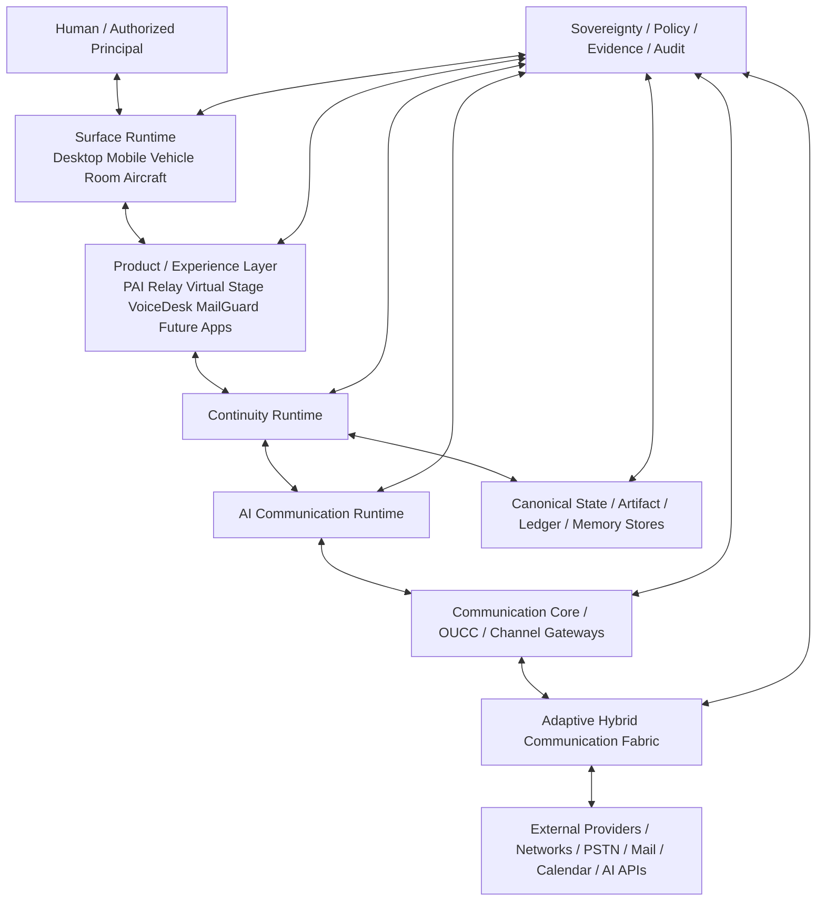
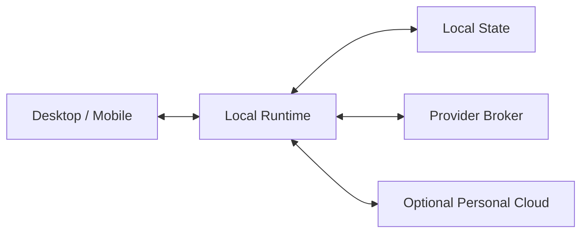
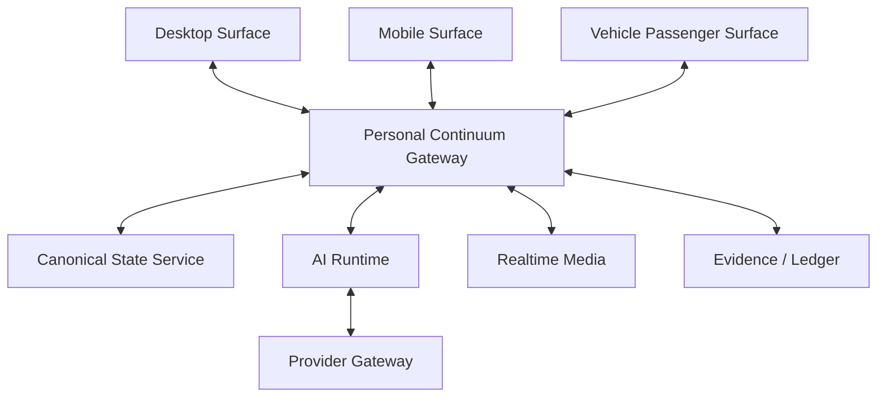
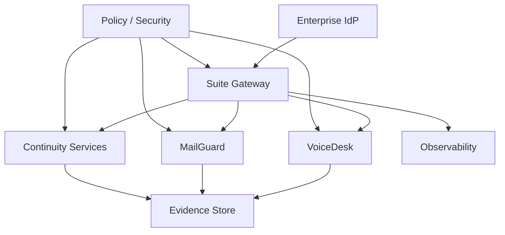
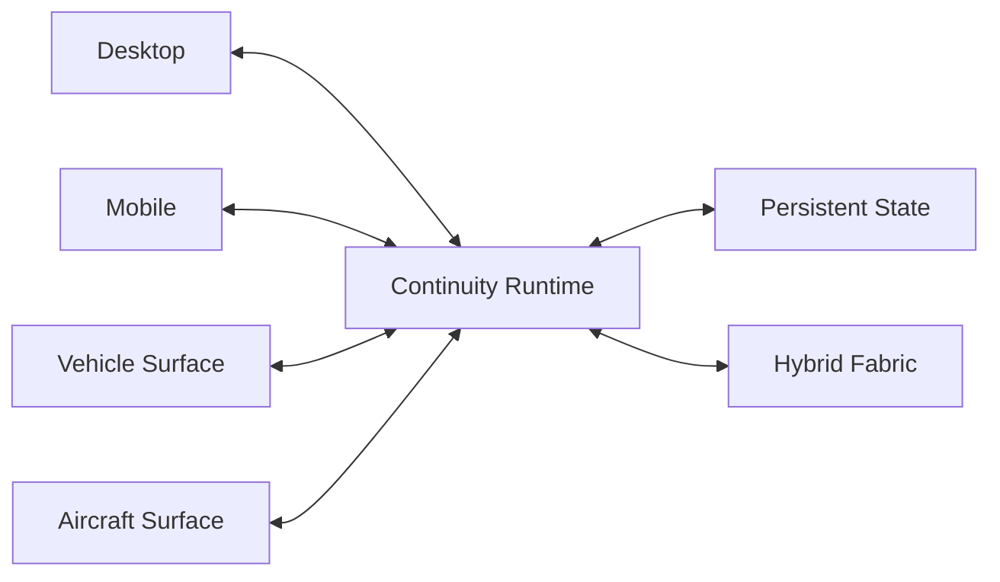

# EVEMISS Communication Continuum Architecture：統一技術白皮書與實作路線圖

## Series A-07｜Unified Technical Whitepaper and Implementation Roadmap for the AI-Native Communication Continuum

**作者：** Neo.K（EVEMISS / EveMissLab）  
**AI 協作：** Aletheia（GPT-5.6 Sol）  
**版本：** v0.1  
**日期：** 2026-08-24  
**文件狀態：** Technical Whitepaper / Canonical Source  

---

# 摘要

Series A-01 至 A-06 已依序建立六個層次：AI-Native Communication Continuum、Persistent Communication State、Multimodal-Native Communication、AI Communication Runtime、Adaptive Hybrid Communication Fabric，以及 Personal Communication Sovereignty。這六篇研究文分別回答「通訊世界如何持續」、「狀態如何恢復」、「不同 Surface 如何投影」、「AI 如何規劃與執行」、「網路路徑如何跨媒介持續」與「持續狀態究竟由誰控制」。A-07 的任務不是再提出第七套互不相干的新理論，而是把上述六層與 EVEMISS 已存在的 OUCC、Consumer Core、PAI Relay、VoiceDesk、MailGuard、Enterprise Communication Suite、虛擬角色多智能體平台重新編譯成一套可以分階段落地的**統一參考架構與工程路線圖**。

本文將 EVEMISS Communication Continuum Architecture（ECCA）定義為：

$$
\boxed{
\mathcal E
=
\mathcal S
+
\mathcal C
+
\mathcal R
+
\mathcal F
+
\mathcal G
}
$$

其中：

- $\mathcal S$：Persistent State / Continuity Layer；
- $\mathcal C$：Communication / Realtime / Channel Layer；
- $\mathcal R$：AI Communication Runtime；
- $\mathcal F$：Adaptive Hybrid Communication Fabric；
- $\mathcal G$：Sovereignty / Governance / Evidence Layer。

最重要的工程原則不是「把所有產品合併成一個程式」，而是：

$$
\boxed{
\text{Shared Primitives}
\neq
\text{Shared Product Identity}
\neq
\text{Shared Authority}
\neq
\text{Shared Raw Data Store}.
}
$$

因此 VoiceDesk、MailGuard、PAI Relay、虛擬角色平台以及未來 Mobility Surface 可以共享 identity、event envelope、provider broker、realtime media、continuity、AI runtime、fabric orchestration、observability 等基礎能力，但仍必須保留各自的產品責任、記憶語義、權限模型、資料保存與 evidence ownership。

本文進一步提出可實作的五平面架構、核心 component map、canonical state contract、Surface contract、Communication Intent、Decision Envelope、Flow Requirement、Action Receipt、Sovereignty Rights Vector、Resume Descriptor、Fabric Receipt 與 Projection Manifest；同時給出 local-first、personal cloud、enterprise gateway 與 multi-surface 四種部署拓樸，以及從「契約凍結」到「跨裝置、多模態、AI runtime、PAI Relay、企業接入、Hybrid Fabric、Mobility Bridge」的分期 roadmap。

本文最後將 v0.1 工程目標收斂為：

> **先證明同一個 communication state 可以在兩個 Surface、至少兩種 modality、至少兩種 provider / path 條件下安全延續，且不造成身分、權限、Artifact、Action Side Effect 與 Evidence 的混淆；再逐步擴張到更多產品與物理空間。**

---

# Abstract

Series A-01 through A-06 define six complementary layers of an AI-native communication continuum: persistent communication worlds, durable logical state, multimodal surface projection, AI communication runtime, adaptive hybrid connectivity, and personal communication sovereignty. This whitepaper compiles those research layers together with existing EVEMISS assets—including OUCC, Consumer Core, PAI Relay, VoiceDesk, MailGuard, the Enterprise Communication Suite, and the virtual-character multi-agent platform—into a deployable reference architecture.

The proposed EVEMISS Communication Continuum Architecture does not collapse all products into one monolith. It standardizes shared primitives and contracts while preserving product-specific identity, memory semantics, authority, data ownership, governance, and evidence boundaries. The architecture introduces five logical planes: Surface / Experience, Continuity / State, AI Runtime, Communication / Fabric, and Governance / Evidence. It defines canonical contracts for persistent state, communication intent, surface profiles, agent handoff, flow requirements, action receipts, and sovereignty controls.

The implementation roadmap begins with contract freezing and a deterministic local continuity harness, then advances through cross-device resumption, multimodal projection, AI runtime execution, PAI Relay integration, enterprise communication adapters, hybrid connectivity orchestration, and finally mobility-surface integration for Series B. The primary v0.1 engineering target is not a universal assistant; it is a verifiable continuum in which device, network, modality, or AI-provider changes do not reset the user's authorized communication state.

---

# 0. 本白皮書的角色：從六篇研究文進入工程收斂

A-01～A-06 的關係不是：

$$
A01+A02+A03+A04+A05+A06
=
\text{六個獨立產品}.
$$

而是：

$$
\boxed{
A01
\rightarrow
A02
\rightarrow
A03
\rightarrow
A04
\rightarrow
A05
\rightarrow
A06
}
$$

分別構成：

1. Continuum ontology；
2. Persistent state；
3. Multimodal projection；
4. AI runtime；
5. Connectivity fabric；
6. Sovereignty / governance。

A-07 將它們編譯成：

$$
\boxed{
\text{Architecture}
+
\text{Contracts}
+
\text{Deployment}
+
\text{Roadmap}
+
\text{Verification}.
}
$$

因此本文是一份**技術白皮書與工程交接母文件**。

---

# 1. v0.1 正式工程目標

ECCA v0.1 不要求第一天就完成：

- 全平台聯邦；
- 全通道接管；
- 全自動 AI；
- 全車載；
- 全衛星／5G multipath；
- 全 E2EE；
- 全 Provider portability；
- 全企業 production certification。

第一個可證明目標更小：

$$
\boxed{
\text{One Identity}
+
\text{One Persistent State}
+
\text{Two Surfaces}
+
\text{Two Modalities}
+
\text{One Safe Handoff}
}
$$

且滿足：

$$
\boxed{
\Delta Surface
\not\Rightarrow
\Delta CommunicationIdentity.
}
$$

$$
\boxed{
\Delta Modality
\not\Rightarrow
\Delta SemanticTaskState.
}
$$

$$
\boxed{
\Delta Provider
\not\Rightarrow
\Delta CanonicalOwnership.
}
$$

$$
\boxed{
\Delta NetworkPath
\not\Rightarrow
\Delta ApplicationState.
}
$$

---

# 2. 七條架構不變量

## 2.1 Continuity Invariant

裝置、位置、模態、網路或 AI Provider 改變，不應自動重置 canonical logical state。

$$
\boxed{
\Delta Device
\lor
\Delta Location
\lor
\Delta Modality
\lor
\Delta Network
\lor
\Delta AIProvider
\not\Rightarrow
\operatorname{Reset}(\mathcal P_t).
}
$$

## 2.2 Authority Invariant

AI 能調用某能力，不代表 AI 被授權執行。

$$
\boxed{
Capability
\neq
Permission.
}
$$

## 2.3 Intent-Action Invariant

使用者意圖與外部副作用必須有顯式轉換契約。

$$
\boxed{
Intent
\neq
Action.
}
$$

## 2.4 Source-of-Record Invariant

摘要、轉錄、影像描述、TTS、重新排版與 AI rendition 不得覆寫 canonical Artifact。

$$
\boxed{
Rendition
\neq
SourceOfRecord.
}
$$

## 2.5 Product Isolation Invariant

共享技術元件不自動共享產品身分、記憶、權限與保存政策。

$$
\boxed{
SharedPrimitive
\not\Rightarrow
SharedAuthority.
}
$$

## 2.6 Sovereignty Invariant

單一 Provider 不得成為 canonical state 唯一不可替代的所有路徑。

$$
\boxed{
ProviderPossession
\neq
CanonicalSovereignty.
}
$$

## 2.7 Evidence Invariant

模型說「完成」不等於系統已證明副作用成功。

$$
\boxed{
ModelClaim
\neq
ExecutionReceipt.
}
$$

---

# 3. 架構不是 Monolith：統一的是 Contract，不是所有 Runtime

EVEMISS Enterprise Communication Suite v0.7 已經採用：

```text
External Voice ──> VoiceDesk ──┐
                               ├──> Suite Gateway
External Email ──> MailGuard ──┘
```

而不是：

```text
VoiceDesk + MailGuard
→ One Giant Runtime
→ One Giant Database
```

這個原則應擴張到整個 Continuum：

$$
\boxed{
\text{Unified Architecture}
=
\text{Common Contracts}
+
\text{Composable Services}
+
\text{Isolated Product Domains}.
}
$$

因此：

- VoiceDesk 繼續擁有 voice media / call policy / voice incident；
- MailGuard 繼續擁有 mail parsing / trust graph / risk / mail evidence；
- Enterprise Suite Gateway 只持有 product binding、case reference 與 aggregate evidence；
- PAI Relay 擁有 personal attention / relationship / delegation semantics；
- Virtual Character Platform 擁有 character / scene / lore / performance semantics；
- Consumer Core 提供可重用 primitive，但不吸收所有產品語義；
- Continuity Runtime 提供跨 Surface / Provider / Network 的狀態連續性；
- AI Communication Runtime 提供 planning / routing / authorized action orchestration；
- AHCF 提供 network / access / path abstraction；
- Sovereignty Layer 提供 identity / export / migration / revocation / audit。

---

# 4. 五平面統一架構

本文採用五個 logical planes。

$$
\boxed{
\mathcal E
=
\mathcal P_S
\oplus
\mathcal P_C
\oplus
\mathcal P_R
\oplus
\mathcal P_F
\oplus
\mathcal P_G.
}
$$

## 4.1 Surface / Experience Plane

負責：

- Desktop；
- Mobile；
- Browser；
- Headset / Earbud；
- Meeting Room；
- Vehicle Driver Surface；
- Vehicle Passenger / Rear Surface；
- Aircraft Surface；
- 未來 AR / spatial surface。

Surface 不擁有 canonical work world。

它只擁有：

$$
\boxed{
\text{LocalProjection}
+
\text{LocalInput}
+
\text{LocalCapabilities}.
}
$$

## 4.2 Continuity / State Plane

負責：

- identity binding；
- canonical logical state；
- session；
- task frontier；
- memory；
- artifact；
- checkpoint；
- resume descriptor；
- event log；
- local replica；
- fork / merge；
- permission epoch。

## 4.3 AI Runtime Plane

負責：

- Planner；
- Router；
- Operator；
- Attention Broker；
- Continuity Guardian；
- Policy / Evidence Guard；
- agent handoff；
- capability discovery；
- model/provider selection。

## 4.4 Communication / Fabric Plane

負責：

- OUCC room / presence / messaging；
- WebRTC；
- WebTransport / HTTP / QUIC 等 transport option；
- PSTN / mail / calendar / external channel adapters；
- provider gateways；
- AHCF path discovery；
- flow requirement；
- failover / multipath / store-and-forward；
- 5G / Wi-Fi / Ethernet / satellite / fibre / relay 等 path families。

## 4.5 Governance / Evidence Plane

負責：

- sovereignty rights；
- policy；
- consent；
- delegation；
- revocation；
- audit；
- Action Receipt；
- Fabric Receipt；
- Evidence Manifest；
- incident；
- release gate；
- retention；
- export / migration / deletion residual。

---

# 5. 系統總圖



治理不是最底下的一個服務，而是：

$$
\boxed{
\text{Cross-Cutting Constraint Plane}.
}
$$

---

# 6. Component Map

## 6.1 Identity & Device Core

責任：

- Principal identity；
- actor identity；
- device identity；
- surface attachment；
- authentication binding；
- recovery binding。

禁止：

- 把 Provider login 當作唯一 person identity；
- 把 device ID 當作 person ID。

## 6.2 Sovereign State Store

責任：

- canonical persistent state；
- version；
- provenance；
- owner / authority scope；
- policy epoch；
- state hash；
- export metadata。

它可以物理分散：

$$
\text{Local}
+
\text{Personal Cloud}
+
\text{Enterprise Store}
$$

但必須有可解析 authoritative semantics。

## 6.3 Room & Session Kernel

承接 Consumer Core / OUCC：

- room；
- presence；
- communication session；
- session link；
- pause / resume；
- participant state。

## 6.4 Task & Context Core

責任：

- task graph；
- task frontier；
- pending action；
- context reconstruction；
- checkpoint；
- resume descriptor。

## 6.5 Memory & Artifact Core

必須分離：

$$
\boxed{
Memory
\neq
Artifact.
}
$$

Memory 是可檢索狀態；Artifact 是有版本、來源與 canonical identity 的工作成果。

## 6.6 Provider & Secret Broker

責任：

- AI model provider；
- speech provider；
- mail / calendar provider；
- BYOK；
- provider capability；
- cost；
- quota；
- fallback。

Secret 不得進一般 Event / Log。

## 6.7 Realtime Media Core

責任：

- WebRTC；
- audio / video；
- STT；
- TTS；
- VAD；
- barge-in；
- media track policy；
- recording / consent hook。

## 6.8 Surface Runtime

每個 Surface 註冊：

$$
\mathcal S_u
=
(
Capabilities,
Attention,
Environment,
Privacy,
Network,
Input,
Output
).
$$

Surface Runtime 不直接決定 authority。

## 6.9 Projection Planner

將：

$$
(\mathcal P_t,\mathcal J_t,\mathcal S_u)
$$

轉成：

$$
\mathcal Y_{u,t}.
$$

也就是可實際呈現在 Surface 上的 modality plan。

## 6.10 AI Communication Runtime

使用 A-04 的六個 logical roles：

- Planner；
- Router；
- Operator；
- Attention Broker；
- Continuity Guardian；
- Policy / Evidence Guard。

它們可以部署為：

- 一個 process；
- 多模組；
- 多 agent；
- 混合架構。

不要求「六個角色 = 六個模型」。

## 6.11 Channel Adapter Layer

初期：

- PSTN / cloud voice；
- email；
- calendar；
- app messaging；
- OUCC / WebRTC；
- browser realtime。

後續依合法 API 能力加入其他 provider。

## 6.12 Fabric Orchestrator

責任：

- discover path；
- assess path；
- apply flow requirement；
- failover；
- multipath；
- degradation；
- path evidence；
- provider abstraction。

不做：

- 讓 LLM 每 packet 決策。

## 6.13 Sovereignty Guard

責任：

- rights vector；
- export；
- migration；
- revoke；
- erase request；
- deletion residual；
- key policy；
- provider coupling inspection；
- recovery policy。

## 6.14 Evidence & Ledger Core

記錄：

- action receipt；
- policy decision；
- state transition；
- mode transition；
- handoff；
- provider migration；
- meaningful network transition；
- incident；
- release evidence。

不記錄不必要的 raw private content。

## 6.15 Observability Core

可使用 traces / metrics / logs 等工程 primitive，但：

$$
\boxed{
Telemetry
\neq
ComplianceEvidence.
}
$$

Evidence 必須另外定義完整性、來源與 retention。

---

# 7. Canonical State Contract

A-02 的 Persistent Communication State 收斂為：

$$
\boxed{
\mathcal P_t
=
(
I_t,
R_t,
S_t,
X_t,
T_t,
M_t,
F_t,
A_t,
P_t,
G_t
).
}
$$

其中：

- $I_t$：identity；
- $R_t$：relationship / room；
- $S_t$：session；
- $X_t$：context；
- $T_t$：task；
- $M_t$：memory；
- $F_t$：artifact；
- $A_t$：agent / tool state；
- $P_t$：permission / authority；
- $G_t$：governance / evidence pointer。

Canonical 不表示「一定中央資料庫」。

Canonical 表示：

> 對同一 logical object，系統知道哪一個 authority domain、version、provenance 與 merge rule 才能決定下一狀態。

---

# 8. Canonical State 與 Local Replica

每個 Surface 可以有：

$$
\mathcal P_t^{local}
$$

但：

$$
\boxed{
\mathcal P_t^{local}
\neq
\mathcal P_t^{authority}
}
$$

離線時可以：

- read cached state；
- create local draft；
- append mergeable events；
- queue low-risk actions。

但不得因離線而：

- 恢復已撤銷 authority；
- 假裝 side effect 成功；
- 覆寫 authoritative policy；
- 自行放大 delegation。

---

# 9. Resume Descriptor

跨 Surface 不是把整個資料庫複製一次。

最小 Resume Descriptor：

```yaml
resume_id: "rs_..."
principal_id: "pr_..."
communication_session_id: "cs_..."
task_frontier:
  - "task_..."
artifact_refs:
  - "artifact_...@v12"
context_checkpoint: "ctx_..."
permission_epoch: 42
pending_actions:
  - "act_..."
preferred_surface_mode: "VOICE_FIRST"
expires_at: "..."
```

Resume 時：

$$
\boxed{
\operatorname{Resume}
=
\operatorname{VerifyIdentity}
+
\operatorname{RefreshAuthority}
+
\operatorname{ReconstructContext}
+
\operatorname{AttachSurface}.
}
$$

---

# 10. Communication Intent Contract

上層不應直接硬寫「打電話」。

Intent：

```yaml
intent_type: "CONTACT"
target: "person_or_service"
purpose: "confirm_contract_time"
urgency: "normal"
privacy: "private"
required_confirmation: true
preferred_modalities:
  - "voice"
  - "text"
deadline: null
```

Runtime 再決定：

$$
\text{Email}
\lor
\text{Message}
\lor
\text{VoiceCall}
\lor
\text{Meeting}
\lor
\text{AgentToAgent}.
$$

這使 channel 成為：

$$
\boxed{
\text{Execution Method}
}
$$

而不是工作世界的最高層身份。

---

# 11. Decision Envelope

A-04 的 runtime decision 必須可保存：

```yaml
decision_id: "dec_..."
intent_ref: "intent_..."
task_ref: "task_..."
decision: "DRAFT"
planner_version: "..."
policy_epoch: 42
authority_ref: "auth_..."
selected_route:
  actor: "agent_..."
  tool: "mail.send"
  channel: "email"
attention_class: "deferred"
evidence_level: "E2"
```

重要：

$$
\boxed{
DecisionEnvelope
\neq
ActionReceipt.
}
$$

前者表示「系統決定怎麼做」。

後者表示「外部世界實際發生了什麼」。

---

# 12. Action Contract 與 Action Receipt

所有高風險或外部副作用 action 至少需要：

- principal；
- authority；
- tool capability；
- target；
- parameters；
- side-effect class；
- idempotency key；
- policy epoch；
- approval requirements；
- evidence requirements。

成功後生成：

```yaml
receipt_id: "rcpt_..."
action_id: "act_..."
status: "SUCCEEDED"
executed_at: "..."
provider: "..."
provider_operation_id: "..."
result_hash: "..."
policy_epoch: 42
evidence_refs:
  - "ev_..."
```

若 provider timeout：

$$
\boxed{
Timeout
\not\Rightarrow
SafeRetry.
}
$$

必須先判斷 operation 是否可能已成功。

---

# 13. Surface Profile

Surface 是可程式投影環境。

```yaml
surface_id: "surface_..."
surface_type: "VEHICLE_PASSENGER"
input:
  voice: true
  keyboard: true
  touch: true
  camera: false
output:
  audio: true
  display: "large"
  projection: false
attention:
  budget: "high"
  interruptibility: "medium"
privacy:
  audience: "private"
network:
  expected: "variable"
safety:
  class: "passenger"
```

Projection Planner 依此決定：

- full visual；
- voice-first；
- audio summary；
- delayed visual；
- privacy-safe output；
- offline-safe operation。

---

# 14. Modality Plan

同一 task：

$$
Task_i
$$

在 Desktop 可投影為：

$$
\text{Document}
+
\text{Screen}
+
\text{Keyboard}
+
\text{VoiceOptional}.
$$

在 Vehicle Passenger：

$$
\text{Voice}
+
\text{LargeDisplay}
+
\text{ShortTouch}.
$$

在 Driver Surface：

$$
\text{VoiceOnlyOrGlanceable}
+
\text{DeferredVisual}.
$$

因此：

$$
\boxed{
\text{Same Task}
\rightarrow
\text{Different Modality Plan}.
}
$$

---

# 15. Communication Fabric Contract

Application 不直接指定：

> 一定走某電信商 5G。

而應提出 Flow Requirement：

```yaml
flow_id: "flow_..."
class: "INTERACTIVE_VOICE"
latency_ms_max: 180
jitter_ms_max: 40
min_bandwidth_kbps: 128
reliability: "high"
privacy: "e2ee_required"
mobility: "high"
cost_policy: "balanced"
fallback:
  allow_store_and_forward: false
```

Fabric Orchestrator 回傳可用 path set。

---

# 16. Path Capability Descriptor

每條 path 可以表示：

$$
e_i
=
(
m_i,
f_i,
b_i,
l_i,
j_i,
r_i,
c_i,
p_i,
s_i,
g_i
)
$$

其中：

- medium / propagation；
- carrier；
- bandwidth；
- latency；
- jitter；
- reliability；
- cost；
- power；
- security；
- governance / jurisdiction。

因此「有線／無線」只是其中一個 descriptor，不再是最高層 ontology。

---

# 17. Provider Abstraction

需要至少三類 provider abstraction：

## 17.1 AI / Model Provider

提供：

- chat / reasoning；
- speech；
- vision；
- embedding；
- tool compatibility；
- cost / quota；
- privacy / retention descriptor。

## 17.2 Communication Provider

例如：

- telephony；
- mail；
- calendar；
- messaging；
- realtime media。

## 17.3 Connectivity Provider

例如：

- ISP；
- cellular；
- satellite；
- enterprise network；
- local mesh。

Provider 不得直接變成 canonical identity。

---

# 18. MCP 與 A2A 的位置

截至 2026-08-24，MCP 2026-07-28 已改成 stateless protocol core，並將 Tasks 置於 extension；A2A 官方文件則列出最新 Released Version 1.0.0，目標為不同 agent 系統之 capability discovery、modality negotiation 與 collaborative tasks。

ECCA 因此採用：

$$
\boxed{
MCP
\subset
\text{Tool / Resource Interop}
}
$$

$$
\boxed{
A2A
\subset
\text{Agent Interop}
}
$$

但：

$$
\boxed{
MCP
\neq
PersistentCommunicationState.
}
$$

$$
\boxed{
A2A
\neq
AuthorityLayer.
}
$$

---

# 19. Realtime Transport

目前可實作的 web / app realtime 基礎包括：

- WebRTC：media / data realtime；
- HTTP / HTTPS；
- QUIC / HTTP/3；
- WebTransport：browser-server low-latency data API，2026-07-30 進入 Candidate Recommendation Snapshot；
- WebSocket：legacy / compatibility path；
- provider-specific media streaming。

選擇原則：

$$
\boxed{
\text{Protocol}
=
f(
Latency,
Reliability,
BrowserSupport,
Bidirectionality,
Security,
Deployment
).
}
$$

而不是統一強制使用一種協定。

---

# 20. E2EE 與 MLS

群組訊息可把 RFC 9420 MLS 作為重要 E2EE primitive 候選。

但：

$$
\boxed{
E2EE
\neq
CompleteSovereignty.
}
$$

它處理 confidentiality 與 key evolution，不自動處理：

- legal ownership；
- export；
- delete；
- task authority；
- artifact provenance；
- enterprise retention；
- third-party rights。

---

# 21. Identity 與 Authentication

v0.1 建議：

- Web / App login：OIDC / OAuth-compatible provider；
- phishing-resistant authentication：WebAuthn / passkey 優先；
- device binding：獨立 device identity；
- workload identity：service-to-service 不使用終端使用者 header 冒充；
- enterprise：JWT / OIDC validation；
- recovery：必須可設計。

原本 Enterprise Suite v0.7 的：

```text
X-Tenant-ID
X-User-ID
X-Roles
```

只應視為 local prototype。

Production Gate 必須改成可驗證 identity。

---

# 22. Mode Isolation

Consumer Core 已有：

- PERSONAL_RELAY；
- PERFORMANCE；
- CREATOR。

ECCA 延續：

$$
\boxed{
Mode
=
\text{Authority Boundary}
+
\text{Memory Boundary}
+
\text{Experience Boundary}.
}
$$

而不只是 theme。

例如：

$$
CharacterAgent
\not\Rightarrow
Read(PersonalContacts).
$$

$$
PersonalAgent
\not\Rightarrow
ActAs(CharacterIdentity).
$$

---

# 23. Data Classification

建議最少：

- D0 Public；
- D1 Internal；
- D2 Personal；
- D3 Sensitive；
- D4 Credential / Secret；
- D5 Regulated / Contractual；
- D6 Evidence / Immutable Reference。

不同 class 必須有：

- storage policy；
- retention；
- export rule；
- logging rule；
- encryption rule；
- provider eligibility；
- Surface eligibility。

---

# 24. Sovereignty Rights Contract

對 object $o$：

$$
\boxed{
\mathcal R_u(o,t)
=
(r,w,d,v,x,e,m,k,a)
}
$$

表示：

- read；
- write；
- delegate；
- revoke；
- export；
- erase；
- migrate；
- key control；
- audit / verify。

UI 不應只顯示：

> 你擁有這筆資料。

而應顯示：

> 你目前對這個 object 有哪些權利與限制。

---

# 25. Export / Migration Bundle

最低 migration bundle：

```text
identity/
sessions/
tasks/
memory/
artifacts/
relationships/
authority/
provider_bindings/
provenance/
schemas/
resume/
receipts/
```

遷移成功不只測：

$$
BytesExported.
$$

還要測：

$$
\boxed{
FunctionalContinuityAfterMigration.
}
$$

---

# 26. Deletion 與 Revocation

Delete 必須區分：

- local deletion；
- provider deletion；
- backup lifecycle；
- recipient copy；
- legal retention；
- derived metadata；
- immutable evidence pointer。

因此回傳：

$$
\boxed{
DeletionResidualReport.
}
$$

Revocation 則主要是未來方向：

$$
\boxed{
Revocation
=
\text{FutureAuthorityInvalidation}.
}
$$

而不是假裝能把已寄出的信從別人的信箱消失。

---

# 27. Enterprise 與 Personal 必須可以共享核心但不同治理

## Personal

核心目標：

- autonomy；
- attention control；
- relationship boundary；
- provider independence；
- portability；
- personal recovery。

## Enterprise

核心目標：

- tenant isolation；
- workload identity；
- policy；
- evidence；
- incident；
- compliance；
- release gate；
- retention。

因此：

$$
\boxed{
SamePrimitive
+
DifferentGovernanceProfile.
}
$$

---

# 28. Existing Asset Mapping

## 28.1 OUCC

定位：

$$
\text{Communication Primitive Layer}.
$$

負責：

- room；
- presence；
- event；
- messaging；
- realtime；
- transport adapters。

## 28.2 Consumer Core

定位：

$$
\text{Consumer Shared State / Runtime Primitive Layer}.
$$

負責：

- identity / device；
- provider / secret；
- model gateway；
- realtime media；
- room / session；
- agent session；
- memory / context；
- event / ledger；
- artifact；
- cost；
- privacy / rights；
- sync；
- observability。

## 28.3 PAI Relay

定位：

$$
\text{Personal Communication Governance Product}.
$$

保留：

- relationship semantics；
- attention firewall；
- personal delegation；
- call / message / email / schedule relay；
- human takeover。

## 28.4 VoiceDesk

定位：

$$
\text{Enterprise Voice Product}.
$$

不吸收進 PAI。

## 28.5 MailGuard

定位：

$$
\text{Enterprise Mail Risk Product}.
$$

不吸收進 generic memory core。

## 28.6 Enterprise Suite Gateway

定位：

$$
\text{Cross-Product Reference / Evidence / Release Layer}.
$$

不複製 raw audio / raw mail body。

## 28.7 Virtual Character Multi-Agent Platform

定位：

$$
\text{Performance / Entertainment / Character Experience Product}.
$$

共享：

- provider；
- session；
- media；
- agent runtime primitive；
- artifact；
- cost。

不共享：

- personal contacts；
- personal relationship authority；
- enterprise mail / call raw data。

---

# 29. Deployment Topology A：Local-First Personal



適合：

- single user；
- private research；
- local AI；
- offline-first；
- early MVP。

優點：

- sovereign state；
- low latency；
- reduced provider lock-in。

限制：

- multi-device sync；
- NAT；
- mobile background；
- availability；
- recovery。

---

# 30. Deployment Topology B：Personal Cloud Continuum



這是 Series A 最重要的 reference deployment。

---

# 31. Deployment Topology C：Enterprise



Production 要求：

- tenant-aware；
- RLS / isolation；
- verified workload identity；
- evidence ownership；
- release gate；
- no raw-data duplication through gateway。

---

# 32. Deployment Topology D：Multi-Surface Mobility

此拓樸是 Series A 與 Series B 的接口。



Series A 只負責：

- state continuity；
- surface attachment；
- modality projection；
- attention / privacy contract；
- connectivity。

真正的：

- cabin geometry；
- driver / rear physical zoning；
- hospitality；
- seat / lighting / acoustic control；

留給 Series B。

---

# 33. Event Envelope

統一事件 envelope 應至少包含：

```yaml
event_id: "evt_..."
event_type: "continuum.session.resumed"
occurred_at: "..."
principal_id: "pr_..."
actor_id: "actor_..."
product_scope: "PAI_RELAY"
mode_scope: "PERSONAL_RELAY"
session_ref: "cs_..."
trace_id: "tr_..."
policy_epoch: 42
data_class: "D2"
payload_ref: "..."
```

禁止把 secret 直接塞進 payload。

---

# 34. Event Namespace

建議：

```text
continuum.identity.*
continuum.surface.*
continuum.session.*
continuum.task.*
continuum.context.*
continuum.artifact.*
continuum.memory.*
continuum.agent.*
continuum.action.*
continuum.fabric.*
continuum.sovereignty.*
continuum.evidence.*

pai.*
performance.*
voicedesk.*
mailguard.*
suite.*
```

這保留共用 primitive 與產品 namespace 的邊界。

---

# 35. API Boundary v0.1

## Identity / Surface

```text
POST /v1/continuum/surfaces:attach
POST /v1/continuum/surfaces:detach
GET  /v1/continuum/surfaces/{id}
```

## Session / Resume

```text
POST /v1/continuum/sessions
POST /v1/continuum/sessions/{id}:checkpoint
POST /v1/continuum/sessions/{id}:resume
POST /v1/continuum/sessions/{id}:handoff
```

## Intent / Runtime

```text
POST /v1/continuum/intents
POST /v1/continuum/intents/{id}:plan
POST /v1/continuum/actions/{id}:approve
POST /v1/continuum/actions/{id}:execute
GET  /v1/continuum/actions/{id}/receipt
```

## Fabric

```text
GET  /v1/fabric/paths
POST /v1/fabric/flows
GET  /v1/fabric/flows/{id}
POST /v1/fabric/flows/{id}:migrate
```

## Sovereignty

```text
GET  /v1/sovereignty/objects/{id}/rights
POST /v1/sovereignty/export
POST /v1/sovereignty/migrate
POST /v1/sovereignty/revoke
POST /v1/sovereignty/delete
```

---

# 36. Service Boundary 原則

每個 service 必須有：

- explicit owner；
- data classification；
- authority source；
- failure mode；
- idempotency behavior；
- evidence behavior；
- retention；
- export / deletion behavior；
- health / readiness；
- versioned schema。

禁止：

> 先做一個萬能 common service，之後再想它到底擁有什麼。

---

# 37. Failure Domain

應至少分開：

- identity failure；
- state failure；
- projection failure；
- AI planning failure；
- authority failure；
- provider failure；
- action execution failure；
- network failure；
- evidence failure；
- sovereignty failure。

原則：

$$
\boxed{
FailureIsolation
>
ConvenientCoupling.
}
$$

例如 MailGuard 掛掉，不應讓 VoiceDesk 自動失效。

---

# 38. Graceful Degradation

Continuum 不要求永遠高速連線。

例如：

$$
Video
\rightarrow
Audio
\rightarrow
Text
\rightarrow
StoreAndForward
\rightarrow
OfflineDraft.
$$

但：

$$
\boxed{
DegradedModality
\not\Rightarrow
DegradedAuthority.
}
$$

不能因網路變差而放寬權限。

---

# 39. Attention as Runtime Resource

Attention Broker 應把：

$$
B_{u,t}
$$

作為 runtime resource。

例如：

- driving：極低 visual budget；
- passenger：高 interaction budget；
- meeting：interruptibility low；
- rest：work interruption deny；
- emergency：priority override under policy。

因此：

$$
\boxed{
CanNotify
\neq
ShouldInterrupt.
}
$$

---

# 40. Privacy-Aware Surface

Surface attach 時必須聲明 audience。

例如：

- PRIVATE；
- SHARED_FAMILY；
- SHARED_WORK；
- PUBLIC；
- UNKNOWN。

若 audience = PUBLIC：

- 不朗讀敏感郵件；
- 不顯示 secret；
- 不自動播出私人 voice message；
- 不顯示 relationship memory。

---

# 41. Agent Handoff

Handoff Envelope 最少包含：

- task frontier；
- context ref；
- artifact refs；
- tool capability；
- authority scope；
- policy epoch；
- pending approvals；
- evidence refs；
- forbidden actions；
- expiration。

核心：

$$
\boxed{
Handoff
\not\Rightarrow
AuthorityEscalation.
}
$$

---

# 42. Model / Provider Switching

Provider switching 前：

1. checkpoint；
2. snapshot capability needs；
3. export compatible context；
4. normalize tool contract；
5. migrate active task；
6. re-verify authority；
7. run semantic continuity test。

完成後測：

$$
\boxed{
L_{semantic}
<
\tau.
}
$$

不能只測 HTTP 200。

---

# 43. Cost / Quota

Continuum Runtime 應把成本當成 capability constraint。

例如：

$$
J
=
w_LL
+
w_CC
+
w_EE
+
w_RR
+
w_PP
$$

其中：

- latency；
- cost；
- energy；
- risk；
- privacy。

Provider selection 與 Fabric selection 都可使用類似 objective，但權限 hard constraints 不可被 cost trade-off。

---

# 44. Observability

最低指標：

- resume success rate；
- handoff continuity；
- semantic projection fidelity；
- action duplicate rate；
- unauthorized action rate；
- provider migration success；
- path migration success；
- evidence completeness；
- revocation propagation latency；
- artifact source traceability。

---

# 45. Evidence Levels

建議：

- E0：runtime log；
- E1：structured event；
- E2：signed / hashed action receipt；
- E3：provider-correlated evidence；
- E4：authorized staging evidence；
- E5：production release evidence。

不同產品要求不同。

例如：

- 個人提醒：E0/E1；
- email send：E2/E3；
- enterprise release gate：E4/E5。

---

# 46. Security Threat Model

至少包含：

## T1 Identity Confusion

Surface / product / AI 把不同 principal 混為同一人。

## T2 Mode Confusion

角色模式拿到個人代理權。

## T3 Authority Drift

舊 approval / token 在新 policy epoch 繼續有效。

## T4 Duplicate Side Effect

retry 導致重複寄信、重複撥號、重複建立行事曆事件。

## T5 Provider Capture

canonical state 只存在單一 provider。

## T6 Context Injection

外部 message / webpage 影響 agent policy 或 tool routing。

## T7 Surface Leakage

共享螢幕／車艙播放私人資訊。

## T8 Network Downgrade

路徑切換造成 security downgrade。

## T9 Evidence Forgery

模型或產品自行宣稱已完成，沒有 execution evidence。

## T10 Recovery Failure

過度 self-custody 導致使用者失去 state。

---

# 47. Reliability Model

對核心 service 定義：

$$
Availability_i
$$

但 Continuum 目標不是每個元件 100% online。

更重要的是：

$$
\boxed{
ContinuityRecoveryRate.
}
$$

例如 provider 斷線：

- task 不丟；
- artifact 不丟；
- authority 不亂；
- user 知道未完成；
- 可以換 provider 或稍後恢復。

---

# 48. Consistency Strategy

不是所有資料都 strong consistency。

可以分：

## Mergeable

- local note；
- draft；
- UI preference；
- some presence state。

## Authority-Sensitive

- permission；
- revocation；
- approval；
- credential；
- enterprise release status。

## Evidence-Sensitive

- action receipt；
- incident；
- audit record。

因此：

$$
\boxed{
OneConsistencyModelForEverything
=
\text{Anti-Pattern}.
}
$$

---

# 49. Technology Selection 原則

A-07 不鎖死所有 framework。

v0.1 可採：

- API：FastAPI / equivalent；
- schema：JSON Schema；
- DB：PostgreSQL；
- local state：SQLite / local store；
- cache / queue：Redis / equivalent；
- object artifact：S3-compatible；
- realtime：WebRTC；
- async browser-server data：WebTransport when practical；
- identity：OIDC / OAuth + WebAuthn / passkeys；
- observability：OpenTelemetry-compatible；
- container：Docker；
- orchestration：先 Compose，後續 Kubernetes only when needed。

原則：

$$
\boxed{
ContractFirst
>
FrameworkFirst.
}
$$

---

# 50. Repository 建議

```text
evemiss-communication-continuum/
├─ contracts/
│  ├─ events/
│  ├─ intents/
│  ├─ surfaces/
│  ├─ state/
│  ├─ actions/
│  ├─ fabric/
│  └─ sovereignty/
├─ services/
│  ├─ identity-device/
│  ├─ continuity/
│  ├─ runtime/
│  ├─ media/
│  ├─ provider-broker/
│  ├─ fabric/
│  ├─ sovereignty/
│  └─ evidence/
├─ products/
│  ├─ pai-relay/
│  ├─ virtual-stage/
│  ├─ voicedesk-adapter/
│  └─ mailguard-adapter/
├─ surfaces/
│  ├─ web/
│  ├─ desktop/
│  ├─ mobile/
│  └─ vehicle-simulator/
├─ harness/
├─ deployment/
└─ docs/
```

這不要求立刻搬動所有既有 repo。

先以 adapter 方式接。

---

# 51. Migration Strategy：不要 Big-Bang Rewrite

## Step 1

凍結 shared contracts。

## Step 2

讓既有產品輸出 standardized event / receipt。

## Step 3

建立 Continuity Gateway。

## Step 4

把 Consumer Core primitive 接到 Gateway。

## Step 5

建立 PAI Relay adapter。

## Step 6

建立 VoiceDesk / MailGuard read-only integration。

## Step 7

驗證後才逐步抽出可共享 service。

原則：

$$
\boxed{
\text{Adapter First}
\rightarrow
\text{Shared Primitive}
\rightarrow
\text{Optional Service Extraction}.
}
$$

---

# 52. Current Asset Reality

截至本白皮書：

## 已有

- VoiceDesk v0.6；
- MailGuard v0.6；
- Enterprise Communication Suite Gateway v0.7；
- Unified Case / Evidence schema；
- Consumer Core 架構與 schemas；
- PAI Relay v0.2 白皮書；
- 虛擬角色平台架構與 schemas；
- Series A A-01～A-06 理論與 contracts；
- 多個 manifest / SHA-256 / validation discipline。

## 尚未宣稱

- authorized Twilio / Google Speech production evidence；
- authorized Microsoft 365 / Azure production evidence；
- unified OIDC / workload identity production deployment；
- full cross-device Continuity Runtime；
- production Hybrid Fabric；
- full semantic portability；
- production vehicle surface；
- universal provider federation。

因此工程狀態應寫：

$$
\boxed{
\text{Architecture Ready for Incremental Implementation}
\neq
\text{Production Complete}.
}
$$

---

# 53. Milestone 0｜Canonical Contract Freeze

目標：

- event envelope；
- actor identity；
- surface profile；
- persistent state；
- communication intent；
- decision envelope；
- action receipt；
- flow requirement；
- rights vector。

驗收：

- JSON Schema pass；
- compatibility tests；
- fixture set；
- no product-specific secret leakage。

---

# 54. Milestone 1｜Deterministic Continuity Harness

建立 deterministic harness：

```text
Surface A
→ Task
→ Checkpoint
→ Detach
→ Surface B
→ Resume
→ Verify
```

測：

- same identity；
- same task frontier；
- same artifact ref；
- current permission epoch；
- no duplicated side effect；
- correct projection。

這是 Series A 的第一個真正工程閉環。

---

# 55. Milestone 2｜Local-First Single User Continuum

功能：

- Desktop + browser；
- local state；
- optional cloud sync；
- provider broker；
- artifact；
- task；
- checkpoint / resume；
- text + voice；
- offline draft。

不先做：

- 多租戶 enterprise；
- vehicle；
- full federation。

---

# 56. Milestone 3｜Cross-Device / Multi-Surface

加入：

- desktop；
- mobile；
- second browser；
- headset。

測：

$$
\boxed{
SurfaceTransitionLoss
<
\tau_S.
}
$$

必須包含：

- permission refresh；
- audience privacy；
- context reconstruction。

---

# 57. Milestone 4｜AI Communication Runtime MVP

加入：

- planner；
- router；
- operator；
- attention broker；
- continuity guardian；
- policy / evidence guard。

只開放：

- read；
- draft；
- low-risk tool；
- explicit approval write。

不先做高權限 autonomous delegation。

---

# 58. Milestone 5｜PAI Relay Integration

第一批：

- Email；
- Calendar；
- attention inbox；
- contact / relationship resolver；
- draft reply；
- schedule task；
- optional voice relay。

目標：

$$
\boxed{
\text{Personal Communication Continuum MVP}.
}
$$

---

# 59. Milestone 6｜Enterprise Adapter Integration

先 read / evidence integration：

- VoiceDesk；
- MailGuard；
- Suite Gateway。

再逐步：

- verified OIDC；
- workload identity；
- tenant isolation；
- production DB policy；
- staging evidence。

保持：

$$
VoiceDesk
\neq
MailGuard.
$$

---

# 60. Milestone 7｜Adaptive Hybrid Fabric MVP

第一版不需要真的控制衛星。

先做：

- Ethernet / Wi-Fi / mobile path observation；
- path descriptor；
- flow requirement；
- simulated failover；
- network degradation；
- store-and-forward；
- Fabric Receipt。

之後才接：

- real multipath；
- cellular；
- satellite；
- enterprise SD-WAN / 5G access。

---

# 61. Milestone 8｜Mobility Surface Bridge

先做 simulator：

```text
Desktop
→ Vehicle Passenger Surface Simulator
→ Voice-first projection
→ Network degradation
→ Resume on Desktop
```

驗證後再進 Series B 的：

- Spatial Attention Zones；
- cabin environment；
- physical controls；
- robotaxi；
- hospitality。

---

# 62. Milestone Gate

每個 Milestone 必須：

1. source validated；
2. schema validated；
3. deterministic tests pass；
4. authority test pass；
5. isolation test pass；
6. continuity test pass；
7. evidence test pass；
8. rollback / recovery scenario pass。

不因「Demo 看起來能跑」直接升版。

---

# 63. Minimum Test Matrix

| 類別 | 測試 |
|---|---|
| Identity | 跨 Surface 仍為同 principal |
| Session | detach / resume |
| Task | task frontier 不遺失 |
| Artifact | version / provenance 不漂移 |
| Modality | text ↔ voice semantic consistency |
| Authority | revoke 後舊 Surface 不可執行 |
| Action | retry 不重複 side effect |
| Provider | model switch 不重置 task |
| Fabric | path failover 不重置 session |
| Privacy | public Surface 不洩漏 D3/D4 |
| Product | performance mode 讀不到 personal contacts |
| Evidence | action 必須有 receipt |

---

# 64. Continuity Scorecard

可以定義：

$$
C
=
w_I C_I
+
w_T C_T
+
w_F C_F
+
w_A C_A
+
w_S C_S
+
w_P C_P
+
w_E C_E.
$$

其中：

- identity continuity；
- task continuity；
- artifact continuity；
- authority continuity；
- semantic continuity；
- projection continuity；
- evidence continuity。

其中 authority error 必須給高 penalty。

---

# 65. SLO 草案

v0.1 research target：

- local checkpoint creation： $<200$ ms；
- local resume descriptor read： $<200$ ms；
- Surface attach acknowledgement： $<1$ s；
- cross-device resume target： $<5$ s excluding provider cold start；
- unauthorized action rate： $0$ in deterministic harness；
- duplicate side-effect rate： $0$ in deterministic harness；
- artifact source traceability： $100\%$ ；
- policy epoch mismatch detection： $100\%$ ；
- schema validation： $100\%$。

這些是工程 target，不是 production SLA。

---

# 66. API Versioning

建議：

```text
/v1/continuum/...
```

Event envelope：

```text
schema_version: "1.0"
```

規則：

- backward-compatible additive change：minor；
- breaking field semantic change：major；
- deprecated field 必須有 migration window；
- receipts / evidence schema 不可偷偷改語義。

---

# 67. Schema Registry

需要一個 registry 記錄：

- schema id；
- version；
- owner；
- product scope；
- compatibility；
- deprecation；
- canonical URL / path；
- example fixtures。

Runtime 不應靠 prompt 猜 schema。

---

# 68. Capability Registry

Capability Descriptor 至少：

```yaml
capability_id: "mail.send"
provider: "..."
input_schema: "..."
side_effect_class: "EXTERNAL_WRITE"
requires_approval: true
evidence_level: "E2"
supports_idempotency: true
allowed_modes:
  - "PERSONAL_RELAY"
```

因此：

$$
\boxed{
ToolName
\neq
Authority.
}
$$

---

# 69. Surface Registry

Surface Descriptor 需要：

- type；
- owner；
- physical context；
- capabilities；
- privacy；
- safety；
- attention；
- network；
- supported modality；
- secure storage；
- auto-lock；
- teardown behavior。

共享 robotaxi Surface 特別要求：

$$
\boxed{
Detach
\Rightarrow
EraseLocalSecrets
+
InvalidateSession
+
RemovePrivateCache.
}
$$

---

# 70. Product Registry

每個 product 宣告：

- identity scope；
- mode；
- memory scope；
- artifact scope；
- tool scope；
- retention；
- evidence；
- provider；
- Surface eligibility。

這讓共用核心無法靠「程式碼重用」偷偷跨越產品邊界。

---

# 71. Local / Cloud Boundary

Local：

- user-facing cache；
- device secret；
- offline task；
- low-latency media；
- optional local model。

Cloud：

- multi-device rendezvous；
- durable sync；
- remote connectors；
- provider orchestration；
- multi-party communication。

因此：

$$
\boxed{
LocalFirst
\neq
CloudForbidden.
}
$$

---

# 72. Offline Mode

離線可以：

- read cached artifact；
- edit local draft；
- run local model；
- create checkpoint；
- queue send intent。

但：

```text
SEND_EMAIL
```

離線只能進：

```text
PENDING_EXTERNAL_ACTION
```

不能生成 fake receipt。

---

# 73. Queue Semantics

每個 queued action 必須：

- idempotency key；
- expiry；
- policy epoch；
- approval validity；
- precondition；
- revalidation rule。

網路恢復後：

$$
\boxed{
Revalidate
\rightarrow
Execute
}
$$

不是：

$$
\boxed{
Reconnect
\rightarrow
BlindReplay.
}
$$

---

# 74. Human Review

Review object 應是 first-class：

```yaml
review_id: "rev_..."
action_ref: "act_..."
reason: "external_write"
requested_at: "..."
expires_at: "..."
required_fields:
  - "recipient"
  - "final_content"
decision: null
```

而不是 UI 裡臨時跳一個 confirm。

---

# 75. Attention Policy

使用者可以定：

```yaml
when:
  context: "REST"
then:
  deny:
    - "non_urgent_work_interrupt"
allow:
  - "family_emergency"
  - "security_alert"
```

因此 Continuum 的目標不是讓人永遠工作。

它提供的是：

$$
\boxed{
\text{Continuity of Choice}.
}
$$

---

# 76. Work / Rest / Entertainment 都是合法 Continuum State

Series A 不把 Work 當唯一用途。

$$
Activity
\in
\{
Work,
Rest,
Entertainment,
Social,
Travel,
Idle
\}.
$$

相同 Surface 可以切換 Mode，但必須：

- 更新 attention policy；
- 更新 memory scope；
- 更新 tool eligibility；
- 更新 notification policy。

---

# 77. Bridge to Series B

Series B 將接收：

- Surface Profile；
- Attention Budget；
- Privacy Audience；
- Network State；
- Communication Session；
- Multimodal Projection；
- AI Runtime；
- Fabric Flow Requirement。

Series B 再加入：

- physical cabin；
- driver / passenger zone；
- sound isolation；
- display / projection；
- seat / lighting；
- robotaxi service model；
- mobility hospitality。

所以：

$$
\boxed{
SeriesA
=
\text{Digital / Communication Continuity Foundation}
}
$$

$$
\boxed{
SeriesB
=
\text{Programmable Physical Mobility Space}.
}
$$

---

# 78. FAL-MCI / SPFC 的位置

A-05 已把 frequency-agile / physical-field research 放在 S2。

A-07 保持：

$$
\boxed{
\text{ECCA v0.1}
\not\Rightarrow
\text{Need SPFC}.
}
$$

ECCA 今天可直接建立在：

- Internet；
- WebRTC；
- QUIC；
- cellular；
- fibre；
- Wi-Fi；
- satellite provider；
- ordinary channel adapters。

未來如果 physical-wave backend 更 programmable，則可透過 AHCF extension 加入。

---

# 79. 標準與外部技術錨點

截至 2026-08-24：

- WebRTC：W3C Recommendation，2025-03-13；
- WebTransport：2026-07-30 Candidate Recommendation Snapshot；
- QUIC：RFC 9000；
- HTTP/3：RFC 9114；
- MLS：RFC 9420；
- MCP：2026-07-28 specification，stateless core + Tasks extension；
- A2A：官方 Latest Released Version 1.0.0；
- 3GPP Release 18：ATSSS / Mobile IAB / NTN 為 A-05 既有 S0 錨點；
- GDPR / EU Data Act：A-06 的 portability / switching / erasure / continuity 治理錨點。

ECCA 不宣稱等同任何單一標準。

它是：

$$
\boxed{
\text{System Architecture}
}
$$

建立在多個標準與產品 primitive 之上。

---

# 80. 不做的事情

A-07 不主張：

1. 所有 communication app 應被一個 EVEMISS app 取代；
2. VoiceDesk 與 MailGuard 應共用 raw database；
3. AI 可以因為 confidence 高就自行取得 authority；
4. E2EE 解決所有主權問題；
5. MCP / A2A 自動提供 canonical state；
6. 多路徑一定提高效能；
7. 車載 AI 可忽略駕駛安全；
8. 所有人都應把交通時間拿來工作；
9. local-first 等於完全離線；
10. provider-independent 等於禁止第三方雲端；
11. personal sovereignty 可以凌駕第三方或企業權利；
12. v0.1 已 production ready。

---

# 81. 第一個真正應該做的程式

不是「萬能 AI 助理」。

而是：

# **Continuity Deterministic Harness**

輸入：

```text
Principal
Task
Artifact
PermissionEpoch
SurfaceA
SurfaceB
ProviderA
ProviderB
NetworkState
```

執行：

```text
Create
→ Work
→ Checkpoint
→ Surface Detach
→ Provider / Network Change
→ Surface Attach
→ Resume
→ Verify
```

輸出：

- State Diff；
- Semantic Diff；
- Authority Diff；
- Artifact Diff；
- Action Receipt Diff；
- Continuity Score。

只要這一個 harness 沒閉合，所有「無縫 AI 世界」都還只是 Demo。

---

# 82. v0.1 優先序

建議：

$$
\boxed{
Contracts
\rightarrow
Harness
\rightarrow
Continuity
\rightarrow
Surface
\rightarrow
Runtime
\rightarrow
PAI
\rightarrow
Enterprise
\rightarrow
Fabric
\rightarrow
Mobility.
}
$$

而不是：

$$
\boxed{
BuildEverythingAtOnce.
}
$$

---

# 83. 完成定義

Series A 的工程完成，不等於所有產品 production。

A-07 的「完成」定義是：

1. 六篇研究文已有統一 component mapping；
2. 核心 contracts 有 machine-readable draft；
3. 部署邊界明確；
4. existing asset migration 有 incremental path；
5. roadmap 有 deterministic milestone；
6. security / sovereignty / evidence 不是事後附加；
7. Series B 有乾淨 bridge interface。

在這個意義上：

$$
\boxed{
\text{Series A Theory / Architecture Closure}
=
\text{Complete}.
}
$$

而：

$$
\boxed{
\text{Production Implementation}
=
\text{Next Engineering Phase}.
}
$$

---

# 84. 結論

AI-native communication 的真正工程問題，不是把 LLM 接到電話、Email、WebRTC 或車載螢幕上。若每次裝置切換、Provider 切換、網路切換、應用切換或 Agent handoff 都造成 state reset、authority ambiguity、artifact drift、privacy leakage 或 evidence loss，那麼它仍然只是更多彼此分裂的功能。

ECCA 的核心主張是：

$$
\boxed{
\text{Communication World}
>
\text{Channel}.
}
$$

$$
\boxed{
\text{Persistent State}
>
\text{App Session}.
}
$$

$$
\boxed{
\text{Intent}
>
\text{Specific Communication Method}.
}
$$

$$
\boxed{
\text{User Authority}
>
\text{Model Confidence}.
}
$$

$$
\boxed{
\text{Continuity}
>
\text{Device Boundary}.
}
$$

以及：

$$
\boxed{
\text{Sovereignty}
>
\text{Provider Possession}.
}
$$

因此最終系統不是：

> 一個「能打電話、能寄 Email、能聊天」的 AI 助理。

而是：

> **一個可以跨裝置、跨模態、跨 AI、跨網路與跨物理空間延續，同時保留權限、來源、主權、治理與證據邊界的個人／企業通訊連續體。**

Series A 到此完成理論與統一架構閉合；下一階段可進入 deterministic harness 與實作，同時 Series B 開始研究這個 Continuum 如何進入汽車、飛機、robotaxi 與其他可程式移動空間。

---

# 參考文獻與技術錨點

## Series A Canonical Sources

1. `A01_AI_Native_Communication_Continuum_v0.1.md`
2. `A02_Persistent_Communication_State_v0.1.md`
3. `A03_Multimodal_Native_Communication_v0.1.md`
4. `A04_AI_Communication_Runtime_v0.1.md`
5. `A05_Adaptive_Hybrid_Communication_Fabric_v0.1.md`
6. `A06_Personal_Communication_Sovereignty_v0.1.md`

## EVEMISS Existing Engineering / Product Sources

7. `EVEMISS_Enterprise_Communication_Suite_Integration_v0.7.zip`
8. `EVEMISS_ECAC_MVP_v0.1.zip`
9. `EVEMISS_VoiceDesk_Production_Operations_Governance_v0.6.zip`
10. `EVEMISS_MailGuard_Authorized_Staging_Calibration_v0.6.zip`
11. `EVEMISS_PAI_Relay_個人AI通訊代理技術白皮書_v0.2.zip`
12. `EVEMISS_消費端通訊與角色智能共用核心_架構規劃_v0.1.zip`
13. `EVEMISS_虛擬角色多智能體表演與交流平台_技術白皮書_v0.1.zip`

## External Standards / Specifications Checked for A-07

14. W3C, WebRTC: Real-Time Communication in Browsers, Recommendation, 2025-03-13.  
    `https://www.w3.org/TR/webrtc/`

15. W3C, WebTransport, Candidate Recommendation Snapshot, 2026-07-30.  
    `https://www.w3.org/TR/2026/CR-webtransport-20260730/`

16. IETF, RFC 9000, QUIC: A UDP-Based Multiplexed and Secure Transport.  
    `https://www.rfc-editor.org/rfc/rfc9000.html`

17. IETF, RFC 9114, HTTP/3.  
    `https://www.rfc-editor.org/rfc/rfc9114.html`

18. IETF, RFC 9420, The Messaging Layer Security Protocol.  
    `https://www.rfc-editor.org/info/rfc9420/`

19. Model Context Protocol, 2026-07-28 Specification Release.  
    `https://blog.modelcontextprotocol.io/posts/2026-07-28/`

20. Agent2Agent Protocol Specification, Latest Released Version 1.0.0.  
    `https://a2a-protocol.org/dev/specification/`

21. 3GPP Portal, Release 18 ATSSS / Mobile IAB / NTN specification records.  
    `https://portal.3gpp.org/`

22. Regulation (EU) 2016/679, GDPR.  
    `https://eur-lex.europa.eu/legal-content/EN/TXT/?uri=CELEX:32016R0679`

23. Regulation (EU) 2023/2854, Data Act.  
    `https://eur-lex.europa.eu/eli/reg/2023/2854/oj`

---

# 文件狀態

**Series：** A｜AI-Native Communication Continuum  
**Number：** A-07  
**Version：** v0.1  
**Status：** Technical Whitepaper / Canonical Source  
**Series A closure：** 7/7  
