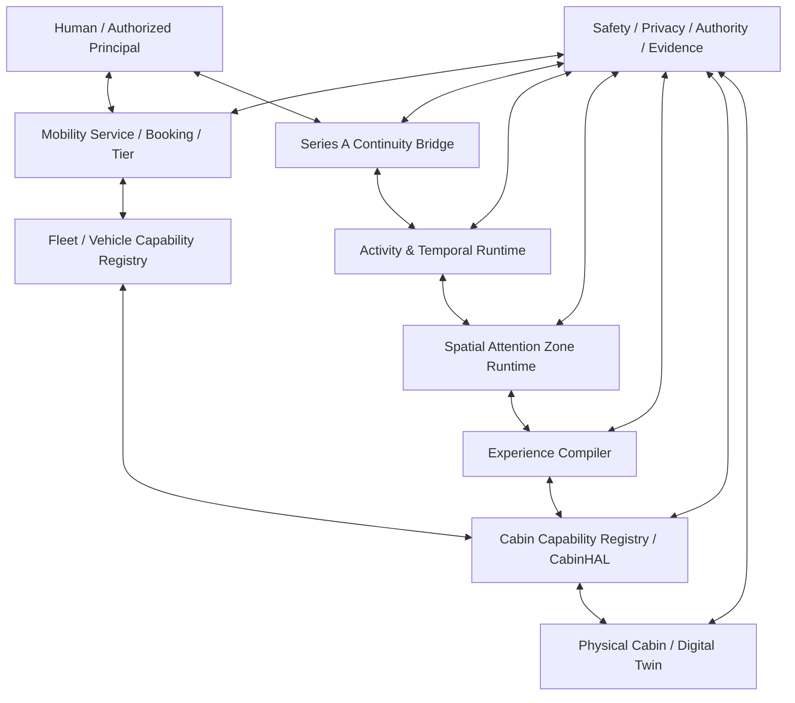
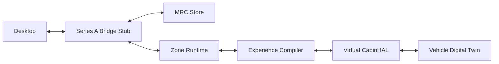
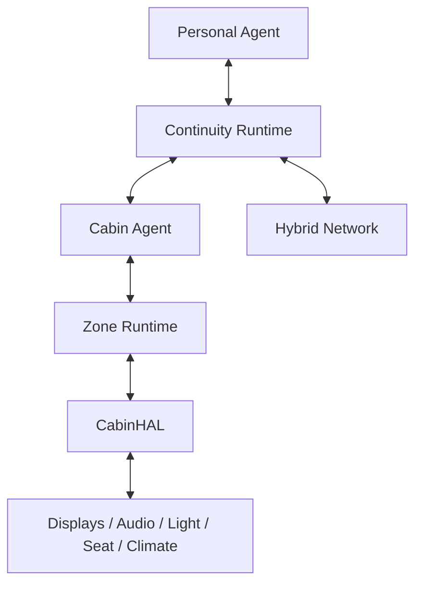
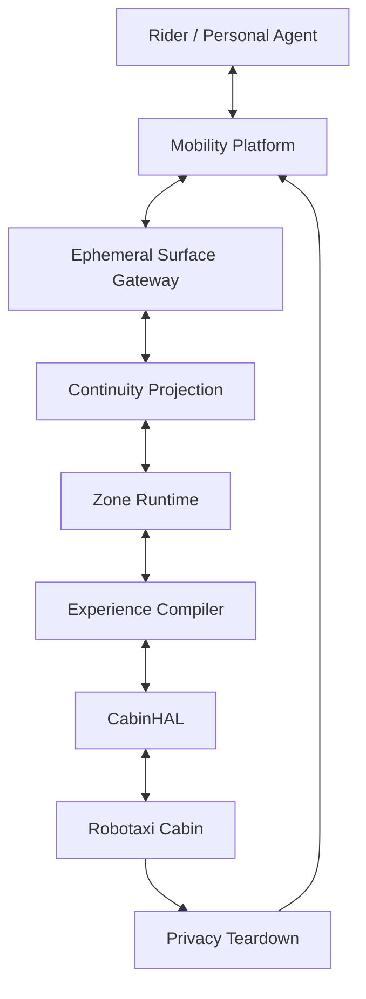

# Programmable Mobility Continuum Reference Architecture：統一技術白皮書與實作路線圖

## Programmable Mobility Continuum Reference Architecture: Unified Technical Whitepaper and Implementation Roadmap

**系列：** Series B｜Programmable Mobility & Spatial Continuum  
**編號：** B-07  
**作者：** Neo.K（EVEMISS / EveMissLab）  
**AI 協作：** Aletheia（GPT-5.6 Sol）  
**版本：** v0.1  
**日期：** 2026-08-24  
**文件狀態：** Technical Whitepaper / Canonical Source  

---

# 摘要

Series B-01 至 B-06 已依序建立六個互補層次：

1. **Programmable Mobility Space**：交通工具從位移載體擴張為可程式移動時空；
2. **Travel-Time Reclamation**：旅程時間不是新創造的時間，而是 forced / unusable time 被降低後重新變成可配置活動時間；
3. **Mobility Cognitive Continuity**：活動身份、task frontier、Artifact、open loops、authority 與 resumption cues 可跨物理位移延續；
4. **Spatial Attention Zones**：同一車內不同角色、座位、注意力、安全、隱私與 authority 不形成同一 interaction domain；
5. **AI-Native Vehicle Cabin**：display、projection、spatial audio、speech、Agent、lighting、seat、climate 與 privacy control 可被 Experience Compiler 以 bounded contract 組合；
6. **Mobility Hospitality / Robotaxi Economy**：Cabin Capability、Privacy、Continuity、Activity Support 與 Journey Quality 可以成為 service attribute、service tier 與 market matching 變量。

B-07 的任務不是提出第七套互相獨立的母理論，而是把前六篇與 Series A 的 AI-Native Communication Continuum 統一編譯成一套可實作的 **Programmable Mobility Continuum Reference Architecture（PMCRA）**。

本文將 PMCRA 定義為：

$$
\boxed{
\mathcal P_M
=
\mathcal D
+
\mathcal T
+
\mathcal Z
+
\mathcal X
+
\mathcal C
+
\mathcal H
+
\mathcal G
}
$$

其中：

- $\mathcal D$：Digital Continuity / Series A Bridge；
- $\mathcal T$：Temporal / Activity State；
- $\mathcal Z$：Spatial Attention Zone Runtime；
- $\mathcal X$：Experience Compiler / Cabin Runtime；
- $\mathcal C$：Cabin Capability / Bounded Actuation Layer；
- $\mathcal H$：Hospitality / Journey Service Layer；
- $\mathcal G$：Governance / Safety / Privacy / Evidence Layer。

本架構的核心不變量為：

$$
\boxed{
\text{Physical Movement}
\not\Rightarrow
\text{Activity Reset}.
}
$$

$$
\boxed{
\text{Continuity}
\not\Rightarrow
\text{Continuous Human Attention}.
}
$$

$$
\boxed{
\text{Same Vehicle}
\neq
\text{Same Interaction Domain}.
}
$$

$$
\boxed{
\text{Cabin Intelligence}
\neq
\text{Driving Authority}.
}
$$

$$
\boxed{
\text{User Buys Experience}
\neq
\text{Platform Owns User State}.
}
$$

$$
\boxed{
\text{Programmable}
\neq
\text{Unbounded Control}.
}
$$

本文進一步提出七平面 reference architecture、Mobility Surface Descriptor、Journey Runtime State、Zone Runtime、Experience Compiler、CabinHAL、Service Tier Registry、Journey Contract、Journey Receipt、Fleet Capability Registry、Series A Bridge Contract、Privacy Teardown、Mobility Evidence Chain 與 Digital Twin Cabin MVP。

第一個工程目標不是真正接管一台量產車，也不是製造自動駕駛系統。B-07 將 v0.1 收斂為一個可在桌面環境驗證的 **Programmable Mobility Digital Twin Harness**：

$$
\boxed{
Desktop
\rightarrow
VehicleSurfaceSimulator
\rightarrow
ZoneDecision
\rightarrow
ExperiencePlan
\rightarrow
VirtualCabinActuation
\rightarrow
JourneyReceipt
\rightarrow
DesktopResume.
}
$$

其驗收重點包括：

- activity identity 不丟失；
- driver / passenger zone policy 不混淆；
- unsafe modality 被 transform / defer / block；
- personal / cabin / driving agent authority 不混淆；
- shared-vehicle local state 可以 teardown；
- Cabin Capability 與 Journey Tier 可 machine-readable；
- network degradation 不重置 canonical state；
- AI failure 不導致 basic cabin control failure；
- service delivery 具有可驗證 receipt。

本文最後提出 M0～M9 implementation roadmap，從 contract freeze、deterministic simulator、single-user continuity、multi-zone cabin、AI Experience Compiler、Hospitality tier、Series A integration、fleet simulator、retrofit prototype，一直到 authorized vehicle sandbox。Series B 到此完成理論與統一架構閉合；最後只剩 Bridge-01 將 Series A 與 Series B 明確接成一個跨數位／物理空間的 **Human–AI Continuum**。

---

# Abstract

Series B has established programmable mobility as a layered system spanning travel-time reallocation, cognitive continuity, spatial attention zoning, AI-native cabin orchestration, and mobility-service economics. This whitepaper compiles those layers into the Programmable Mobility Continuum Reference Architecture (PMCRA).

PMCRA is explicitly not an autonomous-driving architecture. It does not merge cabin intelligence with driving authority, nor does it expose raw safety-critical vehicle control to general-purpose AI. Instead, it defines a bounded cabin and mobility-services layer built on top of Series A's persistent digital communication state.

The reference architecture introduces seven logical planes: Series-A Digital Continuity Bridge, Temporal and Activity State, Spatial Attention Zone Runtime, Experience Compiler, Cabin Capability and Bounded Actuation, Hospitality and Journey Service, and Governance / Safety / Privacy / Evidence. Machine-readable contracts are defined for mobility surfaces, journey runtime state, bridge state, zone decisions, cabin experience plans, service tiers, and journey receipts.

The initial implementation target is a digital-twin mobility harness rather than a production vehicle. It simulates desktop-to-vehicle transition, passenger and driver zones, multimodal transformation, cabin actuation, network degradation, privacy teardown, ride-end evidence, and desktop resumption. The roadmap then advances toward multi-zone physical cabin prototypes and authorized vehicle sandbox integration.

With B-07, Series B achieves theory and architecture closure. A final Bridge-01 document can then unify Series A's AI-native communication continuum with Series B's programmable physical mobility space.

---

# 0. B-07 的角色：從研究系列到工程母架構

B-01～B-06 並不是六個產品。

它們是：

$$
\boxed{
B01
\rightarrow
B02
\rightarrow
B03
\rightarrow
B04
\rightarrow
B05
\rightarrow
B06.
}
$$

分別回答：

- 空間是什麼；
- 時間如何配置；
- 活動如何延續；
- 哪裡可以互動；
- 車艙如何執行；
- 服務如何被販售。

B-07 則回答：

> **這六層要如何真的成為一個系統？**

---

# 1. PMCRA 的正式定義

本文定義：

# **Programmable Mobility Continuum Reference Architecture**
## **PMCRA**

$$
\boxed{
\mathcal P_M
=
\mathcal D
+
\mathcal T
+
\mathcal Z
+
\mathcal X
+
\mathcal C
+
\mathcal H
+
\mathcal G.
}
$$

---

# 2. $\mathcal D$ — Digital Continuity Bridge

來源：

$$
SeriesA.
$$

包含：

- identity；
- persistent state；
- communication；
- task；
- memory；
- artifact；
- AI runtime；
- provider；
- network abstraction；
- sovereignty；
- evidence。

---

# 3. $\mathcal T$ — Temporal / Activity State

來源：

$$
B02+B03.
$$

包含：

- activity mode；
- temporal allocation；
- work / rest / idle；
- task frontier；
- MRC；
- resumption cue；
- interruption / transition state。

---

# 4. $\mathcal Z$ — Spatial Attention Zone Runtime

來源：

$$
B04.
$$

包含：

- role；
- attention budget；
- driving state；
- visual；
- audio；
- privacy；
- authority；
- environment；
- zone decision。

---

# 5. $\mathcal X$ — Experience Compiler

來源：

$$
B05.
$$

負責：

$$
Intent
+
Activity
+
MRC
+
Zone
+
Capability
\rightarrow
ExperiencePlan.
$$

---

# 6. $\mathcal C$ — Cabin Capability / Bounded Actuation

包含：

- displays；
- projection；
- audio；
- mic；
- light；
- seat；
- climate；
- privacy；
- local AI；
- CabinHAL；
- receipt。

---

# 7. $\mathcal H$ — Hospitality / Journey Service

來源：

$$
B06.
$$

包含：

- tier；
- booking；
- matching；
- service SLA；
- price；
- membership；
- journey receipt；
- service recovery。

---

# 8. $\mathcal G$ — Governance / Safety / Privacy / Evidence

跨所有平面。

包含：

- driver-distraction policy；
- privacy；
- consent；
- temporal sovereignty；
- personal data；
- local teardown；
- capability truthfulness；
- authority；
- audit；
- evidence。

---

# 9. 七條統一不變量

## 9.1 Physical Transition Invariant

$$
\boxed{
\Delta PhysicalLocation
\not\Rightarrow
\operatorname{Reset}(Activity).
}
$$

## 9.2 Attention Invariant

$$
\boxed{
Continuity
\neq
ContinuousHumanAttention.
}
$$

## 9.3 Zone Invariant

$$
\boxed{
SameVehicle
\neq
SameInteractionDomain.
}
$$

## 9.4 Authority Invariant

$$
\boxed{
CabinIntelligence
\neq
DrivingAuthority.
}
$$

## 9.5 Control Invariant

$$
\boxed{
Intent
\neq
RawActuation.
}
$$

## 9.6 Sovereignty Invariant

$$
\boxed{
MobilityService
\not\Rightarrow
PlatformOwnership(UserState).
}
$$

## 9.7 Hospitality Invariant

$$
\boxed{
Capability
\neq
Obligation.
}
$$

Work capability 不等於 work obligation。

---

# 10. Architecture Overview



---

# 11. Architecture Is Not One Agent

錯誤：

```text
One AI
→ everything
```

本文採：

$$
\boxed{
PersonalAgent
\neq
CabinAgent
\neq
DrivingAgent
\neq
FleetAgent.
}
$$

---

# 12. Personal Agent

擁有：

- personal context；
- communication；
- activity intent；
- user preference；
- booking delegation。

不擁有：

- raw driving authority；
- fleet admin；
- unrestricted cabin hardware。

---

# 13. Cabin Agent

擁有：

- cabin capability；
- experience plan；
- allowed comfort controls；
- zone-safe media；
- environment orchestration。

---

# 14. Driving Agent / ADS

屬於：

$$
\boxed{
\text{Separate Safety Domain}.
}
$$

B-07 不定義其內部 safety architecture。

---

# 15. Fleet Agent

負責：

- vehicle inventory；
- tier availability；
- reposition；
- energy；
- capability matching。

不能讀：

- 完整個人 AI memory。

---

# 16. Series A Bridge

最重要的接口：

$$
\boxed{
SeriesAState
\rightarrow
MobilityProjection.
}
$$

不是：

$$
SeriesAState
\rightarrow
VehicleOwnershipOfState.
$$

---

# 17. Bridge Input

至少：

- principal；
- communication session；
- activity id；
- artifact refs；
- MRC；
- authority；
- privacy；
- requested mode；
- network flow requirements。

---

# 18. Bridge Output

Mobility Runtime 回傳：

- current mobility surface；
- zone；
- experience mode；
- cabin receipt；
- journey receipt；
- resumption checkpoint。

---

# 19. Mobility Surface Descriptor

每個移動 Surface 宣告：

$$
\boxed{
S_M
=
(
Type,
Trust,
Owner,
Zones,
Capabilities,
Network,
Privacy,
Safety,
Teardown
).
}
$$

---

# 20. Surface Types

例如：

- PERSONAL_CAR；
- CHAUFFEURED_CAR；
- ROBOTAXI；
- SHUTTLE；
- TRAIN_CABIN；
- AIRCRAFT_CABIN；
- SIMULATOR。

---

# 21. Trust Class

例如：

- PERSONAL_TRUSTED；
- ENTERPRISE_MANAGED；
- SHARED_EPHEMERAL；
- PUBLIC_SHARED；
- SIMULATED。

---

# 22. Shared Surface Rule

若：

$$
Trust=SHARED\_EPHEMERAL,
$$

則：

$$
\boxed{
NoPersistentSecretByDefault.
}
$$

---

# 23. Journey Runtime State

本文定義：

$$
\boxed{
J_t
=
(
Trip,
Activity,
Surface,
Zone,
Experience,
Network,
Privacy,
Authority,
Evidence
).
}
$$

---

# 24. Trip

包含：

- origin；
- destination；
- ETA；
- route state；
- ride state；
- service tier。

---

# 25. Activity

包含：

- mode；
- MRC；
- task frontier；
- open loops。

---

# 26. Surface

當前：

$$
MobilitySurface.
$$

---

# 27. Zone

當前：

$$
ZoneContract.
$$

---

# 28. Experience

當前：

$$
CabinExperiencePlan.
$$

---

# 29. Network

承接 Series A AHCF：

- path；
- bandwidth；
- degraded state。

---

# 30. Privacy

包含：

- audience；
- local retention；
- microphone；
- display；
- teardown。

---

# 31. Authority

包含：

- personal actions；
- cabin actions；
- purchase delegation；
- enterprise policy。

---

# 32. Evidence

包含：

- zone decision；
- cabin actuation receipt；
- journey receipt；
- teardown receipt。

---

# 33. State Machine

Journey：

$$
\boxed{
Requested
\rightarrow
Matched
\rightarrow
Boarding
\rightarrow
Attached
\rightarrow
Active
\rightarrow
Arriving
\rightarrow
Detached
\rightarrow
Completed.
}
$$

---

# 34. Requested

使用者提出：

- destination；
- tier；
- intent。

---

# 35. Matched

平台選 vehicle。

---

# 36. Boarding

驗證：

- identity；
- vehicle；
- party；
- accessibility；
- surface trust。

---

# 37. Attached

Series A：

$$
AttachSurface.
$$

---

# 38. Active

Journey Runtime 運作。

---

# 39. Arriving

開始：

- checkpoint；
- summarization；
- experience wind-down。

---

# 40. Detached

移除：

- session；
- local secrets；
- personal context。

---

# 41. Completed

產生：

$$
JourneyReceipt.
$$

---

# 42. Mobility Resume Pipeline

$$
\boxed{
Desktop
\rightarrow
MRC
\rightarrow
SurfaceAttach
\rightarrow
ZoneDecision
\rightarrow
ExperiencePlan
\rightarrow
Resume.
}
$$

---

# 43. Ride-End Pipeline

$$
\boxed{
Checkpoint
\rightarrow
ExperienceStop
\rightarrow
Detach
\rightarrow
PrivacyTeardown
\rightarrow
JourneyReceipt
\rightarrow
ResumeElsewhere.
}
$$

---

# 44. Activity Runtime

Activity mode：

$$
\in
\{
Work,
Rest,
Entertainment,
Social,
Creative,
Idle,
AgentOnly
\}.
$$

---

# 45. Mode Is a Governance Boundary

Work：

- work tools；
- work context。

Rest：

- work block；
- DND。

Idle：

- no optimization。

因此：

$$
\boxed{
Mode
\neq
Theme.
}
$$

---

# 46. Temporal Sovereignty

Mobility Runtime 必須保留：

$$
\boxed{
Choose,
Pause,
Refuse,
Disconnect,
Reallocate.
}
$$

---

# 47. Employer Integration

Enterprise Work Tier：

可以。

但：

$$
\boxed{
EmployerPaidRide
\not\Rightarrow
EmployerOwnsAllTravelTime.
}
$$

勞動分類仍需合法契約。

---

# 48. Zone Runtime

輸入：

- occupant；
- activity；
- driving state；
- privacy；
- authority；
- motion。

輸出：

$$
\boxed{
Allow,
Transform,
Defer,
Block.
}
$$

---

# 49. Driver Example

Activity：

$$
DensePDF.
$$

Zone：

$$
Driver.
$$

Output：

$$
Transform
\rightarrow
AudioBrief
$$

或：

$$
Defer.
$$

---

# 50. Passenger Example

Zone：

$$
RearPrivate.
$$

Output：

$$
Allow
\rightarrow
FullWorkspace.
$$

---

# 51. Shared-Ride Example

Privacy：

$$
PublicShared.
$$

Private message：

$$
Audio
\rightarrow
PrivateText
$$

或：

$$
Defer.
$$

---

# 52. Experience Compiler

輸入：

$$
(
Intent,
Activity,
MRC,
Zone,
Capability,
Network
).
$$

輸出：

$$
CabinExperiencePlan.
$$

---

# 53. Experience Planning Is Declarative

Planner 說：

```text
REST
```

而不是：

```text
raw hardware command
```

---

# 54. CabinHAL

B-07 正式定義：

# **Cabin Hardware Abstraction Layer**

接口示意：

```text
display.present
audio.route
mic.open_scoped
lighting.scene
seat.profile
climate.profile
privacy.mode
notification.policy
```

---

# 55. CabinHAL Must Exclude

一般層不得直接包含：

- steering；
- braking；
- powertrain；
- raw safety-critical bus write。

---

# 56. CabinHAL Capability Registry

每個 capability 具有：

- id；
- type；
- zone；
- safety class；
- authority；
- limits；
- rollback；
- verification。

---

# 57. Actuation Pipeline

$$
\boxed{
ExperiencePlan
\rightarrow
Validate
\rightarrow
CabinHAL
\rightarrow
Actuate
\rightarrow
Observe
\rightarrow
Receipt.
}
$$

---

# 58. Plan Failure

若 capability 不足：

$$
\boxed{
Fallback
}
$$

或：

$$
Defer.
$$

---

# 59. Safety Failure

若：

$$
SafetyPolicy=Block,
$$

任何 personalization：

$$
\rightarrow
Block.
$$

---

# 60. Privacy Failure

若：

$$
PrivacyCapability<Requirement,
$$

敏感 activity：

$$
\rightarrow
Defer.
$$

---

# 61. Network Failure

$$
Cloud
\rightarrow
Edge
\rightarrow
Offline.
$$

---

# 62. AI Failure

$$
Agent
\rightarrow
RuleBased
\rightarrow
Manual.
$$

所以：

$$
\boxed{
\text{AI Failure}
\neq
\text{Cabin Failure}.
}
$$

---

# 63. Experience Profiles

Reference：

- Work；
- Rest；
- Entertainment；
- Social；
- Creative；
- Idle；
- AgentOnly。

---

# 64. Profiles Are Portable Intents

不是固定 hardware preset。

Profile：

$$
\rightarrow
CapabilityMatcher
$$

再生成車輛-specific plan。

---

# 65. Mobility Hospitality Registry

Service Tier 宣告：

- required capability；
- privacy；
- SLA；
- activity；
- fallback；
- price policy。

---

# 66. Tier Truthfulness

若賣：

$$
WORK.
$$

必須：

$$
RequiredCapability\subseteq VehicleCapability.
$$

---

# 67. Fleet Capability Registry

Vehicle Descriptor 至少：

- vehicle id；
- surface type；
- zones；
- display；
- audio；
- privacy；
- seat；
- climate；
- AI；
- connectivity；
- accessibility；
- current health。

---

# 68. Fleet Match

$$
\boxed{
Match(
Trip,
Tier,
Capabilities,
ETA,
Energy,
Privacy,
Accessibility
).
}
$$

---

# 69. Hard Matching Constraints

- capacity；
- accessibility；
- safety；
- tier capability；
- privacy。

不滿足：

$$
NoMatch.
$$

---

# 70. Soft Matching Objectives

- ETA；
- price；
- energy；
- deadhead；
- user preference。

---

# 71. Machine-Readable Booking

Personal Agent 可發：

```yaml
destination: airport
arrival_before: "07:20"
tier: REST
privacy: HIGH
budget_max: 45
```

---

# 72. Booking Authority

若 AI 有：

$$
PurchaseDelegation.
$$

才可自動訂。

---

# 73. Paid Upgrade

任何額外費用：

$$
\boxed{
ExplicitConsent
\lor
BudgetDelegation.
}
$$

---

# 74. Journey Contract

booking 後：

$$
\boxed{
\text{Quoted Service}
}
$$

需被凍結成 contract。

---

# 75. Journey Contract Does Not Guarantee Physics

例如：

塞車。

Arrival 可能遲。

但 SLA 應明確：

- which guarantees；
- which estimates。

---

# 76. Journey Receipt

完成後：

- what delivered；
- SLA；
- fare；
- privacy teardown；
- continuity result；
- compensation。

---

# 77. Evidence Chain

$$
\boxed{
Booking
\rightarrow
Match
\rightarrow
ZoneDecision
\rightarrow
ExperiencePlan
\rightarrow
ActuationReceipt
\rightarrow
JourneyReceipt.
}
$$

---

# 78. Privacy Teardown Chain

shared vehicle ride end：

$$
\boxed{
StopProjection
\rightarrow
ClearSession
\rightarrow
EraseSecrets
\rightarrow
ResetProfile
\rightarrow
TeardownReceipt.
}
$$

---

# 79. Teardown Receipt

應回答：

- account detached；
- local cache cleared；
- mic recording policy；
- profile persisted?；
- residuals。

---

# 80. Physical vs Digital Evidence

物理：

- actuator applied。

數位：

- session detached。

兩者都需可追溯。

---

# 81. Digital Twin First

B-07 工程策略：

$$
\boxed{
Simulator
\rightarrow
\text{Cabin Prototype}
\rightarrow
\text{Authorized Vehicle Sandbox}.
}
$$

---

# 82. Why Not Real Car First?

因為：

- safety；
- OEM API；
- hardware；
- regulation；
- cost。

先驗證 software semantics。

---

# 83. Programmable Mobility Digital Twin Harness

簡稱：

# **PM-DTH**

---

# 84. PM-DTH Components

1. Journey Simulator；
2. Surface Simulator；
3. Zone Runtime；
4. Experience Compiler；
5. Virtual CabinHAL；
6. Series A Bridge Stub；
7. Network Degradation Simulator；
8. Privacy Teardown；
9. Evidence Collector；
10. Fleet Matcher。

---

# 85. Journey Simulator

控制：

- route；
- ETA；
- motion state；
- arrival；
- emergency event。

---

# 86. Surface Simulator

模擬：

- driver；
- front passenger；
- rear passenger；
- shared robotaxi。

---

# 87. Virtual CabinHAL

模擬：

- display；
- audio；
- light；
- seat；
- climate；
- privacy。

---

# 88. Network Degradation Simulator

狀態：

- good；
- degraded；
- intermittent；
- offline。

---

# 89. Series A Bridge Stub

載入：

- principal；
- activity；
- MRC；
- authority；
- artifact refs。

---

# 90. Deterministic Scenario A

# Desktop → Rear Work Cabin

驗證：

- activity id；
- resume；
- display；
- private audio；
- work mode。

---

# 91. Scenario B

# Same Activity → Driver Zone

驗證：

- visual blocked；
- audio transform；
- full resume deferred。

---

# 92. Scenario C

# REST + AGENT_ONLY

人：

$$
Rest.
$$

Agent：

$$
BackgroundTask.
$$

驗證：

- work UI off；
- no unauthorized side effect；
- arrival review packet。

---

# 93. Scenario D

# Shared Ride Privacy

驗證：

- private TTS blocked；
- local session erased；
- teardown receipt。

---

# 94. Scenario E

# Network Failure

驗證：

- cloud → edge；
- 4K → audio/text；
- canonical state unchanged。

---

# 95. Scenario F

# Tier Mismatch

使用者買：

$$
WORK.
$$

vehicle lacks private display。

Matcher：

$$
Reject.
$$

---

# 96. Scenario G

# Service Failure

Work display fails mid-trip。

System：

- fallback；
- SLA violation；
- compensation suggestion。

---

# 97. Scenario H

# Arrival Transition

- checkpoint；
- summarize；
- detach；
- desktop resume。

---

# 98. Deterministic Harness Acceptance

至少：

$$
\boxed{
IdentityDrift=0
}
$$

$$
\boxed{
AuthorityDrift=0
}
$$

$$
\boxed{
UnsafeResume=0
}
$$

$$
\boxed{
PrivateCacheResidual=0
}
$$

在 deterministic test fixture 中。

---

# 99. Soft Metrics

可測：

- resumption lag；
- semantic drift；
- user utility；
- journey utility；
- transform success；
- tier satisfaction。

---

# 100. Milestone 0｜Contract Freeze

凍結：

- Mobility Surface；
- Journey State；
- Series A Bridge；
- Zone Contract；
- Experience Plan；
- Capability；
- Tier；
- Journey Contract；
- Journey Receipt。

---

# 101. Milestone 1｜PM-DTH

建立 deterministic simulator。

---

# 102. Milestone 2｜Single-User Mobility Continuity

Desktop：

$$
\leftrightarrow
VehicleSimulator.
$$

---

# 103. Milestone 3｜Multi-Zone Runtime

加入：

- driver；
- passenger；
- shared。

---

# 104. Milestone 4｜Experience Compiler MVP

支援：

- Work；
- Rest；
- Idle；
- AgentOnly。

---

# 105. Milestone 5｜Hospitality Tier MVP

支援：

- Basic；
- Quiet；
- Work；
- Rest；
- Privacy。

---

# 106. Milestone 6｜Full Series A Bridge

接：

- persistent state；
- provider；
- communication；
- sovereignty。

---

# 107. Milestone 7｜Fleet Simulator

支援：

- 10～100 virtual vehicles；
- capability class；
- matching；
- deadhead；
- ETA；
- tier demand。

---

# 108. Milestone 8｜Retrofit Cabin Prototype

硬體可先：

- mini PC / AI box；
- large display；
- mic；
- speaker / headphones；
- light controller；
- seat mock；
- network。

---

# 109. Retrofit Prototype Not Safety-Critical

禁止：

- steering；
- brake；
- powertrain。

只驗證：

$$
CabinDomain.
$$

---

# 110. Milestone 9｜Authorized Vehicle Sandbox

只有在：

- OEM / legal API；
- sandbox；
- test vehicle；
- safety review；

存在時才接真車 cabin control。

---

# 111. Deployment Topology A｜Local Simulator



---

# 112. Deployment Topology B｜Personal Vehicle



---

# 113. Deployment Topology C｜Shared Robotaxi



---

# 114. Shared Robotaxi Rule

Canonical personal state：

$$
\boxed{
OutsideVehicle.
}
$$

車只持有：

$$
\boxed{
TemporaryProjection.
}
$$

---

# 115. Deployment Topology D｜Enterprise Chauffeur / Fleet

- enterprise identity；
- private workspace；
- fleet policy；
- work / rest mode；
- evidence；
- teardown。

---

# 116. Air / Rail Extension

PMCRA 不限定 car。

相同：

- activity；
- zone；
- experience；
- tier；

可以延伸到：

- train；
- aircraft。

但 physical capability 不同。

---

# 117. Mobility Surface Abstraction Is Cross-Carrier

因此：

$$
\boxed{
MobilitySurface
>
VehicleModel.
}
$$

---

# 118. Passenger Role Is Cross-Carrier

火車：

$$
Passenger.
$$

飛機：

$$
Passenger.
$$

車：

$$
Passenger.
$$

可共享上層 continuity / mode semantics。

---

# 119. Physical Backends Differ

Train：

- stable table；
- public/shared。

Aircraft：

- high privacy in premium cabin；
- connectivity constraints。

所以：

$$
CapabilityDescriptor
$$

不同。

---

# 120. Experience Compiler Can Remain Shared

同一：

$$
REST
$$

可以編譯到不同 carrier。

---

# 121. Personal Profile Portability

理想：

$$
UserProfile
\rightarrow
Train/Air/Car.
$$

但由 capability matcher 降階。

---

# 122. Security Architecture

至少：

## T1 Identity Spoofing

## T2 Zone Misclassification

## T3 Unsafe Actuation

## T4 Agent Authority Escalation

## T5 Shared-Vehicle Data Residual

## T6 Capability Fraud

## T7 Journey SLA Forgery

## T8 Network Downgrade

## T9 Malicious Personal Agent

## T10 Compromised Cabin Agent

## T11 Fleet Match Manipulation

## T12 Privacy-Unsafe Personalization

---

# 123. T1 Mitigation

verified identity / ride binding。

---

# 124. T2

conservative zone default。

---

# 125. T3

CabinHAL bounded capability。

---

# 126. T4

authority separation。

---

# 127. T5

teardown receipt。

---

# 128. T6

capability registry + health。

---

# 129. T7

evidence chain。

---

# 130. T8

Series A network policy。

---

# 131. T9

market / cabin policy gate。

---

# 132. T10

local safe fallback。

---

# 133. T11

auditable matching。

---

# 134. T12

minimum necessary personalization。

---

# 135. Privacy Architecture

分：

- personal canonical state；
- temporary vehicle projection；
- aggregate fleet data；
- journey receipt。

不要混。

---

# 136. Data Classes

可沿用 A-07：

- Public；
- Internal；
- Personal；
- Sensitive；
- Credential；
- Contractual；
- Evidence。

---

# 137. Surface Eligibility

D3 / D4：

只有高 trust / privacy Surface。

---

# 138. Temporary Keying

shared ride 可以：

$$
\boxed{
EphemeralSessionKey.
}
$$

ride end revoke。

---

# 139. Local Processing

優先：

- attention sensing；
- wake word；
- private preference application。

---

# 140. Cloud Processing

只在：

- allowed；
- needed；

情況。

---

# 141. Temporal Analytics

旅程活動資料：

$$
\boxed{
Sensitive.
}
$$

不能變 employee surveillance。

---

# 142. Service Analytics

fleet optimization：

優先 aggregate。

---

# 143. Evidence Minimization

存：

- decision；
- receipt；

不存：

- full cabin conversation。

---

# 144. Safety Boundary

PMCRA 不建立：

- ADS planner；
- perception；
- vehicle dynamics；
- fallback maneuver。

---

# 145. Why Explicit Exclusion Matters

否則：

Cabin AI project

會錯誤變成：

Autonomous Driving Safety Project。

兩者應分開。

---

# 146. Driver / Cabin Contract

只允許：

- read safe driving state；
- receive safety mode；
- send bounded preferences。

---

# 147. No Prompt to Driving Stack

$$
\boxed{
NaturalLanguage
\not\rightarrow
RawDrivingCommand.
}
$$

---

# 148. Journey Utility Objective

服務側：

$$
\boxed{
\max
U_{\text{journey}}
}
$$

subject to：

$$
Safety,
Privacy,
Consent,
Budget,
Capability.
$$

---

# 149. User Utility Not Platform Engagement

錯誤 KPI：

$$
ScreenTime.
$$

正確：

- user goal；
- satisfaction；
- rest compliance；
- work continuity；
- privacy；
- safe arrival。

---

# 150. Idle Is Valid

如果：

$$
Mode=IDLE,
$$

Experience Compiler：

$$
\boxed{
DoNothing.
}
$$

這也算成功。

---

# 151. AgentOnly Is Valid

Human：

$$
Attention=Rest.
$$

Agent：

$$
AuthorizedTaskProgress.
$$

---

# 152. Hospitality Is a Separate Economic Plane

B-07 保留：

$$
CabinRuntime
\neq
Marketplace.
$$

---

# 153. Marketplace Cannot Override Zone

即使 premium customer：

$$
SafetyPolicy
$$

仍然 hard gate。

---

# 154. Paid Tier Cannot Buy Safety Exceptions

$$
\boxed{
Money
\not\Rightarrow
SafetyOverride.
}
$$

---

# 155. Service Tier Cannot Buy Privacy Violation

同樣。

---

# 156. Capability Truthfulness

tier registry：

必須對應 real vehicle capability。

---

# 157. Capability Health

不是只有：

> 車理論上有螢幕。

而是：

$$
Health(Display)=OK.
$$

---

# 158. Dynamic Capability

某功能故障：

matcher 應立即：

$$
RemoveCapability.
$$

---

# 159. SLA Runtime

journey active 時：

監測：

- network；
- display；
- privacy；
- continuity。

---

# 160. Service Recovery

如果 violation：

$$
Fallback
\rightarrow
Compensation.
$$

---

# 161. Membership

上層可以：

- priority；
- loyalty；
- cross-city profile。

但 state：

需 portable / revocable。

---

# 162. Pricing

B-07 不凍結某 price formula。

只定：

$$
\boxed{
PricingPolicy
}
$$

與 transparent quote。

---

# 163. Fleet Economics

Fleet simulator 必須追：

- paid hours；
- deadhead；
- energy；
- reset；
- tier utilization；
- revenue；
- SLA failures。

---

# 164. Capability Economics

還要：

$$
CapabilityUtilization.
$$

例如：

- private display；
- work tier；

是否真的賺錢。

---

# 165. Simulator Research Questions

可測：

- specialized fleet vs universal cabin；
- tier pricing；
- deadhead；
- long-trip premium；
- privacy demand。

---

# 166. Product Manager View

PMCRA 不是一個巨大「未來汽車」。

它是逐步可上市的 feature ladder。

---

# 167. Feature Ladder 0

Connectivity + Power。

---

# 168. Ladder 1

Rear Work / Entertainment Surface。

---

# 169. Ladder 2

AI Continuity + Voice。

---

# 170. Ladder 3

Zone-Aware UI。

---

# 171. Ladder 4

Environment Compiler。

---

# 172. Ladder 5

Hospitality Tier / Fleet Market。

---

# 173. User View

使用者不需要理解：

- MRC；
- Zone；
- HAL。

他只會說：

> 我要休息。

或：

> 繼續剛才那個。

---

# 174. Good Architecture Hides Infrastructure

上層：

$$
Intent.
$$

底層：

$$
Complexity.
$$

---

# 175. But User Must See Consequential Decisions

例如：

- paid upgrade；
- data retention；
- privacy；
- work mode；
- external action。

---

# 176. Explainable Mobility State

UI 可以顯示：

```text
Mode: REST
Privacy: Private
Work notifications: Blocked
Local session: Temporary
Ride-end erase: Enabled
```

---

# 177. Enterprise Admin View

企業看到：

- allowed work tiers；
- privacy compliance；
- device trust；
- enterprise app access。

不能看到：

- unrelated private activity。

---

# 178. Fleet Operator View

只看：

- capability；
- health；
- demand；
- utilization；
- SLA。

---

# 179. OEM View

只暴露：

- CabinHAL；
- capability；
- safety policy。

不需要知道完整 personal semantics。

---

# 180. Separation of Concerns

因此：

$$
\boxed{
User
\leftrightarrow
PersonalRuntime
\leftrightarrow
MobilityRuntime
\leftrightarrow
CabinHAL
\leftrightarrow
Vehicle.
}
$$

---

# 181. API Boundary v0.1

## Mobility Surface

```text
POST /v1/mobility/surfaces:attach
POST /v1/mobility/surfaces:detach
GET  /v1/mobility/surfaces/{id}
```

---

# 182. Journey

```text
POST /v1/mobility/journeys
GET  /v1/mobility/journeys/{id}
POST /v1/mobility/journeys/{id}:start
POST /v1/mobility/journeys/{id}:complete
```

---

# 183. Zone

```text
GET  /v1/mobility/zones
POST /v1/mobility/zones/{id}:evaluate
```

---

# 184. Experience

```text
POST /v1/mobility/experience:compile
POST /v1/mobility/experience/{id}:apply
POST /v1/mobility/experience/{id}:rollback
```

---

# 185. Cabin

```text
GET  /v1/mobility/cababilities
POST /v1/mobility/cabin/actions
GET  /v1/mobility/cabin/actions/{id}/receipt
```

---

# 186. Service

```text
GET  /v1/mobility/tiers
POST /v1/mobility/match
POST /v1/mobility/book
```

---

# 187. Privacy

```text
POST /v1/mobility/privacy:teardown
GET  /v1/mobility/privacy/{journey_id}/receipt
```

---

# 188. Bridge

```text
POST /v1/mobility/bridge:project
POST /v1/mobility/bridge:checkpoint
POST /v1/mobility/bridge:resume
```

---

# 189. Event Namespace

建議：

```text
mobility.journey.*
mobility.surface.*
mobility.zone.*
mobility.activity.*
mobility.experience.*
mobility.cabin.*
mobility.privacy.*
mobility.hospitality.*
mobility.fleet.*
mobility.bridge.*
```

---

# 190. Repository 建議

```text
evemiss-programmable-mobility/
├─ contracts/
│  ├─ surface/
│  ├─ journey/
│  ├─ bridge/
│  ├─ zone/
│  ├─ experience/
│  ├─ cabin/
│  ├─ hospitality/
│  └─ evidence/
├─ runtime/
│  ├─ journey/
│  ├─ temporal/
│  ├─ zone/
│  ├─ experience/
│  ├─ privacy/
│  └─ bridge/
├─ cabin/
│  ├─ hal/
│  ├─ capabilities/
│  └─ simulator/
├─ fleet/
│  ├─ registry/
│  ├─ matcher/
│  └─ simulator/
├─ surfaces/
│  ├─ desktop/
│  ├─ vehicle-sim/
│  └─ rear-cabin-prototype/
├─ harness/
├─ deployment/
└─ docs/
```

---

# 191. Adapter-First Strategy

不要：

$$
RewriteEverything.
$$

先：

$$
\boxed{
SeriesABridge
+
Simulator
+
Adapters.
}
$$

---

# 192. Existing Communication Products Stay Separate

VoiceDesk / PAI Relay 等：

不是直接搬進 Mobility repo。

只透過 Series A Bridge。

---

# 193. Why This Matters

避免：

- duplicate identity；
- duplicate memory；
- duplicate authority。

---

# 194. State Ownership

Series A owns：

$$
CanonicalDigitalState.
$$

Series B owns：

$$
MobilityProjectionState.
$$

---

# 195. Cabin State Ownership

vehicle owns：

$$
CurrentPhysicalCabinState.
$$

但不擁有：

$$
UserCanonicalMemory.
$$

---

# 196. Journey Contract Ownership

Mobility provider / user 共同有 contract。

不是 personal AI 私自生成不可驗證狀態。

---

# 197. Evidence Ownership

- journey provider；
- user；
- enterprise if contractual。

依 rights vector。

---

# 198. Validation Gates

每個 milestone：

1. source validation；
2. schema validation；
3. deterministic tests；
4. zone safety；
5. privacy teardown；
6. authority；
7. continuity；
8. actuation receipt；
9. journey receipt；
10. rollback / recovery。

---

# 199. Minimum Test Matrix

| 類別 | 測試 |
|---|---|
| Identity | Desktop → Vehicle 不換 principal |
| Activity | MRC 保持 activity identity |
| Zone | Driver / passenger 不混 |
| Safety | dense visual driver task 不可直接 Allow |
| Privacy | shared ride 不播私人音訊 |
| Authority | Personal Agent 不取得 Driving Authority |
| Cabin | ExperiencePlan 經 HAL 才執行 |
| Evidence | Actuation 有 receipt |
| Network | degradation 不重置 task |
| Teardown | local secret 清除 |
| Tier | capability mismatch 不可出售 |
| Journey | delivered service 有 receipt |
| Resume | ride end 可回 Desktop |

---

# 200. Research SLO

Digital Twin target：

- deterministic test repeatability： $100\%$ ；
- unsafe driver visual resume： $0$ ；
- authority escalation： $0$ ；
- duplicate actuation： $0$ ；
- privacy residual： $0$ ；
- MRC activity identity preservation： $100\%$ ；
- schema validation： $100\%$。

不是 production SLA。

---

# 201. Soft Targets

- resume lag；
- user utility；
- transform accuracy；
- tier match quality；
- service recovery time。

需實驗。

---

# 202. Versioning

Contract：

```text
pmcra/0.1
```

breaking：

major。

---

# 203. Schema Registry

必須記錄：

- schema；
- owner；
- version；
- compatibility；
- deprecation。

---

# 204. Capability Registry

必須：

- machine-readable；
- health-aware；
- zone-aware；
- safety-aware。

---

# 205. Policy Registry

包含：

- safety policy；
- privacy；
- work / rest；
- enterprise；
- tier。

---

# 206. Dynamic Policy

driver state 改：

policy 重新求值。

---

# 207. No Prompt-Based Policy

LLM 不能自己：

> 覺得應該可以。

---

# 208. Deterministic Policy Core

最重要 safety / authority rules：

$$
\boxed{
Deterministic.
}
$$

AI 可協助 classification。

---

# 209. LLM as Planner, Not Root of Trust

$$
\boxed{
LLM
\neq
RootOfTrust.
}
$$

---

# 210. Root of Trust

應在：

- identity；
- authority；
- safety policy；
- capability；
- evidence。

---

# 211. B-07 Maturity Levels

## PMCRA-L0

Digital Twin。

## PMCRA-L1

Single-user mobility continuity。

## PMCRA-L2

Multi-zone cabin simulator。

## PMCRA-L3

Physical rear-cabin prototype。

## PMCRA-L4

Authorized cabin integration。

## PMCRA-L5

Fleet / Hospitality deployment。

---

# 212. Not a Technology Readiness Level

只是 EVEMISS implementation maturity。

---

# 213. Current Readiness

Series B：

$$
\boxed{
Theory/Architecture
=
Closed.
}
$$

Engineering：

$$
\boxed{
Prototype
=
Next.
}
$$

---

# 214. What Is Already Feasible

2026：

- large displays；
- zonal audio；
- AI box；
- multimodal LLM；
- edge/cloud AI；
- multi-user；
- multi-display；
- personalized cabin；
- robotaxi paid service；
- membership；
- device continuity。

---

# 215. What Is Not Yet Unified

缺：

- cross-provider activity state；
- zone contract standard；
- Experience Compiler；
- portable hospitality profile；
- privacy teardown standard；
- journey evidence chain；
- cross-OEM cabin abstraction。

---

# 216. This Is the Research Opportunity

不是每一個 primitive 都新。

新的是：

$$
\boxed{
\text{Composition}.
}
$$

---

# 217. PMCRA Is a Composition Architecture

把：

- communications；
- cognition；
- zoning；
- cabin；
- economics；

組合。

---

# 218. Series A + B

Series A：

$$
\boxed{
\text{Persistent Digital World}.
}
$$

Series B：

$$
\boxed{
\text{Programmable Physical Mobility Space}.
}
$$

---

# 219. Bridge-01 Will Define

$$
\boxed{
\text{Persistent Digital World}
+
\text{Programmable Physical Space}
=
\text{Human–AI Continuum}.
}
$$

---

# 220. Final Architecture Principle

最終：

$$
\boxed{
\text{Change of physical carrier}
\not\Rightarrow
\text{change of activity identity}.
}
$$

---

# 221. Final Product Principle

$$
\boxed{
\text{User chooses desired experience};
\quad
\text{system chooses safe implementation}.
}
$$

---

# 222. Final Governance Principle

$$
\boxed{
\text{More capability}
\not\Rightarrow
\text{less autonomy}.
}
$$

---

# 223. Final Safety Principle

$$
\boxed{
\text{More AI}
\not\Rightarrow
\text{less boundary}.
}
$$

---

# 224. Final Market Principle

$$
\boxed{
\text{Mobility price}
\rightarrow
\text{transport value + journey value}.
}
$$

---

# 225. 最終結論

Series B 從一個看似簡單的問題開始：

> 為什麼人在交通途中不能把那段時間拿來做別的事？

很快就發現這不只是 productivity。

它其實包含：

- 時間經濟；
- 認知中斷；
- 跨裝置 continuity；
- driver distraction；
- occupant zones；
- privacy；
- spatial audio；
- AI agents；
- physical environment；
- robotaxi market；
- hospitality；
- service pricing。

因此 Series B 最後得到的不是：

> 一套車載辦公軟體。

而是：

# **Programmable Mobility Continuum**

它把交通工具重新描述為：

$$
\boxed{
\text{Mobility Substrate}
+
\text{Programmable Occupied Space}.
}
$$

把旅程時間重新描述為：

$$
\boxed{
\text{User-Allocatable Time}.
}
$$

把活動重新描述為：

$$
\boxed{
\text{Persistent Activity Across Physical Transition}.
}
$$

把車艙重新描述為：

$$
\boxed{
\text{Zone-Constrained Multimodal Runtime}.
}
$$

把 AI 重新描述為：

$$
\boxed{
\text{Experience Orchestrator},
}
$$

而不是 driving root of trust。

把出租車重新描述為：

$$
\boxed{
\text{Mobility Space Service}.
}
$$

而不是單純 price-per-mile transport。

因此 PMCRA 的完整鏈為：

$$
\boxed{
\text{Journey Intent}
\rightarrow
\text{Series A State}
\rightarrow
\text{Activity / MRC}
\rightarrow
\text{Zone Decision}
\rightarrow
\text{Experience Plan}
\rightarrow
\text{CabinHAL}
\rightarrow
\text{Physical Cabin}
\rightarrow
\text{Journey Receipt}
\rightarrow
\text{Resume Elsewhere}.
}
$$

這條鏈的價值不是讓人永遠工作。

而是：

> **讓物理移動不再自動剝奪人對時間、活動、數位世界與私人空間的控制。**

如果使用者想工作：

系統支援工作。

如果想休息：

系統保護休息。

如果想娛樂：

系統提供娛樂。

如果想讓 Agent 工作、人自己發呆：

這也應該是合法狀態。

所以 Series B 的最終核心不是：

$$
\max Productivity.
$$

而是：

$$
\boxed{
\max
\text{Safe, Private, User-Chosen Journey Utility}.
}
$$

在這個意義上，Series B 到此完成理論與統一架構閉合。

---

# 內部 canonical sources

1. `B01_Programmable_Mobility_Space_General_Theory_v0.1.md`
2. `B02_Travel_Time_Reclamation_v0.1.md`
3. `B03_Mobility_Cognitive_Continuity_v0.1.md`
4. `B03_Mobility_Resume_Capsule.schema.json`
5. `B04_Spatial_Attention_Zones_v0.1.md`
6. `B04_Spatial_Attention_Zone.schema.json`
7. `B04_Zone_Decision.schema.json`
8. `B05_AI_Native_Vehicle_Cabin_v0.1.md`
9. `B05_Cabin_Experience_Plan.schema.json`
10. `B05_Cabin_Capability.schema.json`
11. `B05_Cabin_Actuation_Receipt.schema.json`
12. `B06_Mobility_Hospitality_Robotaxi_Economy_v0.1.md`
13. `B06_Mobility_Service_Tier.schema.json`
14. `B06_Journey_Contract.schema.json`
15. `B06_Journey_Receipt.schema.json`
16. Series A A-07 EVEMISS Communication Continuum Architecture

---

# 外部技術與市場錨點

B-07 繼承 B-01～B-06 已檢查的外部來源，包括：

- Android Automotive occupant zones / multi-user / multi-display / UX restrictions；
- NHTSA driver-distraction guidance；
- Euro NCAP 2026 driver monitoring / HMI protocols；
- SAE J3016 driving automation taxonomy；
- Qualcomm Snapdragon Cockpit / central compute；
- NVIDIA in-vehicle agentic AI pipeline；
- Mercedes on-device in-car AI；
- BMW panoramic / next-generation cockpit surfaces；
- personal sound-zone research；
- Waymo Ojai / Premier；
- Zoox purpose-built paid robotaxi service；
- robotaxi adoption / WTP / privacy / personalization research。

B-07 不新增「這些來源已經共同形成 PMCRA」的事實主張。PMCRA 是 EVEMISS 對既有 primitive 與 Series A/B 理論的統一架構提案。

---

# 文件狀態

**Series：** B｜Programmable Mobility & Spatial Continuum  
**Number：** B-07  
**Version：** v0.1  
**Status：** Technical Whitepaper / Canonical Source  
**Series B progress：** 7/7  
**Overall 15-document progress：** 14/15  
